# Hari Kedua {#day2}

## Material{-}


<!-- ## Overview GNSS dan CORS di Indonesia -->

<!-- ## Konsep Dasar SIG -->

## Perancangan Basis Data 

### Konsep 

Dalam membangun basis data relasional dari awal, adalah penting untuk memberikan waktu lebih dalam memikirkan **_business process_** yang terjadi. Basis data yang tidak dirancang dengan baik akan memberikan masalah bagi pengguna, termasuk :

- hilangnya integritas data seiring dengan waktu
- ketidakmampuan dalam mendukung query yang diperlukan
- performa yang buruk, misalnya, lambat dalam menampilkan hasil query

Rumusan dasar dalam merancang basis data adalah membuat tabel yang :

- meminimalisir data berlebih (redundant)
- menggambarkan satu subyek
- memiliki satu Primary Key (kode unik untuk setiap baris rekaman (record))
- tidak mengandung kolom dengan banyak bagian (multi-part field) (Contoh: "302 Walker Bldg, University Park, PA 16802")
- tidak mengandung kolom dengan ragam nilai (Contoh: Kolom Author hendaknya tidak berisi data seperti "Jones, Martin, Williams")
- tidak memiliki duplikasi yang tidak perlu (Contoh: hindari penamaan kolom seperti Author1, Author2, Author3)
- tidak memiliki kolom yang nilainya tergantung dari kolomm lain(Contoh: jangan membuat kolom gaji (Wage) untuk tabel yang memiliki kolom PayRate dan HrsWorked )

### Normalisasi

The process of designing a database according to the rules described above is formally referred to as normalization. All database designers carry out normalization, whether they use that term to describe the process or not. Hardcore database designers not only use the term normalization, they're also able to express the extent to which a database has been normalized:

First normal form (1NF) describes a database whose tables represent distinct entities, have no duplicative columns (e.g., no Author1, Author2, Author3), and have a column or columns that uniquely identify each row (i.e., a primary key). Databases meeting these requirements are said to be in first normal form.
Second normal form (2NF) describes a database that is in 1NF and also avoids having non-key columns that are dependent on a subset of the primary key. It's understandable if that seems confusing, have a look at this simple example [www.1keydata.com/database-normalization/second-normal-form-2nf.php]
In the example, CustomerID and StoreID form a composite key -- that is, the combination of the values from those columns uniquely identifies the rows in the table. In other words, only one row in the table will have a CustomerID of 1 together with a StoreID of 1, only one row will have a CustomerID of 1 together with a StoreID of 3, etc. The PurchaseLocation column depends on the StoreID column, which is only part of the primary key. As shown, the solution to putting the table in 2NF is to move the StoreID-PurchaseLocation relationship into a separate table. This should make intuitive sense as it spells out the PurchaseLocation values just once rather than spelling them out repeatedly.
Third normal form (3NF) describes a database that is in 2NF and also avoids having columns that derive their values from columns other than the primary key. The wage field example mentioned above is a clear violation of the 3NF rule.
In most cases, normalizing a database so that it is in 3NF is sufficient. However, it is worth pointing out that there are other normal forms including Boyce-Codman normal form (BCNF, or 3.5NF), fourth normal form (4NF) and fifth normal form (5NF). Rather than spend time going through examples of these other forms, I encourage you to simply keep in mind the basic characteristics of a well-designed table listed above. If you follow those guidelines carefully, in particular, constantly being on the lookout for redundant data, you should be able to reap the benefits of normalization.

Generally speaking, a higher level of normalization results in a higher number of tables. And as the number of tables increases, the costs of bringing together data through joins increases as well, both in terms of the expertise required in writing the queries and in the performance of the database. In other words, the normalization process can sometimes yield a design that is too difficult to implement or that performs too slowly. Thus, it is important to bear in mind that database design is often a balancing of concerns related to data integrity and storage efficiency (why we normalize) versus concerns related to its usability (getting data into and out of the database).

Earlier, we talked about city/state combinations being redundant with zip code. That is a great example of a situation in which de-normalizing the data might make sense. I have no hard data on this, but I would venture to say that the vast majority of relational databases that store these three attributes keep them all together in the same table. Yes, there is a benefit to storing the city and state names once in the zip code table (less chance of a misspelling, less disk space used). However, my guess is that the added complexity of joining the city/state together with the rest of the address elements outweighs that benefit to most database designers.

### Contoh 

Let's work through an example design scenario to demonstrate how these rules might be applied to produce an efficient database. Ice cream entrepreneurs Jen and Barry have opened their business and now need a database to track orders. When taking an order, they record the customer's name, the details of the order such as the flavors and quantities of ice cream needed, the date the order is needed, and the delivery address. Their database needs to help them answer two important questions:

Which orders are due to be shipped within the next two days?
Which flavors must be produced in greater quantities?
A first crack at storing the order information might look like this:


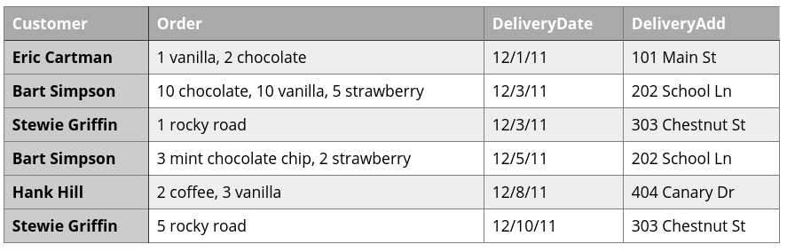

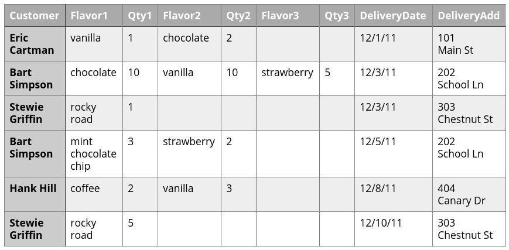

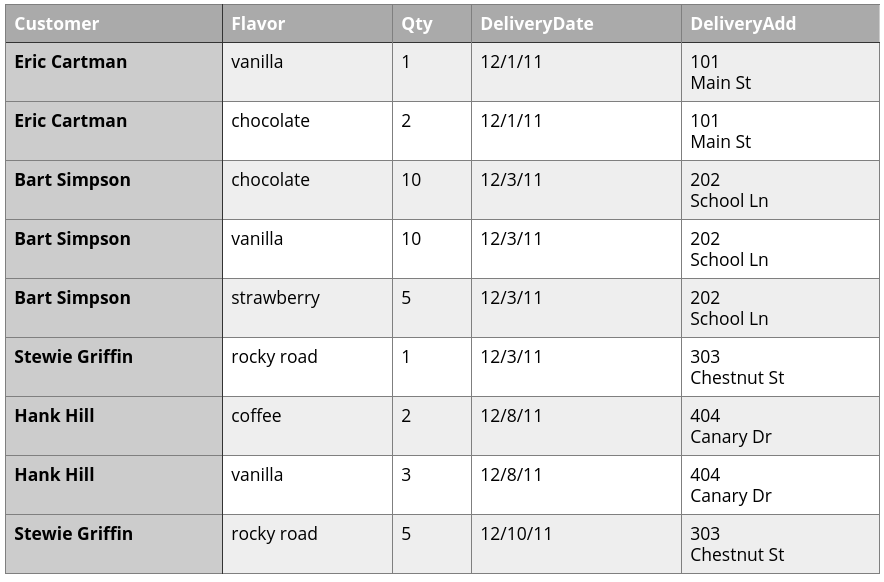
### Pemodelan Data

Whether it's just a quick sketch on a napkin or a months-long process involving many stakeholders, the life cycle of any effective database begins with data modeling. Data modeling itself begins with a requirements analysis, which can be more or less formal, depending on the scale of the project. One of the common products of the data modeling process is an entity-relationship (ER) diagram. This sort of diagram depicts the categories of data that must be stored (the entities) along with the associations (or relationships) between them. The Wikipedia entry on ER diagrams is quite good, so I'm going to point you there to learn more:

Entity-relationship model article at Wikipedia [http://en.wikipedia.org/wiki/Entity-relationship_model]

An ER diagram is essentially a blueprint for a database structure. Some RDBMS's provide diagramming tools (e.g., Oracle Designer, MySQL Workbench) and often include the capability of automatically creating the table structure conceptualized in the diagram.

In a GIS context, Esri makes it possible to create new geodatabases based on diagrams authored using CASE (Computer-Aided Software Engineering) tools. This blog post, Using Case tools in Arc GIS 10, [http://blogs.esri.com/esri/arcgis/2010/08/05/using-case-tools-in-arcgis -10/] provides details if you are interested in learning more.


## Pembuatan Basis Data dengan PostGIS


### Membuat Skema Baru dengan pgAdmin 4
  Instalasi **PgAdmin 4** sangat mudah. Anda tinggal men-_download_-nya dari [download page](https://www.pgadmin.org/download/) di situsnya, dan laksanakan proses instalasi di **workstation** hingga selesai. Sebagai catatan, Anda akan diminta untuk membuat **master password**, yaitu _password_ yang digunakan saat pertama kali mengakses **PgAdmin 4** di _workstation_ Anda.
  
  
  
  Setelah Anda berhasil masuk ke **PgAdmin 4**, maka yang pertama kali harus dilakukan adalah _create connection_ ke server PostgreSQL yang akan Anda akses.
  
  
  
  Pada _dialog_ ini, di _tab_ **General** kita isi **Name** dengan **Webmap Development Server** (atau sesuka Anda), kemudian _checkbox_ **Connect now?**-nya kita _check_, dan **Comments**-nya kita isi dengan deskripsi koneksinya.
  
  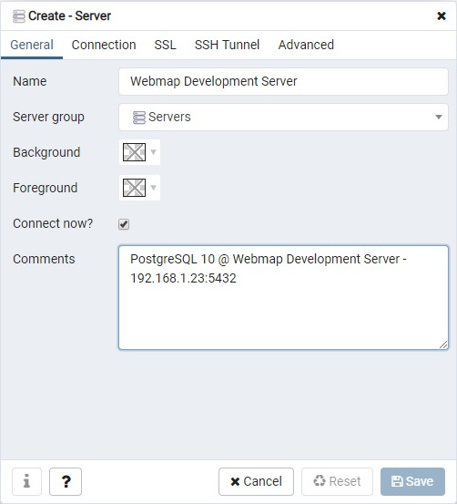
  
  Pindah ke _tab_ **Connection**, kita isi **Host name/address** dengan **192.168.1.23** (IP server PostgreSQL-nya), **Port**: **5432**, **Username**: **pgdbadmin** (biar bisa mengakses seluruh database yang ada), dan _password_-nya. _Checkbox_ Save **Password?**-nya boleh di-_check_, tapi lebih baik dibiarkan _unchecked_ saja, sehingga setiap kali koneksi Anda akan diminta untuk memasukkan _password_.
  
  
  
  Kalau seluruh isian kita sudah benar, maka begitu kita klik **Save**, maka entry **Webmap Development Server** akan muncul di pilihan server pada **PgAdmin 4**:
  
  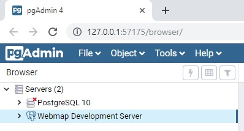
  
  Waktu kita _unfold entry_ ini, maka akan muncul pilihan akses ke **Databases**, **Login/Group Roles** dan **Tablespaces**. Selanjutnya, kita akan fokus ke **Databases** dulu.
  
  
  
  Setelah kita _unfold_ **Databases**, maka akan terlihat **3** _database_, yaitu **postgres** (_default database_, yang digunakan oleh PostgreSQL), **postgis_template** (_database_ yang sudah kita _create_ sebelumnya dan kita fungsikan sebagai _template database_) dan **webmap_db** (_database_ yang akan kita akses selanjutnya).
  
  
  
  Masuk ke **webmap_db** -\> **Schemas** -\> **public** -\> **Tables**, maka akan terlihat _table_ bernama **ne_10m_admin_0_countries**, yang mana itu adalah hasil _upload_ shapefile yang sudah kita laksanakan pada bagian sebelumnya.
  
  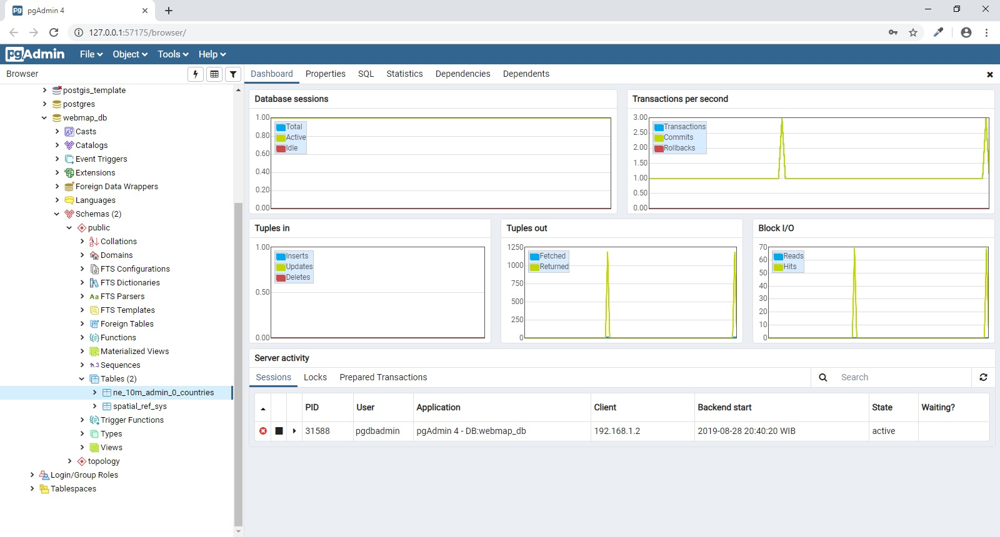
  
  Klik-kanan pada _table_ tersebut (**_ne_10m_admin_0_countries_**), pilih **View/Edit Data** -\> **All Rows**:
  
  
  
  Maka selanjutnya pada bagian kanan (tampilan utama) dari PgAdmin 4 akan muncul tampilan _query_ dan seluruh _rows_ yang ada dalam _table_ **_ne_10m_admin_0_countries_**.
  
  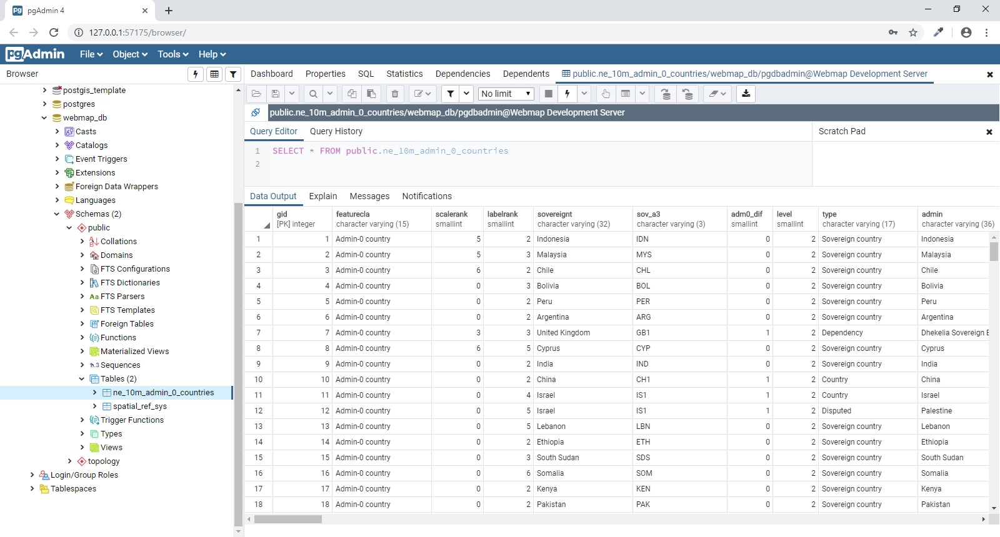
  
  Menariknya pada **PgAdmin 4** ini, jika Anda _scroll_ ke kanan terus hingga akhir _table_, akan ada sebuah _button_ yang berfungsi untuk menampilkan/visualisasi data _geometry_-nya.
  
  
  
  Kalau di-klik _geometry viewer button_ ini, maka selanjutnya akan muncul _webmap_ berbasis [**Leaflet.JS**](https://leafletjs.com/) yang menampilkan data _geometry_-nya.
  
  
  
  Sebagai catatan, _basemap_ dari [**OpenStreetMap**]() hanya akan muncul apabila SRID-nya **EPSG 4326**. Saya belum mencoba untuk **EPSG 3857** atau lainnya. Untuk lebih jelasnya mengenai perbedaan antara **EPSG 4326** dan **EPSG 3857**, dapat Anda baca di artikel bertajuk [EPSG 4326 vs EPSG 3857](https://lyzidiamond.com/posts/4326-vs-3857) ini.


###  PostGIS Shapefile and DBF Loader/Exporter 

  Lakukan langkah-langkah ini di workstation Anda.
  
  FYI, PostGIS Shapefile and DBF Loader/Exporter adalah sebuah aplikasi sederhana yang menjadi bagian dari paket instalasi PostGIS. Instalasi PostGIS membutuhkan PostgreSQL yang sudah terinstall (dan aktif) sebelumnya. Nah, menurut opini saya, instalasi PostgreSQL dan PostGIS di workstation _nggak_ berguna, kecuali hanya untuk _"memancing"_ instalasi **Application Stack Builder**, biar bisa install PostGIS yang mana di proses instalasinya akan mengikutkan **PostGIS Shapefile and DBF Loader Exporter**. PostgreSQL dan PostGIS _toh_ sudah ada di server. Tapi ya... mau _gimana_ lagi? _Let's just do it!_
  
- [**_Download_**](https://www.enterprisedb.com/downloads/postgres-postgresql-downloads) installer PostgreSQL dari EnterpriseDB/EDB, dan install sampai selesai.
  
  > Jika Anda akan langsung melakukan shapefile _upload test_, Anda bisa men-_download_ 1 file dari situs [**Natural Earth**](https://www.naturalearthdata.com/). Ambil contoh, [**batas administrasi negara level 0**](https://www.naturalearthdata.com/http//www.naturalearthdata.com/download/10m/cultural/ne_10m_admin_0_countries.zip).
  
- Setelah instalasi PostgreSQL selesai, dari _Start menu_ jalankan **Application Stack Builder**.
  
  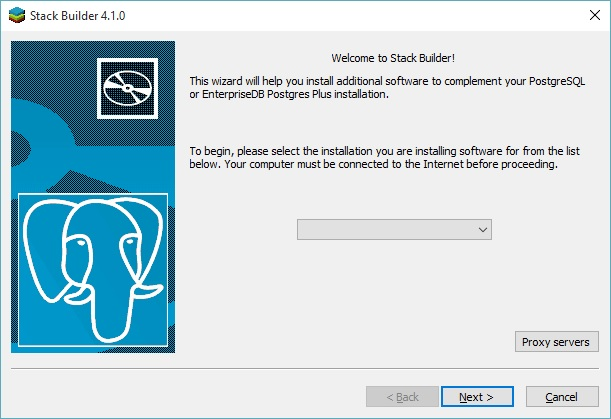
  
- Pilih **PostgreSQL 10 (x64) on port 5432**, dan klik **Next \>**. Jangan pilih yang **\<remote server\>** yaa..., karena pilihan ini selanjutnya tidak menyediakan opsi instalasi Spatial Extensions (PostGIS dll.).
  
  
  
  Tunggu beberapa saat, Application Stack Builder akan men-_download list_ aplikasi yang bisa Anda _install_ di tahap selanjutnya. Jika sudah muncul tampilan:
  
  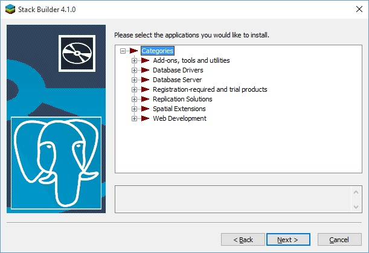
  
- Pilih **Npgsql**, **pgJDBC** dan **psqlODBC** pada kelompok **Database Drivers**, dan **PostGIS 2.5 Bundle for PostgreSQL 10 (64 bit)** pada kelompok **Spatial Extensions**.
  
  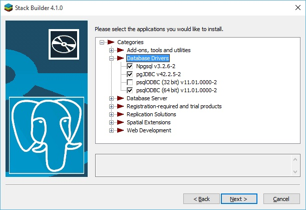
  
  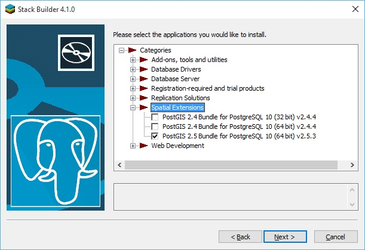
  
  Klik **Next \>**, dan tunggu beberapa saat hingga Application Stack Builder selesai men-_download_ dan meng-_install_ seluruh aplikasi yang sudah dipilih. Setelah selesai, keluar/matikan Application Stack Builder-nya dan buka _Start menu_.
  
  Pilih (atau cari dulu) menu **PostGIS 2.x Shapefile and DBF Loader Exporter**. Tampilan aplikasinya:
  
  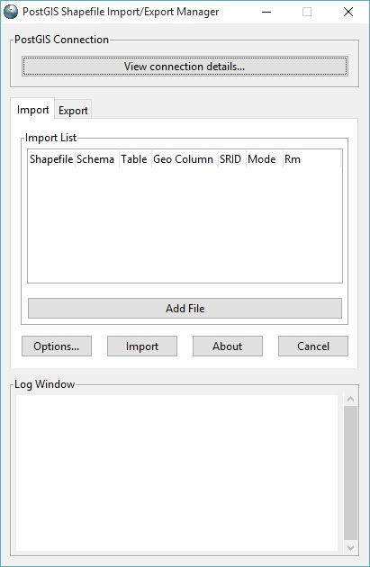
  
- _Connection testing_ ke server.
  
  Klik **View connection details...**, dan isikan Username: **pgdbuser**, Password: [_password_], Server Host: **192.168.1.23** dan port-nya: **5432**, Database: **webmap_db** seperti ini:
  
  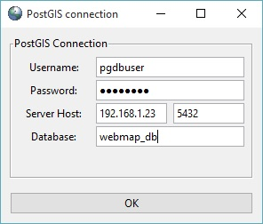
  
  Jika koneksinya sukses, maka pada bagian **Log Window** akan muncul log yang mengkonfirmasi bahwa koneksi berhasil.
  
  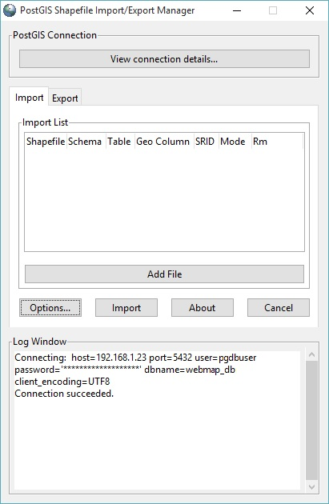
  
  Jika koneksi gagal, periksa kembali pengaturan koneksinya.
  
  Sekarang saatnya Anda mencoba meng-_upload_ sebuah shapefile ke PostgreSQL/PostGIS di server menggunakan **PostGIS 2.x Shapefile and DBF Loader Exporter**.
  
  O ya, tapi lebih baik kita bahas dulu spesifikasi file yang pada bagian 8.1 di atas saya sarankan untuk di-_download_, yaitu [**batas administrasi negara level 0**](https://www.naturalearthdata.com/http//www.naturalearthdata.com/download/10m/cultural/ne_10m_admin_0_countries.zip). Kalau kita ekstrak file ini, maka kita akan memiliki 1 _set files_ yang yang nama file-nya identik, tapi _extension_-nya berbeda. Dalam konteks pembahasan ini, kita hanya akan fokus pada file ```ne_10m_admin_0_countries.prj``` saja, karena pada saat _upload_ shapefile nanti, kita butuh informasi **SRID (Spatial Reference System Identifier)**.
  
  File ber-_extension_ ```*.prj``` ini berisi informasi tentang CRS (Coordinate Reference System) yang diterapkan/digunakan oleh file ber-_extension_ ```*.shp``` dan ```*.shx``` di direktori yang sama. Kalau Anda membuka file ini di ASCII text editor seperti Notepad atau Notepad++, dan Anda menemui _entry_ yang bertuliskan **WGS_1984**, maka besar kemungkinan **SRID** -nya adalah **EPSG 4326**. Lebih lanjut lagi, "tebakan" SRID ini saya kira cukup masuk-akal karena shapefile ini _coverage_-nya _world_. Jika Anda ingin mengetahui lebih lanjut tentang CRS, WGS 1984, SRID, dan lain sebagainya yang terkait, silahkan gali lebih dalam, asal jangan "tersesat" saja (baca: menyerah, dan langsung ngikut paham bumi-datar. Hahaha...).
  
  Kembali ke tampilan **PostGIS Shapefile and DBF Loader Exporter**, langsung saja klik **Add File**, maka dialog **Select a Shape file** muncul, pilih (klik) shapefile yang akan di-_upload_, dan klik **Open**.
  
  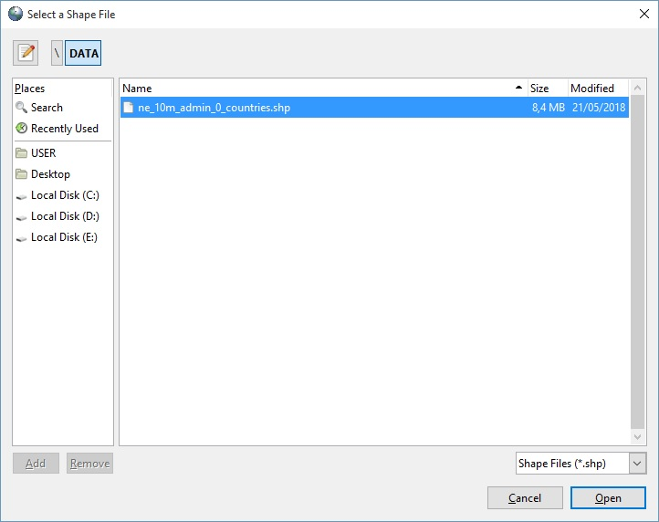
  
  Setelah klik **Open**, maka shapefile tersebut akan masuk ke **Import List**. Dalam tampilan ini mari kita fokus ke boks merah, yaitu kolom **SRID**.
  
  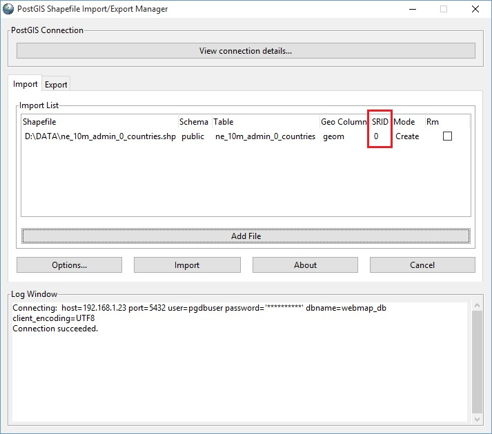
  
  Klik angka **0** dalam kolom, dan isi dengan angka **4326**, dan klik pada ruang kosong dalam **Import List**, di bawah _entry_ shapefile-nya. Untuk nama **Table** dan **Geo Column** yang akan jadi target di PostgreSQL/PostGIS biarkan saja apa-adanya.
  
  
  
  Selanjutnya klik **Import**, dan tunggu beberapa saat sampai selesai. Jika tidak ada _error_ saat proses _upload_, maka setelah selesai di **Log Window**-nya akan muncul konfirmasi bahwa _upload_ shapefile-nya berhasil.
  
  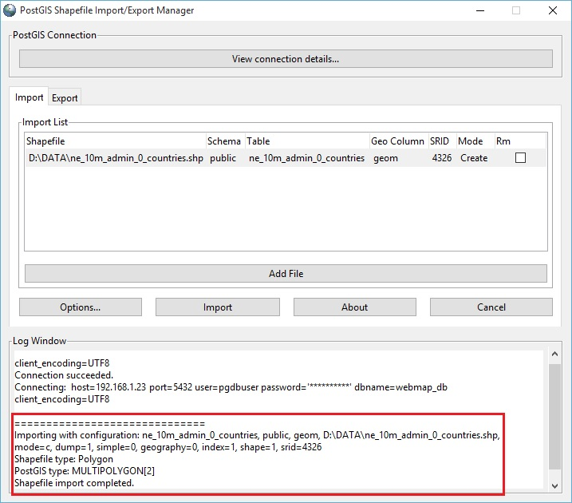
  
  Sampai pada tahap ini, di PostgreSQL/PostGIS server sudah ada contoh geodata yang sudah siap diakses dari berbagai kanal.
  
- Testing PostGIS Layer di Quantum GIS.
  
  _Test_ mengakses PostGIS _layer_ yang paling sederhana adalah dengan menggunakan **Quantum GIS**. Aktifkan Quantum GIS Anda, buat _project_ baru, kemudian klik menu **Layer** -\> **Data Source Manager**:
  
  
  
  Setelah dialog **Data Source Manager** muncul, klik **PostgreSQL** pada bagian kiri, sehingga muncul tampilan koneksi ke PostgreSQL di bagian kanan, dan pada bagian **Connections**, klik **New**:
  
  
  
  Setelah Anda klik **New**, maka akan muncul dialog **Create a New PostGIS Connection**.
  
  
  
  > Pada bagian **Connection Information**, isi Name: **webmap_db@192.168.1.23** (atau yang lain sesuka Anda), **Service** dibiarkan kosong saja, Host: **192.168.1.23**, Port: **5432** dan Database: **webmap_db**.
  
  > Pada bagian **Authentication**, klik _tab_ **Basic**, dan isi **User name**: **pgdbuser**, _checkbox_ **Store**-nya di-_check_, **Password** diisi dengan _password_-nya pgdbuser, dan _checkbox_ **Store**-nya dibiarkan _unchecked_ saja.
  
  > Berikutnya Anda bisa melakukan connection testing dengan meng-klik Test connection. Konfirmasi berhasil atau tidak-nya koneksi akan muncul pada bagian atas dialog box ini.
  
  > Jika Anda ingin hanya menampilkan _table_ yang memiliki _geometry field_ saja, _check_ saja _checkbox_ pada opsi **Don't resolve type of unrestricted columns (GEOMETRY)**.
  
  Setelah Anda klik **OK**, maka _table_ yang tadi sudah terbentuk saat kita meng-_upload_ shapefile akan muncul sebagai pilihan _layer_ yang akan ditampilkan.
  
  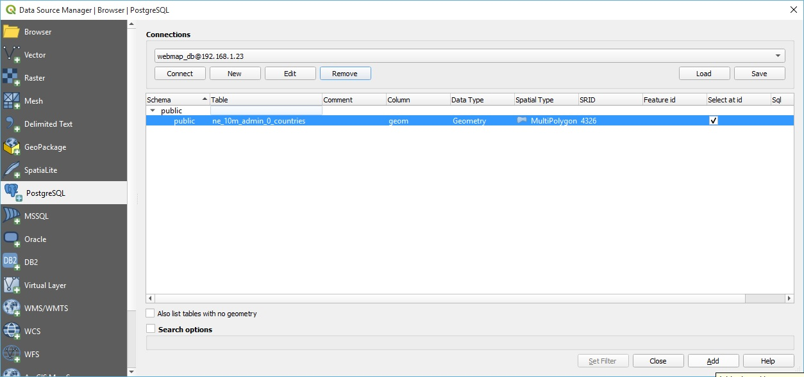
  
  Klik (pilih) pada _table_ tersebut, kemudian klik **Add** pada bagian bawah dan tunggu sejenak hingga tampilan _layer_-nya muncul di belakang dialog **Data Source Manager** ini. Selanjutnya klik **Close**.
  
  
  
  Jika _layer_ **ne_10m_admin_0_countries** sudah muncul, maka test PostGIS _layer_ Anda sudah berhasil.
  


### Download Data

Service Kemendagri

### Impor Data

<!-- You can label chapter and section titles using `{#label}` after them, e.g., we can reference Chapter \@ref(intro). If you do not manually label them, there will be automatic labels anyway, e.g., Chapter \@ref(methods). -->

<!-- Figures and tables with captions will be placed in `figure` and `table` environments, respectively. -->

<!-- ```{r nice-fig, fig.cap='Here is a nice figure!', out.width='80%', fig.asp=.75, fig.align='center'} -->
<!-- par(mar = c(4, 4, .1, .1)) -->
<!-- plot(pressure, type = 'b', pch = 19) -->
<!-- ``` -->

<!-- Reference a figure by its code chunk label with the `fig:` prefix, e.g., see Figure \@ref(fig:nice-fig). Similarly, you can reference tables generated from `knitr::kable()`, e.g., see Table \@ref(tab:nice-tab). -->

<!-- ```{r nice-tab, tidy=FALSE} -->
<!-- knitr::kable( -->
<!--   head(iris, 20), caption = 'Here is a nice table!', -->
<!--   booktabs = TRUE -->
<!-- ) -->
<!-- ``` -->

<!-- You can write citations, too. For example, we are using the **bookdown** package [@R-bookdown] in this sample book, which was built on top of R Markdown and **knitr** [@xie2015]. -->
