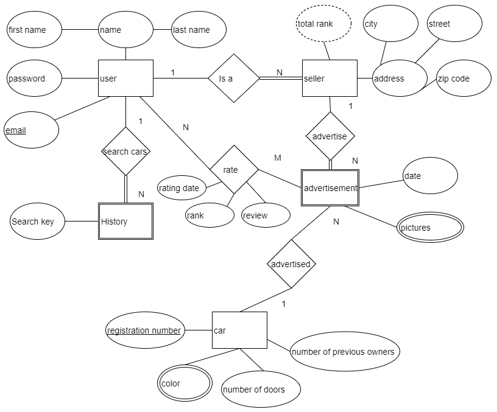
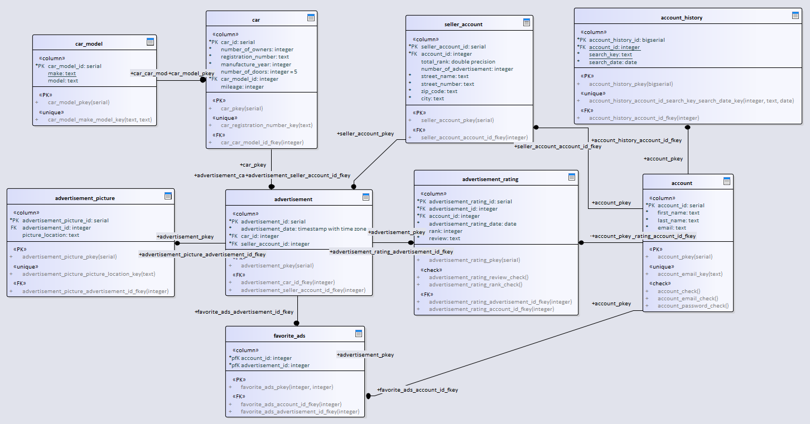
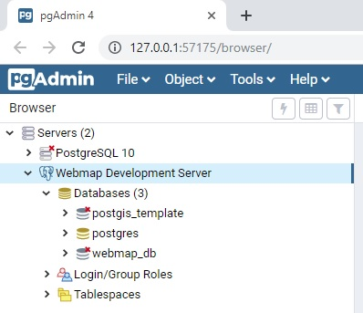
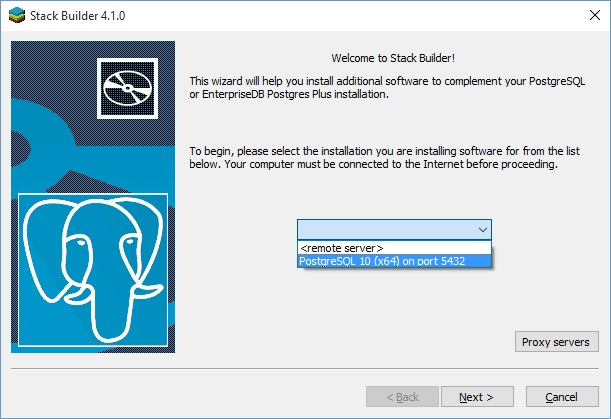
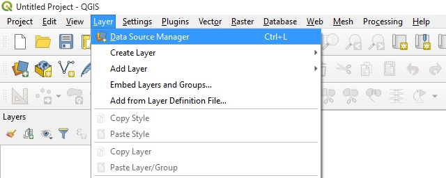

# (PART) Basis Data {-}

# Basis Data {#day2}

<!-- ## Material{-} -->


<!-- ## Overview GNSS dan CORS di Indonesia -->

<!-- ## Konsep Dasar SIG -->

## Perancangan Basis Data ^[Sumber: [https://www.e-education.psu.edu/spatialdb/l2_p4.html](https://www.e-education.psu.edu/spatialdb/l2_p4.html)]


### Rumusan Dasar 

Dalam membangun basis data relasional dari awal, adalah penting untuk memberikan waktu lebih dalam memikirkan **_business process_** yang terjadi. Basis data yang tidak dirancang dengan baik akan memberikan masalah bagi pengguna, termasuk :

- hilangnya integritas data seiring dengan waktu
- ketidakmampuan dalam mendukung query yang diperlukan
- performa yang buruk, misalnya, lambat dalam menampilkan hasil query

Rumusan dasar dalam merancang basis data adalah membuat tabel yang :

- meminimalisir data berlebih (redundant)
- menggambarkan satu subyek
- memiliki satu Primary Key (kode unik untuk setiap baris rekaman (record))
- tidak mengandung kolom dengan banyak bagian (multi-part field) (Contoh: "302 Walker Bldg, University Park, PA 16802")
- tidak mengandung kolom dengan ragam nilai (Contoh: Kolom Author hendaknya tidak berisi data seperti "Jones, Martin, Williams")
- tidak memiliki duplikasi yang tidak perlu (Contoh: hindari penamaan kolom seperti Author1, Author2, Author3)
- tidak memiliki kolom yang nilainya tergantung dari kolomm lain(Contoh: jangan membuat kolom gaji (Wage) untuk tabel yang memiliki kolom PayRate dan HrsWorked )

### Normalisasi

Proses perancangan sebuah basis data seperti yang diuraikan dalam aturan di atas, secara formal disebut dengan normalisasi. Semua perancang basis data melakukan normalisasi, baik mereka menggunakan istilah tersebut untuk menggambarkan prosesnya atau tidak. 

Ada tiga tingkatan normalisasi, yaitu :

- **First Normal Form (1NF)**

menggambarkan sebuah basis data yang tabel-tabelnya merepresentasikan entitas yang unik, tidak ada duplikasi kolom (misal, tidak ada Author1, Author2, Author3), memiliki satu atau banyak kolom yang merupakan identitas unik dari setiap baris (primary key, PK).  Basis data yang memenuhi persyaratan ini termasuk ke dalam First Normal Form (1NF).

- **Second Normal Form (2NF)**

menggambarkan sebuah basis data yang dalam kondisi 1NF dan juga menghindari kolom non-key yang tergantung dari subset Primary Key. Silakan lihat penjelasan di tautan berikut untuk melihat contoh sederhananya [www.1keydata.com/database-normalization/second-normal-form-2nf.php].

Dalam contoh di tautan tersebut, CustomerID dan StoreID membangun sebuah composite key (kunci gabungan) -- gabungan dari nilai kedua kolom tersebut bersifat unik, menjadi identitas setiap kolom dalam tabel. Dalam kata lain, hanya akan ada satu baris dalam tabel yang memiliki CustomerID 1 dengan StoreID 1, hanya akan ada satu baris dengan CustomerID 1 dan StoreID 3, dan seterusnya. Kolom PurchaseLocation tergantung dari kolom StoreID, yang merupakan sebagian dari Primary Key. Dengan demikian, solusi untuk menempatkan tabel ke dalam 2NF adalah dengan memindahkan hubungan StoreID-PurchaseLocation ke dalam tabel terpisah. Pendekatan ini bersifat intuitif di mana kita dapat membaca nilai PurchaseLocation satu kali dibandingkan berulang kali

- **Third Normal Form (3NF)**

menggambarkan sebuah basis data dalam tingkat 2NF dan juga menghindari kolom yang nilainya diturunkan dari kolom lain yang bukan Primary Key. Contoh kolom Wage seperti disebutkan di atas adalah sebuah pelanggaran aturan 3NF. 

Dalam banyak kasus, normalisasi basis data hingga tingkatan 3NF sudah cukup. Perlu ditambahkan juga ada format normalisasi lain seperti Boyce-Codman Normal Form (BCNF, atau 3.5NF), Fourth Normal Form (4NF) dan Fifth Normal Form (5NF). Namun demikian, daripada membuang waktu lebih lama dalam menggambarkan normalisasi tingkat lanjut ini, yang paling simpel adalah mengingat karakteristik dasar dari sebuah tabel yang didesain secara baik seperti di atas. Apabila Anda mengikuti petunjuk tersebut secara seksama, khususnya secara konsisten mencari data berlebih (redundant), Anda akan mampu melakukan normalisasi basis data.

Singkatnya, semakin tinggi tingkatan normalisasi, maka akan semakin banyak jumlah tabel yang ada dalam basis data. Semakin banyak jumlah tabel, usaha untuk menggabungkan data dengan cara _**joins**_ juga akan semakin sulit, dalam arti semakin tinggi level keahlian yang diperlukan untuk membuat queri dan dalam meningkatkan performa basis data. Proses normalisasi kadang-kadang menghasilkan desain yang terlalu sulit untuk diimplementasikan atau kalaupun dapat dibuat, ia memiliki performa yang buruk (baca: lambat). Pada dasarnya, perancangan basis data adalah menyeimbangkan antara kebutuhan yang terkait dengan integritas data dan efisiensi penyimpanan data dengan kebutuhan yang terkait dengan penggunaannya (insert, update, query).

**Contoh** 

Untuk memahami proses normalisasi basis data, contoh berikut memperlihatkan bagaimana aturan-aturan yang telah dijelaskan dapat diterapkan untuk menghasilkan sebuah basis data yang efisien. Pengusaha Jen dan Barry mengembangkan usaha es krim dan membutuhkan sebuah basis data untuk menjejak pesanan (order). Ketika menerima pesanan, mereka mencatat nama pelanggannya, detil pesanan seperti rasa (flavors) dan jumlah es krim yang dibutuhkan, tanggal pesanan dan alamat pengiriman pesanan. Basis data ini diharapkan dapat membantu mereka dalam menjawab dua penting sebagai berikut :

- Pesanan mana yang tenggatnya dalam 2 hari ke depan?
- Perasa apa yang harus dibuat dalam jumlah yang lebih banyak?


Tabel pesanan yang dapat dibuat pertama kali adalah seperti gambar berikut :


Dengan skema di atas, masalah yang muncul adalah ketika mereka akan membuat sebuah query yang menghitung jumlah perasa vanilla yang diperlukan sesuai pesanan. Jumlahnya bercampur dengan nama perasa dan perasa apapun dapat dimasukkan ke dalam daftar di bagian mana saja (tidak akan konsisten dituliskan dalam kolom pertama atau kedua).

Oleh karenanya, desain seperti berikut sepertinya lebih baik:


Skema yang kedua ini lebih baik karena memungkinkan mereka untuk melakukan query perasa tertentu dan menjumlahkan kuantitasnya. Namun untuk menghitung perasa vanila yang diperlukan, mereka harus menghitung jumlahnya dari tiga kolom berbeda. Desain ini juga tidak akan dapat menjawab permasalahan apabila satu orang pelanggan memesan lebih dari tiga perasa.

Desain seperti berikut mungkin menjawab pertanyaan di atas:


Desain seperti di atas memungkinkan penghitungan kuantitas perasa vanila yang dibutuhkan sesuai pesanan dengan lebih mudah. Sayangnya, desain tersebut menghasilkan data berlebih (redundant) dan menuliskan pesanan dari satu pelanggan ke dalam banyak baris (record).

Desain yang paling baik adalah dengan memisahkan data ke dalam empat entitas (Customers, Flavors, Orders and Order Items):


Apabila mereka hendak mengimplementasikan desain seperti di atas dalam MS-Access, query yang diperlukan untuk menampilkan pesanan yang harus dikirim dalam 2 hari ke depan adalah seperti yang terlihat pada GUI :


### Pemodelan Data

Pemodelan data dimulai dengan analisis kebutuhan, dapat dilakukan secara formal atau informal, tergantung dari skala proyeknya. Salah satu perangkat umum yang biasa digunakan dalam proses pemodelan adalah diagram entity-relationship (ER). Diagram ER mengilustrasikan kategori data yang harus disimpan (entitas), juga hubungan (relasi) antara entitas-entitas yang didefinisikan. 

Data models describe real-world entities such as customer, service, products, and the relation between these entities. Data models provide an abstraction for the relations in the database. Data models aid the developers in modeling business requirements and translating business requirements to relations. They are also used for the exchange of information between the developers and business owners.

In the enterprise, data models play a very important role in achieving data consistency across interacting systems. For example, if an entity is not defined, or is poorly defined, then this will lead to inconsistent and misinterpreted data across the enterprise. For instance, if the semantics of the customer entity are not defined clearly, and different business departments use different names for the same entity such as customer and client, this may lead to confusion in the operational departments.

Data model perspectives are defined by ANSI as follows:

- Conceptual data model: 

Describes the domain semantics, and is used to communicate the main business rules, actors, and concepts. It describes the business requirements at a high level and is often called a high-level data model. 

- Logical data model: 

Describes the semantics for a certain technology, for example, the UML class diagram for object-oriented languages.

- Physical data model: 

Describes how data is actually stored and manipulated at the hardware level, such as storage area network, table space, CPUs, and so on.

According to ANSI, this abstraction allows changing one part of the three perspectives without amending the other parts. One could change both the logical and the physical data models without changing the conceptual model. To explain, sorting data using bubble or quick sort is not of interest for the conceptual data model. Also, changing the structure of the relations could be transparent to the conceptual model. One could split one relation into many relations after applying normalization rules, or by using enum data types in order to model the lookup tables.

The entity-relation model
The entity-relation (ER) model falls into the conceptual data model category. It captures and represents the data model for both business users and developers. The ER model can be transformed into the relational model by following certain techniques.

Conceptual modeling is a part of the software development life cycle (SDLC). It is normally done after the functional and data requirement-gathering stage. At this point, the developer is able to make the first draft of the ER diagram as well as describe functional requirements using data flow diagrams, sequence diagrams, user stories, and many other techniques.

During the design phase, the database developer should give great attention to the design, run a benchmark stack to ensure performance, and validate user requirements. Developers modeling simple systems could start coding directly. However, care should be taken when making the design, since data modeling involves not only algorithms in modeling the application but also data. The change in design might lead to a lot of complexities in the future such as data migration from one data structure to another.

While designing a database schema, avoiding design pitfalls is not enough. There are alternative designs where one could be chosen. The following pitfalls should be avoided:

Data redundancy: Bad database designs elicit redundant data. Redundant data can cause several other problems, including data inconsistency and performance degradation. When updating a tuple that contains redundant data, the changes on the redundant data should be reflected in all the tuples that contain this data.
Null saturation: By nature, some applications have sparse data, such as medical applications. Imagine a relation called diagnostics, which has hundreds of attributes for symptoms such as fever, headache, sneezing, and so on. Most of them are not valid for certain diagnostics, but they are valid in general. This could be modeled by utilizing complex data types such as JSON.
Tight coupling: In some cases, tight coupling leads to complex and difficult-to-change data structures. Since business requirements change with time, some requirements might become obsolete. Modeling generalization and specialization (for example, a part-time student is a student) in a tightly coupled way may cause problems.

Sebuah diagram ER pada dasarnya adalah cetak biru dari satu struktur basis data. Beberapa RDBMS menyediakan perangkat untuk menggambar diagram ER (contohnya Oracle Designer, MySQL workbench, PostgreSQL pgModeler) dan juga kadang menyediakan kemampuan untuk membuat struktur tabel yang telah dikonsepkan dalam bentuk diagram ke basis data.

Dalam konteks GIS, ESRI menyediakan sebuah perangkat yang memungkinkan kita membuat geodatabase baru berdasarkan diagram dengan CASE (Computer-Aided Software Engineering) tools. Untuk lebih lanjutnya, Anda dapat membaca blog ini yang menyelaskan secara detil penggunaan CASE, Using Case tools in Arc GIS 10, [http://blogs.esri.com/esri/arcgis/2010/08/05/using-case-tools-in-arcgis -10/].

### Sample application
In order to explain the basics of the ER model, an online web portal to buy and sell cars will be modeled. The requirements of this sample application are as follows, and an ER model will be developed step by step:

The portal provides the facility to register users online and provides different services for users based on their categories.
Users might be sellers or normal users. The sellers can create new car advertisements; other users can explore and search for cars.
All users should provide their full name and a valid email address during registration. The email address will be used for logging in.
The seller should also provide an address.
The user can rate the advertisement and the seller's service quality.
All users' search history should be maintained for later use.
The sellers have ranks and this affects the advertisement search; the rank is determined by the number of posted advertisements and the user's rank.
The car advertisement has a date and the car can have many attributes such as color, number of doors, number of previous owners, registration number, pictures, and so on.
Entities, attributes, and keys
The ER diagram represents entities, attributes, and relationships. An entity is a representation of a real-world object such as a car or a user. An attribute is a property of an object and describes it. A relationship represents an association between two or more entities.

The attributes might be composite or simple (atomic). Composite attributes can be divided into smaller subparts. A subpart of a composite attribute provides incomplete information that is semantically not useful by itself. For example, the address is composed of a street name, building number, and postal code. Any one of them isn't useful alone, without its counterparts.

Attributes could also be single-valued or multi-valued. The color of a bird is an example of a multi-valued attribute. It can be red and black, or a combination of any other colors. A multi-valued attribute can have a lower and upper bound to constrain the number of values allowed. In addition, some attributes can be derived from other attributes. Age can be derived from the birth date. In our example, the final rank of a seller is derived from the number of advertisements and the user ratings.

Key attributes can identify an entity in the real world. A key attribute should be marked as a unique attribute, but not necessarily as a primary key, when physically modeling the relation. Finally, several attribute types could be grouped together to form a complex attribute:

```{r fig11, fig.cap='Simbol Entitas ',echo=FALSE, message=FALSE, warning=FALSE, out.width='70%', fig.asp=.75, fig.align='center'}
knitr::include_graphics("img/01/db_model1.png")
```

Entities should have a name and a set of attributes. They are classified into the following:

Weak entity: Does not have key attributes of its own
Strong entity/regular entity: Has a key attribute
A weak entity is usually related to a strong entity. This strong entity is called the identifying entity. Weak entities have a partial key, also known as a discriminator, which is an attribute that can uniquely identify the weak entity, and it is related to the identifying entity. In our example, if we assume that the search key is distinct each time the user searches for cars, then the search key is the partial key. The weak entity symbol is distinguished by surrounding the entity box with a double line.

The following diagram shows the preliminary design of a car portal application. The user entity has several attributes. The name attribute is a composite attribute, and email is a key attribute. The seller entity is a specialization of the user entity. The total rank is a derived attribute calculated by aggregating the user ratings and the number of advertisements. The color attribute of the car is multi-valued. The seller can be rated by the users for certain advertisements; this relation is a ternary relation, because the rating involves three entities, which are car, seller, and user.

The car picture is a subpart attribute of the advertisement. The following diagram shows that the car can be advertised more than once by different sellers. In the real world, this makes sense, because one could ask more than one seller to sell his car:

```{r fig12,echo=FALSE, message=FALSE, warning=FALSE, out.width='70%', fig.asp=.75, fig.align='center'}
knitr::include_graphics("img/01/db_model2.png")
```


When an attribute of one entity refers to another entity, some relationships exist. In the ER model, these references should not be modeled as attributes but as relationships or weak entities. Similar to entities, there are two classes of relationships: weak and strong. Weak relationships associate the weak entities with other entities. Relationships can have attributes as entities. In our example, the car is advertised by the seller; the advertisement date is a property of the relationship.

 

Relationships have cardinality constraints to limit the possible combinations of entities that participate in a relationship. The cardinality constraint of car and seller is 1:N; the car is advertised by one seller, and the seller can advertise many cars. The participation between seller and user is called total participation, and is denoted by a double line. This means that a seller cannot exist alone, and he must be a user.

Note
The many-to-many relationship cardinality constraint is denoted by N:M to emphasize the different participation by the entities.


```{r fig13,echo=FALSE, message=FALSE, warning=FALSE, out.width='70%', fig.asp=.75, fig.align='center'}

```


Up until now, only the basic concepts of ER diagrams have been covered. Some concepts, such as (min, max) cardinality notation, ternary/n-ary relationships, generalization, specialization, and enhanced entity relation(EER) diagrams, have not been discussed.

Mapping ER to relations
The rules to map an ER diagram to a set of relations (that is, the database schema) are almost straightforward, but not rigid. One could model an entity as an attribute, and then refine it to a relationship. An attribute that belongs to several entities can be promoted to be an independent entity. The most common rules are as follows (note that only basic rules have been covered, and the list is not exhaustive):

Map regular entities to relations. If entities have composite attributes, then include all the subparts of the attributes. Pick one of the key attributes as a primary key.
Map weak entities to relations. Include simple attributes and the subparts of the composite attributes. Add a foreign key to reference the identifying entity. The primary key is normally the combination of the partial key and the foreign key.
If a relationship has an attribute and the relation cardinality is 1:1, then the relation attribute can be assigned to one of the participating entities.
If a relationship has an attribute and the relation cardinality is 1:N, then the relation attribute can be assigned to the participating entity on the N side. 
Map many-to-many relationships, also known as N:M, to a new relation. Add foreign keys to reference the participating entities. The primary key is the composition of foreign keys. 
Map a multi-valued attribute to a relation. Add a foreign key to reference the entity that owns the multi-valued attribute. The primary key is the composition of the foreign key and the multi-valued attribute.
UML class diagrams
Unified Modeling Language (UML) is a standard developed by the Object Management Group (OMG). UML diagrams are widely used in modeling software solutions, and there are several types of UML diagrams for different modeling purposes including class, use case, activity, and implementation diagrams.

A class diagram can represent several types of associations, that is, the relationship between classes. They can depict attributes as well as methods. An ER diagram can be easily translated into a UML class diagram. UML class diagrams also have the following advantages:

Code reverse-engineering: The database schema can be easily reversed to generate a UML class diagram.
Modeling extended relational database objects: Modern relational databases have several object types such as sequences, views, indexes, functions, and stored procedures. UML class diagrams have the capability to represent these object types.
The following class diagram is generated from reverse-engineering the SQL code of a car_portaldatabase: 


```{r fig14,echo=FALSE, message=FALSE, warning=FALSE, out.width='90%', fig.asp=.75, fig.align='center'}

```


## Pembuatan Basis Data dengan PostGIS ^[Sumber: [https://github.com/andyprasetya/webmap-development-server](https://github.com/andyprasetya/webmap-development-server)]


### Membuat Skema Baru dengan pgAdmin 4
  Instalasi **PgAdmin 4** sangat mudah. Anda tinggal men-_download_-nya dari [download page](https://www.pgadmin.org/download/) di situsnya, dan laksanakan proses instalasi di **workstation** hingga selesai. Sebagai catatan, Anda akan diminta untuk membuat **master password**, yaitu _password_ yang digunakan saat pertama kali mengakses **PgAdmin 4** di _workstation_ Anda.
  
  
  
  Setelah Anda berhasil masuk ke **PgAdmin 4**, maka yang pertama kali harus dilakukan adalah _create connection_ ke server PostgreSQL yang akan Anda akses.
  
  
  
  Pada _dialog_ ini, di _tab_ **General** kita isi **Name** dengan **Webmap Development Server** (atau sesuka Anda), kemudian _checkbox_ **Connect now?**-nya kita _check_, dan **Comments**-nya kita isi dengan deskripsi koneksinya.
  
  
  
  Pindah ke _tab_ **Connection**, kita isi **Host name/address** dengan **192.168.1.23** (IP server PostgreSQL-nya), **Port**: **5432**, **Username**: **pgdbadmin** (biar bisa mengakses seluruh database yang ada), dan _password_-nya. _Checkbox_ Save **Password?**-nya boleh di-_check_, tapi lebih baik dibiarkan _unchecked_ saja, sehingga setiap kali koneksi Anda akan diminta untuk memasukkan _password_.
  
  
  
  Kalau seluruh isian kita sudah benar, maka begitu kita klik **Save**, maka entry **Webmap Development Server** akan muncul di pilihan server pada **PgAdmin 4**:
  
  
  
  Waktu kita _unfold entry_ ini, maka akan muncul pilihan akses ke **Databases**, **Login/Group Roles** dan **Tablespaces**. Selanjutnya, kita akan fokus ke **Databases** dulu.
  
  
  
  Setelah kita _unfold_ **Databases**, maka akan terlihat **3** _database_, yaitu **postgres** (_default database_, yang digunakan oleh PostgreSQL), **postgis_template** (_database_ yang sudah kita _create_ sebelumnya dan kita fungsikan sebagai _template database_) dan **webmap_db** (_database_ yang akan kita akses selanjutnya).
  
  
  
  Masuk ke **webmap_db** -\> **Schemas** -\> **public** -\> **Tables**, maka akan terlihat _table_ bernama **ne_10m_admin_0_countries**, yang mana itu adalah hasil _upload_ shapefile yang sudah kita laksanakan pada bagian sebelumnya.
  
  
  
  Klik-kanan pada _table_ tersebut (**_ne_10m_admin_0_countries_**), pilih **View/Edit Data** -\> **All Rows**:
  
  
  
  Maka selanjutnya pada bagian kanan (tampilan utama) dari PgAdmin 4 akan muncul tampilan _query_ dan seluruh _rows_ yang ada dalam _table_ **_ne_10m_admin_0_countries_**.
  
  
  
  Menariknya pada **PgAdmin 4** ini, jika Anda _scroll_ ke kanan terus hingga akhir _table_, akan ada sebuah _button_ yang berfungsi untuk menampilkan/visualisasi data _geometry_-nya.
  
  
  
  Kalau di-klik _geometry viewer button_ ini, maka selanjutnya akan muncul _webmap_ berbasis [**Leaflet.JS**](https://leafletjs.com/) yang menampilkan data _geometry_-nya.
  
  
  
  Sebagai catatan, _basemap_ dari [**OpenStreetMap**]() hanya akan muncul apabila SRID-nya **EPSG 4326**. Saya belum mencoba untuk **EPSG 3857** atau lainnya. Untuk lebih jelasnya mengenai perbedaan antara **EPSG 4326** dan **EPSG 3857**, dapat Anda baca di artikel bertajuk [EPSG 4326 vs EPSG 3857](https://lyzidiamond.com/posts/4326-vs-3857) ini.


###  PostGIS Shapefile and DBF Loader/Exporter 

  Lakukan langkah-langkah ini di workstation Anda.
  
  FYI, PostGIS Shapefile and DBF Loader/Exporter adalah sebuah aplikasi sederhana yang menjadi bagian dari paket instalasi PostGIS. Instalasi PostGIS membutuhkan PostgreSQL yang sudah terinstall (dan aktif) sebelumnya. Nah, menurut opini saya, instalasi PostgreSQL dan PostGIS di workstation _nggak_ berguna, kecuali hanya untuk _"memancing"_ instalasi **Application Stack Builder**, biar bisa install PostGIS yang mana di proses instalasinya akan mengikutkan **PostGIS Shapefile and DBF Loader Exporter**. PostgreSQL dan PostGIS _toh_ sudah ada di server. Tapi ya... mau _gimana_ lagi? _Let's just do it!_
  
- [**_Download_**](https://www.enterprisedb.com/downloads/postgres-postgresql-downloads) installer PostgreSQL dari EnterpriseDB/EDB, dan install sampai selesai.
  
  > Jika Anda akan langsung melakukan shapefile _upload test_, Anda bisa men-_download_ 1 file dari situs [**Natural Earth**](https://www.naturalearthdata.com/). Ambil contoh, [**batas administrasi negara level 0**](https://www.naturalearthdata.com/http//www.naturalearthdata.com/download/10m/cultural/ne_10m_admin_0_countries.zip).
  
- Setelah instalasi PostgreSQL selesai, dari _Start menu_ jalankan **Application Stack Builder**.
  
  
  
- Pilih **PostgreSQL 10 (x64) on port 5432**, dan klik **Next \>**. Jangan pilih yang **\<remote server\>** yaa..., karena pilihan ini selanjutnya tidak menyediakan opsi instalasi Spatial Extensions (PostGIS dll.).
  
  
  
  Tunggu beberapa saat, Application Stack Builder akan men-_download list_ aplikasi yang bisa Anda _install_ di tahap selanjutnya. Jika sudah muncul tampilan:
  
  
  
- Pilih **Npgsql**, **pgJDBC** dan **psqlODBC** pada kelompok **Database Drivers**, dan **PostGIS 2.5 Bundle for PostgreSQL 10 (64 bit)** pada kelompok **Spatial Extensions**.
  
  
  
  
  
  Klik **Next \>**, dan tunggu beberapa saat hingga Application Stack Builder selesai men-_download_ dan meng-_install_ seluruh aplikasi yang sudah dipilih. Setelah selesai, keluar/matikan Application Stack Builder-nya dan buka _Start menu_.
  
  Pilih (atau cari dulu) menu **PostGIS 2.x Shapefile and DBF Loader Exporter**. Tampilan aplikasinya:
  
  
  
- _Connection testing_ ke server.
  
  Klik **View connection details...**, dan isikan Username: **pgdbuser**, Password: [_password_], Server Host: **192.168.1.23** dan port-nya: **5432**, Database: **webmap_db** seperti ini:
  
  
  
  Jika koneksinya sukses, maka pada bagian **Log Window** akan muncul log yang mengkonfirmasi bahwa koneksi berhasil.
  
  
  
  Jika koneksi gagal, periksa kembali pengaturan koneksinya.
  
  Sekarang saatnya Anda mencoba meng-_upload_ sebuah shapefile ke PostgreSQL/PostGIS di server menggunakan **PostGIS 2.x Shapefile and DBF Loader Exporter**.
  
  O ya, tapi lebih baik kita bahas dulu spesifikasi file yang pada bagian 8.1 di atas saya sarankan untuk di-_download_, yaitu [**batas administrasi negara level 0**](https://www.naturalearthdata.com/http//www.naturalearthdata.com/download/10m/cultural/ne_10m_admin_0_countries.zip). Kalau kita ekstrak file ini, maka kita akan memiliki 1 _set files_ yang yang nama file-nya identik, tapi _extension_-nya berbeda. Dalam konteks pembahasan ini, kita hanya akan fokus pada file ```ne_10m_admin_0_countries.prj``` saja, karena pada saat _upload_ shapefile nanti, kita butuh informasi **SRID (Spatial Reference System Identifier)**.
  
  File ber-_extension_ ```*.prj``` ini berisi informasi tentang CRS (Coordinate Reference System) yang diterapkan/digunakan oleh file ber-_extension_ ```*.shp``` dan ```*.shx``` di direktori yang sama. Kalau Anda membuka file ini di ASCII text editor seperti Notepad atau Notepad++, dan Anda menemui _entry_ yang bertuliskan **WGS_1984**, maka besar kemungkinan **SRID** -nya adalah **EPSG 4326**. Lebih lanjut lagi, "tebakan" SRID ini saya kira cukup masuk-akal karena shapefile ini _coverage_-nya _world_. Jika Anda ingin mengetahui lebih lanjut tentang CRS, WGS 1984, SRID, dan lain sebagainya yang terkait, silahkan gali lebih dalam, asal jangan "tersesat" saja (baca: menyerah, dan langsung ngikut paham bumi-datar. Hahaha...).
  
  Kembali ke tampilan **PostGIS Shapefile and DBF Loader Exporter**, langsung saja klik **Add File**, maka dialog **Select a Shape file** muncul, pilih (klik) shapefile yang akan di-_upload_, dan klik **Open**.
  
  
  
  Setelah klik **Open**, maka shapefile tersebut akan masuk ke **Import List**. Dalam tampilan ini mari kita fokus ke boks merah, yaitu kolom **SRID**.
  
  
  
  Klik angka **0** dalam kolom, dan isi dengan angka **4326**, dan klik pada ruang kosong dalam **Import List**, di bawah _entry_ shapefile-nya. Untuk nama **Table** dan **Geo Column** yang akan jadi target di PostgreSQL/PostGIS biarkan saja apa-adanya.
  
  
  
  Selanjutnya klik **Import**, dan tunggu beberapa saat sampai selesai. Jika tidak ada _error_ saat proses _upload_, maka setelah selesai di **Log Window**-nya akan muncul konfirmasi bahwa _upload_ shapefile-nya berhasil.
  
  
  
  Sampai pada tahap ini, di PostgreSQL/PostGIS server sudah ada contoh geodata yang sudah siap diakses dari berbagai kanal.
  
- Testing PostGIS Layer di Quantum GIS.
  
  _Test_ mengakses PostGIS _layer_ yang paling sederhana adalah dengan menggunakan **Quantum GIS**. Aktifkan Quantum GIS Anda, buat _project_ baru, kemudian klik menu **Layer** -\> **Data Source Manager**:
  
  
  
  Setelah dialog **Data Source Manager** muncul, klik **PostgreSQL** pada bagian kiri, sehingga muncul tampilan koneksi ke PostgreSQL di bagian kanan, dan pada bagian **Connections**, klik **New**:
  
  
  
  Setelah Anda klik **New**, maka akan muncul dialog **Create a New PostGIS Connection**.
  
  
  
  > Pada bagian **Connection Information**, isi Name: **webmap_db@192.168.1.23** (atau yang lain sesuka Anda), **Service** dibiarkan kosong saja, Host: **192.168.1.23**, Port: **5432** dan Database: **webmap_db**.
  
  > Pada bagian **Authentication**, klik _tab_ **Basic**, dan isi **User name**: **pgdbuser**, _checkbox_ **Store**-nya di-_check_, **Password** diisi dengan _password_-nya pgdbuser, dan _checkbox_ **Store**-nya dibiarkan _unchecked_ saja.
  
  > Berikutnya Anda bisa melakukan connection testing dengan meng-klik Test connection. Konfirmasi berhasil atau tidak-nya koneksi akan muncul pada bagian atas dialog box ini.
  
  > Jika Anda ingin hanya menampilkan _table_ yang memiliki _geometry field_ saja, _check_ saja _checkbox_ pada opsi **Don't resolve type of unrestricted columns (GEOMETRY)**.
  
  Setelah Anda klik **OK**, maka _table_ yang tadi sudah terbentuk saat kita meng-_upload_ shapefile akan muncul sebagai pilihan _layer_ yang akan ditampilkan.
  
  
  
  Klik (pilih) pada _table_ tersebut, kemudian klik **Add** pada bagian bawah dan tunggu sejenak hingga tampilan _layer_-nya muncul di belakang dialog **Data Source Manager** ini. Selanjutnya klik **Close**.
  
  
  
  Jika _layer_ **ne_10m_admin_0_countries** sudah muncul, maka test PostGIS _layer_ Anda sudah berhasil.
  


### Download Data

Service Kemendagri

### Impor Data

<!-- You can label chapter and section titles using `{#label}` after them, e.g., we can reference Chapter \@ref(intro). If you do not manually label them, there will be automatic labels anyway, e.g., Chapter \@ref(methods). -->

<!-- Figures and tables with captions will be placed in `figure` and `table` environments, respectively. -->

<!-- ```{r nice-fig, fig.cap='Here is a nice figure!', out.width='80%', fig.asp=.75, fig.align='center'} -->
<!-- par(mar = c(4, 4, .1, .1)) -->
<!-- plot(pressure, type = 'b', pch = 19) -->
<!-- ``` -->

<!-- Reference a figure by its code chunk label with the `fig:` prefix, e.g., see Figure \@ref(fig:nice-fig). Similarly, you can reference tables generated from `knitr::kable()`, e.g., see Table \@ref(tab:nice-tab). -->

<!-- ```{r nice-tab, tidy=FALSE} -->
<!-- knitr::kable( -->
<!--   head(iris, 20), caption = 'Here is a nice table!', -->
<!--   booktabs = TRUE -->
<!-- ) -->
<!-- ``` -->

<!-- You can write citations, too. For example, we are using the **bookdown** package [@R-bookdown] in this sample book, which was built on top of R Markdown and **knitr** [@xie2015]. -->
