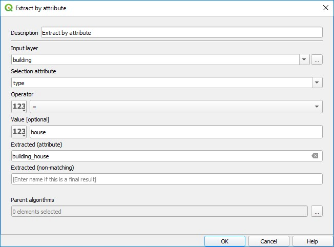

# (PART) Sistem Informasi Geografis {-}

# Pemodelan Sistem Informasi Geografis

**Referensi**

"Geographic Information System (GIS) modeling approach to determine the fastest delivery routes": [https://www.sciencedirect.com/science/article/pii/S1319562X15001370](https://www.sciencedirect.com/science/article/pii/S1319562X15001370)


## Conceptual framework

 

## Data

 


## Final regression model


```{block}
LTIME = +0.2663 * CARVOLUME + 0.6984 * LLENGTH + 0.0203 * LPOP + 0.0605 * TWOWAY + 0.1681 * SCHOOL + 0.0317 * RESIDENTIAL - 0.5497
```

## Studi Kasus : Pemodelan SIG 

### Analisis Wilayah Layanan (Service Area Analyses)

1. Load layer jalan dan fasilitas kesehatan dalam format UTM (Zona 48N).

2. Load raster kepadatan penduduk

3. Melakukan analisis ***service area***

- Processing > Network analyses > Service area

4. Create buffer from service area lines

5. Calculate raster using vector

- Zonal statistics

### Menghitung jumlah rumah di sempadan sungai


  


 




