# Analisis Sistem Informasi Geografis {#hari_keenam}

**Data**

Data dapat diunduh di tautan berikut [https://firmanhadi.github.io/training-for-gis-analyses/img/Day6.zip](https://firmanhadi.github.io/training-for-gis-analyses/img/Day6.zip)

Analisis spasial adalah sebuah proses untuk mengkaji lokasi, atribut dan hubungan antara fitur dari data spasial melalui cara overlay dan teknik analisis lainnya, dalam rangka menjawab pertanyaan atau mendapatkan pemahaman yang bermanfaat. Analisis spasial mengekstrak atau membuat informasi baru dari data spasial.

## Basic Geoprocessing

Geoprocessing adalah operasi SIG untuk memanipulasi data. Operasi geoprocessing membutuhkan input, melakukan operasi tertentu pada data tersebut dan memberikan hasil dari operasi dalam bentuk output dataset, seringkali disebut juga data turunan.

Operasi geoprocessing yang umum adalah overlay, feature selection dan analisis, pemrosesan topologi dan konversi data. Geoprocessing memungkinkan Anda untuk mendefinisikan, mengelola dan menganalisis informasi geografis yang digunakan untuk membuat keputusan.

Dengan kata lain, ektraksi atau pengubahan informasi seperti yang Anda harapkan dari data selalu melibatkan geoprocessing.

<!-- ### Buffer -->

### Penapisan data

Kawasan lindung (taman nasional, suaga margasatwa dan hutan lindung) direncanakan dan dikelola dengan tujuan utama untuk konservasi biodiversitas. Hampir semua kawasan lindung terpapar interaksi dengan manusia, baik di dalam ataupun di luar kawasan. Hal ini akan berpengaruh terhadap hidupan liar dan habitatnya. Oleh karena itu, pertumbuhan populasi merupakan salah satu masalah utama dalam pengelolaan kawasan lindung. Hal tersebut akan memicu perubahan tutupan lahan dan penggunaan lahan, yang berdampak pada semakin tingginya tekanan terhadap kawasan lindung.

Walaupun efek kawasan lindung terhadap permukiman manusia masih menjadi perdebatan, ada sebuah kebutuhan pengelolaan interaksi tersebut, baik dalam hal positif ataupun negatif, yang menjadi vital dalam menjaga kelestarian layanan ekosistem. Dengan alasan ini, memetakan sebaran permukiman adalah salah hal yang dilakukan pertama kali dalam mengelola kawasan lindung.

Dalam pelatihan ini, permukiman direpresentasikan sebagai titik perkampungan dari OpenStreetMap yang akan diekstrak melalui query atau penapisan data. Caranya adalah sebagai berikut :

1. Buka osm_points.shp

2. Klik-kanan pada Layer dan pilih Open Attribute Table.


```{r fig1424, fig.cap='Open Attribute Table',echo=FALSE, message=FALSE, warning=FALSE, out.width='30%', fig.asp=.75, fig.align='center'}
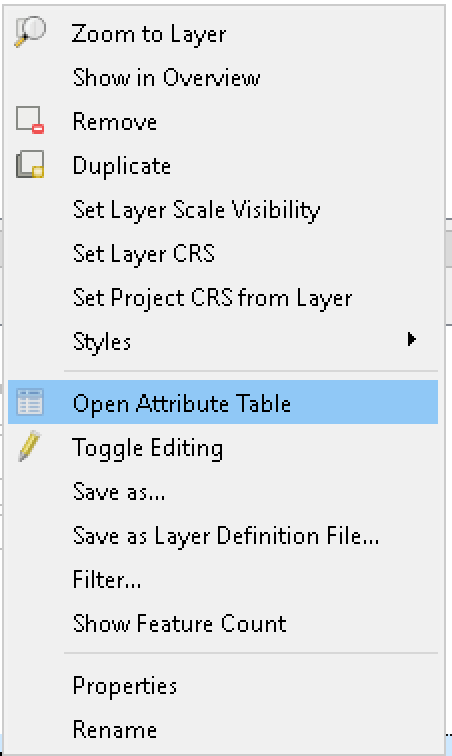
```


3. Klik tombol __Select features by expression__.

```{r fig1425, fig.cap='Select Features by expression button',echo=FALSE, message=FALSE, warning=FALSE, out.width='70%', fig.asp=.75, fig.align='center'}
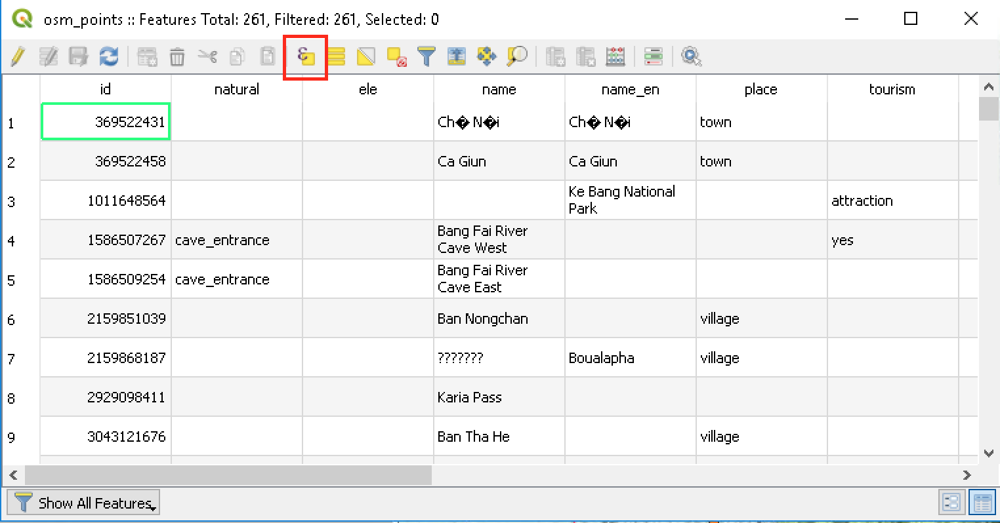
```

4. Pilih __place__ untuk opsi **Field and Values**. Klik tombol __All unique__ untuk melihat nilai yang ada di kolmo Place. Ketik ekspresi "place" = 'village', klik tombol __Select features__ di bagian bawah untuk melakukan penapisan data.

```{r fig1426, fig.cap='Select by expression window',echo=FALSE, message=FALSE, warning=FALSE, out.width='70%', fig.asp=.75, fig.align='center'}
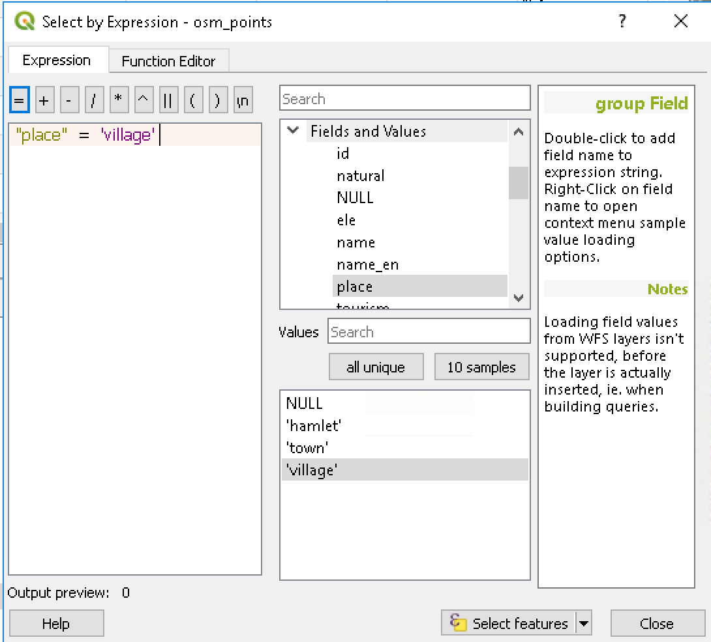
```

5. Baris yang terpilih akan berwarna biru (highlight).


```{r fig1427, fig.cap='Selected records',echo=FALSE, message=FALSE, warning=FALSE, out.width='70%', fig.asp=.75, fig.align='center'}
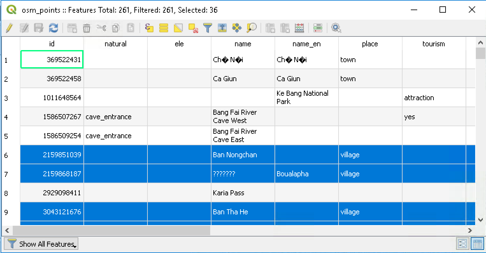
```

5. Klik kanan pada Layer __osm_points__ layer dan pilih __"Save as"__

6. Isikan pilihan seperti pada Gambar \@ref(fig:fig1428). Dan jangan lupa untuk memilih __Save only selected features__.

Untuk mengubah Coordinate Reference System (CRS), klik ikon Globe pada opsi CRS dan ketikkan 32648 dalam kotak Filter.

```{r fig1429, fig.cap='Save Vector Layer As window',echo=FALSE, message=FALSE, warning=FALSE, out.width='70%', fig.asp=.75, fig.align='center'}
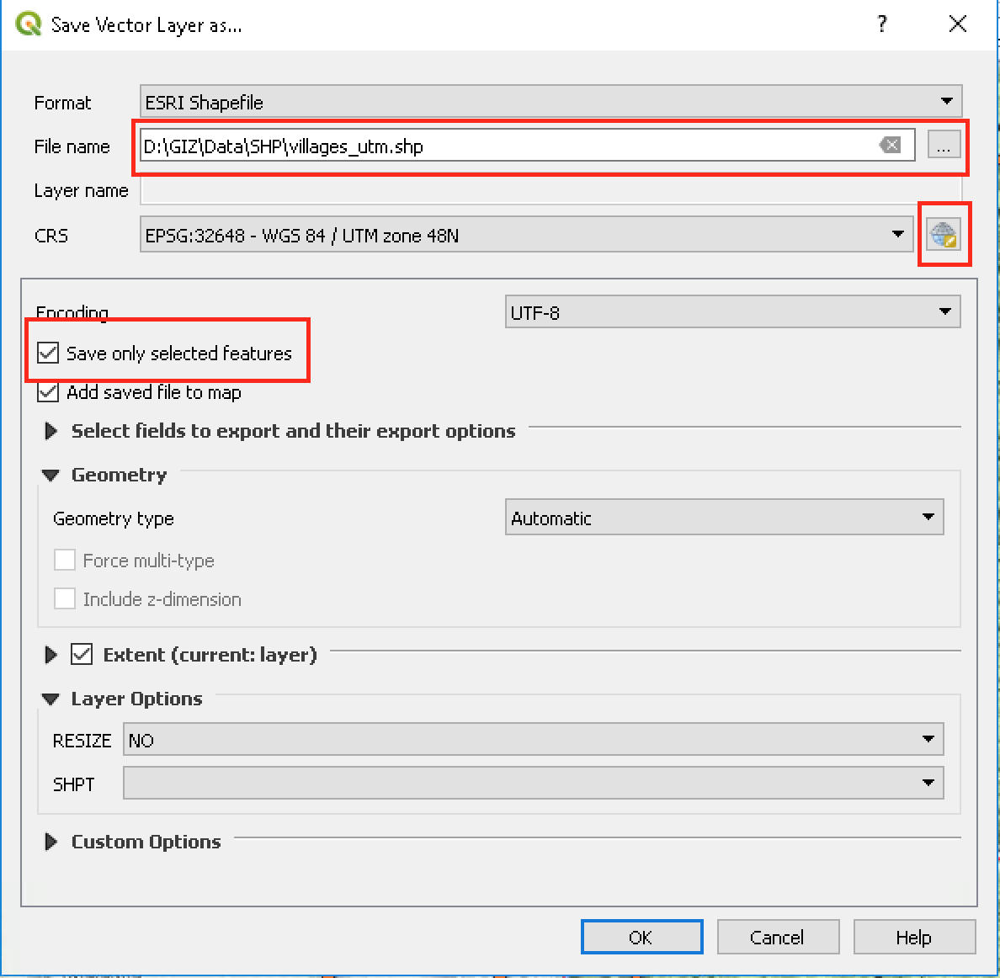
```

```{r fig1428, fig.cap='Selecting new CRS',echo=FALSE, message=FALSE, warning=FALSE, out.width='70%', fig.asp=.75, fig.align='center'}
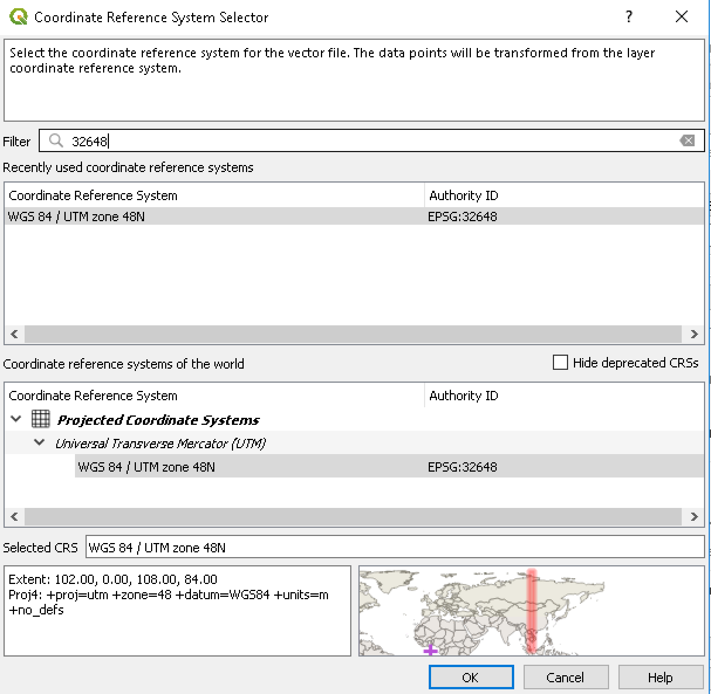
```


### Dissolve

Satu atau lebih atribut dapat dipilih untuk menggabungkan (merge) geometri yang termasuk ke dalam kelas yang sama, atau semua geometri, dapat digabungkan.

Semua luaran (output) geometri akan dikonversi ke dalam bentuk multi geometri. Apabila inputnya adalah Layer poligon, common boundaries (batas bersama) dari poligon-poligon tetangga yang digabungkan, akan dihapus.

Untuk latihan ini, data yang akan digunakan adalah batas administrasi Laos. Batas ini terdiri dari tiga level (1) negara, (2) propinsi dan (3) distrik. Kita akan menggabungkan batas distrik ke tingkat propinsi.

Silakan ikuti langkah berikut untuk menggabungkan poligon berdasarkan atribut:

1. Buka gadm36_LAO_2.shp di Map Display.


```{r fig1419, fig.cap='Lao Admin Boundary Level 2',echo=FALSE, message=FALSE, warning=FALSE, out.width='70%', fig.asp=.75, fig.align='center'}
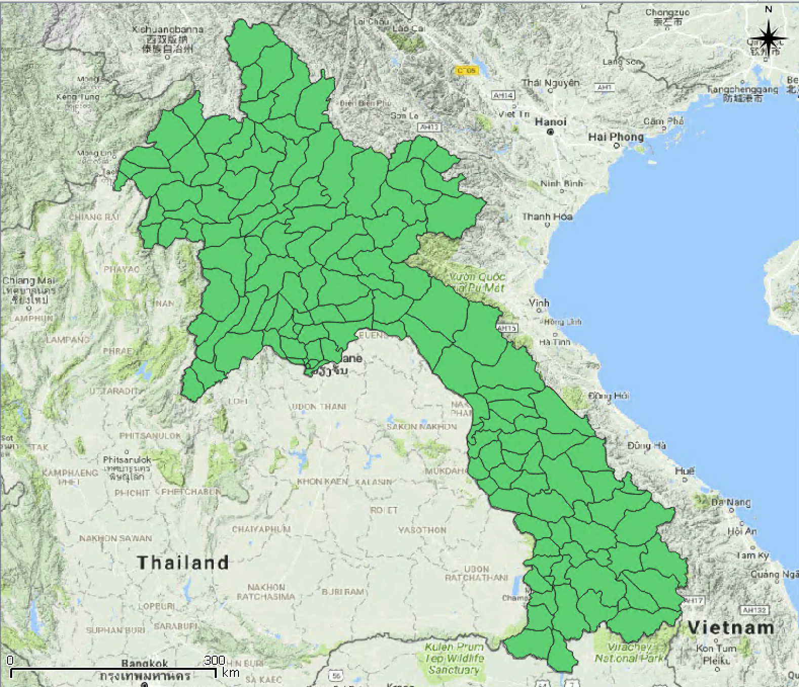
```


2. Pilih ***Vector -> GeoProcessing Tools -> Dissolve***

```{r fig1419a, fig.cap='Dissolve menu',echo=FALSE, message=FALSE, warning=FALSE, out.width='60%', fig.asp=.75, fig.align='center'}
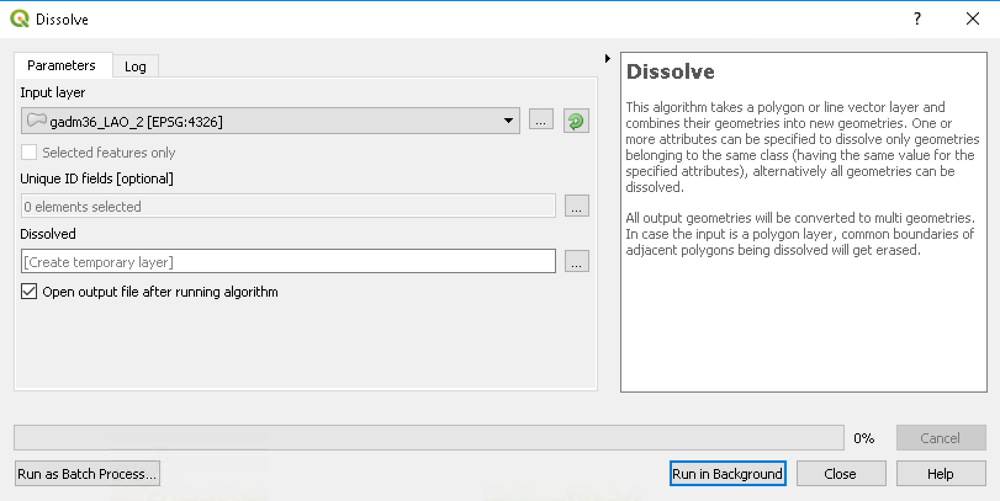
```

3. Klik ... pada **Unique ID Field**, pilih **NAME1** dan klik OK.

```{r fig1420, fig.cap='NAME1 selected as Unique ID',echo=FALSE, message=FALSE, warning=FALSE, out.width='60%', fig.asp=.75, fig.align='center'}
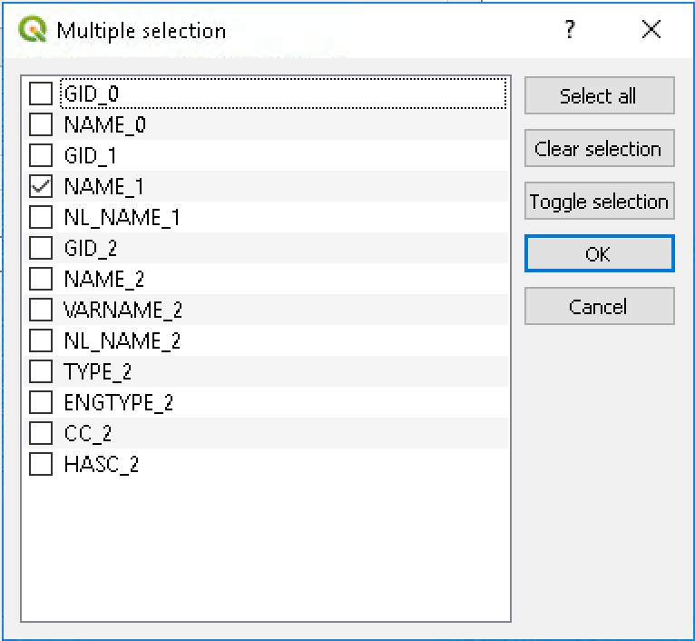
```

4. Pada menu Dissolve, klik __Run in the background__ untuk menjalankan proses.Hasilnya akan ditampilkan di Map Display.


```{r fig1421, fig.cap='Dissolved region',echo=FALSE, message=FALSE, warning=FALSE, out.width='70%', fig.asp=.75, fig.align='center'}
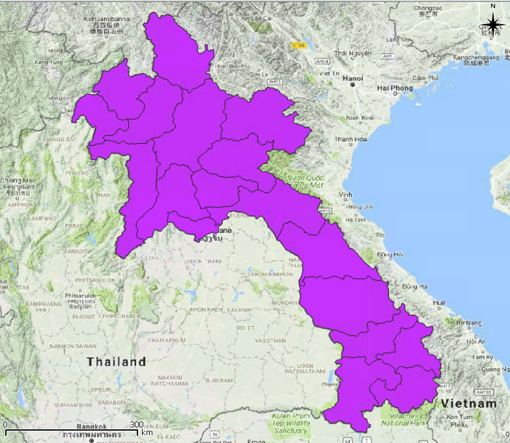
```

### Polygon dari layer extent

<!-- # ```{block2, type='rmdcaution'} -->
<!-- # # The following lesson sometimes failed in QGIS 3. You can try the process in QGIS 3 first and if it is failed, try it in QGIS 2.18 -->
<!-- # # ``` -->

Fungsi ini bermanfaat ketika kita ingin memotong raster atau vektor dengan menggunakan extent (bounding box) dari fitur tertentu.

Ikuti langkah berikut untuk melakukan ekstraksi batas dari poligon:

1. Pilih __Vector -> Research Tools -> Extract layer extent__

2. Anda dapat mengatur apakah luaran disimpan sebagai layer sementara atau disimpan ke dalam berkas baru.

```{r fig1422, fig.cap='Extract layer extent',echo=FALSE, message=FALSE, warning=FALSE, out.width='70%', fig.asp=.75, fig.align='center'}
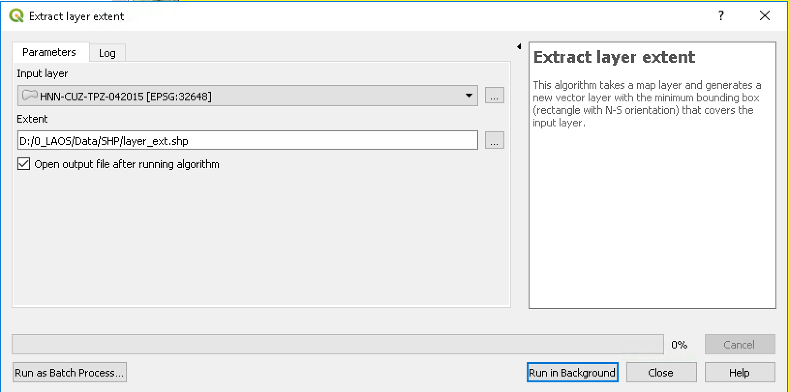
```

3. Hasil dari proses ini adalah sebuah poligon kotak (persegi panjang) berdasarkan batas koordinat kiri-atas dan kanan-bawah dari fitur yang digunakan.

```{r fig1423, fig.cap='Layer extent created',echo=FALSE, message=FALSE, warning=FALSE, out.width='70%', fig.asp=.75, fig.align='center'}
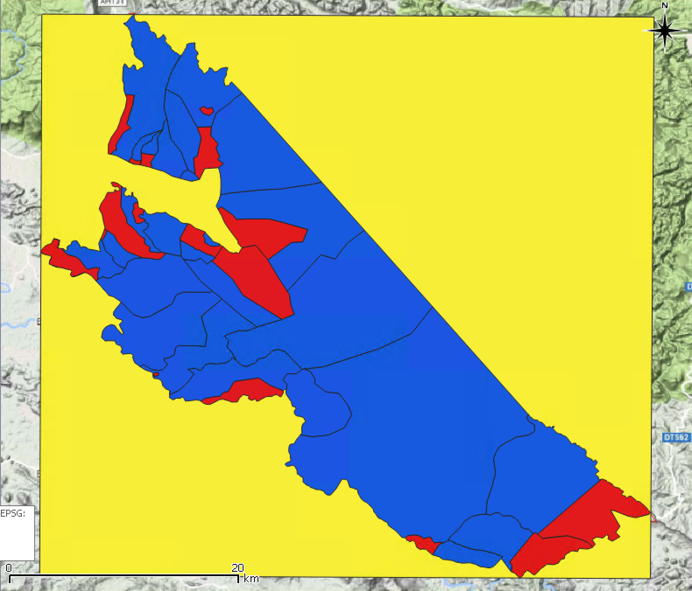
```


<!-- ### Join table -->
<!-- District data -->
<!-- Population data -->

<!-- ### Calculate area -->

<!-- ### Point sampling tols -->


<!-- ### Coordinate transformation -->


<!-- ### Mosaic raster -->
<!-- Clipping WorlPop mosaic with HNN Extent -->
<!-- WorldPop Laos + WorldPop Vietnam -->

<!-- ### Clipping raster -->

<!-- ### Rescale  -->

### Reklasifikasi

Fitur ini merupakan salah satu teknik yang bermanfaat untuk mengubah rentang nilai atau mengelompokkannya ke dalam kategori yang baru.

Kita akan melakukan klasifikasi ketinggian ke dalam tiga kelas:

```
- Kurang dari 1.000 m

- Antara 1.000 dan 2.000 m

- Lebih dari 2.000 m
```

Untuk melakukan ini, silakan ikuti tahapan berikut :

1. Buka __srtm_58_09.tif__

2. Buka fungsi __r.reclass__ dari menu __Processing Toolbox__. Isi pilihan seperti terlihat dalam gambar dan klik **Run**.

```{r fig1474, fig.cap='Reclassifying the elevation data',echo=FALSE, message=FALSE, warning=FALSE, out.width='70%', fig.asp=.75, fig.align='center'}
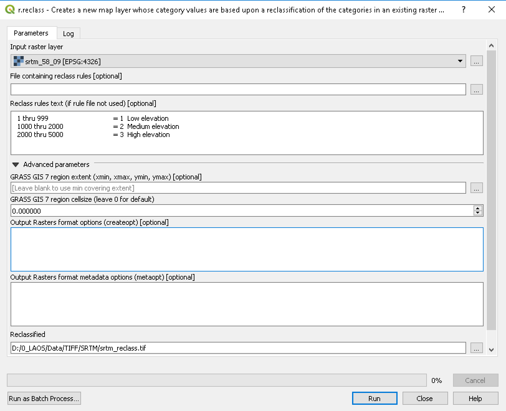
```

3. Hasilnya adalah layer dengan kelas baru

```{r fig1475, fig.cap='Reclassified elevation data',echo=FALSE, message=FALSE, warning=FALSE, out.width='70%', fig.asp=.75, fig.align='center'}
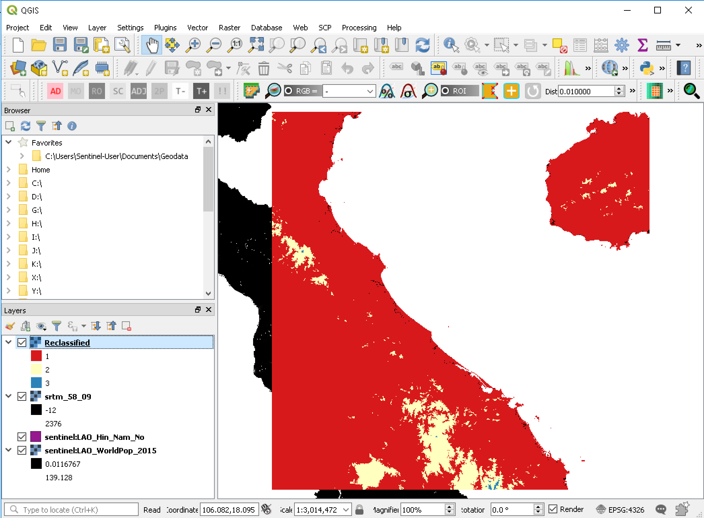
```

Nilai dari setiap piksel dibandingkan dengan rentang limit yang ada di lookup table. 
Apabila nilai piksel termasuk ke dalam kelas tertentu, nilai kelas untuk rentang ini akan digunakan di dalam layer luaran.

<!-- ### Zonal statistics -->

## Terrain analyses

Tipe raster tertentu memungkinkan Anda untuk mendapatkan informasi yang lebih terkait terrain. Biasanya Digital Elevation Models (DEMs) digunakan untuk keperluan ini. 

### Persiapan

1. Buka __srtm_58_09.tif__ (ada di dalam sub folder TIF). Layer ini merupakan DEM dengan 
EPSG:4326 CRS dan ketinggian dalam kaki (feet). Karakteristik ini tidak cocok untuk algoritma terrain analyses, harus dikonversi terlebih dahulu ke dalam proyeksi meter (Universal Transverse Mercator).

2. Reproyeksi layer ke sistem CRS EPSG:32648, menggunakan pilihan **Save as...** pada menu yang muncul ketika di-klik kanan pada nama layer.

3. Buka layer yang dihasilkan.

Ada hal yang perlu diperhatikan ketika menerapkan algoritma terrain analyses, agar hasilnya benar.

Salah satu permasalahan utamanya adalah apabila raster yang digunakan memiliki piksel dengan ukuran panjang dan lebar yang tidak sama (bukan bujur sangkar). Asumsi yang biasa digunakan adalah semua piksel pasti bujur sangkar. Namun seringkali data yang kita dapatkan tidak seperti itu.

Oleh karena itu, tahapan yang perlu dilakukan adalah mengekspor layer dan mendefinisikan ukuran piksel dengan nilai yang sama, misalnya 30 atau 90 m. Caranya adalah dengan klik kanan pada nama layer dan pilih **Save as ... **. Pada dialog ***save*** yang ada, pastikan untuk mengisikan nilai piksel di bagian bawah dialog :

```{r fig1471, fig.cap='Save raster layer as',echo=FALSE, message=FALSE, warning=FALSE, out.width='70%', fig.asp=.75, fig.align='center'}
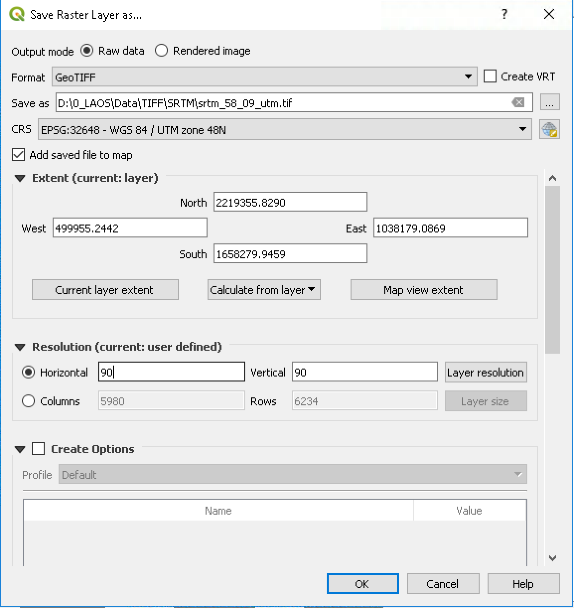
```

### Kelerengan

Kelerengan (**Slope**) merupakan salah satu parameter dasar yang dapat diturunkan dari DEM.
Ia adalah turunan pertama dari DEM dan menggambarkan laju perubahan ketinggian. **Slope** dihitung dengan melakukan analisis ketinggian dari setiap piksel, membandingkannya dengan ketinggian piksel di sekelilingnya. Untuk menghitungnya di QGIS, silakan ikuti cara berikut : 

1. Pada opsi **Processing Toolbox** , pilih algoritma **Slope**, klik ganda untuk membukanya.

```{r fig1472, fig.cap='Calculating slope',echo=FALSE, message=FALSE, warning=FALSE, out.width='70%', fig.asp=.75, fig.align='center'}
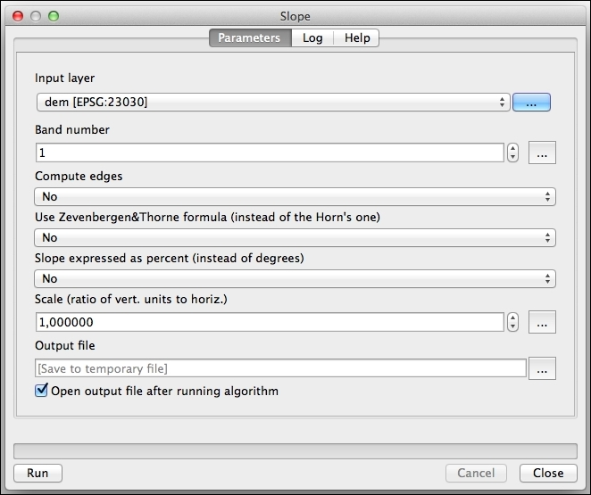
```

2. Pilih **DEM** sebagai layer masukan (input).

3. Klik **Run** untuk menjalankan prosesnya.

### Hillshade

Layer **hillshade** umumnya digunakan untuk memperbagus tampilan peta dan topografi yang intuitif, dengan mensimulasikan sumber cahaya dan bayangan yang dibentuk oleh permukaan bumi. **Hillshade** dapat dihitung dengan cara sebagai berikut :

1. Pada opsi **Processing Toolbox**, cari algoritma **Hillshade** dan klik-ganda untuk membuka menunya.

```{r fig1473, fig.cap='Calculating hillshade',echo=FALSE, message=FALSE, warning=FALSE, out.width='70%', fig.asp=.75, fig.align='center'}
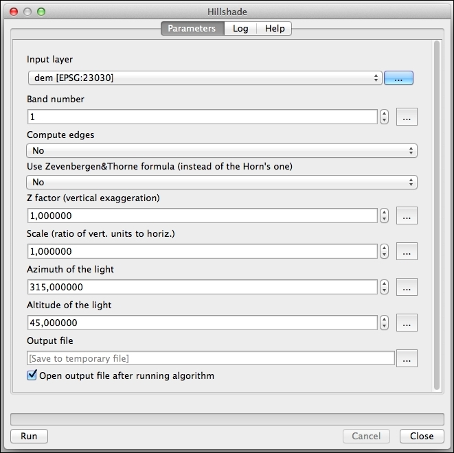
```


2. Pilih DEM sebagai **Input layer**, gunakan parameter default.

3. Klik **Run** untuk menjalankan algoritmanya.

## Density Analyses (Analisis Kepadatan)

Seringkali kita harus bekerja dengan data besar dan padat fiturnya, yang membuat penampilan datanya lambat. Jumlahnya yang ribuan atau bahkan jutaan fitur seringkali sulit diinterpretasi, terjadi overlap antar fitur yang menyebabkan pendeteksian pola cluster atau distribusinya tidak mudah untuk dilakukan.   

Pada bagian ini, kita akan belajar mengenai teknik yang memungkinkan visualisasi dataset semacam itu dengan bentuk yang lebih mudah dibaca dan dengan waktu pemuatan (**loading**) yang lebih cepat. Setelah melakukan praktek di bagian ini, Anda diharapkan mampu melakukan analisis kepadatan (**density analyses**) untuk data yang Anda miliki dan mengekstrak informasi dari peta kepadatan.

### Konsep 

Peta kepadatan memungkinkan estimasi visual konsentrasi objek atau peristiwa di area studi. Peta seperti itu sangat berguna untuk penilaian pola distribusi fitur di wilayah studi. Ketika kita cukup menambahkan lokasi fitur atau peristiwa (misalnya, sebagai titik) ke peta, kita tidak dapat melihat perubahan konsentrasi mereka di area yang berbeda. Analisis kepadatan memberi kita fungsionalitas seperti itu dengan menggunakan karakteristik area yang seragam, seperti jumlah fitur per hektar atau kilometer persegi.

Peta kepadatan memberi kita kemampuan untuk memperkirakan konsentrasi beberapa fitur dalam suatu area. Ini membantu kita menemukan area di mana reaksi mendesak diperlukan atau yang cocok dengan kriteria. **Heatmap** juga membantu mengontrol kondisi dan perubahannya.

Peta kepadatan juga sangat berguna ketika wilayah yang dipetakan (misalnya, kabupaten) memiliki ukuran yang berbeda. Misalnya, jika kita ingin tahu berapa banyak orang yang tinggal di setiap kabupaten, kita hanya perlu peta ordinal dengan data populasi. Menurut peta ini, sebuah distrik besar mungkin memiliki populasi yang lebih tinggi daripada distrik yang lebih kecil. Tetapi jika kita ingin mengidentifikasi kabupaten dengan konsentrasi populasi yang lebih tinggi, maka kita membutuhkan peta kepadatan untuk melihat jumlah orang per kilometer persegi. Dan peta kepadatan akan menunjukkan kepada kita bahwa, pada kenyataannya, daerah kecil dengan kepadatan penduduk yang tinggi mungkin memiliki lebih banyak orang per kilometer persegi daripada kabupaten yang lebih besar.

Secara umum, kita dapat menunjukkan pada peta distribusi kepadatan fitur itu sendiri (misalnya, sekolah), serta distribusi beberapa karakteristik numerik fitur ini (misalnya, jumlah siswa di sekolah). Hasilnya akan sangat berbeda dalam kasus ini. Peta kepadatan sekolah dapat membantu departemen pendidikan menemukan daerah-daerah di mana lebih banyak sekolah dibutuhkan, sementara peta kepadatan dibuat dari informasi tentang jumlah siswa di setiap sekolah dapat membantu perusahaan transportasi untuk merencanakan rute bus dan untuk memutuskan di mana menempatkan halte bus. .

Kasus penggunaan yang paling umum adalah pembuatan peta kepadatan untuk menampilkan kerapatan fitur titik. Peta seperti ini sering disebut **_heat map_**. Apa itu **heat map**? Ini adalah layer raster. Setiap pikselnya menggambarkan kepadatan fitur di sekitarnya (misalnya, jumlah orang per kilometer persegi), yang tergantung pada jumlah fitur dalam beberapa area.

Untuk membuat **heat map**, dalam kasus paling sederhana, GIS melihat fitur di sekitar pusat piksel, menggunakan radius pencarian yang diberikan. Kemudian jumlah fitur yang termasuk dalam radius yang diberikan dihitung dan dibagi dengan luas wilayah. Nilai ini akan menjadi nilai piksel. Kemudian piksel selanjutnya akan dianalisis, dan seterusnya. Sebagai hasilnya, kita akan mendapatkan kombinasi nilai, yang menciptakan permukaan yang halus. Untuk memahami ini lebih baik, lihat diagram berikut:


```{r fig1400, fig.cap='General principle of creating heatmaps',echo=FALSE, message=FALSE, warning=FALSE, out.width='70%', fig.asp=.75, fig.align='center'}
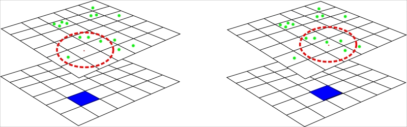
```

Diagram ini menunjukkan prinsip umum pembuatan **_heat map_**. Titik-titik hijau menggambarkan fitur yang digunakan untuk pembuatan peta kepadatan, kotak biru adalah sel raster saat ini, dan lingkaran titik-titik merah menandai radius pencarian, misalnya, 1 km. Dalam hal ini, area yang dicakupi adalah sekitar 3,14 km persegi. Seperti yang dapat kita lihat pada diagram di sebelah kiri, empat fitur berada dalam radius pencarian. Jadi, piksel raster akan mendapatkan nilai 4 / 3,14 = 1,27. Di sisi kanan, kita perhatikan bahwa piksel berikutnya akan mendapatkan nilai 1,59 karena sekarang ada lima fitur di dalam radius pencarian.

Ini adalah pendekatan paling sederhana. Dalam aplikasi dunia nyata, algoritma yang lebih kompleks digunakan, di mana setiap titik memiliki dampak pada nilai-nilai piksel tetangga, tergantung pada jaraknya dari piksel-piksel tersebut.

### Membuat Heatmap dengan plugin QGIS

Dengan bantuan plugin inti QGIS yang disebut **Heatmap**, kita dapat dengan mudah membuat **heat map** dari data titik vektor dan menggunakannya untuk analisis lebih lanjut. Pertama, kita perlu mengaktifkan plugin ini, jika belum diaktifkan. Setelah aktivasi, ia membuat submenu di bawah menu Raster dan menempatkan tombolnya pada bilah alat Raster .

Mari kita buat peta kepadatan untuk lapisan kebisingan , yang berisi informasi tentang keluhan tentang tingkat kebisingan yang tinggi. Lapisan ini berisi 44.397 fitur, dan sulit untuk mengetahui tempat mana yang berisik.

Informasi tentang tempat-tempat seperti itu mungkin berguna bagi departemen kepolisian atau lembaga lain untuk merencanakan beberapa kegiatan untuk mengurangi kebisingan, atau bagi mereka yang mencari apartemen dan tidak ingin hidup berdampingan dengan tetangga yang hobinya mendengarkan musik cadas! .

1. Mulai plugin dengan klik tombol __Heatmap__ pada panel __Raster__, atau dengan melakukan navigasi __Raster | Heatmap | Heatmap....__

```{r fig1409, fig.cap='General principle of creating heatmaps',echo=FALSE, message=FALSE, warning=FALSE, out.width='70%', fig.asp=.75, fig.align='center'}
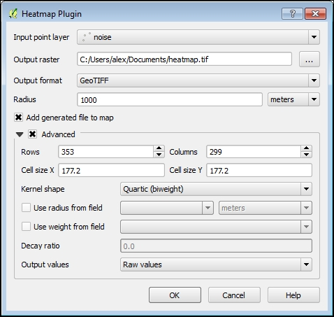
```

2. Pilih layer __noise__ dari kotak centang __Input point layer__.

3. Dengan memilih tombol **…** di bagian kanan dari kolom __Output raster__, tentukan direktori di mana Anda akan menyimpan peta **heat map**. Catatan, Anda tidak perlu menuliskan ekstensi berkasnya, ia akan dipilih secara otomatis.

4. Gunakan kotak centang __Output format__ untuk memilih format data yang diinginkan. Pilihan paling umum adalah __GeoTIFF__, namun untuk peta yang mencakup area luas, lebih baik gunakan format yang lain, misalnya __Erdas Imagine__.

5. Yang terakhir harus ditentukan adalah __Radius__. Nilai ini menentukan jarak dari setiap piksel di mana QGIS akan mencari fitur tetangganya dan mengikutsertakan keberadaan piksel tetangga ke dalam perhitungan. Secara umum, radius yang lebih besar akan memberikan hasil yang lebih umum (tergeneralisasi), karena jumlah fitur akan dibagi dengan area yang lebih besar. Radius lebih kecil akan memberikan hasil yang lebih presisi, namun apabila terlalu kecil maka kita tidak akan dapat melihat pola distribusinya. Radius pencarian dapat didefinisikan dalam meter atau unit peta.

Untuk menentukan radius pencarian dari wilayah tertentu, kita dapat menggunakan formula sederhana berikut yang diperoleh dari formula untuk luas lingkaran:

\begin{equation*}
r = \sqrt{\frac{S}{\pi}}
\end{equation*}

Sebagai contoh, apabila kita ingin menghitung kepadatan per kilo meter persegi, maka radius pencariannya adalah sebagai berikut:

\begin{equation*}
r = \sqrt{\frac{1 km^2}{\pi}} = \sqrt{\frac{1000000 m^2}{3.1415926}} \approx 564.2 m
\end{equation*}

Untuk mengatur hasil yang lebih baik, kita dapat memilih kotak **_Advanced_** dan menentukan beberapa parameter tambahan:


- __Rows and Columns__: 

Ini memungkinkan kita untuk mendefinisikan dimensi raster luaran. Dimensi yang lebih besar akan menghasilkan ukuran berkas luaran yang lebih besar, sedangkan dimensi yang lebih kecil akan menghasilkan luaran yang kasar dan kotak-kotak (*pixelated*). Kolom input ditautkan satu sama lain, sehingga mengubah nilai dalam bidang baris (misalnya, membagi dua) juga akan menyebabkan perubahan yang sesuai dengan nilai di bidang kolom, dan sebaliknya. Selanjutnya, nilai-nilai ini memiliki pengaruh langsung pada ukuran piksel (lihat poin berikutnya). Perlu ditekankan bahwa luas raster dipertahankan saat mengubah dimensi raster.

- __Ukuran piksel X dan Y__: 

Ukuran piksel raster menentukan seberapa kasar atau terperinci tampilan pola distribusi. Ukuran piksel yang lebih kecil akan memberikan hasil yang lebih halus, tetapi waktu pemrosesan dan memori yang diperlukan untuk analisis akan meningkat. Sel besar akan diproses lebih cepat, tetapi raster yang dihasilkan akan *pixelated*. Jika piksel-pikselnya sangat besar, beberapa pola akan menjadi tidak terlihat, jadi Anda mungkin perlu menjalankan analisis beberapa kali, mencoba ukuran sel yang berbeda untuk mendapatkan hasil yang memenuhi kebutuhan Anda.

Ukuran piksel tergantung pada dan terkait dengan dimensi raster. Menambahnya akan mengurangi jumlah baris dan kolom, dan sebaliknya.

- __Kernel shape__: 

Ini mengontrol bagaimana titik mempengaruhi perubahan dengan perubahan jarak dari titik ini. __Heatmap plugin__ QGIS saat ini mendukung kernel seperti berikut:

-- quartic (dikenal juga dengan biweight)

-- triangular

-- uniform

-- triweight

-- Epanechnikov


```{r fig1410, fig.cap='Distribution of the point influence for different kernel',echo=FALSE, message=FALSE, warning=FALSE, out.width='80%', fig.asp=.75, fig.align='center'}
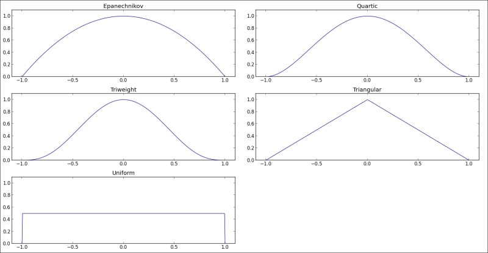
```


Bergantung pada bentuk kernel, kita akan mendapatkan **heat map** yang lebih halus, atau hotspot yang lebih jelas. Misalnya, kernel triweight akan memberikan hotspot yang lebih jelas, lebih tajam daripada kernel Epanechnikov, karena kernel Epanechnikov memiliki pengaruh lebih rendah di dekat pusat hotspot. Juga, dalam bidang ilmiah yang berbeda, kernel yang berbeda lebih disukai; misalnya, dalam analisis kejahatan, kernel kuartik biasanya digunakan.

Dimungkinkan juga untuk menggunakan jari-jari pencarian variabel untuk setiap titik dengan memilih kotak centang **Use radius from field** dan memilih bidang atribut dengan nilai jari-jari dari kotak centang. Jika Anda perlu membobot poin (dengan kata lain, menambah atau mengurangi pengaruhnya) dengan beberapa atribut numerik, aktifkan kotak centang **Use weight from field** dan pilih bobot yang sesuai. Dalam contoh kita, kita tidak akan menggunakan fungsi ini, tetapi Anda dapat mencobanya sendiri.

Seperti yang dijelaskan sebelumnya, ukuran piksel memiliki pengaruh langsung pada kualitas **heat map** yang dihasilkan, jadi penting untuk memilihnya dengan hati-hati. Dalam kebanyakan kasus, ukuran sel dipilih sedemikian rupa sehingga kita mendapatkan 10 hingga 100 sel per unit area (yang pada gilirannya ditentukan oleh radius pencarian). Untuk menghitung ukuran piksel, kita perlu menyelaraskan unit area dengan unit jarak; misalnya, jika kita menghitung kepadatan menggunakan kilometer persegi dan menentukan radius pencarian dalam meter, maka perlu untuk mengubah kilometer persegi menjadi meter persegi. Langkah selanjutnya adalah membagi area dengan jumlah sel yang diinginkan. Akhirnya, karena ukuran piksel ditentukan oleh lebar atau tingginya (karena sel raster biasanya memiliki bentuk persegi), kita perlu mengekstrak akar kuadrat dari nilai ini.

Dalam contoh kita, kita akan membuat **heat map** dengan radius pencarian 1000 m, sehingga area pencarian akan sekitar 3,14 kilometer persegi. Saat dinyatakan dalam meter, ini akan menjadi sebagai berikut:

\begin{equation*}
3.14 km^2 = 3.14 . 1000 m . 1000 m = 3140000m^2
\end{equation*}

Karena kita ingin **heat map** yang halus, kita akan menggunakan jumlah piksel yang relatif besar per satuan luas; katakanlah 100 piksel per 3,14 kilometer persegi. Jadi, kita membagi area dalam meter persegi dengan jumlah piksel yang diinginkan:

\begin{equation*}
\frac{3140000m^2}{100 cells} = 3140000m^2 per cell
\end{equation*}

Akhirnya, kita menghitung akar kuadrat dari nilai ini untuk mendapatkan ukuran yang memungkinkan kita memiliki 100 piksel per 3,14 kilometer persegi:

\begin{equation*}
\sqrt{31400m^2} \approx 177.2 m
\end{equation*}

Tentu saja ini bukan aturan yang kaku tapi hanya rekomendasi. Anda dapat menggunakan ukuran piksel lain dengan aman, tergantung datadan hasil yang Anda inginkan. Hanya ingat bahwa nilai yang lebih kecil mengarah pada **heat map** yang lebih halus, tetapi pada saat yang sama meningkatkan waktu analisis dan menghasilkan ukuran raster yang lebih besar.

Ketika semua input dan parameter diatur, tekan tombol OK untuk memulai proses pembuatan *peta panas **heat map**. Proses pembentukan **heat map** akan ditampilkan dalam dialog progres kecil. Jika proses ini terlalu lama untuk diselesaikan, Anda dapat menghentikannya dengan menekan tombol **Cancel**. Perhatikan bahwa setelah membatalkan pembuatan **heat map**, Anda masih mendapatkan hasilnya, tetapi hasilnya tidak lengkap dan tidak berguna untuk analisis lebih lanjut.

Ketika proses selesai, **heat map** yang dihasilkan akan ditambahkan ke QGIS sebagai raster grayscale, di mana wilayah yang lebih terang menggambarkan dengan nilai kepadatan yang lebih tinggi dan daerah yang lebih gelap berarti memiliki nilai kepadatan yang lebih rendah, seperti ini:

```{r fig1476, fig.cap='Heatmap result in greyscale',echo=FALSE, message=FALSE, warning=FALSE, out.width='80%', fig.asp=.75, fig.align='center'}
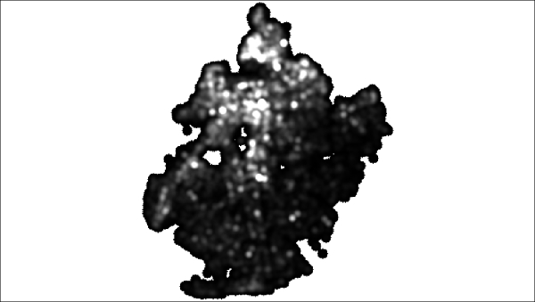
```


Untuk meningkatkan keterbacaan dan membuatnya terlihat seperti **heat map** nyata, kita perlu mengubah gayanya. Untuk melakukan ini, ikuti langkah selanjutnya.

1. Klik kanan pada layer __heatmap__. Pada menu, pilih __Properties__.

2. Buka tab __Style__ dan pilih __Singleband pseudocolor__ untuk __Render type__.

3. Pada grup __Load min/max values__, aktifkan opsi __Min/max__. Pilih __Extent to Full__ dan __Accuracy to Actual (slower)__. Tekan tombol __Load__ untuk mendapatkan statistik layer. Hasilnya akan digunakan untuk klasifikasi nilai.

4. Pilih pola warna (color ramp) pada grup __Generate new color map__, sebagai contoh, __YlOrBr__ (di mana warna berubah dari kuning ke jingga dan kemudian coklat), atau __Red__ (yang menggunakan gradasi warna merah). Jika dirasa perlu, ubah jumlah kelas dan tekan tombol __Classify__.

5. Klik __OK__ untuk menerapkan perubahan dan menutup dialog properties.

```{r fig1477, fig.cap='Heatmap result  pseudocolor',echo=FALSE, message=FALSE, warning=FALSE, out.width='80%', fig.asp=.75, fig.align='center'}
knitr::include_graphics("images/04/fig77.jpg")
```

Sekarang kita dapat dengan mudah menemukan titik terpanas (ditampilkan dalam warna lebih dekat ke merah jika peta warna Merah digunakan), dan bahkan mengenali beberapa pola distribusi yang tidak terlihat ketika kita melihat lapisan titik asli. Juga, lapisan **heat map** kita muncul jauh lebih cepat daripada vektor yang digunakan untuk membuat peta panas ini.


__Mendeteksi wilayah terpanas ("hottest")__

Terkadang, Anda tidak perlu **heat map** itu sendiri, tetapi hanya ingin menemukan hotspot — area dengan kepadatan tertinggi — dan menggunakannya dalam analisis lebih lanjut. Sangat mudah untuk menemukan wilayah seperti itu di QGIS dan mengekstraknya dalam bentuk vektor.

Pertama, kita harus mendefinisikan nilai ambang, yang akan digunakan untuk mengenali hotspot. Sebagai nilai awal, kita dapat menggunakan nilai piksel maksimum dalam **heat map** kita dan kemudian menyesuaikannya dengan kebutuhan kita.

Cara paling sederhana untuk menemukan nilai piksel maksimum adalah dengan menggunakan alat Identify Features . Pilih satu layer di pohon layer QGIS, aktifkan alat Identify Features , klik pada daerah yang paling “terpanas” secara visual, dan lihat nilai yang dilaporkan. Dengan peta panas kita, ini akan menjadi 540,32.

Jika kita akan menggunakan nilai ini sebagaimana adanya, kita tidak dapat menemukan semua cluster penting, jadi nilai ini harus dikurangi terlebih dahulu. Semakin kecil nilai yang dipilih (dibandingkan dengan nilai maksimum), semakin besar jumlah cluster yang ditemukan. Luas cluster yang terpisah juga akan tumbuh. Sebagai contoh kita, kita memilih nilai 200.

Sekarang, buka __Raster Calculator__ dari menu __Raster__, tentukan path di mana berkas akan disimpan dalam kolom __Output layer__, dan masukkan formula __"heatmap\@1">=200__ pada kolom __Raster calculator expression__, seperti berikut:

```{r fig1478, fig.cap='Heatmap result  pseudocolor',echo=FALSE, message=FALSE, warning=FALSE, out.width='80%', fig.asp=.75, fig.align='center'}
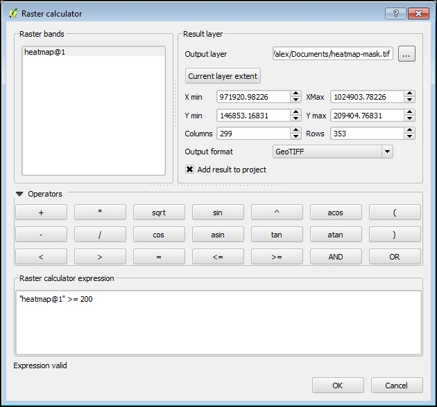
```

Formula ini digunakan untuk membuat apa yang disebut dengan ***mask*** (topeng) . Jika nilai piksel dari lapisan input lebih besar atau sama dengan nilai ambang batas kita 200, maka nilai piksel output akan menjadi 1. Jika tidak, itu akan menjadi 0. Jadi, raster luaran kita akan menjadi raster biner, dengan hanya dua piksel nilai — 0 dan 1 — yang sangat mudah dikonversi menjadi vektor.

Biarkan semua nilai lainnya tetap tidak berubah, sehingga raster yang dihasilkan akan memiliki dimensi dan ukuran sel yang persis sama dengan yang dimasukkan. Tekan tombol **OK** untuk memulai perhitungan. Ketika selesai, layer raster hitam-putih baru akan ditambahkan ke kanvas QGIS, seperti yang ditunjukkan di sini:

```{r fig1479, fig.cap='Mask for heatmap',echo=FALSE, message=FALSE, warning=FALSE, out.width='80%', fig.asp=.75, fig.align='center'}
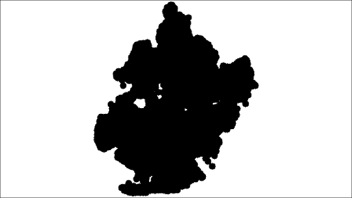
```

Untuk mengonversi topeng raster ke dalam format vektor, kita perlu membuat poligon dari semua piksel yang terhubung dengan nilai yang sama. Di sinilah tool **Polygonize** amat membantu. Di kotak alat **Processing Toolbox**, Anda dapat menemukan algoritma **Polygonize** dengan mengetik namanya di bidang filter di bagian atas kotak alat. Klik dua kali pada nama algoritma untuk membuka dialognya, dan Anda akan melihat sesuatu seperti ini:

```{r fig1480, fig.cap='Polygonized mask',echo=FALSE, message=FALSE, warning=FALSE, out.width='80%', fig.asp=.75, fig.align='center'}
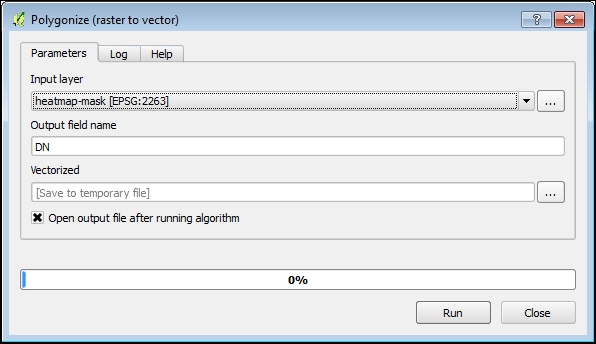
```

Pilih layer mask yang sebelumnya dibuat sebagai layer Input , tentukan path tempat hasilnya akan disimpan menggunakan bidang layer Output , dan klik tombol **Run** untuk memulai algoritma. Setelah selesai, layer vektor baru akan ditambahkan ke QGIS. Lapisan ini memiliki atribut yang disebut DN (jika Anda tidak mengubahnya) yang menunjukkan nilai piksel setiap poligon dalam lapisan. Jadi, yang perlu kita lakukan adalah menghapus semua fitur yang memiliki nilai atribut sama dengan nol. Fitur yang tersisa adalah hotspot.

Untuk menghapus fitur yang tidak perlu dari lapisan hotspot, pilih di **Layer Tree QGIS**, klik kanan untuk membuka menu konteks, dan pilih **Open Attribute** . Klik pada tombol **Select features using an expression**. Dalam dialog **Select by expression** , masukkan “DN” = 0 (jika perlu, ganti DN dengan nama kolom tertentu), klik tombol **Select** , dan tutup dialog. Mulai mengedit dengan mengklik tombol **Toggle editing mode**, atau tekan **Ctrl + E** . Untuk menghapus fitur yang dipilih, tekan tombol **Delete** atau klik **Delete selected features**. Terakhir, matikan mode pengeditan dengan menekan **Ctrl + E** atau klik kembali **Toggle editing mode**

```{r fig1481, fig.cap='Cleaned hotspot polygon',echo=FALSE, message=FALSE, warning=FALSE, out.width='80%', fig.asp=.75, fig.align='center'}
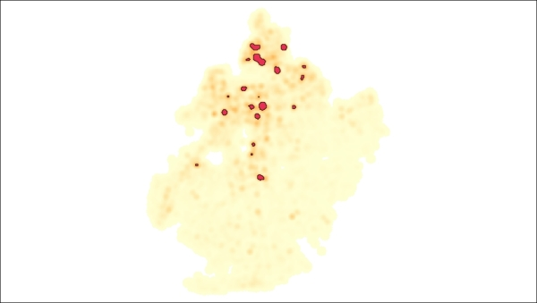
```

Sekarang, lapisan hotspot hanya berisi poligon hotspot, yang dapat digunakan untuk analisis lebih lanjut. Misalnya, kita dapat menggabungkan kluster ini dengan informasi tentang bangunan terdekat dan jenis kebisingan untuk menemukan ketergantungan dan mengembangkan beberapa saran untuk mengurangi tingkat kebisingan di sana.

__Mengamati pola distribusi dengan garis kontur__

Selain mendeteksi titik panas, **heatmap** juga dapat digunakan untuk mendeteksi perubahan intensitas atau memvisualisasikan arah perubahan nilai. Cara paling umum untuk melakukan kedua tugas ini adalah dengan membuat garis kontur.

Untungnya, QGIS memiliki semua alat yang diperlukan untuk ini. kita akan menggunakan **Processing Toolbox** lagi, tetapi pembuatan garis kontur juga tersedia di plugin **GDALTools** (yang dapat ditemukan di menu Raster ). Di kotak **Processing Toolbox**, Anda dapat menemukan algoritma **Contour** dengan mengetik kata tersebut di bidang filter di bagian atas kotak alat. Klik dua kali pada nama algoritma untuk membuka dialognya, yang terlihat seperti ini:

```{r fig1482, fig.cap='Creating Contour',echo=FALSE, message=FALSE, warning=FALSE, out.width='80%', fig.asp=.75, fig.align='center'}
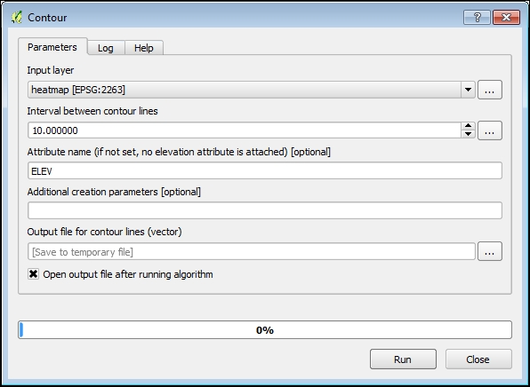
```

Pilih layer **heatmap** sebagai input. Di bagian **Output**, tentukan direktori di mana hasil akan disimpan. Juga, perlu untuk menentukan **Interval between contour lines**. Tidak ada prinsip yang kaku tentang penentuan interval ini. Aturan umum adalah memilih interval yang mendeteksi pola di area dengan perubahan kepadatan halus. Di sini kita akan memilih interval 10.

Ketika semua informasi yang diperlukan telah ditentukan, klik **Run** untuk memulai pembuatan garis kontur. Setelah beberapa waktu, layer vektor poligonal baru akan ditambahkan ke QGIS, dan kita dapat mulai menganalisisnya. Pertama, jika perlu, pindahkan layer kontur ke atas **heat map** di QGIS. Selain itu, lebih baik menyesuaikan simbologi kontur untuk membuatnya lebih mudah dikenali dari latar belakang **peta panas**.

```{r fig1483, fig.cap='Contour heatmap',echo=FALSE, message=FALSE, warning=FALSE, out.width='80%', fig.asp=.75, fig.align='center'}
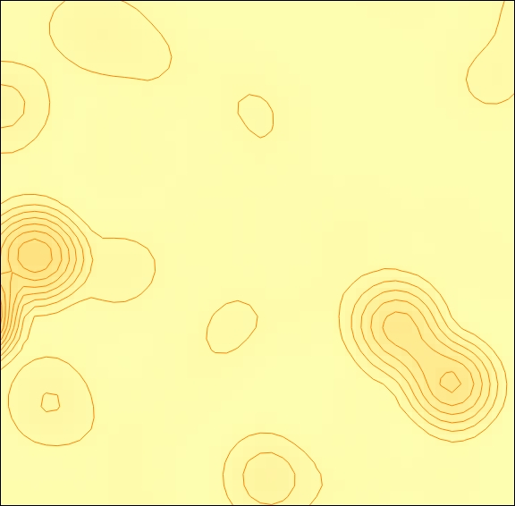
```

Kontur yang lebih padat sesuai dengan perubahan kepadatan yang lebih intens. Selain itu, kita dapat mengidentifikasi arah perubahan kebisingan. Misalnya, dalam *screenshot* sebelumnya, kita dapat melihat bahwa di beberapa tempat, distribusi kebisingan di sekitar pusat tidak sama; intensitas berkurang lebih cepat di tenggara daripada di barat laut. Jadi, kita dapat berasumsi bahwa ada beberapa hambatan untuk kebisingan di sana.

<!-- ### Mapping density with a hexagonal grid -->

<!-- There is also another approach of mapping density, called binning. Generally speaking, binning is a technique of grouping N values/features into M groups, where M < N. The result of such an operation can be interpreted as a two-dimensional histogram. -->

<!-- Binning is an alternative to heat maps, not a replacement. The choice of the method depends on the requirements and further usage of the results. It is, however, worth mentioning that binning produces a vector output, while a heat map produces a raster output. -->

<!-- In general, binning can be described in two simple steps: -->

<!-- Create a hexagonal grid on top of the point layer. -->

<!-- Count the number of points in each grid cell. -->

<!-- In this section, you will learn how to use this technique in QGIS in the example of hexbinning, in other words, mapping density with a hexagonal grid. -->

<!-- Note -->
<!-- In fact, for binning, we can use not only hexagons but also other shapes that allow regular tessellation of a 2D surface—triangles and rectangles. -->

<!-- Why do we choose hexagons? Well, because a hexagon is closest to a circle among all shapes that tessellate. As a result, they represent curves more naturally. Another advantage of hexagons is a more compact structure, so the distance between cell centers in a hexagonal grid is lower than in a rectangular grid. So data aggregation around the cell center is more efficient. -->

<!-- Note -->
<!-- In Chapter 8, Automating Analysis with Processing Models, we will create a model that produces two density maps: hexagonal and rectangular, so that you can compare them side by side and better understand their differences and use cases. -->

<!-- In the upcoming sections, we will create a density map using this approach. For this exercise, we will use data from Brooklyn's street tree census. This is the trees layer in our map. -->

<!-- Creating a hexagonal grid -->
<!-- To create a hexagonal grid, we will use the QGIS Processing framework and its algorithm called Create grid: -->

<!-- In the Processing toolbox, find the Create grid algorithm by typing its name in the filter field at the top of the toolbox. Double-click on the algorithm name to open its dialog, which looks like this: -->


<!-- In the Grid type combobox, select Hexagon (polygon). -->

<!-- To specify grid extent press the … button on the right side of the Grid extent field and choose Use layer/canvas extent from the menu. -->

<!-- The Select extent dialog will pop up. Use it to select the trees layer from the combobox, and click on OK. The coordinates of the layer extent will be added to the field. -->

<!-- Set 1000 as the horizontal and vertical spacing. These values have the same meaning as the search radius in the case of heat maps. Grid spacing determines how many cells will be in a grid and how smooth the resulting map will be. A smaller spacing produces smoother results, but very small values prevent us from identifying any distribution patterns. Note that the spacing should be specified in the same units as used by layer; for example, if a layer CRS uses feet as units, then the spacing should be in feet too. -->

<!-- Finally, in the Output field, specify the path where the resulting grid will be saved and click on Run to create the grid. When the algorithm execution completes, a new polygonal layer will be added to QGIS. -->

<!-- Counting points in grid cells -->
<!-- To calculate the number of features inside each grid cell, we can use fTools or Processing core plugins. The latter is more flexible and allows us to automate tasks, as described in Chapter 8, Automating Analysis with Processing Models. We will use the Count points in polygon algorithm from the Processing framework. -->

<!-- Tip -->
<!-- There is also a Count unique points algorithm in Processing that lets us count only points with unique attributes in the selected field. This may be useful when a more precise analysis is needed, for example, for mapping diversity. -->

<!-- In the Processing toolbox, find the Count points in polygon algorithm by typing its name in filter field at the top of the toolbox. Double-click on the algorithm name to open its dialog, and you will see this: -->


<!-- Select the grid layer created in the previous section as Polygons and the trees layer as Points. Enter Count field name or leave it unchanged. Don't forget the 10-character limitation for the shapefile field names! Finally, in the Result field, specify the location where the resulting layer will be stored, and click on the Run button to start the analysis. Keep in mind that this may take some time, as the tree layer contains many features and the grid size is relatively small. -->

<!-- When an algorithm execution completes, a new grid layer, containing the field with the number of points in each cell, will be added to QGIS. We can safely remove the original grid layer from QGIS and from the filesystem, as it is no longer needed. -->

<!-- For better visual representation of our data, we apply a graduated renderer to style cells according to the number of features in them. If necessary, go back to the Developing styles for vector layers section of Chapter 2, Visualizing and Styling the Data. The result may look like this: -->


<!-- Removing redundant data -->
<!-- If we look carefully at our grid layer and its attribute table, we will see that some grid cells are empty; there are no points in them. Such cells displayed with a very light green color in the preceding screenshot. It is clear that the empty cells are much more than the nonempty cells. Of course, we can simply hide such empty cells by assigning to them the same color as the map background, or by removing them from the renderer (assigning an empty style). But, is it better to remove them completely and reduce the file size? -->

<!-- There are two possible ways to remove empty cells: manually or by using one of the existing tools from the Processing toolbox. Each method has own advantages. -->

<!-- First, you will learn how to remove redundant data manually. This method can be used when you need to process only one layer and don't want to create any temporary intermediate files. Also, it allows you to easily examine the features that will be removed. Let's do it: -->

<!-- Select the LAYER layer from the QGIS layer tree. Then, click on the Select features using an expression button in the Attributes toolbar to open the Select by expression dialog. -->


<!-- In the functions tree, under the Fields and Values group, find the NUMPOINTS field and double-click on it to add its name to the expression. -->

<!-- Then, click on = to add the equal to operator to the expression, and type 0 after it. The final expression will look like "NUMPOINTS" = 0. -->

<!-- Click on Select to select all the features that match your condition. The selected features will be highlighted in yellow so that you can check whether they are what you want. -->

<!-- Now, close the Select by expression dialog and open the layer attribute table by clicking on the Open Attribute Table button in the Attributes toolbar. -->

<!-- Toggle editing mode by clicking on the corresponding button in the attribute table dialog, or by simply pressing Ctrl + E. -->

<!-- To remove the selected features, just press the Delete key or click on the Delete selected features button. -->

<!-- Finally, turn editing mode off by pressing Ctrl + E again. Now our layer contains only nonempty cells and is much smaller in size. -->

<!-- Deleting redundant data with Processing requires fewer steps than removing redundant data manually, but instead of updating the existing layer, it creates another file. The Processing framework is useful when you need to process many layers at once or want to automate some operations. To remove empty cells, we can use the Extract by attribute algorithm. -->

<!-- Tip -->
<!-- In our case, the comparison condition is very simple, so we use the Extract by attribute algorithm. When a more complex comparison condition that includes several attributes or some calculations is needed, it is better to use the Select by expression algorithm in combination with Save selected features. -->


<!-- Here are the necessary steps: -->

<!-- Find the Extract by attribute algorithm by typing its name in the filter field, and double-click on its name to open its dialog. -->

<!-- In the Input layer combobox, select LAYER. -->

<!-- In the Selection attribute combobox, select the NUMPOINTS field, which stores the point count in each cell. -->

<!-- In the Operator combobox select the not equal operator !=. -->

<!-- Enter 0 in the Value field. -->

<!-- Specify the name of the output file in the Output field. -->

<!-- Now, we can press the Run button to start processing. When it is done, the new layer, with empty cells removed, will be added to QGIS, and we can remove the original layer. The new layer is much smaller, but still contains all of the information. Also, we can now set up styles more precisely and identify some distribution patterns that were not visible earlier. -->


<!-- If we overlay a layer that has a street network with this density map, we can easily identify that the greenest street is the Ocean Parkway. -->

<!-- The result looks great, but performing all of these steps manually is not very comfortable. Also, there are a number of intermediate layers that can, and should, be removed. Fortunately, QGIS allows us to automate such operations with the Processing Graphical Modeler. Refer to Chapter 8, Automating Analysis with Processing Models, to learn how to create models and use them. -->

## Analisis kesesuaian

Kita hidup di dunia yang penuh dengan berbagai hubungan yang dapat dianalisis dalam konteks fungsional, temporal, atau spasial. Hubungan spasial merupakan hal yang sangat menarik di bidang GIS, karena di sini objek ruang direpresentasikan dengan cara yang membantu penjelasan serta memperlihatkan hubungan geografis mereka. Analisis kesesuaian adalah bagian mendasar dari analisis GIS yang menjawab pertanyaan, "Di mana tempat terbaik untuk menempatkan fasilitas baru?" Dalam bab ini, kita akan dihadapkan pada dasar-dasar analisis kesesuaian melalui pencarian tempat terbaik untuk tempat tinggal. Kita akan belajar cara:

```
- menginterpretasikan relasi spasial antar obyek

- mengekspresikan relasi ini melalui data spasial

- menganalisis data spasial sesuai serangkaian kriteria yang ditentukan

- melakukan analisis overlay dan menjelaskan hasilnya
```

__Dasar Analisis Kesesuaian__

Analisis kesesuaian diakui sebagai pendekatan *multi-criteria decision support*. Dengan kata lain, tujuan utamanya adalah untuk membagi bidang yang diminati menjadi dua kategori berdasarkan seperangkat kriteria yang telah ditentukan: sesuai untuk beberapa jenis penggunaan (hidup, bangunan, konservasi, dan sebagainya) dan tidak sesuai. Pendekatan umum yang digunakan untuk penilaian kesesuaian adalah overlay lapisan ganda yang mendukung keputusan multi-kriteria. Bergantung pada data yang mewakili kriteria kesesuaian dan overlay, ada dua pendekatan dasar yang tersedia:

1. Analisis kesesuaian dengan data vektor. 

Ini terutama menggunakan operasi seperti buffering dan kombinasi berurutan mereka menggunakan operasi overlay vektor, seperti **Clipping**, **Intersection**, dan **Union**.

2. Analisis kesesuaian dengan data raster. 

Ini sangat bergantung pada aljabar raster, yang digunakan untuk mengklasifikasikan ulang cakupan raster awal dan kemudian menggabungkannya untuk menghasilkan raster kesesuaian biner atau peringkat. Pendekatan ini lebih fleksibel, karena memungkinkan untuk menghasilkan beberapa kelas kesesuaian dan mengubah bobot raster sesuai dengan pentingnya faktor yang diwakilinya. Dampaknya, pengguna dapat menghasilkan kombinasi hasil, tetapi alur kerja membutuhkan lebih banyak upaya yang terhubung ke pengambilan data dan keputusan.


\newpage

                                                Vector data                             Raster data
-------                                         -----------                             ---------
__Main operations__  
                                                Buffering                                 Vector data rasterization
                                                Clip overlay                              Proximity raster creation
                                                Intersection overlay                      Raster reclassification
                                                Union overlay                             Raster algebra addition
                                                                                          Raster algebra multiplication
                                                                                          Raster algebra substraction
__Advantages__
                                                Workflow quickness                        Simple data reclassification
                                                Workflow simplicity                       Good representation of continuous features
                                                Good representation of man-made features  Crisp and fuzzy classes are possible
                                                                                          Different weighting according to their importance
                                                                                          Various assessments are possible
__Limitations__
                                                Provide only crisp classes                Reclassification and ranking subjectivity
                                                Usually provide binary assessment only    Workflow complexity
                                                
                                                
Apa pun pendekatan yang akan diikuti, alur kerja analisis kesesuaian umum melibatkan beberapa langkah umum. kita sekarang akan melihat lebih dekat pada mereka untuk memastikan pemahaman yang lebih baik tentang sistem analisis kesesuaian:

1. __Definisikan maksud dan tujuan dari analisis Anda__ 

Pertanyaan yang akan dipelajari dirumuskan secara umum, dan signifikansi terapannya ditentukan, yang nantinya akan menjadi seperangkat kriteria kesesuaian.

Beberapa aplikasi kesesuaian yang populer meliputi yang berikut:

**Pertanian** : Penilaian kesesuaian area untuk budidaya tanaman tertentu.

**Ritel** : Area dinilai dari sudut pandang pemasaran — apakah akan menarik pelanggan atau pembeli baru, atau tidak. Jenis analisis ini sangat diminati ketika memilih lokasi belanja yang disukai.

**Energi terbarukan** : Menilai kesesuaian lahan untuk lokasi tenaga angin atau stasiun tenaga surya adalah tren yang luar biasa di bidang perencanaan geospasial untuk keberlanjutan.

**Konservasi alam** : Kebutuhan konservasi diprioritaskan menggunakan pemodelan kesesuaian habitat, dan kawasan ini dibagi menjadi lokasi yang lebih atau kurang bernilai untuk kelangsungan hidup dan reproduksi spesies tertentu.

Secara umum, aplikasi utama dari analisis kesesuaian adalah di bidang perencanaan penggunaan lahan, yang bertujuan memprioritaskan berbagai jenis kegiatan manusia dalam ruang dan sumber daya alam yang terbatas.

2. __Lakukan analisis ketersediaan data dan tentukan relevansinya terhadap maksud dan tujuan__

Relevansi data dengan tujuan dan sasaran hendaknya ditentukan. Ketersediaan data saat ini dan kebutuhan data masa depan sebaiknya dianalisis, terutama pengetahuan tentang apakah turunan data saat ini dapat digunakan untuk analisis atau tidak. Misalnya, jika kita harus menganalisis kesesuaian untuk kebutuhan pertanian, DEM dapat menjadi sumber yang bagus. Ini tidak hanya memberikan informasi dasar tentang **relief**, tetapi juga beberapa turunan yang bermanfaat, seperti kemiringan dan aspek. Hasil utama dari tahap ini adalah daftar sumber data primer dan turunan potensial mereka.

3. __Definisikan kriteria dari analisis__

Ini adalah tahap yang paling penting, di mana tujuan analisis digambarkan sebagai kriteria numerik yang jelas berdasarkan data yang relevan. Tujuan deskriptif diterjemahkan ke dalam bahasa analisis SIG. Pada tahap ini, berbagai jenis hubungan spasial antara objek dianalisis, dan beberapa hubungan paling populer termasuk yang berikut:

\newpage


- hubungan point-to-point :

-- "is within": Semua sekolah yang berjarak 1 km dari tempat tinggal

-- "is nearest to": Sekolah dasar yang paling dekat dengan tempat tinggal

```{r fig1401, fig.cap='Example of the "is within" point-to-point relationship',echo=FALSE, message=FALSE, warning=FALSE, out.width='20%', fig.asp=.75, fig.align='center'}
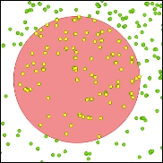
```


- hubungan point-to-line:

-- "is nearest to": alan yang paling dekat dengan pintu masuk stasiun kereta bawah tanah


```{r fig1402, fig.cap='Example of the "nearest to point-to-line" relationship',echo=FALSE, message=FALSE, warning=FALSE, out.width='20%', fig.asp=.75, fig.align='center'}
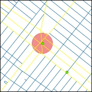
```


- point-to-polygon relationships:

-- "is contained in": Semua sekolah negeri dalam batas komunitas tertentu


```{r fig1403, fig.cap='Example of the "is contained in" point-to-polygon relationship',echo=FALSE, message=FALSE, warning=FALSE, out.width='20%', fig.asp=.75, fig.align='center'}
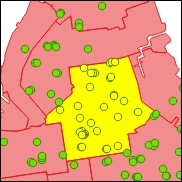
```


- relasi line-to-line:

-- "crosses": Apakah jalan setapak tertentu melintasi jalan

-- "is within": Temukan semua jalan setapak yang berjarak 1 km dari sungai tertentu

-- "is connected to": Temukan semua jalan yang terhubung ke jalan raya tertentu


- relasi line-to-polygon:

-- "intersects": Temukan semua distrik yang dilintasi oleh jalan setapak

-- "contains": Temukan semua jalan yang benar-benar dalam satu kabupaten tertentu


```{r fig1404, fig.cap='Example of the "intersects" line-to-polygon relationship',echo=FALSE, message=FALSE, warning=FALSE, out.width='20%', fig.asp=.75, fig.align='center'}
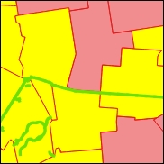
```


- relasi polygon-to-polygon:

-- "completely within": Temukan semua kabupaten yang sepenuhnya berada dalam zona bahaya

-- "is nearest to":  Find the building that is nearest to a park

```{r fig1405, fig.cap='Example of the "completely within" polygon-to-polygon relationship',echo=FALSE, message=FALSE, warning=FALSE, out.width='20%', fig.asp=.75, fig.align='center'}
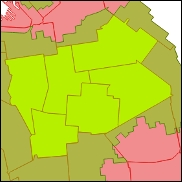
```


4. __Analisis primer dan penyiapan data__ 

Data dianalisis sesuai dengan serangkaian kriteria yang ditentukan pada tahap sebelumnya. Operasi analisis umum melibatkan pemilihan berdasarkan lokasi, buffering, rasterisasi, *proximity* (jarak raster), dan sebagainya. Setelah semua lapisan yang diperlukan siap, data tersebut harus siap untuk di-overlay, yang melibatkan proyeksi ulang ke sistem referensi koordinat umum (jika perlu), menetapkan rentang untuk berbagai peringkat, dan klasifikasi ulang dalam sistem peringkat umum. Semua layer harus berisi nilai dalam unit yang seragam, jika tidak, overlaynya akan menjadi tidak berarti dan sulit untuk ditafsirkan.

5. __Overlay data dan interpretasikan hasilnya__

Lapisan yang disiapkan sebelumnya digabungkan menjadi satu cakupan yang didasarkan pada seperangkat aturan yang ditentukan pengguna. Bergantung pada data yang tersedia dan aturan yang diterapkan, penilaian kesesuaian berikut dimungkinkan:

- __Binary suitability assessment__ 

Semua area dibagi ke dalam kategori yang sesuai dan tidak sesuai. Ini adalah tipe penilaian paling sederhana yang dapat diperoleh dari overlay data vektor.

- __Ranked suitability assessment__ 

Tempat diberi peringkat dari yang paling tidak sesuai hingga yang paling sesuai berdasarkan seluruh rentang kriteria yang telah ditentukan. Jenis penilaian ini dapat diturunkan dari data vektor dan raster. Ini memungkinkan Anda menghindari penilaian ya / tidak yang sederhana, yang tidak melekat pada kata aslinya. Keuntungan ini diimbangi oleh subjektivitas peringkat data dan kepentingan yang sama dari berbagai faktor. Namun demikian, di dunia nyata, kontribusi mereka terhadap penilaian keseluruhan dapat bervariasi.

- __Weighted suitability assessment__ 

Ini serupa dengan jenis penilaian sebelumnya dan hanya memiliki satu perbedaan signifikan: berbagai faktor dapat diberi bobot berbeda sesuai dengan kepentingannya untuk jenis kegiatan tertentu. Jenis penilaian ini bergantung pada pendekatan aljabar raster dan dianggap inklusif, tetapi bukan tanpa subjektivitas, terutama ketika menyangkut faktor pembobotan dan menafsirkan hasil akhir.

### Tahap 1: Mendefinisikan maksud dan tujuan

Sepanjang tutorial ini, kita akan menganggap bahwa kita bekerja untuk satu pasangan muda dengan anak kecil. Mereka mencari tempat yang sempurna untuk tinggal di wilayah tertentu yang menarik perhatian mereka. Tujuan kita adalah menggunakan kekuatan metode analisis kesesuaian berbasis GIS dan memberikan jawaban yang objektif dan dapat diandalkan untuk pertanyaan mereka.

Tujuan dari analisis ini adalah untuk menemukan area yang cocok untuk keluarga muda dengan anak, dengan pertimbangan tertentu. Banyak dari persyaratan mereka mirip dengan yang dimiliki oleh perusahaan pengembang perumahan tradisional. Misalnya, kedekatan dengan stasiun kereta bawah tanah, zona hijau, dan keselamatan publik harus dipertimbangkan. Ada juga beberapa persyaratan khusus keluarga yang harus dipertimbangkan. Seperti yang telah disebutkan, keluarga memiliki anak kecil, yang berarti bahwa kita harus memperhitungkan keberadaan anak usia dini atau sekolah dasar di dekatnya. Juga, mereka tertarik pada olahraga, dan akan lebih bagus jika daerah tempat mereka akan tinggal memiliki infrastruktur istirahat yang berkembang dengan baik dan aktif. Setelah tinjauan semacam ini, kita dapat merumuskan beberapa persyaratan dan tujuan yang lebih spesifik:

- __Keselamatan__: Area tidak boleh terkena atau memiliki resiko tinggi terhadap ragam bahaya alam dan kejahatan

- __Konektivitas__: Harus terhubung dengan baik ke jaringan transportasi kota

- __Greenness and openness__: Harus dekat dengan taman atau area hijau lainnya

- __Educational potential__: Ada lokasi pendidikan anak usia dini atau sekolah dasar di lingkungan tersebut

- __Active rest opportunities__:  Termasuk jaringan bersepeda dan fasilitas atletik

- __Cultural life__: Galeri seni dan museum dapat dikenali sebagai tanda umum hidupnya budaya

Sekarang setelah tujuan dan persyaratan utama telah diklarifikasi, kita dapat melanjutkan ke langkah berikutnya dan mempelajari semua data yang tersedia untuk menilai relevansinya dengan contoh kita.

### Tahap 2 : Analisis ketersediaan data dan definisikan relevansi

Segera setelah kita menetapkan persyaratan dasar, kita perlu melakukan eksplorasi data yang mungkin untuk digunakan dan relevan untuk analisis. Dataset pelatihan berisi sejumlah besar dataset, dan yang paling relevan di antaranya tercantum dalam daftar berikut:

#### Keselamatan

- Layer *hurricane_evacuation_zones* : 

Zona evakuasi badai adalah area kota yang mungkin perlu dievakuasi karena ancaman yang terkait dengan keselamatan dan kehidupan dari badai topan.

- Layer *hurricane_inundation_zones* :

Zona genangan badai adalah area genangan badai terburuk.

- Layer noise_heatmap :

Raster yang dibuat di bagian membuat *Heat map*, yang menunjukkan kepadatan spasial pengaduan kebisingan yang terdaftar mungkin berguna untuk penilaian potensial untuk keselamatan publik.

#### Konektivitas

- Layer subway_entrances :

Lokasi pintu masuk kereta bawah tanah.

#### Greenness dan openness

- Layer parks :

Lapisan yang berisi informasi ruang terbuka hijau, seperti lapangan, trek, taman, dan sebagainya.

- Layer *tree_density* :

Ini adalah layer raster yang dibuat dari data sensus pohon.


#### Educational potential

- Layer elementary_schools :

Ini adalah lokasi titik sekolah berdasarkan alamat resmi. Lapisan ini mencakup beberapa informasi dasar tentang sekolah, seperti nama, alamat, jenis, dan informasi kontak kepala sekolah.

#### Active rest opportunities

- Layer bike_routes : 

Lokasi jalur sepeda dan rute di seluruh kota.

- Layer athletic_facilities

Lapisan ini berisi fasilitas atletik dan beberapa informasi dasar tentangnya, termasuk jenis olahraga utama, permukaan, dimensi, dan sebagainya.


#### Cultural life
 
- Layer musemart :

Lokasi museum dan galeri seni.


### Tahap 3 : Definisikan kriteria analisis 

Pada layer *hurricane_evacuation_zones*, ada enam zona, yang diperingkat dalam zona bidang atribut berdasarkan risiko dampak gelombang badai, dengan zona 1 menjadi wilayah yang kemungkinan besar akan banjir. Jika terjadi badai atau badai tropis, penghuni di zona ini harus mengungsi. Daerah dengan nilai zona X tidak berada dalam zona evakuasi. Area dengan nilai zona 0 adalah salah satu dari yang berikut: air, dermaga kecil, atau pulau-pulau tak berpenghuni. Untuk keperluan analisis, lapisan ini harus dirasterisasi dan diberi peringkat sesuai dengan risiko dampak badai, dengan nilai peringkat turun dari area yang tidak berada dalam zona evakuasi ke yang paling mungkin terkena banjir.

Lapisan poligon *hurricane_inundation_zones* berisi informasi tentang risiko genangan akibat badai, ditulis di kolom atribut, di mana nilainya adalah ketinggian lonjakan (dalam feet). Area yang kemungkinan besar akan tergenang diberi nilai 1, dan area yang dikecualikan dari pemodelan inundasi diberi nilai 5. Lapisan ini harus dirasterisasi dan diberi peringkat dengan nilai kesesuaian potensial tertinggi untuk area yang dikecualikan, dan yang terendah untuk bidang kategori 1.

Layer raster *noise_heatmap* adalah raster yang harus diberi peringkat menggunakan beberapa kategori, dengan nilai kesesuaian terendah untuk tempat paling berisik dan sebaliknya. Hal yang baik di sini adalah kita tidak perlu melakukan rasterisasi layer ini, seperti yang kita lakukan pada layer sebelumnya. Pada saat yang sama, menetapkan jumlah dan kisaran untuk peringkat membawa subjektivitas ke dalam penilaian kita. Layer *tree_density*, yang juga merupakan raster kepadatan, harus dianalisis dengan cara yang sama.

Lapisan yang dipilih lainnya harus dianalisis terlebih dahulu untuk kedekatannya. Untuk tujuan ini, pertama-tama kita akan merasterisasi mereka, kemudian membuat *continuous raster proximity*, dan akhirnya peringkat mereka di bawah beberapa kategori sesuai dengan nilai *proximity* (semakin dekat suatu objek, semakin tinggi nilai kesesuaian). Sekali lagi, dalam hal peringkat pengguna, kita tidak akan dapat menghindari beberapa subjektivitas dalam penilaian kita. Selain itu, raster kedekatan akhir dapat ditimbang menurut kepentingannya dalam penilaian kesesuaian keseluruhan.


### Tahap 4 : Analisis dan persiapan data

Ada tiga pendekatan utama untuk analisis data primer. Ini tergantung pada tipe data awal dan atribut yang tersedia:

- **Rasterisasi dan rangking layer vektor yang dikategorikan** 

Ini adalah layer yang sudah mengandung semua nilai yang diperlukan, dan pada tahap persiapan, semuanya harus dirasterisasi ke tingkat dan resolusi yang sama. Selain itu, kategorinya harus diberi peringkat dengan benar, dengan nilai tertinggi untuk area yang paling cocok dan sebaliknya. Contoh dari lapisan ini adalah hurricane_evacuation_zones, hurricane_inundation_zones, dan sebagainya.

- **Raster peringkat kepadatan** 

Ini adalah raster **heat map**yang harus dikonversi dari *continuous coverage* ke nilai yang dikategorikan di mana nilai tertinggi melambangkan area yang paling tepat, dan yang terendah terkait dengan area yang paling tidak cocok. Contoh dari layer ini adalah noise_heatmap dan tree_density.

- **Menghasilkan dan menentukan peringkat proximity raster**

Ini adalah alur kerja yang paling membosankan. Lapisan vektor harus diraster terlebih dahulu, dan kemudian *proximity raster* harus dibuat dan diberi peringkat dengan benar. Kategori ini mencakup lapisan vektor berikut: subway_entrances, taman, public_schools, bike_routes, athletic_facilities, dan museumart.

Perhatikan bahwa untuk hasil akhir, kita akan selalu memiliki peringkat raster nilai unik, dengan nilai tertinggi menunjukkan area yang paling cocok. Juga, penting bahwa semua raster keluaran berbagi tingkat yang sama, yang diperlukan untuk overlay yang tepat dengan kalkulator raster dan penilaian kesesuaian keseluruhan.

Di bagian mendatang, kita akan melalui alur kerja yang disebutkan sebelumnya untuk contoh lapisan raster. Segera setelah Anda memahami prinsipnya, Anda akan dapat menyiapkan lapisan lain secara mandiri.

#### Rasterisasi dan pemeringkatan layer vektor kategori###

Dalam contoh ini, kita akan mengerjakan lapisan hurricane_evacuation_zones. Atribut yang sangat kita minati adalah zona, yang menggambarkan daerah diprioritaskan untuk evakuasi. Daerah dengan nilai terendah, 1, kemungkinan besar akan dievakuasi, dan sebaliknya. Dalam hal ini, kita dapat menggunakan nilai-nilai ini secara langsung untuk memberi peringkat raster.

Satu hal yang perlu diperhatikan ketika kita melakukan rasterisasi adalah kolom atribut yang digunakan untuk rasterisasi harus berupa angka. Jika Anda memeriksa kolom atribut di bagian **Field** di bawah **Properties**, Anda akan melihat bahwa zona bidang memiliki Tipe QString, dan nilainya yang berisi angka 1-6 dan huruf (X) ditafsirkan bukan sebagai angka tetapi sebagai urutan simbol atau string. Itu sebabnya kolom ini tidak tersedia untuk rasterisasi dan pertama-tama harus dikonversi menjadi angka. Ini dapat dilakukan dengan mudah dengan **Field calculator**:

1. Buka tabel atribut lapisan menggunakan klik kanan **Open Attribute Table**, atau tekan tombol relatif dari toolbar **Attribute**. Di bilah alat tabel atribut, klik tombol **Open field calculator** atau gunakan pintasan keyboard Ctrl + I.

2. Pertama-tama, kita harus membuang nilai X yang tidak dapat diartikan sebagai angka dan tidak dapat dikonversi ke dalamnya. Karena kita hanya memiliki satu baris yang berisi nilai X, kita cukup beralih mode pengeditan dengan mengklik tombol di toolbar tabel atribut. Klik dua kali pada sel dan masukkan nilai baru 7. secara manual. Jika Anda memiliki beberapa nilai untuk diubah, Anda dapat menggunakan ekspresi berikut di Kalkulator bidang untuk mengubah beberapa nilai bidang zona: CASE WHEN “zone” = 'X' THEN ' 7 'ELSE "zone" END.

3. Klik pada tombol untuk membuka jendela dialog **Field calculator** seperti yang ditunjukkan pada gambar berikut, dan lakukan penyesuaian berikut:

- Pastikan bahwa sakelar **Create a new field** diaktifkan.

- Ketikkan nama kolom **Output** secara manual, misalnya, peringkat.

- Pilih **Whole number (integer)** dari daftar tipe field Output, karena kita akan menggunakan integer pendek untuk peringkat.

- Kurangi lebar bidang Output ke 1. Ini karena nilai peringkat tidak melebihi 10 dan kita tidak ingin membuat data berlebih dengan menghasilkan kolom panjang yang melebihi nilai data aktual.

- Di kolom **Expression**, kita perlu mengetik fungsi yang akan digunakan untuk membuat nilai-nilai dari bidang baru. Dalam daftar **Function**, perluas item **Conversions** dan klik dua kali pada fungsi toint. Menurut deskripsinya, ini mengonversi string ke angka integer. Tidak ada yang berubah jika nilai tidak dapat dikonversi ke integer (misalnya, 123asd tidak valid). Setelah mengklik dua kali, fungsi akan ditambahkan ke ekspresi dengan braket terbuka, setelah itu Anda harus mengetik (atau mengklik dua kali untuk menambahkan item dari **Field and Valuues**) nama kolom yang akan dikonversi dalam tanda kutip ganda, dan tutup kurung. Dalam kasus kita, ekspresi yang dihasilkan adalah toint ("zone").

- Setelah mengklik tombol OK, kolom baru akan muncul di akhir tabel. Nonaktifkan mode pengeditan, konfirmasi penyimpanan hasil edit, dan keluar dari jendela tabel atribut.


```{r fig1433, fig.cap='Field Calculator',echo=FALSE, message=FALSE, warning=FALSE, out.width='70%', fig.asp=.75, fig.align='center'}
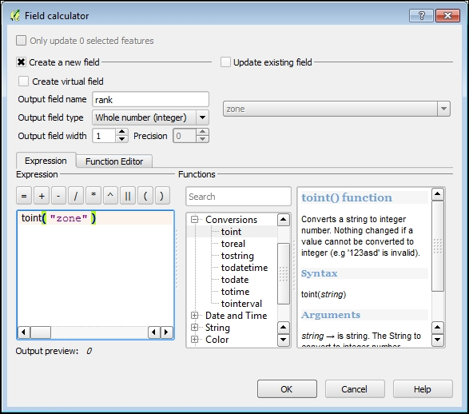
```

Lapisan siap untuk rasterisasi. Buka jendela dialog dengan pergi ke **Raster | Conversion | Rasterize (Vektor to Raster)**. Di jendela dialog ini seperti yang ditunjukkan pada gambar berikut, sesuaikan pengaturan berikut:

1.Dari daftar drop-down File input (shapefile), pilih *hurricane_evacuation_zones*.

2. Dari daftar **Attribute**, pilih peringkat.

3. Dalam **Output file for rasterized vectors** (raster), klik tombol **Select**. Arahkan ke direktori kerja Anda, dan ketik hurricane_evacuation_zones.tif sebagai nama layer baru. Pesan ini akan ditampilkan: **The output file doesn't exist**. Anda harus mengatur ukuran atau resolusi output untuk membuatnya. Klik OK dan lanjutkan ke tahap berikutnya.

4. Pada langkah sebelumnya, Anda menetapkan beberapa opsi utama. Untuk kenyamanan, kita akan membuat raster dalam tutorial ini dengan tingkat dan resolusi yang sama menggunakan lidar_dem.tif sebagai template. Klik pada tombol untuk membuat parameter baris perintah *gdal_rasterize* dapat diedit. Setelah modifikasi, garis harus terlihat mirip dengan contoh berikut:

```
gdal_rasterize -a rank -l hurricane_evacuation_zones –a_nodata 0 -te 982199.3000000000465661 188224.6749999999883585 991709.3000000000465661 196484.6749999999883585 -tr 10 10 -ot UInt16 fullpath/hurricane_evacuation_zones.shp fullpath/hurricane_evacuation_zones.tif
```

Ini berarti bahwa raster luaran akan berisi nilai raster dari bidang atribut peringkat. Area di luar layer poligon akan diberi nilai 0, yang akan ditafsirkan sebagai nodata. Tipe data output adalah bilangan bulat *unsigned 16-bit*.

5. Klik pada tombol **OK**. Hasil rasterisasi akan muncul di panel Layers.

```{r fig1434, fig.cap='Rasterize',echo=FALSE, message=FALSE, warning=FALSE, out.width='70%', fig.asp=.75, fig.align='center'}
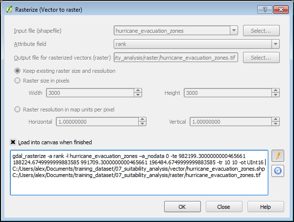
```

Layer *hurricane_inundation_zones* harus diproses sebelumnya dengan cara yang sama. Lapisan berisi beberapa nomor zona. Ini dapat diartikan sebagai tingkat keparahan risiko genangan; yaitu, semakin tinggi angkanya, semakin rendah risikonya. Ini berarti bahwa kita dapat menggunakan nilai-nilai ini secara langsung untuk peringkat. Dalam hal lapisan ini, parameter baris perintah *gdal_rasterize* akan terlihat sebagai berikut:

```
gdal_rasterize -a category -l hurricane_inundation_zones -a_nodata 0 -te 982199.3000000000465661 188224.6749999999883585 991709.3000000000465661 196484.6749999999883585 -tr 10 10 -ot UInt16 fullpath/hurricane_inundation_zones.shp fullpath/hurricane_inundation_zones.tif
```

Ketika dikombinasikan, lapisan-lapisan ini dapat memberikan penilaian kumulatif kesesuaian berdasarkan keparahan risiko dari bahaya alam.

#### Mengurutkan raster kepadatan

Dalam kasus raster kepadatan, kita dapat menggunakan peta noise_heatamp.tif dan membuat layer tree_density.tif sendiri. Pertama, kita akan menyiapkan noise_heatmap.tif yang awalnya jauh lebih besar daripada bidang minat yang kita kerjakan dalam bab ini. Untuk klip layer raster, gunakan menu berikut **Raster | Extraction | Clipper** :

1. Dari daftar drop-down **File input** (raster) pilih *noise-heatmap*, yang merupakan raster yang akan dipotong.

2. Dalam file **Output**, klik **Select button**untuk mengatur direktori dan nama untuk file output, misalnya, **noise_heatmap_clip.tif**.

3. Di bagian **Clipping mode**, ada dua mode yang dapat dipilih:

- *Extent* adalah tempat Anda dapat memasukkan koordinat kotak pembatas secara manual atau dengan menyeret kanvas peta. Gunakan pendekatan ini untuk mengatur sejauh mana file output Anda. Ingat saja bahwa luasnya harus melebihi batas bidang minat yang ditetapkan oleh zipcode_bound shapefile.

- Jika **Mask layer** aktif, Anda dapat memilih bentuk poligonal, dan itu akan digunakan sebagai batas kliping.

Setelah Anda mengklik tombol **OK**, layer akan dimuat ke kanvas peta.


```{r fig1435, fig.cap='Clipper',echo=FALSE, message=FALSE, warning=FALSE, out.width='70%', fig.asp=.75, fig.align='center'}
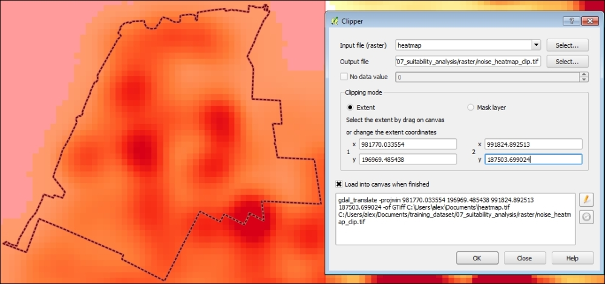
```

Langkah-langkah berikut harus dilakukan untuk menilai rentang nilainya, membaginya ke dalam kategori, dan memberi peringkat:

1. Klik dua kali pada layer *noise_heatmap_clip* untuk membuka jendela **Layer Properties** . Di jendela ini, buka bagian Metadata . Jelajahi jendela Properties di bagian bawah dialog sampai Anda menemukan garis yang disorot Band 1 dengan statistik raster dasar, seperti yang ditunjukkan di sini:


```{r fig1436, fig.cap='Band 1 Metadata',echo=FALSE, message=FALSE, warning=FALSE, out.width='70%', fig.asp=.75, fig.align='center'}
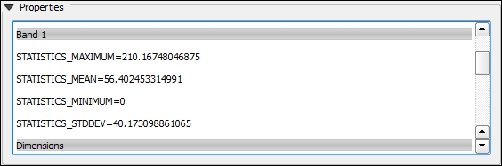
```

Kita akan menangani raster kepadatan, dan nilainya ditafsirkan sebagai jumlah keluhan gangguan per area piksel. Permukaan yang terus menerus ini harus dibagi ke dalam beberapa kategori dan harus diberi peringkat sesuai dengan jumlah pengaduan. Untuk ini, sejumlah kritis pengaduan harus ditetapkan. Tidak ada batasan dan persyaratan yang diakui secara resmi, tetapi kita dapat mengartikan nilai dataset rata-rata sebagai beberapa angka kritis (sedikit lebih besar dari 56, tetapi kita akan menggunakan 50 untuk kenyamanan). Bagilah nilai-nilai ke dalam kategori-kategori dan berikan mereka peringkat berikut (semakin sedikit jumlah keluhan, semakin baik):

Category        Value range       Suitability rank
--------        -----------       ----------------
1               Less than 50      5
2               50 to 100         4
3               100 to 150        3
4               150 to 200        2
5               Greater than 200  1

Untuk pemeringkatan, gunakan menu __Raster | Raster Calculator__ dan ubah suaikan opsi berikut dalam dialog:

- Pilih direktori dan nama layer __Output__, sebagai contoh, __noise_ranked__

- Pilih band raster __noise_heatmap_clip @1__ dan klik pada tombol __Current layer extent__ untuk memastikan layer luaran memiliki resolusi dan extent yang sama.

- Pada window ekspresi __Raster Calculator__, masukkan ekspresi berikut:

```
("noise_heatmap_clip@1" <= 50) *5 + ("noise_heatmap_clip@1" > 50 AND"noise_heatmap_clip@1" <= 100) *4 + ("noise_heatmap_clip@1" > 100 AND "noise_heatmap_clip@1" <= 150) *3 + ("noise_heatmap_clip@1" > 150 AND "noise_heatmap_clip@1" <= 200) *2+ ("noise_heatmap_clip@1" > 200)*1
```

Ekspresi ini berarti bahwa setiap piksel yang berada di bawah rentang tertentu yang diberikan dalam tanda kurung pertama diberi nilai 1, dan kemudian diperingkat oleh nilai pengali tertentu, yang berada di luar tanda kurung. Setelah Anda mengklik tombol OK, raster yang direklasifikasi akan dimuat ke panel Layers.


```{r fig1437, fig.cap='Reclassified raster',echo=FALSE, message=FALSE, warning=FALSE, out.width='70%', fig.asp=.75, fig.align='center'}
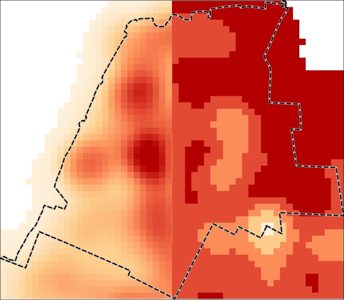
```

Perhatikan hal ini: karena peringkat, peta panas terbalik; yaitu, hotspot paling berisik mendapatkan peringkat terendah dan tempat paling tenang mendapatkan peringkat tertinggi.

Dengan cara yang sama, kita dapat membuat dan memberi peringkat peta panas untuk objek titik lain yang menarik dalam analisis kesesuaian kita, yaitu pohon dan museumart .

#### Pembuatan dan pengurutan proximity rasters

Alur kerja akan dijelaskan dalam contoh lapisan vektor titik subway_entrances:

1. Pertama, layer harus dirasterisasi dengan cara yang umum. Baris gdal_rasterize akan berisi parameter berikut:t, the layer should be rasterized in a common way. The gdal_rasterize line will contain the following parameters:

```
gdal_rasterize -l subway_entrances -burn 1 -a_nodata 0 -te 982199.3000000000465661 188224.6749999999883585 991709.3000000000465661 196484.6749999999883585 -tr 10 10 -ot Byte fullpath/subway_entrances.shp fullpath/subway_entances.tif
```

Di lapisan output, lokasi titik yang ada akan ditandai dengan nilai piksel 1, sementara semua area lain akan diberi nilai nodata 0.

2. rgi ke _ Raster | Analisis | Kedekatan (Jarak Raster) . Dialog ini menghasilkan peta kedekatan raster yang menunjukkan jarak dari pusat setiap piksel ke pusat piksel terdekat yang diidentifikasi sebagai piksel target. Pixel target adalah piksel dalam raster sumber yang nilai piksel rasternya berada di set nilai piksel target. Jika tidak ditentukan, semua piksel bukan nol akan dianggap piksel target. Di jendela dialog, sesuaikan parameter berikut:
Dari daftar drop-down File input, pilih layer subway_entrances .

Dalam file Output, klik tombol Select dan tentukan path dan nama untuk layer output, misalnya, subway_entances_proximity.tif .

Pastikan parameter unit Dist diaktifkan dan diatur ke GEO . Dalam hal ini, jarak yang dihasilkan akan berada dalam koordinat georeferensi (kaki).

Baris parameter yang dihasilkan akan terlihat seperti ini:

```
gdal_proximity.bat fullpath/subway_entances.tif fullpath/subway_entances_proximity.tif -distunits GEO -of GTiff
```

```{r fig1438, fig.cap='Proximity analyses',echo=FALSE, message=FALSE, warning=FALSE, out.width='70%', fig.asp=.75, fig.align='center'}
knitr::include_graphics("images/04/fig38.jpeg")
```

3. Kedekatan raster harus dibagi ke dalam kategori diskrit dan mereka harus diberi peringkat. Untuk operasi ini, kita akan menggunakan Kalkulator Raster. Masalah utama di sini adalah untuk memutuskan jumlah dan memilih kategori kedekatan yang tepat untuk peringkat. Keputusan optimal tergantung pada apa yang disebut jari-jari berjalan, yaitu jarak yang membuat orang nyaman untuk berjalan. Secara umum, perencana transportasi telah mengamati bahwa jarak berjalan yang tampaknya dilalui sebagian besar orang dengan nyaman — di luar itu penumpang turun secara drastis — adalah sekitar 400 m (sekitar 1.300 kaki). kita akan menerapkan aturan 400 m ini untuk mengkategorikan nilai-nilai layer (min sebagai nol dan maks sebagai 4.888,71) menjadi empat kategori, dengan peringkat berikut:


Kategori          Proximity values range (feet)       Suitability rank
--------          -----------------------------       ----------------
1                 Less than 1,300                     4
2                 1,300 to 2,600                      3
3                 2,600 to 3,900                      2
4                 Greater than 3,900                  1


Buka __Raster | Raster Calculator__ dan sesuaikan opsi utamanya. Masukkan ekspresi berikut untuk menghasilkan peta Enter the following expression to generate a new __subway_entrances_proximity_ranks__ raster:

```
("subway_entances_proximity@1" <= 1300) *4 + ("subway_entances_proximity@1" > 1300 AND "subway_entances_proximity@1" <= 2600) *3 + ("subway_entances_proximity@1" > 2600 AND "subway_entances_proximity@1" <= 3900) *2 + ("subway_entances_proximity@1" > 3900)*1
```

Di tangkapan layar berikut, Anda dapat melihat seperti apa raster berkelanjutan (di kiri) dan peringkat (di kanan):

```{r fig1439, fig.cap='Field Calculator',echo=FALSE, message=FALSE, warning=FALSE, out.width='70%', fig.asp=.75, fig.align='center'}
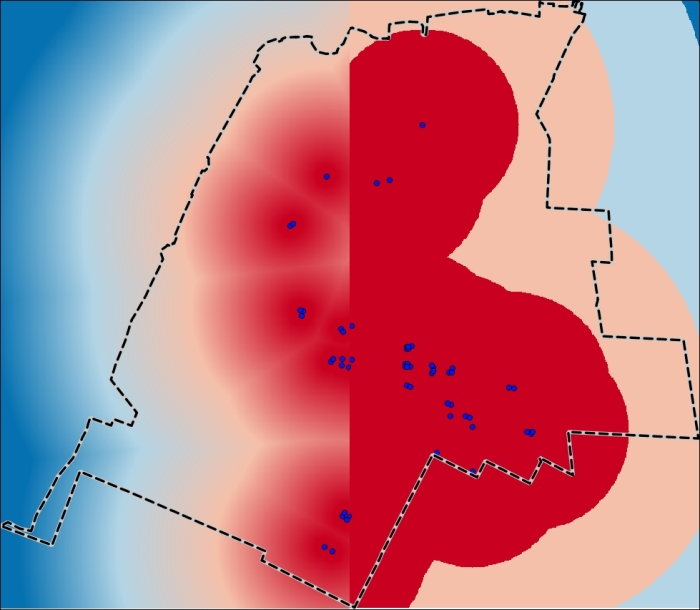
```

Dengan cara yang sama, Anda dapat memproses ulang layer vektor lain yang harus dianalisis dari posisi kedekatan, yaitu taman, bike_routes, athletic_facilities, dan sekolah dasar. Sebagai hasilnya, Anda akan memiliki seperangkat lapisan raster yang diberi peringkat dengan beberapa kategori sesuai dengan kedekatan objek yang dipilih. Semakin tinggi pangkat, semakin dekat objek. Sebagai pedoman umum, terapkan nilai 400 m (atau 1300 kaki) untuk memberi peringkat pada raster dengan benar.

### Tahap 5 :  Overlay data dan interpretasi hasil

Sekarang kita memiliki segalanya siap untuk menutupi raster dan menghasilkan penilaian kesesuaian kumulatif. Pada gambar berikut, Anda dapat melihat daftar lengkap lapisan, ditimbang oleh kepentingannya untuk kesesuaian umum. Bobot adalah koefisien sederhana dalam kisaran 0 hingga 1, dan mereka digunakan untuk memodifikasi peringkat dengan benar.


```{r fig1440, fig.cap='list of layers weighted by their importance for general suitability',echo=FALSE, message=FALSE, warning=FALSE, out.width='90%', fig.asp=.75, fig.align='center'}
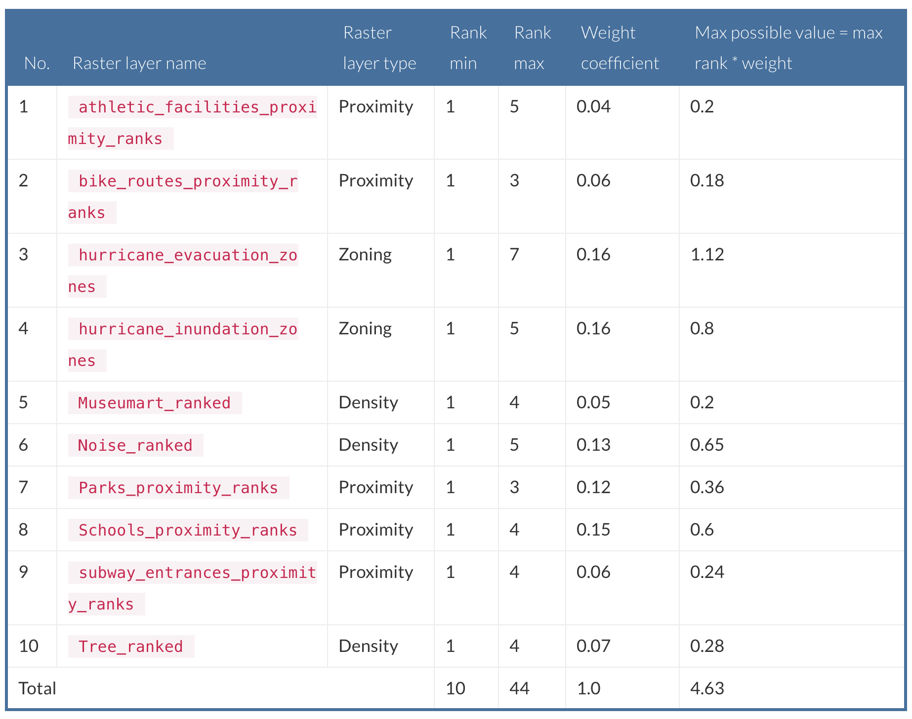
```

Ungkapan yang digunakan untuk penilaian kesesuaian kita dapat dikonstruksikan dengan beberapa langkah:

1. Semua faktor yang tersedia yang diwakili oleh layer raster harus dikalikan dengan koefisien bobotnya dan diringkas, seperti ini:
```
(factor_1*weight + factor_2*weight + factor_3*weight + … factor_n*weight)
```

Jenis penilaian ini memberikan kesesuaian kotor, yang sulit untuk ditafsirkan karena nilai-nilai yang diperoleh tidak dihitung secara relatif ke minimum minimum dan maksimum.

2. Untuk kesederhanaan interpretasi, penilaian kesesuaian bruto dapat dibagi menjadi jumlah dari nilai maksimum yang mungkin. Rumus yang diperluas akan terlihat seperti ini:

```
(factor_1*weight + factor_2*weight + factor_3*weight + … factor_n*weight) / (factor_1_max*weight + factor_2_max*weight + factor_3_max*weight + … factor_n_max*weight)
```

Akibatnya, rentang nilai output akan dari 0 hingga 1, di mana nilai kesesuaian maksimum mendekati 1.

3. Secara opsional, hasilnya dapat dikalikan dengan 100, dan nilai output akan menjadi persentase kesesuaian.

Pergi ke Raster | Kalkulator Raster untuk melakukan penilaian:

Atur path dan nama untuk layer Output

Pilih satu layer dari daftar Raster bands untuk mengatur Luas layer sekarang, misalnya, hurricane_inundataion

Di jendela Ekspresi, masukkan rumus berikut (jika Anda tidak yakin tentang nilai, lihat tabel sebelumnya):

```
( ( "athletic_facilities_proximity_ranks@1" * 0.04 + "bike_routes_proximity_ranks@1" * 0.06+"hurricane_evacuation_zones@1" * 0.16+"hurricane_inundation_zones@1" * 0.16+"museumart_ranked@1" * 0.05+"noise_ranked@1" * 0.13+"parks_proximity@1" * 0.12+"schools_proximity@1" * 0.15+"subway_entrances_proximity_ranks@1" * 0.06+"tree_ranked@1"*0.07) / 4.63 ) *1000
```

Setelah Anda mengklik tombol OK, lapisan yang dihasilkan akan ditambahkan ke kanvas peta. Kisaran nilai kesesuaian raster bervariasi dari 42 hingga 96 persen. Dengan demikian, dapat dengan mudah diklasifikasikan dan ditafsirkan. Arahkan ke properti Layer | Gaya dan sesuaikan properti rendering dengan yang ditunjukkan pada tangkapan layar berikut:


```{r fig1441, fig.cap='Suitability layer',echo=FALSE, message=FALSE, warning=FALSE, out.width='70%', fig.asp=.75, fig.align='center'}
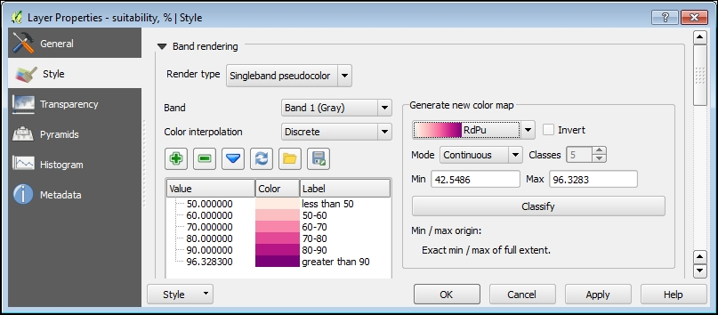
```

Setelah menerapkan pengaturan ini, layer akan terlihat sebagai berikut:


```{r fig1442, fig.cap='Suitability map',echo=FALSE, message=FALSE, warning=FALSE, out.width='70%', fig.asp=.75, fig.align='center'}
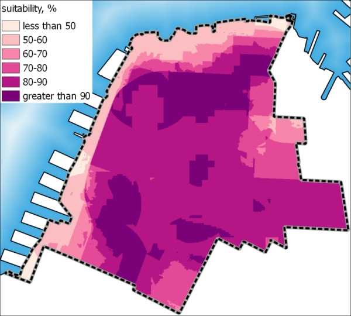
```

Kita dapat menggunakan raster ini sebagai dasar untuk penilaian kesesuaian visual utama dari bidang yang kita minati, atau melangkah lebih jauh dan menggabungkannya dengan lapisan lain untuk mengidentifikasi blok yang tepat yang paling cocok dengan seluruh rentang kriteria kesesuaian.

Dalam hal ini, kita perlu melakukan urutan terbalik langkah-langkah: pilih area yang paling cocok, vektorisasi, dan overlay poligon kesesuaian maksimum dengan ruang tamu perumahan untuk mengidentifikasi blok dan bangunan yang akan sangat cocok:

1. Raster kesesuaian awal harus dikategorikan ke dalam hanya dua kelas dengan batas kesesuaian 90 persen. Pergi ke Raster | Kalkulator Raster dan tentukan jalur dan nama untuk raster keluaran (misalnya, max_suitability). Di jendela Ekspresi, masukkan "kesesuaian,% ( ??? ) "> = 90. Pada halaman berikutnya, Anda dapat melihat bahwa lapisan yang dihasilkan hanya berisi dua kelas: cocok (nilainya 1; ditugaskan ke area dengan kesesuaian yang lebih besar dari atau sama dengan 90 persen), dan tidak cocok (nilainya 0).

2. Sekarang kita perlu melakukan vektorisasi area-area ini untuk dapat melakukan query layer vektor dengannya. Buka jendela dialog Polygonize (Raster to vector) dengan masuk ke Raster | Konversi dan sesuaikan parameter berikut:

```{r fig1443, fig.cap='Polygonize',echo=FALSE, message=FALSE, warning=FALSE, out.width='70%', fig.asp=.75, fig.align='center'}
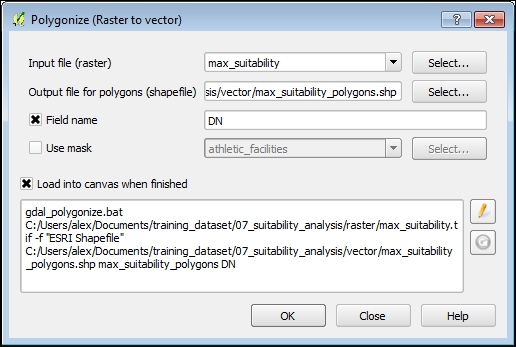
```

- Pilih max_suitability sebagai raster yang akan dipoligonisasi dari file Input (raster) .

Berikan path dan nama shapefile keluaran dalam file Output untuk poligon (shapefile) , misalnya, max_suitability_polygons.

Aktifkan sakelar Nama bidang dan terima nilai DN default. Opsi ini bertanggung jawab untuk membuat dan mengisi bidang dengan nilai kelas dari raster awal.

```{r fig1444, fig.cap='Masking raster',echo=FALSE, message=FALSE, warning=FALSE, out.width='70%', fig.asp=.75, fig.align='center'}
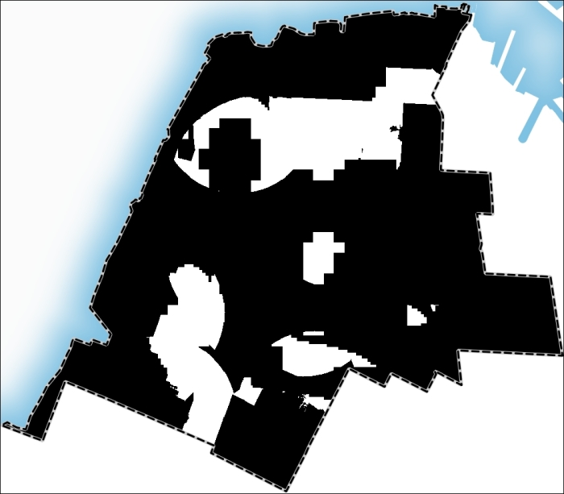
```


3. Setelah Anda mengklik tombol OK, shapefile yang dihasilkan akan ditambahkan ke panel Layers. Awalnya, layer berisi poligon semua kelas, sedangkan kita hanya tertarik pada kelas 1. Untuk tujuan memilih dan menghapus poligon yang tidak perlu, kita akan menggunakan fitur Pilih menggunakan opsi ekspresi:
Buka tabel atribut max_suitability dengan mengklik tombol di panel Attribute, atau dari klik kanan jalan pintas layer Open Attribute Table.

Di panel bilah alat tabel atribut, klik pada fitur Pilih menggunakan tombol ekspresi,, dan masukkan ekspresi berikut: "DN" = 0. Setelah mengklik OK, semua poligon yang memenuhi kondisi akan disorot dalam tabel atribut dan di kanvas peta.

Karena kita tidak memerlukan poligon ini untuk analisis lebih lanjut, kita harus menghapusnya. Di panel bilah alat tabel atribut, klik tombol untuk mengaktifkan mode pengeditan, atau gunakan pintasan keyboard Ctrl + E. Sekarang kita dapat menjalankan Hapus fitur yang dipilih menggunakan tombol, atau cukup tekan Del dari keyboard.

Setelah menghapus data yang tidak perlu, jangan lupa untuk menyimpan hasil edit Anda (menggunakan atau Ctrl + S) dan menonaktifkan mode pengeditan. Dalam tangkapan layar berikut, Anda dapat melihat bahwa layer hanya berisi poligon yang mencakup nilai kesesuaian maksimum, yang ditetapkan hingga 90 persen:

```{r fig1445, fig.cap='Reclass maximum suitability',echo=FALSE, message=FALSE, warning=FALSE, out.width='70%', fig.asp=.75, fig.align='center'}
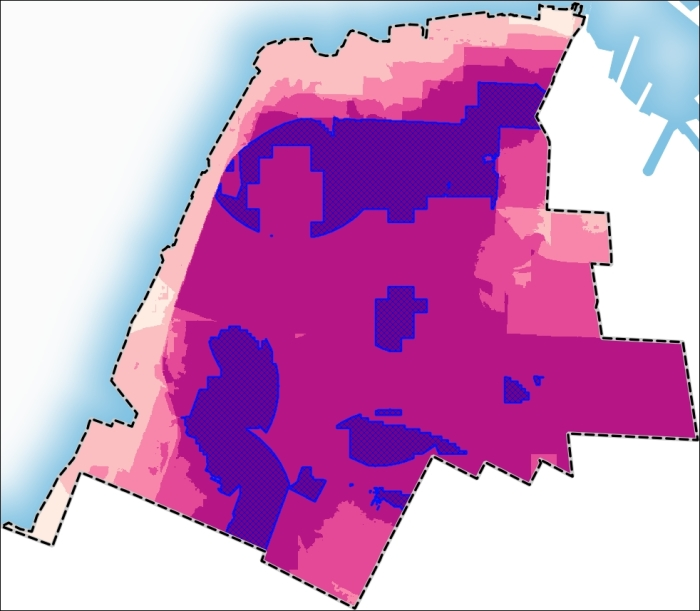
```


4. Sekarang layer ini dapat digunakan untuk overlay dengan layer vektor lainnya dan menganalisis hubungan spasial antara objek, seperti yang dijelaskan dalam bagian Dasar analisis kesesuaian. Sebagai contoh, kita dapat mengidentifikasi area zonasi area tempat tinggal primer yang berpotensi menarik bagi kita sesuai dengan kriteria kesesuaian:

Buka jendela dialog dengan masuk ke Vector | Alat penelitian | Pilih berdasarkan lokasi . Dalam dialog ini, Anda pertama-tama harus memilih layer dari objek mana yang akan dipilih — residential_zoning dari fitur Pilih di : daftar turun bawah — seperti ini:

```{r fig1446, fig.cap='Select by location',echo=FALSE, message=FALSE, warning=FALSE, out.width='60%', fig.asp=.75, fig.align='center'}
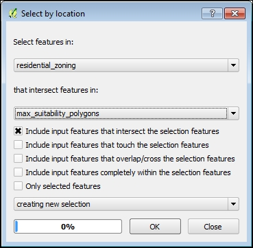
```


- fitur yang berpotongan di: daftar drop-down, pilih max_suitability_polygons, yang akan digunakan sebagai pemilih.

Ada beberapa opsi pemilihan overlay. Aktifkan Sertakan fitur input yang memotong fitur seleksi. Hanya poligon yang berada di dalam batas atau kueri mask berpotongan yang akan ditambahkan ke seleksi. Klik pada tombol OK. Anda akan melihat hasil berikut di kanvas peta:

```{r fig1447, fig.cap='Selected maximum suitability',echo=FALSE, message=FALSE, warning=FALSE, out.width='70%', fig.asp=.75, fig.align='center'}
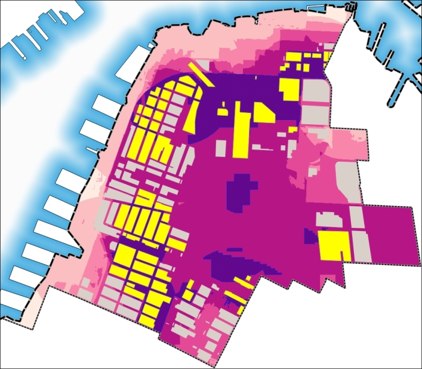
```

Demikian pula, Anda dapat mencoba jenis kueri lain dan mengidentifikasi bangunan yang tepat yang memenuhi kondisi kesesuaian. Dalam hal ini, jendela dialog akan terlihat sebagai berikut:


```{r fig1448, fig.cap='Exact buildings from selected maximum suitability',echo=FALSE, message=FALSE, warning=FALSE, out.width='60%', fig.asp=.75, fig.align='center'}
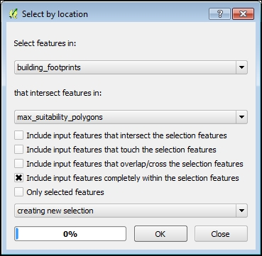
```

Setelah mengklik tombol **OK**, Anda akan melihat hasil berikut di kanvas peta:

```{r fig1449, fig.cap='Final result',echo=FALSE, message=FALSE, warning=FALSE, out.width='70%', fig.asp=.75, fig.align='center'}
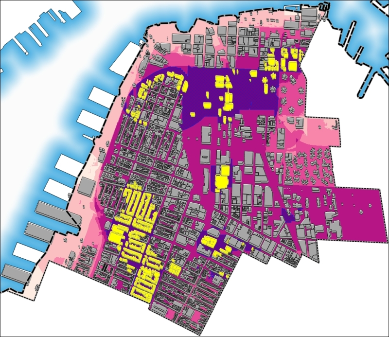
```

Perhatikan bahwa saat ini, kita telah memilih bangunan yang sepenuhnya berada dalam area kesesuaian maksimum. Jadi, kita siap memberikan jawaban yang solid dan spesifik untuk pertanyaan, "Tempat mana yang terbaik untuk tinggal?"
<!-- ## Raster analysis -->

<!-- ### Using the raster calculator -->

<!-- ### Calculating NDVI -->

<!-- ### Handling NULL values -->


<!-- ### Setting extents with masks -->

<!-- ### Sampling a raster layer -->

<!-- ### Preparing elevation data -->

<!-- ### Calculating a slope -->

<!-- ### Calculating a hillshade layer -->

<!-- ### Analyzing hydrology -->

<!-- ### Calculating a topographic index -->

<!-- ### Automating analyses tasks using the graphical modeler -->


<!-- ## Vector analysis -->

<!-- ### Selecting optimum sites -->

<!-- ### Dasymetric mapping -->

<!-- ### Calculating regional statistics -->


<!-- ### Estimating density using heatmaps -->

<!-- ### Estimating values based on samples -->


