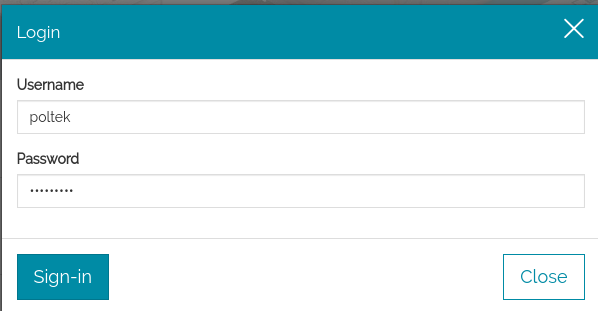
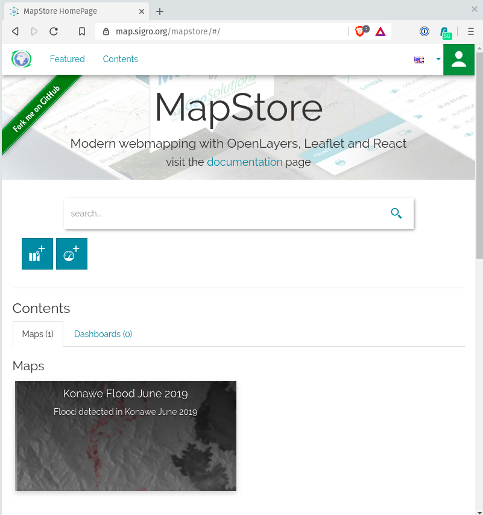
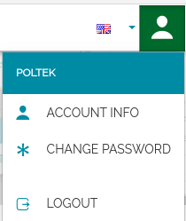

# MapStore2 {#hari_kedelapan}


MapStore adalah kerangka kerja webgis open source yang sangat modular, dikembangkan oleh GeoSolutions untuk membuat, mengelola, dan berbagi peta dan mashup secara aman. Kerangka kerja yang sederhana dan intuitif ini menggabungkan konten yang disajikan dari server seperti Google Maps, OpenStreetMap, Bing atau dari server lain yang mengikuti standar OGC seperti WFS, CSW, WMS, WMTS, dan TMS. MapStore2 diinstal dan dikonfigurasi pada server aplikasi Web, memungkinkan banyak pengguna mengakses situs menggunakan peramban web. MapStore2 digunakan untuk mencari, memvisualisasikan, dan melakukan kueri data geospasial yang diterbitkan dan untuk mengintegrasikan berbagai sumber ke dalam tampilan peta terintegrasi yang dapat dengan mudah dinavigasi. Selain itu, dengan merilis versi baru, perangkat lunak ini memungkinkan pengguna untuk membuat dasbor untuk hosting widget seperti peta mini, grafik statistik, tabel dan banyak lagi.

MapStore2 bertujuan untuk menjadi kerangka kerja produk dan webgis. Sebagai produk geoportal standar, MapStore2 adalah produk berbasis web untuk visualisasi dan analisis peta yang memungkinkan Anda membangun situs web interaktif geospasial atau layanan web. MapStore2 memungkinkan akses langsung dan real-time ke penyimpanan data geospasial dari semua format yang didukung. Ini juga menyediakan semua fungsi analisis spasial. Anda dapat menggunakannya untuk membangun situs web yang memberikan kepada pengguna, dengan tidak lebih dari browser web, aplikasi geospasial yang kuat, dinamis, dan terbuka, yang sebelumnya hanya tersedia dalam aplikasi desktop. MapStore2 juga merupakan ***framework*** dalam arti dapat digunakan sebagai titik awal untuk membangun aplikasi geospasial yang canggih.Ia tidak bergantung secara eksplisit pada *Engine Map* tertentu, tetapi ia dapat bekerja dengan OpenLayers , LeafletJS dan Cesium 3D viewer, yang memastikan fleksibilitas terbesar ketika seseorang ingin menggunakannya sebagai ***framework***.

MapStore2 telah dirancang sejak awal untuk memberi pengguna pengalaman yang koheren dan komprehensif di berbagai perangkat, oleh karena itu ia harus secara otomatis beradaptasi dengan ukuran layar yang berbeda seperti yang ditunjukkan nanti.

MapStore2 dikembangkan  dengan basis teknologi pada OpenLayers, Leaflet dan ReactJS, dan dilisensikan di bawah lisensi Simplified BSD.

## Quick Start
Anda dapat memilih untuk mengunduh paket biner mandiri atau file WAR untuk menggunakan  MapStore.

### Paket Biner

Cara termudah untuk mencoba MapStore adalah dengan mengunduh dan mengekstrak paket biner yang tersedia di halaman rilis MapStore . Di sini Anda dapat menemukan beberapa peta yang telah dikonfigurasikan sebelumnya serta pengguna dan grup. Tujuan dari paket ini adalah untuk memudahkan semua persyaratan yang diperlukan agar Anda mengambil MapStore untuk test-drive.

**Bagaimana cara menjalankannya**

1. Buka lokasi tempat Anda menyimpan file zip, unzip kontennya dan jalankan:

  - Windows: mapstore2_startup.bat

  - Linux: ./mapstore2_startup.sh

2. Arahkan browser Anda ke: http://localhost:8082/mapstore

3. Untuk menghentikan MapStore cukup lakukan:

  - Windows: mapstore2_shutdown.bat

  - Linux: ./mapstore2_shutdown.sh


### Arsip Web (WAR)


Setelah mengunduh file war MapStore, instal dalam wadah web java Anda (mis. Tomcat), dengan prosedur biasa untuk wadah tersebut (biasanya Anda hanya perlu menyalin file war di subfolder webapps).

Jika Anda tidak memiliki wadah web java, Anda dapat mengunduh Apache Tomcat dari sini dan menginstalnya. Anda juga akan membutuhkan Java7 JRE .

Kemudian Anda dapat mengakses MapStore menggunakan URL berikut (dengan asumsi wadah web pada port 8080 standar):

```
http: // localhost: 8080 / mapstore
```

Gunakan kredensial default (admin / admin) untuk masuk dan mulai membuat peta Anda!

## Menggunakan MapStore2

1. Login

Untuk login ke dalam MapStore2 yang terinstal dalam komputer Anda, gunakan tautan berikut [http://localhost/mapstore/](http://localhost/mapstore/). Untuk menggunakan web SIGRO, silakan kunjungi [https://map.sigro.org/mapstore](https://map.sigro.org/mapstore). Gunakan kredensial 'poltek' untuk login.

```{r fig181, fig.cap='Open Attribute Table',echo=FALSE, message=FALSE, warning=FALSE, out.width='50%', fig.asp=.75, fig.align='center'}

```


2. Tampilan awal MapStore2


```{r fig182, fig.cap='Open Attribute Table',echo=FALSE, message=FALSE, warning=FALSE, out.width='50%', fig.asp=.75, fig.align='center'}

```


3. Informasi Pengguna

Klik ikon di bagian kanan atas dasbor untuk mengetahui informasi pengguna.

```{r fig183, fig.cap='Open Attribute Table',echo=FALSE, message=FALSE, warning=FALSE, out.width='50%', fig.asp=.75, fig.align='center'}

```
