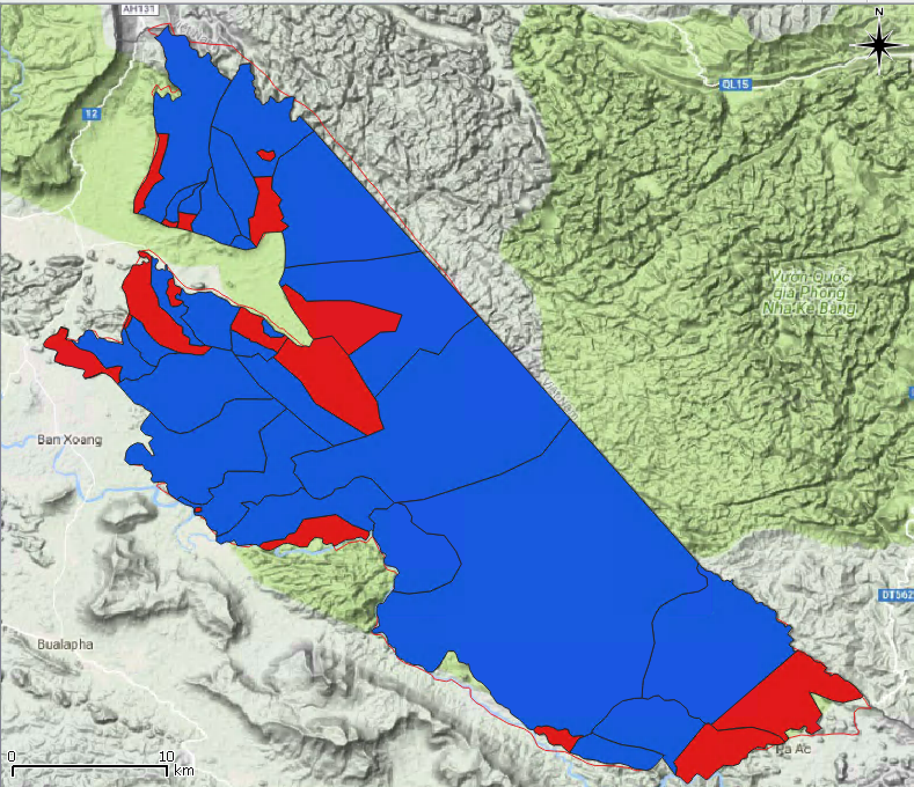
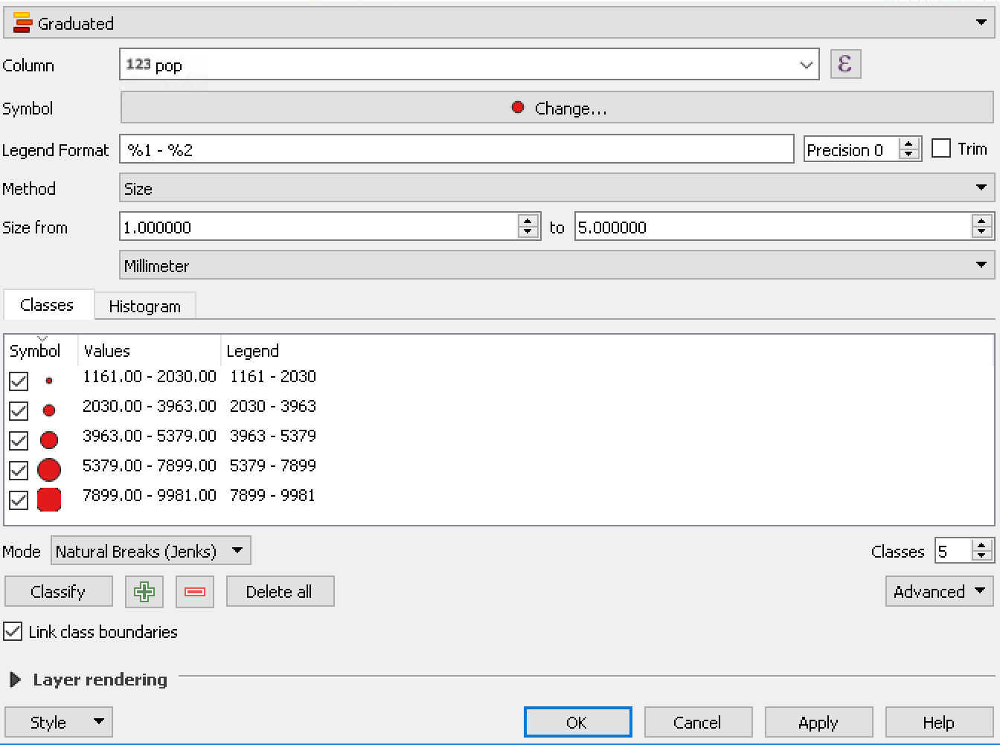
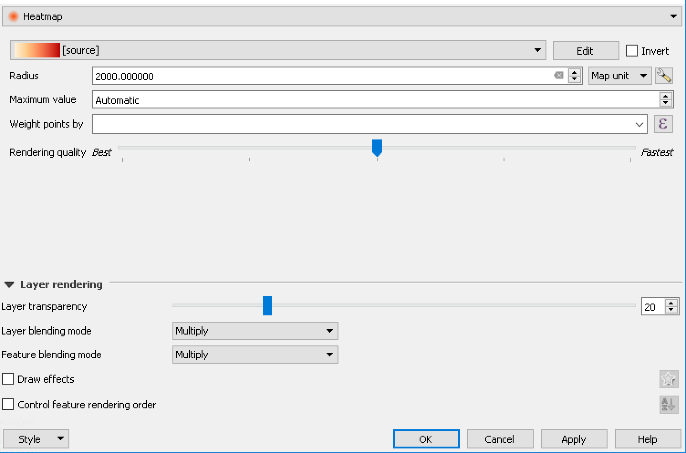
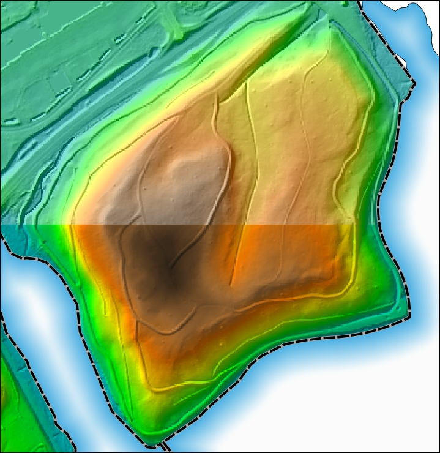

# (PART) Visualisasi dan Penyajian Data{-}
# Visualisasi Data 

## QGIS

Mengumpulkan dan mengatur data dari sumber yang berbeda hanya setengah dari pekerjaan. Langkah selanjutnya adalah mempresentasikannya di peta, mengungkapkan konten dan fitur tematik secara akurat. Untuk tujuan ini, berbagai teknik desain visual, atau lapisan penataan berdasarkan atributnya, digunakan dalam GIS. QGIS memiliki kemampuan visualisasi kartografi dan penataan data yang luas dan fleksibel.

Di bagian ini, kita akan membahas topik dan keterampilan berikut:

```
- Contoh-contoh bagus dalam organisasi data dalam sebuah dokumen kerja tunggal (project)

- Representasi visual dari data, menggambarkan fitur tematik dan spasialnya

- Pelabelan layer, yang dilakukan untuk meningkatkan keterbacaan data

- Mengatur style 

- Peta dasar untuk menyediakan konteks spasial dan sebagai latar belakang data Anda
```

Hasil utama dari bagian ini adalah proyek, yang dirancang sesuai dengan persyaratan dasar visualisasi kartografi.

### Grouping dan Ordering

Secara default, layer dimuat dalam urutan abjad (terbalik jika Anda menambahkannya dari panel browser). Setiap layer baru diletakkan di atas layer sebelumnya dan menutupinya. Semua layer ditampilkan secara default, ditata dengan simbol seragam sederhana, dan diberi warna acak. Ini adalah alasan ketika orang yang berbeda memvisualisasikan data sama, akan melihat warna yang berbeda. Urutan layer dapat diubah hanya dengan menyeret dan meletakkannya ke atas dan ke bawah legenda. Juga disarankan untuk memesan dan mengatur lapisan dalam beberapa kelompok logis, menyederhanakan navigasi dan pemahaman data. Khususnya dalam istilah GIS, lapisan bawah akan berupa fitur raster atau poligon. Di atas poligon akan ada fitur garis dan kemudian fitur titik di bagian atas.

Untuk mengelola dan mengatur ulang layer dan mempertahankan visibilitasnya, gunakan menu **Layer**  di panel **Layers**, yang diperlihatkan oleh screenshot berikut dan berisi tombol-tombol yang dijelaskan sesudahnya (sesuai urutan tampilan dari kiri ke kanan):

```{r fig91, fig.cap='Layer Toolbar',echo=FALSE, message=FALSE, warning=FALSE, out.width='30%', fig.asp=.75, fig.align='center'}
knitr::include_graphics("images/09/fig91.jpeg")
```


- **Tambah Grup** : Tombol ini akan membuat grup layer yang kosong.

- **Mengelola visibilitas Layer** : Tombol ini memungkinkan kita untuk dengan cepat menampilkan dan menyembunyikan layer dan juga menyesuaikan visibilitasnya dengan kombinasi layer yang telah ditentukan — yang disebut preset.

- **Filter Legenda Menurut Konten Peta** : Jika filter aktif, legenda layer hanya menunjukkan item-item yang benar-benar terlihat di dalam kanvas peta. Semua simbol lainnya disembunyikan dari legenda.

- **Rentangkan Semua / Tutup Semua** : Tombol digunakan untuk membuka atau menutup lapisan, legenda simbologi, dan grup lapisan, jika ada.

- **Remove Layer / Group** : Menghapus entri legenda yang dipilih.


Ada dua cara membuat grup layer:

Klik pada ikon tombol **Add Group**, dari Layers toolbar. Grup baru akan muncul di bagian bawah daftar layer. Ketikkan nama yang sesuai lalu seret dan letakkan lapisan ke dalam grup. Hati-hati jika Anda menyorot grup tertentu, itu akan membuat Sub-grup baru di bawah grup yang aktif. Jika ini terjadi, Anda dapat menyeret sub-grup untuk menjadikannya sebagai grup.

Pilih beberapa layer sambil menahan tombol Ctrl, dan gunakan pintasan kontekstual klik kanan **Group Selected** untuk menempatkannya dalam satu grup.

Dimungkinkan untuk mengembangkan hierarki bertingkat dengan subkelompok dengan memilih grup dan menerapkan Add Group . Item apa pun dari legenda lapisan, apakah itu layer tunggal atau grup, dapat diganti namanya dengan klik kanan **Rename**. Mengganti nama tidak memengaruhi dataset itu sendiri, tetapi memungkinkan kita memberikan nama yang tepat dan bermakna dalam suatu proyek. Sekarang coba atur sendiri layer-layer itu menjadi beberapa grup yang bermakna, dan beri nama dengan tepat.

### Styling

Dalam QGIS, style adalah cara visualisasi kartografi yang memperhitungkan fitur individu dan tematik layer. Ini mencakup karakteristik dasar simbologi, seperti warna dan isian, parameter outline, penggunaan marker, rendering tergantung skala, transparansi lapisan, interaksi dengan lapisan lain, dan pelabelan.

Style yang dipilih dengan baik menyederhanakan persepsi dan keterbacaan data, sehingga penting untuk mempelajari cara bekerja dengan style agar dapat mewakili data Anda dengan cara terbaik. Dalam istilah sederhana, pelajari cara membuat peta yang “eye-catching”. Pada bagian ini, kita akan membahas layer vektor dan raster secara terpisah, karena stilisasi mereka memiliki beberapa fitur unik.


#### Vektor

Menu **Style** dari dialog **Layer Properties** menyediakan Anda dengan semua alat yang diperlukan untuk melambangkan dan menampilkan data Anda dengan style tertentu. Untuk membukanya, klik dua kali pada nama layer di panel **Layers**, atau gunakan klik kanan dan pilih **Properties**, pilih bagian **Style**. Anda akan melihat sesuatu yang mirip dengan \@ref(fig:fig92).

```{r fig92, fig.cap='Layer Property',echo=FALSE, message=FALSE, warning=FALSE, out.width='30%', fig.asp=.75, fig.align='center'}
knitr::include_graphics("images/09/fig92.png")
```

Hal pertama yang harus Anda fokuskan adalah **Renderer** kecil di sudut kiri atas, yang berisi item-item berikut:

- **Single Symbol** : Ini adalah tipe paling sederhana yang menggambar semua fitur layer dengan simbol yang sama.

- **Categorized** : Ini mendefinisikan kategori yang digerakkan oleh data, membuatnya dilambangkan secara individual.

- **Graduated** : Ini mendefinisikan kategori berdasarkan atribut kuantitatif, fitur dapat diberi peringkat secara bertahap.

- **Rule-based** : Ini adalah tipe renderer yang paling fleksibel dan canggih. Hal ini memungkinkan pengguna untuk mendefinisikan kategorinya sendiri menggunakan beberapa kriteria dan style mereka secara individual.

- **Point displacement** : Penyaji ini berguna saat Anda bekerja dengan lapisan titik yang berisi titik-titik yang tumpang tindih yang memiliki koordinat yang sama atau berada terlalu dekat satu sama lain. Ini hanya tersedia untuk layer titik tunggal, dan secara otomatis akan menggeser lokasi marker sehingga semua marker yang tumpang tindih terlihat.

- **Inverted polygons** : Ini digunakan untuk memberi style pada bagian luar poligon, dan hanya tersedia untuk lapisan poligon saja.

- **Heatmap** : Ini mewakili lapisan titik dengan permukaan kontinu sesuai dengan kerapatan titik, tersedia untuk lapisan titik saja.

Setelah jenis penyaji dipilih, Anda dapat mulai menyesuaikan simbologi dengan dialog pemilih Simbol , yang aksesibilitasnya tergantung pada jenis penyaji yang dipilih. Misalnya, untuk simbol tunggal dan renderer poligon terbalik, dialog ini tersedia langsung dari bagian style . Untuk penyaji **Graduated** dan **Categorized**, tersedia dari tombol Ubah Simbol, yang terlihat seperti ini:


```{r fig92a, fig.cap='Layer Property',echo=FALSE, message=FALSE, warning=FALSE, out.width='30%', fig.asp=.75, fig.align='center'}

```


**Rule-based**, **point displacement** dan **Heatmap** memiliki spesifikasi sendiri untuk pemilihan dan penyesuaian simbologi, yang akan dibahas pada bagian berikut. Namun demikian, terlepas dari jenis renderer yang dipilih (kecuali renderer Heatmap ), Anda selalu memiliki akses ke dialog pemilih Simbol, yang terlihat mirip dengan apa yang ditunjukkan pada Gambar \@ref(fig:fig93) dan terdiri dari beberapa bagian.


```{r fig93, fig.cap='Pemilih simbol',echo=FALSE, message=FALSE, warning=FALSE, out.width='30%', fig.asp=.75, fig.align='center'}
knitr::include_graphics("images/09/fig93.png")
```

Di bagian kanan atas jendela, Anda dapat melihat pratinjau simbol. Di bawah pratinjau, ada lapisan simbol. Secara default, hanya satu layer yang digunakan, tetapi Anda dapat menambahkan lebih banyak dengan tombol layer **Add symbol**, atau menghapus layer yang tidak perlu dengan tombol **Remove symbol layer**, yang hanya aktif jika ada dua atau lebih lapisan yang tersedia. Dengan tombol **Lock layer's color**, warna layer akan dikunci untuk perubahan, yang mencegah warna dari modifikasi oleh renderer *categorized* atau *graduated*. Layers dapat disusun ulang dengan tombol Move up () dan Move down (), dan jika Anda puas dengan hasilnya, gunakan tombol **Save**.

Di sisi kanan jendela dialog, ada opsi yang tersedia untuk lapisan simbol yang dipilih. Di antaranya, **Symbol layer type** adalah yang paling penting. Daftar jenis yang tersedia tergantung pada geometri layer. Untuk layer poligon, Anda dapat memilih dari daftar berikut:

- **Centroid Fill** : Poligon dilambangkan dengan spidol pada centroid poligon, alih-alih merender seluruh area poligon. Ini berguna jika Anda memiliki banyak poligon kecil yang lebih baik untuk divisualisasikan pada suatu titik daripada oleh poligon kecil yang terlihat hanya setelah di-zoom-in.

- **Gradient fill** : Menggunakan gradien yang telah ditentukan atau membuat gradien khusus untuk mengisi poligon.

- **Line pattern fill**: Pola garis dapat dikombinasikan untuk menciptakan berbagai *hatching effect*. Efek ini berguna ketika Anda ingin menggunakan warna isian yang sama di bawahnya tetapi ingin menyorot beberapa perbedaan antara objek dengan ***hatching***.

- **Point pattern fill** : Titik yang didistribusikan secara teratur (atau simbol lainnya) dapat mengisi poligon dan membuat pola.

- **Raster image fill** : Gambar raster apa saja dapat digunakan untuk membuat tekstur atau pola yang mengisi latar belakang.

- **SVG fill** : File vektor .svg yang dapat diskalakan (atau marker) dapat digunakan untuk membuat tekstur atau pola pengisian.

- **Shapeburst fill** : Gradasi keabuan dari interior poligon, tergantung pada jarak dari tepi poligon, dan menciptakan efek penyangga batas yang tidak umum.

- **Simple fill** : Ini tipe default, dan ditandai oleh warna isi, pola, dan garis tepi.

- **Outline** : marker line: Simbol penanda digunakan sebagai outline.

- **Outline** : Simple line: Hanya outline poligon yang digambar dan sifat-sifatnya ditentukan oleh warna garis, lebar, dan style.

Untuk layer titik, Anda dapat memilih berbagai jenis marker yang diwakili oleh **Ellipse** , huruf atau tanda (**Font marker**), ragam penanda (**Simple marker**), ikon(**SVG marker**), atau nilai kolom atribut (**Vector field marker**).

Untuk layer garis, tipe tersedia **Simple line** dan **Marker line**. Dalam kasus pertama, garis digambarkan seperti biasa, dan dalam kasus kedua, simbol simbol marker digunakan secara berulang. **Marker line** dapat digunakan, misalnya, untuk menunjukkan arah garis (gerakan di jalan, aliran sungai, dan sebagainya) dengan simbol penanda panah.

Setelah membahas dasar-dasarnya, kita akan mengeksplorasi style render yang berbeda dalam contoh beberapa layer dari basis data kita.

**Styling layer dengan renderer Single Symbol**

Dalam contoh ini, kita akan menggunakan lapisan layer Admin untuk menunjukkan wilayah pekerjaan (Area of Interest) di peta. Seperti yang dapat Anda lihat di screenshot berikut, kami menggunakan dua simbol layer, keduanya didefinisikan sebagai Outline: **Simple line**, tetapi dengan pola style **Pen Style** berbeda . Di bawahnya, kami menempatkan **Solid line** yang lebih terang dan menutupinya dengan style **Dash Line** yang lebih gelap . Memilih warna kontras memungkinkan kita untuk menerapkan efek garis seperti pada gambar.

```{r fig94, fig.cap='Memilih simbol',echo=FALSE, message=FALSE, warning=FALSE, out.width='60%', fig.asp=.75, fig.align='center'}
knitr::include_graphics("images/09/fig94.png")
```


**Styling layer dengan renderer Categorized**

Mari kita style lapisan zona Taman Nasional Hin Nam No, yang memiliki dua kategori, (1) TPZ dan (2) CUZ.

1. Setelah mengatur jenis penyaji ke Dikategorikan, pilih kolom dengan kategori yang akan diberikan di bawah Kolom. Kolom tersedia dari daftar turun bawah yang berisi semua bidang atribut lapisan. Karena kami ingin zona ditampilkan sebagai kategori, pilih bidang Zona untuk mengategorikan lapisan.

```{r fig95, fig.cap='Memilih simbol',echo=FALSE, message=FALSE, warning=FALSE, out.width='30%', fig.asp=.75, fig.align='center'}

```

1. Klik pada tombol **Symbol Change** untuk menyesuaikan simbologi layer. Di jendela pemilih Simbol, atur Symbol layer type ke **Categorized**.

2. Klik tombol OK untuk kembali ke jendela utama.

3. Klik pada tombol **Classify**. Jendela dengan kolom **Symbol**, **Value** dan **Legend** akan secara otomatis diisi dengan kategori dan deskripsi mereka dari bidang atribut. Perbedaan antara **Value** dan **Legend** adalah bahwa nilai mewakili atribut yang unik, sementara legenda memberikan karakteristik deskriptif mereka. Akan terlihat lebih jelas ketika nilai, misalnya, berisi kode dan legenda yang menjelaskan maknanya. Selain itu, dapat juga diatur hingga nilai tidak terlihat dalam legenda layer, tetapi hanya deskripsi saja. Anda dapat menambah atau menghapus kategori, atau secara manual mengedit teks elemen-elemennya (Value atau Legend) dengan mengklik dua kali pada item di kolom yang relevan. Untuk saat ini, cukup klik **OK** untuk keluar dari dialog **Style** dan lihat hasil awal.

Screenshot ini menunjukkan yang akan terjadi jika Anda memilih renderer **Categorized**.

```{r fig96, fig.cap='Memilih simbol',echo=FALSE, message=FALSE, warning=FALSE, out.width='60%', fig.asp=.75, fig.align='center'}

```

**Styling layer dengan renderer Graduated**

Jenis renderer **Graduated** berguna ketika Anda ingin menampilkan fitur berdasarkan beberapa atribut kuantitatif. Dataset titik desa kita berisi kolom tentang populasi di kolom ***pop***. Perhatikan bahwa nilai bidang pop dibuat secara acak untuk tujuan pelatihan.

1. Memuat shapefile desa.

2. Klik dua kali layer dan pilih **Properties**.

3. Pilih **Symbology** dan atur jenis renderer ke **Graduated** dan pilih bidang **pop** di bagian Kolom.

4. Karena data adalah fitur titik, pilih **Size** sebagai metodenya.

5. Tentukan jumlah kelas yang ingin Anda tampilkan (biasanya, lima hingga tujuh kelas direkomendasikan, jika tidak, akan sulit untuk membedakannya secara visual).

6. Kemudian, pilih mode kelulusan yang sesuai, yaitu sebagai berikut:

- **Equal interval** : Rentang nilai dibagi ke dalam kelas rentang yang sama sesuai dengan jumlah kelas yang ditetapkan (misalnya, nilai dari 0 hingga 100 dibagi menjadi lima kelas masing-masing 20 unit).

- **Quantile (Equal Count)** : Semua data akan dibagi ke dalam jumlah kelas yang ditetapkan, dan rentang akan dipilih sedemikian rupa sehingga setiap kelas akan berisi jumlah item yang sama.

- **Natural Breaks (Jenks)** : Metode ini mengelompokkan nilai berdasarkan kesamaannya. Jadi nilai dalam suatu kelas memiliki varians minimum, tetapi nilai fitur di seluruh kelas sangat bervariasi.

- **Standard Deviation** : Kelas dibagi sesuai dengan standar deviasi dari nilai-nilai, dan ini menunjukkan bagaimana data berbeda dari nilai rata-rata.

- **Pretty Breaks** : Ini menciptakan n + 1 kelas untuk rentang nilai yang diberikan (yaitu, jika 5 kelas ditetapkan, jumlah yang dihasilkan akan 6), mirip dengan **Interval Equal**, tetapi titik-titik pemisahan dipilih sehingga nilai-nilai dibulatkan dengan baik angka (misalnya, kelipatan 10 jika menggunakan bilangan bulat).

7. Setelah mengklik tombol **Classify**, kolom Symbol, Value, dan Legend akan diisi. Klik dua kali pada semua ini untuk memodifikasinya. Mengklik kanan membuka menu kontekstual. Anda dapat mencoba berbagai kelas dan klasifikasi untuk memutuskan mana yang terbaik untuk menampilkan fitur data.

```{r fig97, fig.cap='Memilih simbol',echo=FALSE, message=FALSE, warning=FALSE, out.width='30%', fig.asp=.75, fig.align='center'}

```

```{r fig98, fig.cap='Memilih simbol',echo=FALSE, message=FALSE, warning=FALSE, out.width='30%', fig.asp=.75, fig.align='center'}
knitr::include_graphics("images/09/fig98.png")
```

**Styling layer dengan renderer Heatmap**

**Heatmap** adalah jenis renderer yang relatif baru. Itu diperkenalkan di QGIS 2.8. Ini mewakili titik sebagai permukaan dengan kerapatan kontinu dan memungkinkan kita untuk menerapkan efek style yang keren.

Kami akan menerapkan penyaji ke layer **villages_utm**, dan overlay hasilnya dengan batas Taman Nasional Hin Nam No.

Setelah memilih jenis renderer Heatmap dari daftar drop-down, pilih jalur warna yang telah ditetapkan untuk lapisan yang disebut OrRd (dari Oranye ke Merah). Jika Anda tidak puas dengan jalur warna, Anda dapat memodifikasinya dengan mengklik tombol **Edit** di sebelahnya, atau membuat jalur warna Anda sendiri dengan memilih Jalur warna baru dari bagian paling akhir daftar, dan akhirnya Balikkan jalur warna jika ada adalah suatu kebutuhan.

Radius menentukan area pencarian untuk estimasi kepadatan. Pada dasarnya ini menggambarkan seberapa dekat titik yang harus dimiliki satu sama lain untuk mempengaruhi peta panas. Semakin besar jari-jarinya, semakin halus permukaannya; dan semakin kecil jari-jarinya, semakin halus detail di peta panas. Anda dapat menentukan jari-jari suatu titik dalam unit yang berbeda: Pixel , Milimeter , atau unit Peta . Ingat bahwa unit peta tergantung pada skala. Piksel dan milimeter berubah terlepas dari skala, tetapi juga mencerminkan efek pembesaran.

Nilai maksimum biasanya ditetapkan secara otomatis dan bertanggung jawab atas kepadatan maksimum poin per unit area, tetapi Anda dapat menyesuaikannya dengan kebutuhan Anda.

Selain itu, Anda dapat menggunakan titik Bobot berdasarkan bidang numerik untuk berjaga-jaga seandainya Anda ingin lapisan mencerminkan beberapa informasi penting selain kerapatan. Misalnya, jika kita memiliki data yang relevan, kita dapat menimbang sekolah dengan jumlah siswa, atau kafe dengan jumlah pengunjung per bulan.

The Rendering kualitas slider digunakan untuk mengatur kelancaran permukaan. Semakin tinggi kualitas yang Anda pilih, semakin lambat proses rendernya, sementara permukaan yang lebih kasar dirender lebih cepat.

Render lapisan

Apapun jenis rendering yang Anda pilih, selalu ada opsi rendering Layer yang sama di bagian bawah jendela dialog Style. Yang pertama adalah slider persentase transparansi Layer umum. Anda dapat memindahkannya untuk menyesuaikan transparansi lapisan. Mode blending layer memberikan beberapa efek grafis khusus untuk layer yang Anda gunakan untuk berinteraksi dengan layer bawah (atau layer). Secara default, mode Normal diatur, yang berarti bahwa lapisan di bawahnya tersembunyi di bawahnya tanpa pencampuran warna dengan lapisan penutup. Ini ditulis sebagai (a, b) = a, di mana a adalah lapisan atas dan b adalah lapisan bawah. Anda dapat memilih di antara 12 mode campuran yang berbeda yang dibagi menjadi empat kelompok.

Mode pencampuran fitur menerapkan efek yang sama ke fitur yang tumpang tindih dalam lapisan. Kami menyarankan Anda untuk mencoba berbagai mode yang berbeda untuk memahami cara kerjanya dengan tipe data dan opsi penataan yang berbeda. Mengenalnya memungkinkan Anda membuat peta yang tampak profesional dengan efek desain kartografi yang memukau.

```{r fig99, fig.cap='Memilih simbol',echo=FALSE, message=FALSE, warning=FALSE, out.width='30%', fig.asp=.75, fig.align='center'}

```

```{r fig9100, fig.cap='Memilih simbol',echo=FALSE, message=FALSE, warning=FALSE, out.width='30%', fig.asp=.75, fig.align='center'}
knitr::include_graphics("images/09/fig9100.png")
```

Mengembangkan style untuk layer raster

Dataset kami berisi tiga lapisan raster: landcover 2010 , lidar_dem , dan hillshade . Semua ini adalah turunan penginderaan jauh yang berguna untuk mewakili fitur penggunaan lahan dan bantuan. Kami akan mengembangkan style bagi mereka untuk mewakili DEM sebagai lapisan berkelanjutan, dan menggabungkannya dengan hillshade untuk mendapatkan beberapa efek kartografi semi-3D. Lapisan landcover 2010 akan digunakan untuk menunjukkan cara bekerja dengan himpunan kelas diskrit.

Pertama, mari kita beri style pada layer landcover 2010 yang berisi beberapa kelas landcover. Ini dikodekan oleh nilai integer yang dijelaskan dalam metadata sebagai berikut:

1: tree canopy

2: grass/shrub

3: bare earth

4: water

5: buildings

6: roads

7: other paved surfaces

Mari kembangkan style dengan melakukan langkah-langkah berikut:

Buka tab Style dari jendela dialog Properties (klik dua kali pada layer dalam legenda, atau pilih Properties klik kanan kontekstual shortcut).

Tetapkan Singleband pseudocolor sebagai tipe Render. Karena raster kami hanya memiliki satu band, maka akan dimuat secara otomatis sebagai Band 1 (Abu-abu) dalam daftar drop-down Band.

Saat kami bekerja dengan kelas tutupan lahan diskrit, kami menuju ke Interpolasi warna | Diskrit.

Sekarang kita perlu menambahkan kelas kita ke jendela legenda. Gunakan tombol Tambahkan nilai secara manual, +, untuk menambahkan kelas.

Secara default, semua kelas diberi nilai 0, Warna yang sama, dan entri peta warna khusus alih-alih Label. Anda dapat mengubahnya dengan mengklik dua kali pada item koresponden. Setelah selesai, bagian Style Anda akan terlihat mirip dengan apa yang diperlihatkan dalam tangkapan layar berikut:

```{r fig911a, fig.cap='Memilih simbol',echo=FALSE, message=FALSE, warning=FALSE, out.width='30%', fig.asp=.75, fig.align='center'}
knitr::include_graphics("images/09/fig911.jpg")
```

Untuk layer lidar_dem, di bagian Style, pilih Render type as Singleband pseudocolor.

Pita akan diatur secara otomatis, dan dalam hal nilai yang berubah dengan mulus seperti pada DEM, biarkan opsi Linear default (di bawah Interpolasi warna) tidak dapat diubah.

Sekarang, kita perlu memilih ramp warna yang sesuai untuk konten tematik layer. Daftar drop-down landai yang telah ditentukan tidak menunjukkan semua keragaman yang tersedia. Untuk mendapatkan ini, pilih Tanjakan warna baru. Dari daftar drop-down Color ramp type type, pilih cpt-city. Anda akan diperlihatkan semua jalur warna standar yang tersedia, diurutkan menjadi beberapa kelompok tematik.

Klik pada grup Topografi, pilih jalan elevasi (atau jalan lain yang Anda suka), dan klik tombol OK.

Kami akan diminta memasukkan nama untuk jalur warna baru. Klik OK karena kami puas dengan yang sudah ada. Lalu, kita akan kembali ke jendela Style utama.

Arahkan ke Mode | Terus menerus , dan QGIS akan membuat kelas setelah Anda mengklik tombol Klasifikasi. Rentang nilai min / maks di mana kelas-kelas ini akan dibuat didefinisikan di bagian Muat nilai min / maks dengan opsi berikut, seperti yang ditunjukkan pada tangkapan layar berikut:

Pemotongan jumlah kumulatif:
Secara default, ini diatur ke 2-98 persen dari rentang data dan membantu memotong pencilan data yang sangat rendah atau sangat tinggi. Memilih jenis pengaturan rentang data ini, gambar awal memperoleh lebih banyak kontras dan lebih baik mencerminkan perbedaan dalam nilai data.

Min / maks:
Seluruh rentang data diperhitungkan, tetapi peta yang dihasilkan mungkin terlihat membosankan.

Berarti +/- standar deviasi ×:
Nilai dalam deviasi standar yang diberikan (atau penyimpangan) menentukan rentang data.

```{r fig912a, fig.cap='Memilih simbol',echo=FALSE, message=FALSE, warning=FALSE, out.width='30%', fig.asp=.75, fig.align='center'}

```

Untuk memuat nilai menurut mode rentang data yang ditentukan, pilih Aktual (lebih lambat) di opsi bagian Akurasi dan klik tombol Muat. Bergantung pada dataset, mungkin perlu waktu, dan ketika Anda melihat bahwa nilai Min dan Max di bawah jalur warna dan Mode diperbarui, klik tombol Klasifikasi. Di jendela di sebelah kiri, Anda akan melihat kelas dan rentangnya diatur secara otomatis dalam rentang data yang ditentukan. Ini sesuai dengan ramp warna yang dipilih. Penting untuk dipahami bahwa setiap nilai mewakili batas maksimum kelas, dan nilai tertinggi bukanlah nilai maksimum riil dari dataset, tetapi jumlah maksimum kumulatif. Anda dapat menyesuaikan nilai dengan mengklik dua kali pada nilai tersebut dan mengetik nilai integer, dan memperjelas legenda dengan memasukkan rentang alih-alih nilai tunggal.

Akhirnya, mari kita style raster hillshade untuk mengungkapkan detail dan kekasaran lega. Sebelum memulai, pastikan bahwa layer di atas lidar_dem, dan jika tidak, seret dan letakkan dengan benar. Hill-shading mensimulasikan bagaimana sinar matahari menerangi medan. Menggabungkannya dengan DEM adalah pendekatan yang sangat populer dalam visualisasi kartografi untuk menerapkan efek semi-3D dan menyoroti detail bantuan. Secara konvensional, naungan bukit semi-transparan dilapis di atas lapisan medan untuk mencapai hal ini. Hasilnya, visualisasi medan akhir kehilangan kontras warna dan menjadi kusam. Untuk mengatasinya, pertama-tama kita akan memindahkan penggeser transparansi Global ke 50 persen di bagian Transparansi di bawah properti Layer, dan di bagian style, pilih Multiply dari daftar drop-down Blending mode. Jika Anda tidak yakin tentang apa yang sebenarnya terjadi, coba terapkan Mode pencampuran normal menggunakan Terapkan, lalu kembali ke Multiply. Tangkapan layar berikut menunjukkan perbedaan:

```{r fig913, fig.cap='Memilih simbol',echo=FALSE, message=FALSE, warning=FALSE, out.width='30%', fig.asp=.75, fig.align='center'}

```

Screenshot sebelumnya menunjukkan gabungan hillshade dan layer DEM menggunakan transparansi 50 persen sederhana (di atas) dan mode blending layer Multiply dengan transparansi 50 persen (di bawah).

### Pelabelan


Pelabelan adalah bagian penting dari visualisasi kartografi. Ini secara signifikan meningkatkan keterbacaan dan pemahaman data. Perhatikan bahwa pelabelan hanya berlaku untuk layer vektor karena mengandung landmark dan atribut (biasanya nama) untuk ditampilkan pada peta. Anda dapat mencapai bagian Label dari dialog Layer Properties atau dengan masuk ke Layer | Menu pelabelan . Juga, ada bilah alat Label yang dapat Anda aktifkan atau nonaktifkan dengan mengklik kanan pada menu kontekstual panel panel dan gunakan untuk akses cepat ke opsi pelabelan.

Jika Anda ingin menambahkan label ke layer Anda dengan cepat, cukup nyalakan opsi Label this layer with, pilih bidang atribut yang akan digunakan untuk memberi label dari daftar drop-down di sebelahnya, dan klik OK. Label akan ditambahkan segera ke layer. Meskipun ini berfungsi baik untuk penggunaan pribadi dan sementara, ada banyak opsi pelabelan lain yang tersedia untuk properti label berikut:

Teks : Ini mendefinisikan properti utama dari style teks, seperti Font, Ukuran, Warna, Jenis huruf, dan sebagainya

Pemformatan : Ini digunakan untuk mengatur dan memformat label sebagai beberapa baris

Buffer : Text buffering mendefinisikan properti dari halo buffer seperti ukuran, warna, transparansi, dan sebagainya

Latar Belakang : Mereka berisi opsi latar belakang untuk label seperti bentuk, ukuran, warna latar belakang, dan banyak lagi

Bayangan : Ini adalah opsi bayangan untuk label dan latar belakang

Penempatan : Ini adalah opsi penempatan lanjutan untuk mengatur label dan menghindari tumpang tindih

Rendering : Ini adalah opsi untuk label dan fitur untuk rendering label yang cepat dan jelas

Sekarang, kita akan membahas beberapa contoh pelabelan layer menggunakan opsi pelabelan tingkat lanjut.

#### Memberi label lapisan titik
Dalam contoh ini, kami akan memberi label lapisan titik stasiun kereta bawah tanah dengan nama stasiun dan ID garis. Ini berarti bahwa dalam label, kita perlu menggabungkan informasi dari berbagai bidang, dan untuk melakukan ini, kita akan menggunakan "nama" || “/ N” || "Garis" ekspresi.

Dari daftar drop-down Font , pilih misalnya OpenSans (atau font lain yang diinginkan) dan maksimalkan nilai Ukurannya menjadi 9 poin.

Di bagian Pemformatan , kami hanya mengatur Alignment ke Center .

Di bagian Buffer , aktifkan Draw text buffer . Atur ukuran Buffer ke 1 mm dan Pen join style ke Round .

Jangan lupa memilih warna untuk buffering. Selain itu, jika Anda ingin mendapatkan efek yang lebih berstyle, mainkan dengan slider Transparansi dan mode Blend . Kami tidak akan menggunakan opsi latar belakang apa pun, jadi dalam contoh ini, bagian ini dihilangkan dan kami akan langsung ke Shadow.

Aktifkan sakelar Draw drop shadow . Dari daftar drop-down Draw under, pilih Komponen label terendah.

Jika Anda ingin melihat hasilnya tanpa meninggalkan jendela dialog, klik tombol Terapkan dari waktu ke waktu.
Di bagian Offset , Anda dapat menentukan sudut drop shadow. Nilai dimasukkan secara manual atau disesuaikan dengan panah mouse di sakelar putar di sebelah.

Perhatikan bahwa garis besar bayangan tergantung pada sudut rotasi label. Jika Anda ingin mengabaikannya, sakelar Gunakan bayangan global harus diaktifkan.

Memaksimalkan nilai radius Blur melembutkan bayangan, dan Anda dapat mencapai efek yang lebih kompleks menggunakan mode Transparansi , Warna , dan Blend .

Dengan meminimalkan atau memaksimalkan nilai Skala , bayangan dapat dibuat lebih halus atau jelas.

Di bagian Penempatan , aktifkan Offset dari mode titik dan Anda akan melihat kuadran penempatan. Klik tombol kuadran tengah terendah untuk menempatkan label di tengah di bawah penanda simbol. Jika labelnya kompleks, seperti pada kasus kami, ada kemungkinan label akan tumpang tindih sebagian. Untuk menghindari tumpang tindih, gunakan Offset X, Y , yang merupakan nilai untuk perpindahan horisontal dan vertikal label. Masukkan nilai Y positif kecil (misalnya, 3.0) untuk memindahkan label sedikit lebih rendah.

Akhirnya, di bagian Rendering , aktifkan visibilitas berbasis Skala dan masukkan 10000 di penyebut untuk skala maksimum yang dimungkinkan. Ini berarti bahwa label kami hanya akan terlihat dalam rentang skala 1: 1 hingga 1: 10000. Jika Anda ingin mencegah QGIS menyembunyikan label yang tumpang tindih, aktifkan Tampilkan semua label untuk lapisan ini (termasuk label yang bertabrakan). Beberapa label mungkin diputar untuk penempatan yang lebih baik, atau bahkan kanvas peta dapat diputar. Kemudian, Anda dapat memutuskan apakah akan mengizinkan rotasi label terbalik menggunakan Show label terbalik.

Jika layer mengandung banyak fitur, dimungkinkan untuk menggunakan nomor untuk membatasi jumlah fitur yang akan dilabeli . Anda juga dapat menggunakan label Discourage dari fitur penutup . Hasilnya, peta Anda akan terlihat lebih rapi. Bergantung pada opsi pelabelan yang telah Anda pilih, lapisan berlabel Anda mungkin terlihat mirip dengan tangkapan layar berikut:

```{r fig931, fig.cap='Memilih simbol',echo=FALSE, message=FALSE, warning=FALSE, out.width='30%', fig.asp=.75, fig.align='center'}
knitr::include_graphics("images/09/fig93.jpeg")
```

Memberi label lapisan garis
Proses pelabelan lapisan garis mirip dengan yang dijelaskan sebelumnya, tetapi di bagian Penempatan, Anda dapat menemukan beberapa opsi garis khusus. Opsi yang paling penting adalah sebagai berikut:

Paralel : Label disesuaikan sepanjang arah yang sejajar dengan arah utama dari garis berlabel. Jenis penempatan ini baik untuk menyampaikan lekukan garis, tetapi dapat melewatkan detail kecil.

Lengkung : Label akan melengkung sehingga mencerminkan kelengkungan garis asli. Ini adalah pilihan terbaik untuk memberi label objek dengan geometri yang kompleks, seperti sungai dan jalur.

Horisontal : Terlepas dari orientasi garis, label selalu ditempatkan secara horizontal.

Label dapat ditempatkan masing-masing di atas, di, atau di bawah garis. Dalam hal penempatan on-line, jalur akan tumpang tindih sebagian dengan label. Jika Anda memilih beberapa opsi sekaligus, QGIS akan menentukan posisi terbaik dan bahkan mempertimbangkan arah garis dengan posisi yang bergantung pada orientasi Garis diaktifkan.

The pilihan Jarak mendefinisikan seberapa jauh dari garis label akan ditempatkan (itu hanya aktif untuk atas / On line posisi). Sudut maksimum antara karakter melengkung menentukan seberapa jauh Anda dapat menekuk label. Di bagian Rendering , opsi spesifik jalur utama berada di dalam Opsi fitur . Misalnya, di sini Anda dapat menggunakan Gabung yang terhubung baris untuk menghindari duplikat label , yang sangat berguna untuk bekerja dengan jaringan jalan. Dengan fitur penandaan label Suppress lebih kecil dari , Anda dapat mengatur nilai-nilai untuk fitur kecil diabaikan selama pelabelan.

2.3.3.3 Memberi label lapisan poligon
Di bagian ini, kami akan menambahkan label ke lapisan kode pos:

Aktifkan pelabelan dan pilih bidang kode pos untuk menambahkan label.

Di bagian teks, atur Font ke Harlow Solid Italic (atau font lain yang Anda suka) dan masukkan 10 di bawah Size. Labelnya sangat sederhana, jadi kami tidak akan menggunakan format apa pun, dan alih-alih menggunakan buffer, kami akan bekerja dengan Background .

Aktifkan sakelar Draw background .

Di daftar turun-bawah Bentuk , ada beberapa opsi yang tersedia untuk menentukan bentuk latar belakang. Anda dapat memilih dari geometri sederhana (persegi panjang, persegi, elips, dan sebagainya) atau bentuk yang lebih canggih dengan SVG. Pilih SVG, navigasikan ke folder dataset pelatihan / svg, dan pilih plate.svg. Atur tipenya ke Buffer dan sesuaikan Ukuran ke 1 mm. Selain itu, jika parameter SVG dapat dimodifikasi, Anda dapat memilih Fill , Border color , dan Lebar Border .

Di bagian Penempatan , Anda akan melihat beberapa opsi khusus poligon, sebagai berikut:

Offset dari centroid :
Label akan ditempatkan di tengah poligon dalam kuadran yang dipilih dan dengan offset yang ditentukan, jika ada. Anda juga dapat menentukan dengan tepat centroid mana yang akan digunakan, terlihat atau keseluruhan. Jika Anda memilih centroid poligon yang terlihat, maka visibilitas dan penempatan label akan berubah secara dinamis saat memperbesar dan menggeser peta. Jika Anda memilih seluruh poligon centroid, labelnya akan statis. Selain itu, jika Anda mengaktifkan Force point di dalam poligon, label akan cenderung tetap di dalam poligon saja.

Sekitar centroid :
Label akan ditempatkan di tengah poligon dalam jarak yang ditentukan.

Menggunakan Perimeter :
Label akan ditempatkan di sepanjang garis batas (opsi penempatan Di Atas / Di / Di Bawah tersedia, dan dimungkinkan untuk menggabungkannya agar memungkinkan QGIS menentukan posisi terbaik). Aktifkan posisi yang tergantung orientasi garis jika Anda ingin mempertimbangkan arah jalur. Nilai Distance menentukan seberapa jauh dari garis label akan ditempatkan, dan nilai Ulangi bervariasi frekuensi pengulangan. Jenis pelabelan ini sangat berguna untuk batasan.

Horisontal (lambat) :
Semua label akan ditempatkan secara horizontal dan akan mengubah posisinya secara dinamis dengan zooming dan panning agar tetap berada di dalam poligon. Karena QGIS secara konstan mendefinisikan posisi optimal, jenis pelabelan ini dapat bekerja lebih lambat untuk kumpulan data besar.

Gratis (lambat) :
QGIS akan menentukan posisi optimal (termasuk rotasi) untuk label dalam tampilan peta saat ini.

Coba sendiri berbagai opsi untuk pemahaman penempatan label yang lebih baik. Bagian Rendering sama dengan untuk layer garis, jadi Anda dapat menghindari memberi label beberapa fitur kecil atau membatasi jumlahnya.

### Mengelola style

Seperti yang dapat Anda lihat dari bagian sebelumnya, mengembangkan style adalah tugas yang menghabiskan waktu. Tetapi hal baiknya adalah bahwa sekali dikembangkan, style tidak hilang. Mereka dapat disimpan, diterapkan ke lapisan lain, dan diimpor dari dan diekspor ke sumber eksternal.

Opsi manajemen style utama tersedia dari tombol __Style__fig1275 di baris bawah bagian Style di bawah Properties seperti yang ditunjukkan. Menu ini dibagi menjadi beberapa bagian yang dipisahkan oleh garis horizontal. Bagian pertama bertanggung jawab untuk memuat dan menyimpan style. Yang kedua dan ketiga adalah untuk mengelola beberapa style untuk lapisan, dan di bagian bawah adalah beralih untuk mengaktifkan style yang berbeda (tidak aktif dan berwarna abu-abu secara default, ketika hanya ada satu style yang tersedia).

```{r fig941, fig.cap='Memilih simbol',echo=FALSE, message=FALSE, warning=FALSE, out.width='30%', fig.asp=.75, fig.align='center'}
knitr::include_graphics("images/09/fig94.jpeg")
```


Setelah selesai memoles style Anda, sebaiknya simpan saja. Ada tiga pilihan utama untuk melakukan hal ini dari Style tombol dari Simpan Style menu:

File Layer Style QGIS : Style disimpan sebagai file .qml, yang merupakan format QGIS asli untuk menyimpan style.

File SLD : style diekspor ke file style descriptor layer (.sld). Jenis file ini mengubah simbologi asli menjadi simbol tunggal atau tipe berbasis aturan. Ini berarti dikategorikan, lulus, peta panas, dan jenis simbologi lainnya mungkin tidak didukung dengan benar. Simbologi berbasis penyaji mungkin tidak didukung dengan benar. Mungkin nyaman untuk menyimpan simbologi dalam file .sld jika Anda berencana untuk mengerjakannya dalam aplikasi eksternal, seperti GeoServer.

Simpan dalam basis data : Kami menggunakan opsi ini untuk menyimpan dan mendistribusikan semua data dan style kami dalam satu basis data SpatiaLite. Saat memuat style, penting untuk memberikan nama yang bermakna dan deskripsi lengkap. Ini sangat berguna karena jika Anda ingin orang lain bekerja dengan data Anda dan style dengan benar, mereka hanya perlu terhubung ke database, memuat lapisan dan style spasial, dan menerapkannya.

Setelah style disimpan, Anda dapat menggunakan Muat dari file (style | Muat style | Muat dari file) atau Muat dari database untuk memilih dan menerapkan style.

Komunitas QGIS sangat aktif dalam mengembangkan sumber daya dan ingin membagikannya, jadi alih-alih menghabiskan waktu yang lama untuk mengembangkan style Anda sendiri, Anda dapat menerapkan style siap pakai yang disediakan oleh berbagai pengguna. Kami menyarankan Anda untuk melihat hal-hal berikut:

Lembaran style QGIS bentuk OSM Charley Glynn tersedia di https://github.com/charleyglynn/OSM-Shapefile-QGIS-stylesheets

3liz styles untuk data OpenStreetMap di QGIS di https://github.com/3liz/osm-in-qgis

style Anita Graser untuk database SpatiaLite di https://github.com/anitagraser/QGIS-resources/tree/master/qgis2/osm_spatialite

Ross Grayscale styles untuk shapefile OSM di QGIS di https://github.com/mixedbredie/OSM-Shapefile-QGIS-stylesheets/tree/master/QML%20files/greyscale

Anda dapat mengunduh file .qml yang siap digunakan dari sana dan menerapkannya ke lapisan Anda, tetapi atribut lapisan Anda harus sama dengan atribut yang digunakan dalam style siap. Jika tidak, Anda bisa menggunakan style ini sebagai templat dasar dan menyesuaikan nama dan nilai bidang secara manual.
Menggunakan beberapa style untuk lapisan yang sama

Anda juga bisa mendapatkan akses cepat ke beberapa properti penataan style dari layer kontekstual Styles klik kanan, seperti yang ditunjukkan di sini:

```{r fig951, fig.cap='Memilih simbol',echo=FALSE, message=FALSE, warning=FALSE, out.width='30%', fig.asp=.75, fig.align='center'}
knitr::include_graphics("images/09/fig95.jpeg")
```

Misalnya, Anda dapat dengan mudah menyalin style dari satu lapisan dan menempelkannya ke yang lain. Selain itu, Anda dapat menerapkan beberapa style untuk satu lapisan dan beralih di antara mereka jika perlu. Untuk menambahkan satu style lagi ke layer, ikuti langkah-langkah ini:

Klik pada jalan pintas kontekstual klik kanan Tambah lapisan, yang berada di bawah Styles.

Di jendela style baru, ketik nama untuk style baru, dan klik OK, seperti yang ditunjukkan pada tangkapan layar berikut


```{r fig961, fig.cap='Memilih simbol',echo=FALSE, message=FALSE, warning=FALSE, out.width='30%', fig.asp=.75, fig.align='center'}
knitr::include_graphics("images/09/fig96.jpeg")
```

Penampilan layer tidak akan diubah, karena itu bergantung pada style yang diterapkan terakhir untuk saat ini. Buka dialog Properties layer dan sesuaikan style baru seperti ini:
Anda dapat mengembangkan style baru di bagian style dengan cara yang umum, seperti yang dijelaskan sebelumnya di bagian Mengembangkan style Anda sendiri.

Juga, Anda dapat mengunggah style siap pakai dengan membuka style | Muat style.

Setelah penataan selesai, klik tombol OK . Anda akan melihat bahwa kedua style tersedia, baik dari menu tombol style atau jalan pintas kontekstual style klik kanan.

Anda dapat mengembangkan style sebanyak yang Anda inginkan, dan gunakan sakelar di sebelah namanya untuk beralih di antara style. Anda juga dapat menggunakan pintasan Tambah , Hapus Saat Ini , dan Ubah Nama Saat Ini untuk mengelola beberapa style.


### Menambahkan peta dasar

Peta dasar adalah peta latar belakang siap pakai yang menyediakan informasi kontekstual dan spasial tambahan untuk data Anda. Mereka dapat berupa citra satelit, peta umum dari berbagai sumber, atau bahkan peta khusus yang disiapkan sendiri. Di bagian ini, kita akan melihat jenis-jenis peta latar belakang yang paling populer dan cara memuatnya ke QGIS untuk menggabungkannya dengan data Anda.

Plugin OpenLayers

Ini adalah salah satu plugin QGIS paling populer , karena memungkinkan penambahan sederhana peta dasar dari berbagai penyedia peta populer ( OpenStreetMap, Google Maps, Bing Maps, dan sebagainya ). Instal plugin seperti yang dijelaskan pada Bab 1, dan pastikan plugin itu aktif setelah instalasi.

Memuat peta dasar itu sederhana; pergi ke Web | OpenLayers , pilih penyedia, dan klik pada peta yang ingin Anda tambahkan. Peta akan dimuat ke kanvas peta dan muncul di panel Layers . Secara default, layer ditambahkan ke grup layer pertama, tetapi Anda dapat menarik dan melepasnya di mana pun Anda inginkan. Lapisan dapat ditampilkan atau disembunyikan dengan beralih di samping namanya, dan dihapus dari proyek dengan Hapus pintasan kontekstual Klik kanan.

Anda dapat memperoleh kontrol lebih luas atas lapisan dan navigasi dengan mengaktifkan panel OpenLayers Overview dari menu. Panel akan muncul di sudut kiri bawah di bawah panel Layers.

Aktifkan sakelar Aktifkan peta dan pilih peta untuk ikhtisar dari daftar turun bawah. Anda dapat menggunakan dua peta berbeda di jendela ikhtisar dan jendela kanvas peta untuk perbandingan. Jika Anda ingin memuat peta ke kanvas, klik tombol Tambahkan peta di sebelah daftar drop-down. Untuk navigasi yang lebih sederhana, ada palang merah di jendela peta utama. Ini menandai pusat dari luas ikhtisar. Anda dapat menyembunyikannya dengan mengeklik sakelar yang sesuai. Juga, peta ikhtisar dapat disimpan sebagai gambar .jpeg, atau luas persegi panjang dapat disalin ke clipboard sebagai KML.

The OpenLayers Plugin ini sangat berguna karena banyak peta dan kesederhanaan, tetapi ada sejumlah kendala Anda harus memperhatikan saat bekerja dengan itu. Pertama-tama, plugin ini ditujukan untuk menyediakan peta dasar saja, dan sebelum menggunakannya untuk melakukan tugas-tugas lain, sangat disarankan untuk mempelajari persyaratan lisensi penyedia. Kedua, perhatikan bahwa menambahkan lapisan apa pun dari daftar plugin secara otomatis mengubah proyeksi peta asli ke EPSG: 3857 WGS 84 / Pseudo Mercator .

Ini karena plugin mengambil data yang semula disediakan dalam EPSG: 3857 , dan alih-alih memproyeksi ulang, itu menekan proyeksi peta dan secara otomatis memproyeksi ulang data pengguna. Last but not least adalah fakta bahwa dengan plugin OpenLayers, Anda tidak dapat mengandalkan skala dan pengukuran peta. Ini karena proyeksi EPSG: 3857 WGS 84 / Pseudo Mercator yang digunakannya dirancang bukan untuk meminimalkan distorsi objek (bentuk, area, jarak, dan sebagainya) tetapi agar sesuai dengan seluruh bola dunia sedemikian rupa sehingga dapat ditampilkan pada peta web. Semua pengukuran dalam proyeksi ini dilakukan pada bola, dan kemungkinan besar akan jauh lebih besar dari yang diharapkan. Dalam beberapa kata, proyeksi ini baik untuk eksplorasi visual tetapi tidak untuk pengukuran. Untuk mengatasi keterbatasan ini, Anda dapat menggunakan pendekatan lain.

Menambahkan lapisan WMS / WMTS

Layanan Web Map / Web Tile Service (WMS / WMTS) adalah protokol web populer untuk mentransfer informasi spasial. Untuk menambahkan lapisan dasar WMS / WMTS ke peta Anda lakukan langkah-langkah berikut:

Untuk memuat data dari layanan web, pergi ke Layer | Tambahkan Layer | Tambahkan WMS / WMTS , gunakan tombol yang sesuai di toolbar Kelola lapisan, atau gunakan pintasan keyboard Ctrl + Shift + W.

Di Tambahkan lapisan (s) dari jendela Server WM (T) S , klik tombol Baru untuk mengonfigurasi parameter koneksi baru.

Di Buat Koneksi WMS baru , masukkan detail koneksi. Ketik Nama dan URL untuk parameter koneksi dan otentikasi, jika ada. Setelah mengisi rincian ini, klik OK . Koneksi yang baru dibuat akan muncul di daftar drop-down di bawah tab Layers.

Klik tombol Connect untuk mendapatkan informasi tentang lapisan yang tersedia, pilih lapisan yang ingin Anda gunakan, klik Tambah , lalu klik Tutup untuk meninggalkan jendela.

Dalam hal menggunakan lapisan WMS , data akan secara otomatis diproyeksikan ulang. Selain itu, Anda akan memiliki akses ke dialog Properties layer dan parameter styling, seperti transparansi, blending, dan mode warna yang tersedia untuk modifikasi. Tentu saja, lapisan ini tersedia untuk membuat peta pencetakan resolusi tinggi.

Menambahkan lapisan TMS

The Tile Map Service (TMS) adalah cara lain untuk memberikan data spasial melalui Internet dalam bentuk gambar rujukan geografis (ubin). Untuk memuat data TMS ke QGIS, instal dan aktifkan plugin TileMapScale . Setelah instalasi, plugin tersedia dari menu TileMapScale di bawah Plugins . Panel plugin terdiri dari dua tab. Pada tab pertama, Alat , Anda dapat melihat daftar tarik-turun dengan kumpulan data TMS yang tersedia. Dengan sakelar zoomlevel aktif, skala akan diatur secara otomatis agar sesuai dengan tingkat zoom ubin. Di bawah tab Opsi, Anda dapat mengaktifkan Use 'On-The-Fly'Transformasi jika Anda ingin lapisan ubin disesuaikan untuk memetakan proyeksi. Atur min / maks Zoomlevels dan klik tombol DPI untuk mengatur resolusi secara langsung.

## GeoServer

### Styling

### Menggunakan SLD 


# Pencetakan Peta

Cetak peta adalah alat yang hebat untuk berbagi informasi spasial Anda karena mereka dapat dimasukkan dalam presentasi, publikasi, dan laporan sebagai grafik berkualitas tinggi atau dicetak dengan cara konvensional. QGIS memiliki kemampuan yang kuat untuk membuat peta satu halaman atau multipage (disebut atlases) yang dapat Anda ekspor dalam banyak, mudah didistribusikan, dan mencetak format grafis (misalnya, .pdf, .png, .svg, dan sebagainya di).

Dalam bab ini, Anda akan melihat alat utama QGIS untuk membuat peta cetak, yang disebut komposer cetak, dan akan belajar bagaimana menggunakannya untuk mendapatkan hasil yang luar biasa.

## Composer Peta

Dengan komposer cetak, perancangan peta menjadi mudah dan intuitif, karena memungkinkan Anda untuk mengatur tata letak dan menambahkan peta dan elemen-elemen yang diperlukan, seperti label teks, legenda, bilah skala, dan panah utara. Selain itu, Anda dapat secara signifikan memperbesar peta Anda dengan menggabungkan beberapa ikhtisar, gambar, gambar, dan label HTML. Untuk menyederhanakan pembuatan peta dan menghemat waktu Anda, Anda dapat menggunakan templat peta dan fungsionalitas generator atlas.

Untuk masuk ke mode komposer cetak, masuk ke Project | Cetak Komposer Baru dari menu, klik tombol pada bilah alat File, atau cukup gunakan pintasan keyboard Ctrl + P. Di jendela dialog Judul penyusun, Anda akan diminta untuk memberikan judul pada peta Anda. Klik pada tombol OK untuk judul yang akan dihasilkan secara otomatis (Komposer 1, Komposer 2, Komposer 3, dan seterusnya; Anda akan dapat mengubah nama mereka nanti jika Anda mau).

Di baris atas jendela komposer cetak, ada menu tarik-turun yang menyediakan akses ke opsi dan fungsinya. Baris atas toolbar menyediakan tombol akses cepat untuk fungsi yang sama. Perhatikan bahwa bilah alat Item Komposer, secara default, ditempatkan secara terpisah di sisi kiri jendela karena menyediakan akses cepat ke semua elemen yang biasanya diperlukan untuk membentuk peta, misalnya, kanvas peta, legenda, bilah skala , label, anotasi, dan sebagainya. Di bagian tengah jendela, Anda dapat melihat halaman kosong yang mewakili kanvas komposer yang tersedia untuk pengaturan item, seperti yang ditunjukkan di sini:


```{r fig971, fig.cap='Memilih simbol',echo=FALSE, message=FALSE, warning=FALSE, out.width='60%', fig.asp=.75, fig.align='center'}
knitr::include_graphics("images/09/fig97.jpeg")
```

Di bagian kanan jendela komposer cetak, ada dua panel dengan tab. Panel atas memegang tab berikut:

Item :
Ini menampilkan daftar item peta yang ditambahkan ke peta. Ini memungkinkan Anda untuk menentukan visibilitas mereka, mengubah nama, menyusun ulang, dan menguncinya untuk perubahan.

Sejarah perintah :
Ini menampilkan daftar perintah yang digunakan. Dengan histori, Anda dapat dengan mudah mengembalikan perubahan dan memiliki kontrol yang lebih baik atas proses pembuatan peta.

Panel bawah memegang tiga tab, sebagai berikut:

Komposisi :
Ini bertanggung jawab untuk Kertas dan kualitas (ukuran halaman, jumlah, dan resolusi) dan Panduan dan Kisi (toleransi jarak dan gertakan) untuk menyederhanakan penempatan item peta.

Properti barang :
Ini adalah tab dinamis yang isinya berubah secara otomatis, tergantung pada item peta yang saat ini dipilih.

Generasi Atlas :
Setelah Hasilkan atlas toggle aktif, Anda dapat mengatur dan memodifikasi parameternya.

Anda bisa mendapatkan kontrol tambahan atas pengaturan komposer dari menu Opsi Komposer , yang dapat ditemukan di bawah Pengaturan . Misalnya, Anda mungkin ingin mengubah font Default yang akan digunakan untuk legenda dan label teks. Untuk pekerjaan lebih lanjut di bagian Tampilan kisi , kami mengatur style Kisi ke Solid dan membiarkan Grid dan memandu default tidak berubah , karena kami akan mengonfigurasinya nanti.

### Halaman pengaturan awal

Sebelum membuat peta, kita harus mengatur ruang kerja kita, yang terutama ditentukan oleh pengaturan halaman. Semua opsi yang diperlukan ada di bawah tab Komposisi . Mari kita lihat lebih dekat bagian Kertas dan kualitas . Ukuran halaman default dalam daftar drop-down Preset adalah A4 , tetapi Anda dapat memilih di antara 23 ukuran lainnya. Kami akan membuat halaman kami sendiri dengan melakukan langkah-langkah berikut:

Pilih Kustom dari daftar.

Bidang Lebar dan Tinggi akan diaktifkan. Masukkan nilai 200 untuk keduanya (ini berarti kami akan membuat halaman persegi untuk komposisi peta). Nilai tergantung pada unit yang dipilih di Unit, dan secara default, ini diatur ke mm (milimeter).

Karena kami hanya akan membuat satu peta, kami meninggalkan Jumlah halaman sebagai 1, tetapi Anda selalu dapat memasukkan lebih banyak jika Anda akan menggabungkan beberapa halaman menjadi satu dokumen. Ini karena Anda dapat memiliki beberapa peta dalam komposisi satu halaman. Seperti ditunjukkan dalam contoh, kami menggunakan halaman persegi. Jadi, tidak masalah apakah itu memiliki orientasi halaman Portrait atau Landscape . Latar belakang halaman adalah item yang sangat penting karena memungkinkan Anda untuk mencapai efek visualisasi kartografi yang keren. Dengan mengklik tombol Ubah , Anda dapat melihat bahwa, secara default, diatur ke Pengisian sederhanadengan warna putih (yang akan kita gunakan). Namun, Anda dapat mengubahnya dan memilih dari antara beberapa opsi pengisian untuk membuat pola pengisian asli.

Resolusi ekspor menentukan kualitas peta yang diekspor dalam satuan dpi. Semakin tinggi nilai ini, semakin baik peta. Namun, file yang dihasilkan juga akan lebih besar. Untuk tujuan umum, seperti publikasi, laporan, dan grafik presentasi, 300 dpi sudah cukup. Ketika sakelar Cetak sebagai raster aktif, seluruh komposisi diubah menjadi raster sebelum diekspor ke .pdf. File Dunia pada sakelar memungkinkan Anda untuk melampirkan file .wld yang berisi informasi tentang referensi geografis ke output ekspor gambar. Ini berarti bahwa peta Anda tidak hanya dapat dilihat dalam perangkat lunak grafis atau pratinjau, tetapi juga dapat dibuka dan disejajarkan dengan benar secara langsung dalam perangkat lunak GIS.

Sekarang, kami akan menyesuaikan kisi yang akan digunakan untuk menyelaraskan item peta dalam tata letak peta:

Di bagian Panduan dan Kotak , masukkan 5 mm sebagai nilai spasi Grid untuk membuatnya lebih padat, dan atur Toleransi snap hingga 10 piksel (semakin tinggi nilainya, semakin kuat gertakan).

Untuk menampilkan kisi, aktifkan tombol Tampilkan kisi , yang di bawah Lihat , atau gunakan pintasan keyboard Ctrl + ' .

Beralih Snap ke kisi , yang di bawah Lihat , atau menekan Ctrl + Shift + ' mengaktifkan gertakan.

### Menambahkan dan mengkustomisasi peta
Di bagian ini, kita akan membuat peta populasi wilayah Brooklyn. Pastikan bahwa di jendela utama, lapisan berikut aktif: Batas wilayah borough Brooklyn , kode pos (dengan style populasi), Batas wilayah borough NY , dan area perairan .

Untuk menambahkan peta ke tata letak cetak Anda, klik tombol Tambahkan peta baru di bilah alat Komposer , dan seret panah mouse secara diagonal ke halaman sambil menahan tombol kiri mouse. Anda akan melihat persegi panjang yang digambar di halaman dan peta di dalamnya.

Bingkai peta dapat dipindahkan atau diubah ukurannya dengan menyeret penanda kuadrat khusus di pusat dan sudut perbatasan. Jika Anda tidak melihat bingkai dan spidol, itu berarti bahwa item saat ini tidak aktif. Untuk mengaktifkannya, klik tombol Pilih / Pindahkan item di bilah alat Komposer . Jika Anda ingin memindahkan peta di dalam bingkai, gunakan tombol Pindahkan konten konten,, di bilah alat Komposer . Juga, selama tombol ini aktif, Anda dapat memperbesar peta dengan roda mouse (atau dengan Ctrl dan roda mouse ). Dengan menggunakan spidol, perluas peta sedemikian rupa sehingga menutupi seluruh halaman.

Setelah menempatkan peta dengan benar, kita dapat melanjutkan ke opsi lanjutan pada tab Properti item. Tab menyatukan beberapa bagian yang dapat diperluas atau diciutkan dengan mengklik simbol di sebelahnya.

Bagian Properti utama memungkinkan Anda memilih dari mode pratinjau peta berikut:

Cache : Ini membuat peta dalam resolusi layar saat ini, yang tidak akan berubah saat memperbesar / memperkecil, tetapi gambar itu sendiri akan diskalakan dengan benar.

Render : Resolusi peta akan disesuaikan dengan nilai maksimum saat melakukan zoom. Mode ini memberikan gambar pratinjau yang lebih baik, tetapi lebih lambat dibandingkan dengan Cache.

Kotak : Alih-alih peta, Peta akan dicetak di sini pesan akan ditampilkan dalam kotak kosong.

Saat Anda memasukkan beberapa nilai di bidang Skala , luas peta berubah secara dinamis. Tetapkan nilainya ke 100000 dan gunakan tombol Pindahkan konten konten untuk menemukan peta di dalam bingkai dengan benar. Tangkapan layar berikut ini menunjukkan kepada Anda bagaimana tampilan properti Item tab pada tahap ini:

```{r fig981, fig.cap='Memilih simbol',echo=FALSE, message=FALSE, warning=FALSE, out.width='60%', fig.asp=.75, fig.align='center'}
knitr::include_graphics("images/09/fig98.jpeg")
```

Dengan bidang rotasi Peta, Anda dapat menentukan sudut dalam derajat untuk memutar peta searah jarum jam di dalam bingkainya. Perhatikan bahwa sudut rotasi akan diterapkan secara otomatis ke garis kisi untuk menyesuaikannya dengan benar sehubungan dengan konten peta. Ada tiga matikan dan mereka menyediakan opsi berikut:

Ketika sakelar Gambar item kanvas peta diaktifkan, anotasi yang ada dari jendela kanvas peta utama akan ditambahkan ke peta.

Opsi Kunci lapisan untuk item peta sangat berguna jika Anda tidak ingin peta cetak mencerminkan perubahan yang dibuat di jendela kanvas peta utama. Jadi, lapisan akan tetap sama, tetapi penataan dan pelabelannya akan berubah sesuai dengan jendela utama. Kami mengaktifkan opsi ini karena kami tidak ingin komposisi lapisan diubah.

Kunci style lapisan untuk item peta memblokir item peta dari perubahan style yang dibuat di jendela kanvas peta utama. Aktifkan opsi ini juga. Bersama diterapkan dengan opsi sebelumnya, ini memungkinkan kita untuk memblokir peta komposer dari perubahan yang dibuat di jendela kanvas peta utama (yaitu, style dan komposisi lapisan ').

Di sisi kanan matikan, ada daftar layer Set dari tombol preset visibilitas . Tombol ini memungkinkan kita untuk dengan cepat menentukan konten item peta dari preset visibilitas pada bilah alat panel Layers . Untuk memuat preset, klik panah segitiga kecil di sudut kanan bawah tombol, dan pilih preset yang ingin Anda tampilkan di peta. Konten peta akan diubah sesuai dengan pengaturan awal dan lapisan akan dikunci secara otomatis.

Bagian Extents menyediakan berbagai opsi untuk menentukan dan menyesuaikan tingkat item peta:

Definisi manual, dengan memasukkan nilai X dan Y di bidang koresponden.

Setel untuk memetakan batas kanvas : Luas peta saat ini akan menjadi sama dengan luas jendela kanvas peta utama.

Lihat luasnya di kanvas peta : Ini persis kebalikan dari tombol sebelumnya. Ini mengubah luas kanvas peta di jendela utama sesuai dengan luas item peta saat ini.

Bagian Controlled by atlas akan dibahas nanti, ketika kita berbicara tentang pembuatan atlas di bagian Creating atlases.

Bagian Grid memungkinkan Anda untuk menambahkan koordinat grid dan frame ke bingkai peta. Untuk menambahkan kisi baru, klik tombol dan sesuaikan sifat utamanya, seperti jenis Kisi , Interval , bingkai Kisi , Koordinat , dan sebagainya.

Bagian Gambaran Umum memungkinkan Anda untuk menggabungkan beberapa ikhtisar dalam berbagai skala menjadi satu komposisi peta. Ini akan dibahas nanti, di bagian Bekerja dengan ikhtisar peta.

Bagian berikut ini umum untuk berbagai item peta:

Bagian Posisi dan ukuran memungkinkan Anda untuk menentukan ukuran bingkai item dalam unit halaman. Titik referensi menentukan sudut item mana yang ditentukan oleh posisi X dan Y.

Nilai bidang Rotasi mengatur sudut rotasi item dalam derajat.

The Bingkai beralih memungkinkan frame sekitar item, dan menyediakan akses ke pilihan, seperti Bingkai warna, ketebalan, dan Gabung style.

Latar belakang bertanggung jawab atas warna isi bingkai.

ID Item dapat digunakan dengan klien web untuk membuat tautan antara item peta, dan juga untuk memudahkan identifikasi item tertentu dalam panel Item.

Rendering memberikan akses ke mode Blending dan opsi Transparansi yang memungkinkan kita untuk menerapkan efek grafik profesional.

### Menambahkan dan menyesuaikan legenda
Legenda adalah elemen penting dalam peta apa pun. Ini memberikan penjelasan tentang simbologi layer dan membantu kita membaca dan memahami peta. Untuk menambahkan legenda, klik pada tombol Tambahkan legenda baru di bilah alat Komposer , dan seret panah mouse secara diagonal ke atas halaman sambil menahan tombol kiri mouse. Anda akan melihat persegi panjang digambar di halaman dan legenda di dalamnya. Secara default, semua layer dalam proyek akan dimasukkan dalam legenda, sehingga mungkin terlihat terlalu besar untuk disesuaikan dengan tata letak. Dengan item legenda dipilih, Anda dapat menggunakan tab Properti item untuk menyesuaikan konten dan penampilannya. Ada beberapa bagian legenda spesifik yang harus dibahas.

Bagian Properti utama memungkinkan Anda untuk menyesuaikan opsi berikut:

Judul : Secara default, judul Legenda digunakan, tetapi Anda dapat mengetik teks lain di sini, atau membiarkan bidang kosong untuk menghapus judul.

Perataan judul : Ini dapat menyelaraskan judul ke Kiri, Tengah, atau Kanan.

Peta : Secara default, hanya ada Peta 0 yang tersedia, tetapi jika Anda menggabungkan beberapa peta dalam tata letak satu halaman, Anda dapat memutuskan peta mana yang akan menjadi referensi legenda tersebut.

Bungkus teks : Ketikkan di sini simbol yang akan digunakan untuk memisahkan garis panjang menjadi potongan teks yang lebih pendek. Kemudian, Anda dapat mengedit teks dalam item legenda dan menyisipkan simbol ini di mana pun diperlukan untuk secara paksa memulai baris baru.

Bagian item Legenda bertanggung jawab atas konten legenda. Secara default, mode Pembaruan otomatis aktif, dan semua lapisan yang tersedia dimuat ke legenda. Matikan mode Pembaruan otomatis dan tombol-tombol di bawah pohon konten legenda akan diaktifkan, memberikan opsi berikut (dari kiri ke kanan):

Tombol ke bawah dan ke atas digunakan untuk memindahkan item dan mengubah urutannya. Jika tidak, Anda cukup menarik dan melepas item di posisi baru. Setelah perubahan konten konten legenda segera diperbarui.

Tombol tambah grup memungkinkan Anda menambahkan grup dan subkelompok baru untuk mengembangkan hierarki legenda.

Tombol plus dan minus bertanggung jawab untuk menambah dan menghapus item apa pun, apakah itu grup atau layer. Perhatikan bahwa hanya lapisan yang aktif di jendela kanvas peta utama yang tersedia untuk ditambahkan.

Tombol edit memungkinkan kita untuk mengubah teks untuk setiap item yang dipilih (grup, subkelompok, layer, atau label simbologi). Misalnya, jika Anda ingin garis panjang dibungkus, masukkan simbol teks yang ditentukan di bagian Properti utama. Perubahan ini hanya diterapkan dalam item legenda komposer cetak dan tidak memengaruhi item peta di jendela utama.

Tombol penjumlahan menunjukkan jumlah fitur untuk setiap kelas lapisan vektor.

Tombol filter menyaring legenda berdasarkan konten peta; yaitu, hanya item legenda (layer dan kelas) yang ditampilkan dalam item peta akan dimasukkan dalam legenda.

Di bagian Font , Anda dapat menentukan warna umum dan font yang berbeda untuk judul, subkelompok, grup, dan item untuk meningkatkan keterbacaan legenda. Jika legenda berisi banyak item dan terlalu panjang untuk ditampilkan dalam satu kolom, itu dapat dibagi di bagian Kolom . Di sini, Anda dapat menentukan jumlah kolom di bidang Hitung . Secara default, lebar kolom disesuaikan menurut konten. Jika Anda ingin disetel sama untuk semua kolom, aktifkan sakelar Lebar kolom yang sama. Jika lapisan Splitmode aktif, item simbologi layer yang dikategorikan akan dialokasikan secara merata di antara kolom; jika tidak, kategori tidak boleh dipindahkan ke kolom lain. Di tangkapan layar berikut, Anda dapat melihat cara kerjanya. Di bagian atas, ada legenda di mana pemisahan lapisan dilarang, dan di bagian bawah, kategori dibagi sama rata antara tiga kolom.

```{r fig991, fig.cap='Memilih simbol',echo=FALSE, message=FALSE, warning=FALSE, out.width='60%', fig.asp=.75, fig.align='center'}
knitr::include_graphics("images/09/fig99.jpeg")
```

Di bagian Simbol , nilai Lebar dan Tinggi default dapat dimodifikasi secara manual. WMS Legend Graphic digunakan untuk menambahkan legenda untuk lapisan WMS , tetapi ini jika didukung dan disediakan oleh server WMS . Di jendela dialog, Anda dapat mengubah ukuran lebar dan tinggi legenda yang disediakan sebagai gambar raster. Bagian Spasi memungkinkan Anda untuk memperbaiki tata letak dan keterbacaan legenda dengan menyesuaikan spasi di antara berbagai item: judul, grup, subkelompok, simbol, label ikon, kotak pembatas, dan kolom.

Bagian lain, seperti Posisi dan Ukuran , Rotasi , Bingkai , Latar Belakang , ID Item , dan Rendering , memberikan opsi yang sama dengan item peta.

2.4.5 Item peta lainnya
Untuk saat ini, peta kami berisi dua item yang diperlukan: peta itu sendiri dan legenda yang menjelaskan kontennya. Namun, ada lebih banyak item yang dapat digunakan untuk meningkatkan tampilan estetika dan keterbacaan geografisnya, seperti bilah skala, panah utara, label teks, dan sebagainya.

Bilah skala

Sebelum menambahkan item bar skala, pastikan bahwa kanvas peta Anda menggunakan sistem referensi koordinat yang diproyeksikan dalam unit pengukuran linier (meter dan kaki). Untuk menambahkan bilah skala, klik tombol Tambahkan batang skal baru di bilah alat Komposer , dan seret panah mouse ke atas halaman sambil menahan tombol kiri mouse. Anda akan melihat persegi panjang digambar di halaman dan bilah skala di dalamnya. Dengan item bar skala dipilih, gunakan tab Properti item untuk menyesuaikan tampilannya.

Di bagian Properti utama , pilih peta untuk mengaitkan bilah skala dengan. Karena Anda hanya akan bekerja dengan satu peta, Peta 0 akan ditetapkan secara default. Daftar tarik-turun style menentukan tampilan bilah skala:

Kotak tunggal atau ganda bertanggung jawab atas penampilan scalebar sebagai kotak zebra tunggal atau ganda

Kutu Garis Tengah , Bawah , atau Atas menghasilkan garis horizontal sederhana dengan tanda centang di atasnya untuk memasang unit skala

Numerik menampilkan skala sebagai rasio numerik

Untuk keperluan tutorial ini, pilih style Kotak Ganda . Bagian Unit bertanggung jawab untuk representasi yang tepat dari unit pengukuran:

Dari daftar tarik-turun, pilih unit pengukuran proyeksi Kaki . Bilah skala akan dikonversi menjadi bilah yang mengukur mil. Demikian pula, konversi didukung oleh Meter dan Mil Laut . Unit peta dapat menggunakan unit peta asli, tetapi Anda harus menentukannya.

Di bidang Label , ketikkan mi untuk menggunakan singkatan unit pengukuran (mil, dalam kasus kami).

Unit peta per unit batang mewakili rasio unit peta dengan unit batang. Masukkan nilai sebagai 5280 di sini, karena kita tahu bahwa 1 mil sama dengan 5.280 kaki.

Jangan khawatir tentang penampilan bilah skala Anda yang aneh dan runtuh; kami akan memperbaikinya di bagian Segmen seperti yang dijelaskan:

Di bagian Ukuran , Anda harus memasukkan nilai untuk menentukan berapa panjang segmen. Jika Anda ingin panjangnya 1 mil, masukkan 5280; untuk membuatnya sepanjang 2 mil, masukkan 10560 (5.280 × 2); dan seterusnya. Prinsipnya sederhana — cukup gunakan rasio unit Peta per batang unit yang Anda masukkan di bagian Properti utama dan kalikan dengan jumlah unit batang skala yang harus di satu segmen. Untuk tujuan tutorial ini, kami akan membuat satu segmen sama dengan 1 mil dan memasukkan nilai 5280.

Di Segmen , masukkan nilai 2 untuk kiri dan 1 untuk kanan.

Tingkatkan nilai Tinggi bar skala menjadi 5 mm.

Di bagian Tampilan , Anda dapat menyesuaikan properti bilah skala berikut:

Box margin : Semakin besar nilai ini, semakin jauh jarak antara isi item bar skala dan batas kotak pembatasnya.

Label margin : Ini mendefinisikan ruang antara bar skala dan label teks.

Lebar garis : Ini menentukan lebar garis bilah skala.

Gabung style : Ini menentukan tampilan sudut bilah skala. Ini hanya tersedia untuk bilah skala jenis kotak.

style topi : Ini menentukan tampilan akhir garis. Ini tersedia hanya untuk bilah skala jenis garis.

Alignment : Ini menyelaraskan bar skala dan labelnya di dalam kotak pembatas. Ini hanya tersedia untuk jenis skala numerik.

Bagian Font dan warna menyediakan akses ke fungsi eponymous. Untuk mengubah font atau warna, klik tombol dan pilih item yang diperlukan dari jendela dialog. Perhatikan bahwa Fill color dan color fill sekunder hanya berfungsi dengan bilah skala jenis kotak. Di tangkapan layar berikut, Anda dapat melihat contoh bilah skala Kotak Ganda sederhana dengan dua segmen di sisi kiri dan satu di sisi kanan:

```{r fig910, fig.cap='Memilih simbol',echo=FALSE, message=FALSE, warning=FALSE, out.width='30%', fig.asp=.75, fig.align='center'}
knitr::include_graphics("images/09/fig910.jpeg")
```

Bagian-bagian seperti Posisi dan Ukuran , Rotasi , Bingkai , Latar Belakang , Item ID , dan Rendering memberikan opsi yang sama seperti yang dicakup untuk item peta.

Panah utara

Untuk menambahkan panah utara, klik tombol Tambahkan gambar di bilah alat Komposer , dan seret panah mouse ke atas halaman sambil menahan tombol kiri mouse. Anda akan melihat kotak kosong yang tergambar di halaman. Dengan Item gambar dipilih, gunakan tab Properti item untuk menyesuaikan tampilannya.

Pertama-tama, Anda harus menavigasi ke file sumber gambar yang ingin Anda gunakan:

Luaskan bagian Pencarian direktori. Di bagian ini, Anda dapat mengatur jalur pencarian gambar. Anda selalu dapat mendefinisikan ulang jalur dengan tombol Hapus dan Tambah , dan dapatkan akses ke gambar Anda sendiri.

Di jendela Memuat pratinjau ..., Anda akan melihat gambar mini dari gambar yang tersedia seperti yang ditunjukkan pada tangkapan layar berikut. Mengkliknya secara otomatis memuatnya ke dalam bingkai item gambar. Untuk keperluan tutorial ini, kami memilih NorthArrow_02.svg.

Sekarang Anda telah memilih panah utara, Anda dapat menyesuaikan beberapa properti utamanya . Mode Ubah Ukuran mendefinisikan pendekatan untuk penyesuaian gambar dalam bingkai:

Zoom : Gambar akan disesuaikan dengan bingkai dan proporsinya akan disimpan.

Regang : Gambar akan direntangkan dalam bingkai, mengabaikan proporsinya.

Klip : Gambar akan diubah ukurannya ke ukuran aslinya, dan bingkai akan digunakan untuk klip gambar, sehingga hanya bagian dari itu yang akan terlihat. Mode ini hanya sesuai untuk gambar raster.

Zoom dan ubah ukuran frame : Baik gambar maupun bingkai akan diubah ukurannya agar pas satu sama lain. Pertama, gambar akan disesuaikan secara proporsional agar sesuai dengan bingkai, dan kemudian bingkai akan disesuaikan untuk mencakup gambar.

Ubah ukuran bingkai ke ukuran gambar : Bingkai akan disesuaikan dengan ukuran gambar asli.

Untuk tujuan tutorial ini, kami akan menggunakan mode Zoom dan mengubah ukuran bingkai . Dalam mode ini, opsi Penempatan tidak aktif, tetapi Anda dapat menggunakannya saat memilih mode Zoom dan Klip untuk memposisikan gambar dalam bingkai. Demikian pula, Rotasi gambar juga tersedia untuk Zoom dan Zoom dan mengubah ukuran mode bingkai . Aktifkan toggle Sinkronkan dengan peta jika Anda ingin memutar panah utara secara sinkron dengan peta.

Bagian lain, seperti Posisi dan Ukuran , Rotasi , Bingkai , Latar Belakang , ID Item , dan Rendering , memberikan opsi yang sama seperti yang tercakup untuk item peta.

Ketika semuanya sudah siap, Anda dapat mengekspor peta Anda dari menu, dengan menavigasi ke Composer | Ekspor sebagai Gambar atau Ekspor sebagai SVG atau Ekspor sebagai PDF , atau dengan mengklik tombol yang relevan di bilah alat Penggubah , yang bertanggung jawab untuk ekspor gambar, untuk ekspor sebagai SVG, dan untuk ekspor sebagai PDF.


```{r fig911, fig.cap='Memilih simbol',echo=FALSE, message=FALSE, warning=FALSE, out.width='60%', fig.asp=.75, fig.align='center'}
knitr::include_graphics("images/09/fig911.jpeg")
```

### Mengelola komposer cetak

Para pemula biasanya lupa untuk menerapkan opsi penguncian peta dan sering membuat setiap peta dari awal. Akibatnya, mereka kelebihan beban dengan beberapa komposer peta yang memiliki peta yang berubah secara permanen. Jika Anda ingin menghemat waktu, maka sebaiknya gunakan layer Lock untuk item peta dan style layer Lock untuk item peta untuk memblokir perubahan yang tidak diinginkan pada peta Anda.

Anda dapat memiliki banyak peta dan atlas yang disimpan dalam satu proyek, dan dapatkan aksesnya dengan masuk ke Project | Print Composers . Opsi lanjutan tersedia di Print Composer Manager , yang berada di bawah Project .

```{r fig912, fig.cap='Memilih simbol',echo=FALSE, message=FALSE, warning=FALSE, out.width='30%', fig.asp=.75, fig.align='center'}

```

### Video

Berikut adalah video yang menggambarkan bagaimana melakukan layout dan pencetakan di QGIS untuk membuat peta lokasi penelitian

```{r embed11, out.extra='style="border: none;"', out.width='99%', fig.cap="Pembuatan peta lokasi penelitian menggunakan QGIS", echo = FALSE}
knitr::include_url("https://www.youtube.com/embed/pkSZQY450yI")
```

## Kartografi di R


Tujuan *cartography* adalah untuk mendapatkan peta tematik dengan kualitas visual yang dibuat dengan pemetaan klasik atau perangkat lunak GIS.

Pengguna paket bisa menjadi salah satu dari dua kategori: kartografer yang bersedia menggunakan R atau pengguna R yang ingin membuat peta. Oleh karena itu, fungsinya harus intuitif untuk kartografer dan memastikan kompatibilitas dengan alur kerja R yang umum.

cartography menggunakan obyek *sf* atau *sp* untuk menghasilkan grafik *base*grafik*. Karena sebagian besar paket internal bergantung pada fungsi sf, format yang disukai untuk obyek spasial.


### Fitur
Fungsi pustaka cartography dapat dibagi dalam kategori berikut:

- Simbologi

Setiap fungsi berfokus pada representasi kartografi tunggal (mis. Simbol proporsional atau representasi choropleth) dan menampilkannya pada plot georeferensi. Solusi ini memungkinkan untuk mempertimbangkan setiap representasi sebagai layer dan untuk overlay banyak representasi pada peta yang sama.

Setiap fungsi memiliki dua argumen utama yaitu:

  - *x*, objek spasial (lebih disukai obyek *sf*),
  - *var*, nama variabel yang akan dipetakan.

Obyek *sp* yang ditangani oleh argumen *spdf* jika variabel yang terkandung dalam **Spatial*DataFrame** dan melalui *spdf*, *spdfid*, *df*, *dfid* jika variabel adalah di terpisah data.framebahwa kebutuhan akan bergabung ke Spatial*DataFrame.

Banyak parameter yang tersedia untuk menyempurnakan representasi kartografi. Parameter ini adalah yang umum ditemukan dalam GIS dan alat kartografi otomatis (misalnya klasifikasi dan palet warna yang digunakan dalam peta choropleth, ukuran simbol yang digunakan dalam peta simbol proporsional ...).

- Transformasi

Seperangkat fungsi didedikasikan untuk penciptaan atau transformasi objek spasial (misalnya ekstraksi batas, grid, atau pembuatan tautan). Fungsi-fungsi ini disediakan untuk memudahkan pembuatan beberapa peta yang lebih maju yang biasanya membutuhkan geo-processing.

- Tata Letak Peta

Bersama dengan fungsi kartografi, beberapa fungsi lain didedikasikan untuk desain tata letak (misalnya blok skala yang dapat disesuaikan, panah utara, judul, sumber, atau informasi penulis ...).

- Palet Warna

16 palet warna asli dikirimkan dalam paket. Palet-palet itu dapat dikustomisasi dan dikombinasikan.

- Legenda

Legends ditampilkan secara default di sepanjang lapisan kartografi, tetapi lebih banyak parameter tersedia melalui legend*()fungsi.

- Klasifikasi

getBreaks() memberikan akses ke sebagian besar metode klasifikasi yang digunakan untuk binning data.

### Contoh

#### OpenStreetMap Basemap dan Proportional Symbols

```
library(sf)
library(cartography)
# path to the geopackage file embedded in cartography
path_to_gpkg <- system.file("gpkg/mtq.gpkg", package="cartography")
# import to an sf object
mtq <- st_read(dsn = path_to_gpkg, quiet = TRUE)
# download osm tiles
mtq.osm <- getTiles(
  x = mtq, 
  type = "osm", 
  zoom = 11, 
  crop = TRUE
)
## Data and map tiles sources:
## © OpenStreetMap contributors. Tiles style under CC BY-SA, www.openstreetmap.org/copyright.
# plot osm tiles
tilesLayer(x = mtq.osm)
# plot municipalities (only borders are plotted)
plot(st_geometry(mtq), col = NA, border = "grey", add=TRUE)
# plot population
propSymbolsLayer(
  x = mtq, 
  var = "POP", 
  inches = 0.4, 
  col = "brown4",
  legend.pos = "topright",  
  legend.title.txt = "Total population"
)
# layout
layoutLayer(title = "Population Distribution in Martinique",
            sources = "Sources: Insee and IGN, 2018\n© OpenStreetMap contributors.\nTiles style under CC BY-SA, www.openstreetmap.org/copyright.",
            author = paste0("cartography ", packageVersion("cartography")),
            frame = FALSE, north = FALSE, tabtitle = TRUE)
# north arrow
north(pos = "topleft")
```

```{r carto1, fig.cap='Memilih simbol',echo=FALSE, message=FALSE, warning=FALSE, out.width='80%', fig.asp=.75, fig.align='center'}
knitr::include_graphics("images/09/carto1.png")
```


#### Choropleth Map

```
library(sf)
library(cartography)
# path to the geopackage file embedded in cartography
path_to_gpkg <- system.file("gpkg/mtq.gpkg", package="cartography")
# import to an sf object
mtq <- st_read(dsn = path_to_gpkg, quiet = TRUE)
# population density (inhab./km2) using sf::st_area()
mtq$POPDENS <- 1e6 * mtq$POP / st_area(mtq)
# plot municipalities (only the backgroung color is plotted)
plot(st_geometry(mtq), col = NA, border = NA, bg = "#aadaff")
# plot population density
choroLayer(
  x = mtq, 
  var = "POPDENS",
  method = "geom",
  nclass=5,
  col = carto.pal(pal1 = "sand.pal", n1 = 5),
  border = "white", 
  lwd = 0.5,
  legend.pos = "topright", 
  legend.title.txt = "Population Density\n(people per km2)",
  add = TRUE
) 
# layout
layoutLayer(title = "Population Distribution in Martinique", 
            sources = "Sources: Insee and IGN, 2018",
            author = paste0("cartography ", packageVersion("cartography")), 
            frame = FALSE, north = FALSE, tabtitle = TRUE, theme= "sand.pal") 
# north arrow
north(pos = "topleft")
```

```{r carto2, fig.cap='Memilih simbol',echo=FALSE, message=FALSE, warning=FALSE, out.width='80%', fig.asp=.75, fig.align='center'}

```

#### Pensil Warna

```
library(sf)
library(cartography)
# path to the geopackage file embedded in cartography
path_to_gpkg <- system.file("gpkg/mtq.gpkg", package="cartography")
# import to an sf object
mtq <- st_read(dsn = path_to_gpkg, quiet = TRUE)
# transform municipality multipolygons to (multi)linestrings
mtq_pencil <- getPencilLayer(
  x = mtq, 
  size = 400, 
  lefthanded = F
)
# plot municipalities (only the backgroung color is plotted)
plot(st_geometry(mtq), col = "white", border = NA, bg = "lightblue1")
# plot administrative status
typoLayer(
  x = mtq_pencil, 
  var="STATUS",  
  col = c("aquamarine4", "yellow3","wheat"), 
  lwd = .7,
  legend.values.order = c("Prefecture",
                          "Sub-prefecture", 
                          "Simple municipality"),
  legend.pos = "topright",
  legend.title.txt = "", 
  add = TRUE
)
#  plot municipalities
plot(st_geometry(mtq), lwd = 0.5, border = "grey20", add = TRUE, lty = 3)
# labels for a few  municipalities
labelLayer(x = mtq[mtq$STATUS != "Simple municipality",], txt = "LIBGEO", 
           cex = 0.9, halo = TRUE, r = 0.15)
# title, source, author
layoutLayer(title = "Administrative Status",
            sources = "Sources: Insee and IGN, 2018", 
            author = paste0("cartography ", packageVersion("cartography")), 
            north = FALSE, tabtitle = TRUE, postitle = "right", 
            col = "white", coltitle = "black") 
# north arrow
north(pos = "topleft")
```


```{r carto3, fig.cap='Memilih simbol',echo=FALSE, message=FALSE, warning=FALSE, out.width='80%', fig.asp=.75, fig.align='center'}

```