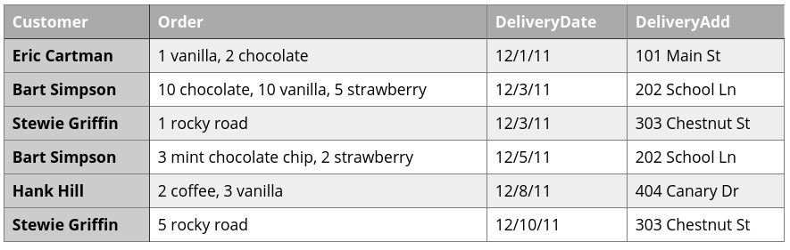
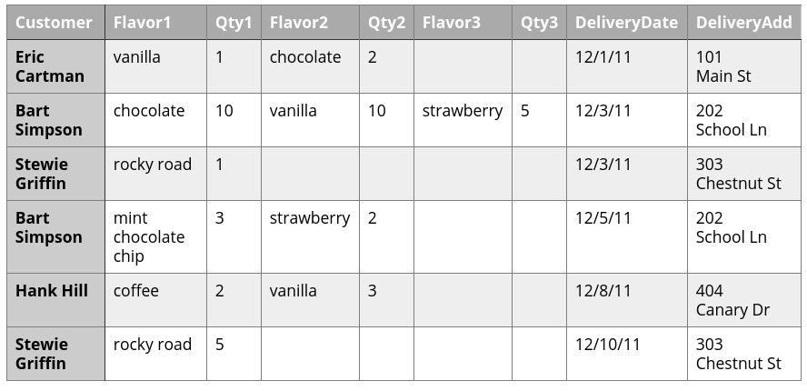
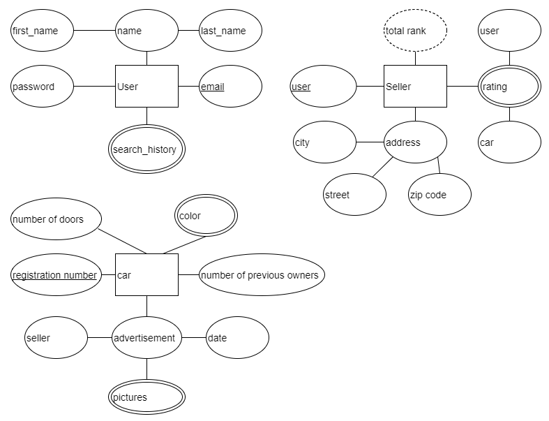
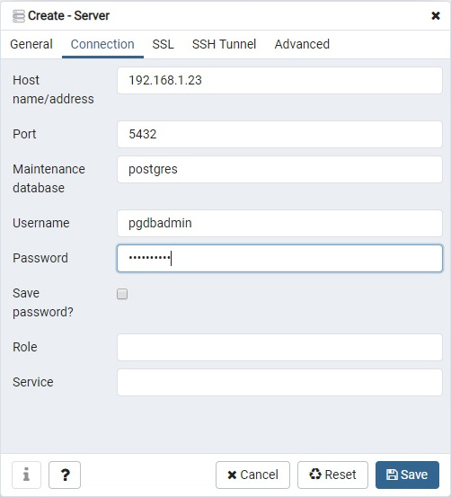
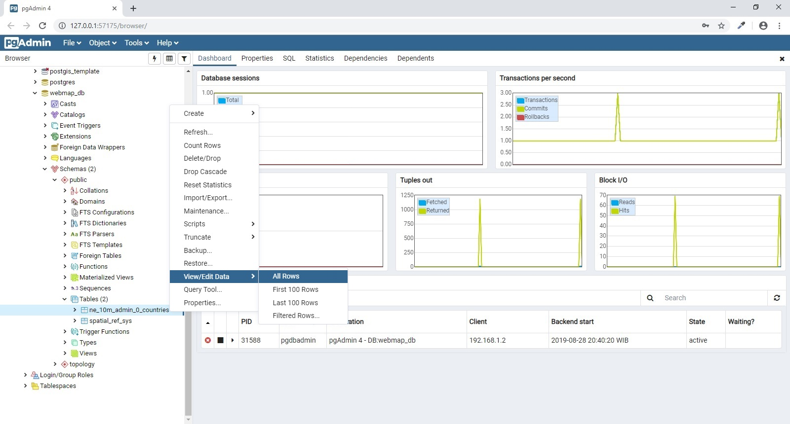
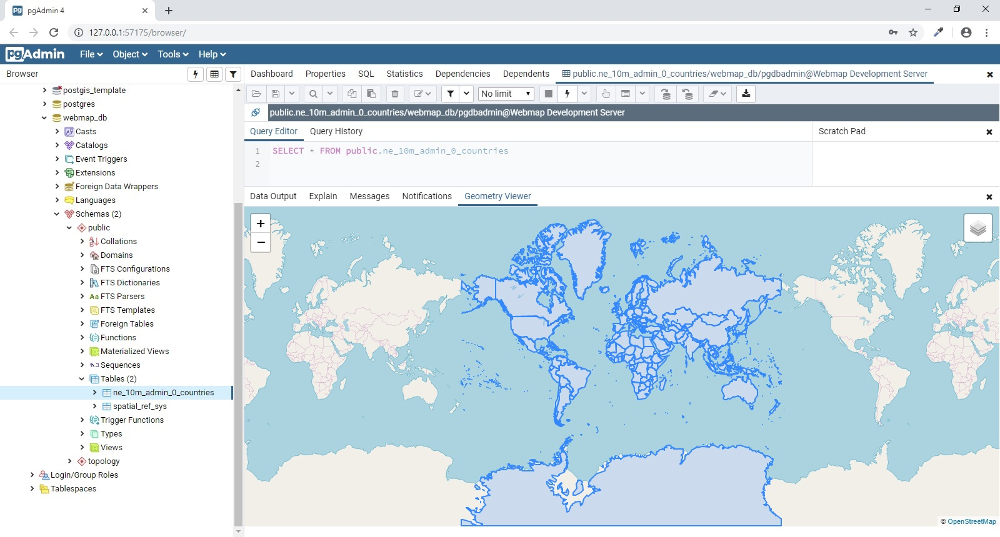
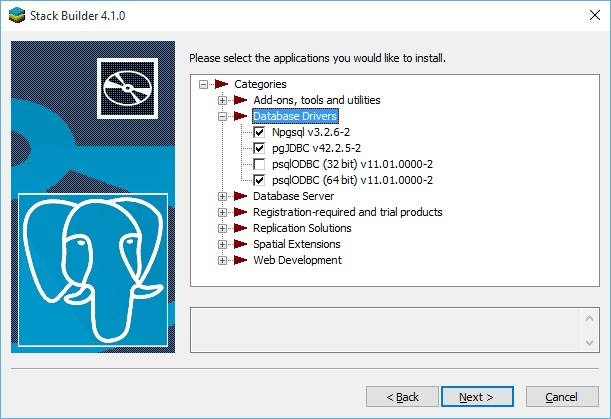

# (PART) Basis Data {-}

# Basis Data {#day2}

<!-- ## Material{-} -->


<!-- ## Overview GNSS dan CORS di Indonesia -->

<!-- ## Konsep Dasar SIG -->

## Perancangan Basis Data ^[Sumber: [https://www.e-education.psu.edu/spatialdb/l2_p4.html](https://www.e-education.psu.edu/spatialdb/l2_p4.html)]


### Rumusan Dasar 

Dalam membangun basis data relasional dari awal, adalah penting untuk memberikan waktu lebih dalam memikirkan **_business process_** yang terjadi. Basis data yang tidak dirancang dengan baik akan memberikan masalah bagi pengguna, termasuk :

- hilangnya integritas data seiring dengan waktu
- ketidakmampuan dalam mendukung query yang diperlukan
- performa yang buruk, misalnya, lambat dalam menampilkan hasil query

Rumusan dasar dalam merancang basis data adalah membuat tabel yang :

- meminimalisir data berlebih (redundant)
- menggambarkan satu subyek
- memiliki satu Primary Key (kode unik untuk setiap baris rekaman (record))
- tidak mengandung kolom dengan banyak bagian (multi-part field) (Contoh: "302 Walker Bldg, University Park, PA 16802")
- tidak mengandung kolom dengan ragam nilai (Contoh: Kolom Author hendaknya tidak berisi data seperti "Jones, Martin, Williams")
- tidak memiliki duplikasi yang tidak perlu (Contoh: hindari penamaan kolom seperti Author1, Author2, Author3)
- tidak memiliki kolom yang nilainya tergantung dari kolomm lain(Contoh: jangan membuat kolom gaji (Wage) untuk tabel yang memiliki kolom PayRate dan HrsWorked )

### Normalisasi

Proses perancangan sebuah basis data seperti yang diuraikan dalam aturan di atas, secara formal disebut dengan normalisasi. Semua perancang basis data melakukan normalisasi, baik mereka menggunakan istilah tersebut untuk menggambarkan prosesnya atau tidak. 

Ada tiga tingkatan normalisasi, yaitu :

- **First Normal Form (1NF)**

menggambarkan sebuah basis data yang tabel-tabelnya merepresentasikan entitas yang unik, tidak ada duplikasi kolom (misal, tidak ada Author1, Author2, Author3), memiliki satu atau banyak kolom yang merupakan identitas unik dari setiap baris (primary key, PK).  Basis data yang memenuhi persyaratan ini termasuk ke dalam First Normal Form (1NF).

- **Second Normal Form (2NF)**

menggambarkan sebuah basis data yang dalam kondisi 1NF dan juga menghindari kolom non-key yang tergantung dari subset Primary Key. Silakan lihat penjelasan di tautan berikut untuk melihat contoh sederhananya [www.1keydata.com/database-normalization/second-normal-form-2nf.php].

Dalam contoh di tautan tersebut, CustomerID dan StoreID membangun sebuah composite key (kunci gabungan) -- gabungan dari nilai kedua kolom tersebut bersifat unik, menjadi identitas setiap kolom dalam tabel. Dalam kata lain, hanya akan ada satu baris dalam tabel yang memiliki CustomerID 1 dengan StoreID 1, hanya akan ada satu baris dengan CustomerID 1 dan StoreID 3, dan seterusnya. Kolom PurchaseLocation tergantung dari kolom StoreID, yang merupakan sebagian dari Primary Key. Dengan demikian, solusi untuk menempatkan tabel ke dalam 2NF adalah dengan memindahkan hubungan StoreID-PurchaseLocation ke dalam tabel terpisah. Pendekatan ini bersifat intuitif di mana kita dapat membaca nilai PurchaseLocation satu kali dibandingkan berulang kali

- **Third Normal Form (3NF)**

menggambarkan sebuah basis data dalam tingkat 2NF dan juga menghindari kolom yang nilainya diturunkan dari kolom lain yang bukan Primary Key. Contoh kolom Wage seperti disebutkan di atas adalah sebuah pelanggaran aturan 3NF. 

Dalam banyak kasus, normalisasi basis data hingga tingkatan 3NF sudah cukup. Perlu ditambahkan juga ada format normalisasi lain seperti Boyce-Codman Normal Form (BCNF, atau 3.5NF), Fourth Normal Form (4NF) dan Fifth Normal Form (5NF). Namun demikian, daripada membuang waktu lebih lama dalam menggambarkan normalisasi tingkat lanjut ini, yang paling simpel adalah mengingat karakteristik dasar dari sebuah tabel yang didesain secara baik seperti di atas. Apabila Anda mengikuti petunjuk tersebut secara seksama, khususnya secara konsisten mencari data berlebih (redundant), Anda akan mampu melakukan normalisasi basis data.

Singkatnya, semakin tinggi tingkatan normalisasi, maka akan semakin banyak jumlah tabel yang ada dalam basis data. Semakin banyak jumlah tabel, usaha untuk menggabungkan data dengan cara _**joins**_ juga akan semakin sulit, dalam arti semakin tinggi level keahlian yang diperlukan untuk membuat queri dan dalam meningkatkan performa basis data. Proses normalisasi kadang-kadang menghasilkan desain yang terlalu sulit untuk diimplementasikan atau kalaupun dapat dibuat, ia memiliki performa yang buruk (baca: lambat). Pada dasarnya, perancangan basis data adalah menyeimbangkan antara kebutuhan yang terkait dengan integritas data dan efisiensi penyimpanan data dengan kebutuhan yang terkait dengan penggunaannya (insert, update, query).

**Contoh** 

Untuk memahami proses normalisasi basis data, contoh berikut memperlihatkan bagaimana aturan-aturan yang telah dijelaskan dapat diterapkan untuk menghasilkan sebuah basis data yang efisien. Pengusaha Jen dan Barry mengembangkan usaha es krim dan membutuhkan sebuah basis data untuk menjejak pesanan (order). Ketika menerima pesanan, mereka mencatat nama pelanggannya, detil pesanan seperti rasa (flavors) dan jumlah es krim yang dibutuhkan, tanggal pesanan dan alamat pengiriman pesanan. Basis data ini diharapkan dapat membantu mereka dalam menjawab dua penting sebagai berikut :

- Pesanan mana yang tenggatnya dalam 2 hari ke depan?
- Perasa apa yang harus dibuat dalam jumlah yang lebih banyak?


Tabel pesanan yang dapat dibuat pertama kali adalah seperti gambar berikut :



Dengan skema di atas, masalah yang muncul adalah ketika mereka akan membuat sebuah query yang menghitung jumlah perasa vanilla yang diperlukan sesuai pesanan. Jumlahnya bercampur dengan nama perasa dan perasa apapun dapat dimasukkan ke dalam daftar di bagian mana saja (tidak akan konsisten dituliskan dalam kolom pertama atau kedua).

Oleh karenanya, desain seperti berikut sepertinya lebih baik:


Skema yang kedua ini lebih baik karena memungkinkan mereka untuk melakukan query perasa tertentu dan menjumlahkan kuantitasnya. Namun untuk menghitung perasa vanila yang diperlukan, mereka harus menghitung jumlahnya dari tiga kolom berbeda. Desain ini juga tidak akan dapat menjawab permasalahan apabila satu orang pelanggan memesan lebih dari tiga perasa.

Desain seperti berikut mungkin menjawab pertanyaan di atas:


Desain seperti di atas memungkinkan penghitungan kuantitas perasa vanila yang dibutuhkan sesuai pesanan dengan lebih mudah. Sayangnya, desain tersebut menghasilkan data berlebih (redundant) dan menuliskan pesanan dari satu pelanggan ke dalam banyak baris (record).

Desain yang paling baik adalah dengan memisahkan data ke dalam empat entitas (Customers, Flavors, Orders and Order Items):


Apabila mereka hendak mengimplementasikan desain seperti di atas dalam MS-Access, query yang diperlukan untuk menampilkan pesanan yang harus dikirim dalam 2 hari ke depan adalah seperti yang terlihat pada GUI :


### Pemodelan Data

Pemodelan data dimulai dengan analisis kebutuhan, dapat dilakukan secara formal atau informal, tergantung dari skala proyeknya. Salah satu perangkat umum yang biasa digunakan dalam proses pemodelan adalah diagram entity-relationship (ER). Diagram ER mengilustrasikan kategori data yang harus disimpan (entitas), juga hubungan (relasi) antara entitas-entitas yang didefinisikan. 

Model data menggambarkan entitas dunia nyata seperti pelanggan, layanan, produk, dan hubungan antara entitas ini. Model data menyediakan abstraksi untuk relasi dalam basis data. Model data membantu pengembang memodelkan persyaratan bisnis dan menerjemahkan persyaratan bisnis ke dalam relasi hubungan. Mereka juga digunakan untuk pertukaran informasi antara pengembang dan pemilik bisnis.

Di perusahaan, model data memainkan peran yang sangat penting dalam mencapai konsistensi data di seluruh sistem yang berinteraksi. Misalnya, jika suatu entitas tidak didefinisikan, atau tidak didefinisikan dengan baik, maka ini akan menyebabkan data yang tidak konsisten dan salah tafsir di seluruh perusahaan. Misalnya, jika semantik entitas pelanggan tidak didefinisikan dengan jelas, dan departemen bisnis yang berbeda menggunakan nama yang berbeda untuk entitas yang sama seperti pelanggan dan klien, ini dapat menyebabkan kebingungan di departemen operasional.

Perspektif model data didefinisikan oleh ANSI sebagai berikut:

- Model data konseptual: 

Menjelaskan domain semantik, dan digunakan untuk mengkomunikasikan aturan utama dalam bisnis, aktor yang berperan, dan konsepnya. Ini menggambarkan persyaratan bisnis di tingkat tinggi dan sering disebut model data tingkat tinggi.

- Model data logis: 

Menjelaskan semantik untuk teknologi tertentu, misalnya, diagram kelas UML untuk bahasa berorientasi objek.

- Model data fisik: 

Menjelaskan bagaimana data sebenarnya disimpan dan dimanipulasi pada tingkat perangkat keras, seperti jaringan area penyimpanan, ruang tabel, CPU, dan sebagainya.

Menurut ANSI, abstraksi ini memungkinkan mengubah satu bagian dari tiga perspektif tanpa mengubah bagian lainnya. Seseorang dapat mengubah model data logis dan fisik tanpa mengubah model konseptual. Untuk menjelaskan, pengurutan data menggunakan gelembung atau pengurutan cepat tidak menarik untuk model data konseptual. Juga, mengubah struktur hubungan bisa transparan ke model konseptual. Seseorang dapat membagi satu relasi menjadi banyak relasi setelah menerapkan aturan normalisasi, atau dengan menggunakan tipe data enum untuk memodelkan tabel pencarian.

Model entitas-hubungan Model entitas-hubungan (ER) jatuh ke dalam kategori model data konseptual. Ini menangkap dan mewakili model data untuk pengguna bisnis dan pengembang. Model ER dapat ditransformasikan menjadi model relasional dengan mengikuti teknik-teknik tertentu.

Pemodelan konseptual adalah bagian dari siklus hidup pengembangan perangkat lunak (SDLC). Ini biasanya dilakukan setelah tahap pengumpulan-kebutuhan fungsional dan data. Pada titik ini, pengembang dapat membuat draf pertama diagram ER serta mendeskripsikan persyaratan fungsional menggunakan diagram aliran data, diagram urutan, cerita pengguna, dan banyak teknik lainnya.

Selama fase desain, pengembang basis data harus memberikan perhatian besar pada desain, menjalankan benchmark benchmark untuk memastikan kinerja, dan memvalidasi persyaratan pengguna. Pengembang memodelkan sistem sederhana bisa mulai mengkodekan secara langsung. Namun, kehati-hatian harus diambil ketika membuat desain, karena pemodelan data tidak hanya melibatkan algoritma dalam pemodelan aplikasi tetapi juga data. Perubahan dalam desain mungkin menyebabkan banyak kompleksitas di masa depan seperti migrasi data dari satu struktur data ke yang lain.

Saat merancang skema database, menghindari jebakan desain tidak cukup. Ada desain alternatif di mana seseorang dapat dipilih. Perangkap berikut harus dihindari:

Redundansi data: Desain database yang buruk menghasilkan data yang berlebihan. Data yang berlebihan dapat menyebabkan beberapa masalah lain, termasuk inkonsistensi data dan penurunan kinerja. Saat memperbarui tuple yang berisi data redundan, perubahan pada data redundan harus tercermin dalam semua tupel yang berisi data ini. Saturasi total: Secara alami, beberapa aplikasi memiliki data yang jarang, seperti aplikasi medis. Bayangkan suatu hubungan yang disebut diagnosa, yang memiliki ratusan atribut untuk gejala seperti demam, sakit kepala, bersin, dan sebagainya. Sebagian besar tidak valid untuk diagnosa tertentu, tetapi secara umum valid. Ini bisa dimodelkan dengan menggunakan tipe data yang kompleks seperti JSON. Kopling ketat: Dalam beberapa kasus, kopling ketat menyebabkan struktur data yang kompleks dan sulit diubah. Karena persyaratan bisnis berubah seiring waktu, beberapa persyaratan mungkin menjadi usang. Pemodelan generalisasi dan spesialisasi (misalnya, seorang siswa paruh waktu adalah seorang siswa) dengan cara yang digabungkan secara ketat dapat menyebabkan masalah.

Sebuah diagram ER pada basis adalah cetak biru dari satu struktur basis data. Beberapa RDBMS menyediakan perangkat untuk menggambar diagram ER (contohnya Oracle Designer, MySQL workbench, PostgreSQL pgModeler) dan juga terkadang menyediakan kemampuan untuk membuat struktur tabel yang telah dikonsepkan dalam bentuk diagram ke basis data.

Dalam konteks GIS, ESRI menyediakan perangkat yang memungkinkan kita membuat alat diagram geodatabase baru melalui CASE (Computer-Aided Software Engineering). Untuk lebih lanjutnya, Anda dapat membaca blog ini yang menjelaskan tentang penggunaan CASE, Menggunakan perkakas Case di Arc GIS 10, [ http://blogs.esri.com/esri/arcgis/2010/08/05/using-case-tools -in-arcgis -10 /].

### Contoh aplikasi

Untuk menjelaskan dasar-dasar model ER, portal web online untuk membeli dan menjual mobil akan dimodelkan. Persyaratan aplikasi sampel ini adalah sebagai berikut, dan model ER akan dikembangkan langkah demi langkah:

Portal ini menyediakan fasilitas untuk mendaftarkan pengguna secara online dan menyediakan layanan yang berbeda untuk pengguna berdasarkan kategori mereka. Pengguna mungkin adalah penjual atau pengguna normal. Penjual dapat membuat iklan mobil baru; pengguna lain dapat menjelajahi dan mencari mobil. Semua pengguna harus memberikan nama lengkap dan alamat email yang valid saat pendaftaran. Alamat email akan digunakan untuk masuk. Penjual juga harus memberikan alamat. Pengguna dapat menilai iklan dan kualitas layanan penjual. Riwayat pencarian semua pengguna harus dipertahankan untuk digunakan nanti. Penjual memiliki peringkat dan ini mempengaruhi pencarian iklan; peringkat ditentukan oleh jumlah iklan yang dipasang dan peringkat pengguna. Iklan mobil memiliki tanggal dan mobil dapat memiliki banyak atribut seperti warna, jumlah pintu, jumlah pemilik sebelumnya, nomor registrasi, gambar, dan sebagainya. Entitas, atribut, dan kunci. Diagram ER mewakili entitas, atribut, dan hubungan. Entitas adalah representasi dari objek dunia nyata seperti mobil atau pengguna. Atribut adalah properti dari suatu objek dan menggambarkannya. Hubungan mewakili hubungan antara dua atau lebih entitas.

Atribut mungkin komposit atau sederhana (atom). Atribut komposit dapat dibagi menjadi beberapa bagian yang lebih kecil. Subbagian dari atribut gabungan memberikan informasi yang tidak lengkap yang secara semantik tidak berguna dengan sendirinya. Misalnya, alamat terdiri dari nama jalan, nomor gedung, dan kode pos. Salah satu dari mereka tidak berguna sendirian, tanpa rekan-rekannya.

Atribut juga bisa bernilai tunggal atau multi-nilai. Warna burung adalah contoh atribut multi-nilai. Itu bisa merah dan hitam, atau kombinasi dari warna lain. Atribut multi-nilai dapat memiliki batas bawah dan atas untuk membatasi jumlah nilai yang diizinkan. Selain itu, beberapa atribut dapat diturunkan dari atribut lainnya. Usia dapat diturunkan dari tanggal lahir. Dalam contoh kami, peringkat akhir penjual berasal dari jumlah iklan dan peringkat pengguna.

Atribut kunci dapat mengidentifikasi entitas di dunia nyata. Atribut kunci harus ditandai sebagai atribut unik, tetapi tidak harus sebagai kunci primer, ketika memodelkan relasi secara fisik. Akhirnya, beberapa tipe atribut dapat dikelompokkan bersama untuk membentuk atribut yang kompleks:

<div class="figure" style="text-align: center">

<p class="caption">(\#fig:fig11)Simbol Entitas </p>
</div>

Entitas harus memiliki nama dan seperangkat atribut. Mereka diklasifikasikan menjadi sebagai berikut:

Entitas lemah: Tidak memiliki atribut kunci dari entitas Kuatnya sendiri / entitas reguler: Memiliki atribut kunci Entitas yang lemah biasanya terkait dengan entitas yang kuat. Entitas yang kuat ini disebut entitas pengidentifikasi. Entitas yang lemah memiliki kunci parsial, juga dikenal sebagai diskriminator, yang merupakan atribut yang secara unik dapat mengidentifikasi entitas yang lemah, dan terkait dengan entitas yang mengidentifikasi. Dalam contoh kami, jika kami menganggap bahwa kunci pencarian berbeda setiap kali pengguna mencari mobil, maka kunci pencarian adalah kunci parsial. Simbol entitas yang lemah dibedakan dengan mengelilingi kotak entitas dengan garis ganda.

Diagram berikut menunjukkan desain awal aplikasi portal mobil. Entitas pengguna memiliki beberapa atribut. Atribut nama adalah atribut gabungan, dan email adalah atribut kunci. Entitas penjual adalah spesialisasi entitas pengguna. Peringkat total adalah atribut turunan yang dihitung dengan menggabungkan peringkat pengguna dan jumlah iklan. Atribut warna mobil ini bernilai multi. Penjual dapat dinilai oleh pengguna untuk iklan tertentu; hubungan ini adalah hubungan terner, karena peringkat melibatkan tiga entitas, yaitu mobil, penjual, dan pengguna.

Gambar mobil adalah atribut sub bagian dari iklan. Diagram berikut menunjukkan bahwa mobil dapat diiklankan lebih dari satu kali oleh penjual yang berbeda. Di dunia nyata, ini masuk akal, karena orang dapat meminta lebih dari satu penjual untuk menjual mobilnya:



Ketika atribut dari satu entitas merujuk ke entitas lain, beberapa hubungan ada. Dalam model ER, referensi ini tidak boleh dimodelkan sebagai atribut tetapi sebagai hubungan atau entitas yang lemah. Mirip dengan entitas, ada dua kelas hubungan: lemah dan kuat. Hubungan yang lemah mengasosiasikan entitas yang lemah dengan entitas lain. Hubungan dapat memiliki atribut sebagai entitas. Dalam contoh kita, mobil diiklankan oleh penjual; tanggal iklan adalah properti hubungan.

Hubungan memiliki batasan kardinalitas untuk membatasi kemungkinan kombinasi entitas yang berpartisipasi dalam suatu hubungan. Batasan utama mobil dan penjual adalah 1: N; mobil diiklankan oleh satu penjual, dan penjual dapat mengiklankan banyak mobil. Partisipasi antara penjual dan pengguna disebut partisipasi total, dan dilambangkan dengan garis ganda. Ini berarti bahwa penjual tidak dapat hidup sendiri, dan ia harus menjadi pengguna.

Catatan 

Batasan hubungan kardinalitas banyak-ke-banyak dilambangkan dengan N: M untuk menekankan perbedaan partisipasi oleh entitas.


Sampai sekarang, hanya konsep dasar diagram ER yang telah dibahas. Beberapa konsep, seperti notasi kardinalitas (min, maks), hubungan ternary / n-ary, generalisasi, spesialisasi, dan diagram entity entity (EER) yang disempurnakan, belum pernah dibahas.

Memetakan ER ke relasi Aturan untuk memetakan diagram ER ke sekumpulan relasi (yaitu, skema basis data) hampir mudah, tetapi tidak kaku. Orang bisa memodelkan entitas sebagai atribut, dan kemudian memperbaikinya menjadi suatu hubungan. Atribut yang dimiliki beberapa entitas dapat dipromosikan menjadi entitas independen. Aturan yang paling umum adalah sebagai berikut (perhatikan bahwa hanya aturan dasar yang telah dicakup, dan daftarnya tidak lengkap):

Memetakan entitas biasa ke hubungan. Jika entitas memiliki atribut gabungan, maka sertakan semua bagian dari atribut. Pilih salah satu atribut kunci sebagai kunci utama. Memetakan entitas yang lemah ke hubungan. Sertakan atribut sederhana dan sub bagian dari atribut komposit. Tambahkan kunci asing untuk referensi entitas yang mengidentifikasi. Kunci primer biasanya merupakan kombinasi dari kunci parsial dan kunci asing. 

Jika suatu hubungan memiliki atribut dan kardinalitas relasinya adalah 1: 1, maka atribut relasi tersebut dapat ditetapkan ke salah satu entitas yang berpartisipasi. Jika suatu hubungan memiliki atribut dan kardinalitas relasinya adalah 1: N, maka atribut relasi dapat ditetapkan ke entitas yang berpartisipasi di sisi N. Peta banyak-ke-banyak hubungan, juga dikenal sebagai N: M, ke hubungan baru. Tambahkan kunci asing untuk referensi entitas yang berpartisipasi. Kunci utama adalah komposisi kunci asing. Memetakan atribut multi-nilai ke suatu relasi. Tambahkan kunci asing untuk referensi entitas yang memiliki atribut multi-nilai. Kunci utama adalah komposisi kunci asing dan atribut multi-nilai.

Diagram kelas UML Unified Modeling Language (UML) adalah standar yang dikembangkan oleh Object Management Group (OMG). Diagram UML banyak digunakan dalam pemodelan solusi perangkat lunak, dan ada beberapa jenis diagram UML untuk berbagai tujuan pemodelan termasuk kelas, use case, aktivitas, dan diagram implementasi. Diagram kelas UML Unified Modeling Language (UML) adalah standar yang dikembangkan oleh Object Management Group (OMG).

Diagram UML banyak digunakan dalam pemodelan solusi perangkat lunak, dan ada beberapa jenis diagram UML untuk berbagai tujuan pemodelan termasuk kelas, use case, aktivitas, dan diagram implementasi. Diagram kelas UML Unified Modeling Language (UML) adalah standar yang dikembangkan oleh Object Management Group (OMG). Diagram UML banyak digunakan dalam pemodelan solusi perangkat lunak, dan ada beberapa jenis diagram UML untuk berbagai tujuan pemodelan termasuk kelas, use case, aktivitas, dan diagram implementasi.

Diagram kelas dapat mewakili beberapa jenis asosiasi, yaitu hubungan antar kelas. Mereka dapat menggambarkan atribut serta metode. Diagram ER dapat dengan mudah diterjemahkan ke dalam diagram kelas UML. Diagram kelas UML juga memiliki keuntungan sebagai berikut:

Rekayasa ulang kode: Skema basis data dapat dengan mudah dibalik untuk menghasilkan diagram kelas UML. Pemodelan objek basis data relasional yang diperluas: Database relasional modern memiliki beberapa jenis objek seperti sekuens, tampilan, indeks, fungsi, dan prosedur tersimpan. Diagram kelas UML memiliki kemampuan untuk mewakili jenis objek ini. Diagram kelas berikut dihasilkan dari rekayasa ulang kode SQL dari car_portaldatabase:


## Pembuatan Basis Data dengan PostGIS ^[Sumber: [https://github.com/andyprasetya/webmap-development-server](https://github.com/andyprasetya/webmap-development-server)]


### Membuat Skema Baru dengan pgAdmin 4
  Instalasi **PgAdmin 4** sangat mudah. Anda tinggal men-_download_-nya dari [download page](https://www.pgadmin.org/download/) di situsnya, dan laksanakan proses instalasi di **workstation** hingga selesai. Sebagai catatan, Anda akan diminta untuk membuat **master password**, yaitu _password_ yang digunakan saat pertama kali mengakses **PgAdmin 4** di _workstation_ Anda.
  
  
  
  Setelah Anda berhasil masuk ke **PgAdmin 4**, maka yang pertama kali harus dilakukan adalah _create connection_ ke server PostgreSQL yang akan Anda akses.
  
  
  
  Pada _dialog_ ini, di _tab_ **General** kita isi **Name** dengan **Webmap Development Server** (atau sesuka Anda), kemudian _checkbox_ **Connect now?**-nya kita _check_, dan **Comments**-nya kita isi dengan deskripsi koneksinya.
  
  
  
  Pindah ke _tab_ **Connection**, kita isi **Host name/address** dengan **192.168.1.23** (IP server PostgreSQL-nya), **Port**: **5432**, **Username**: **pgdbadmin** (biar bisa mengakses seluruh database yang ada), dan _password_-nya. _Checkbox_ Save **Password?**-nya boleh di-_check_, tapi lebih baik dibiarkan _unchecked_ saja, sehingga setiap kali koneksi Anda akan diminta untuk memasukkan _password_.
  
  
  
  Kalau seluruh isian kita sudah benar, maka begitu kita klik **Save**, maka entry **Webmap Development Server** akan muncul di pilihan server pada **PgAdmin 4**:
  
  
  
  Waktu kita _unfold entry_ ini, maka akan muncul pilihan akses ke **Databases**, **Login/Group Roles** dan **Tablespaces**. Selanjutnya, kita akan fokus ke **Databases** dulu.
  
  
  
  Setelah kita _unfold_ **Databases**, maka akan terlihat **3** _database_, yaitu **postgres** (_default database_, yang digunakan oleh PostgreSQL), **postgis_template** (_database_ yang sudah kita _create_ sebelumnya dan kita fungsikan sebagai _template database_) dan **webmap_db** (_database_ yang akan kita akses selanjutnya).
  
  
  
  Masuk ke **webmap_db** -\> **Schemas** -\> **public** -\> **Tables**, maka akan terlihat _table_ bernama **ne_10m_admin_0_countries**, yang mana itu adalah hasil _upload_ shapefile yang sudah kita laksanakan pada bagian sebelumnya.
  
  
  
  Klik-kanan pada _table_ tersebut (**_ne_10m_admin_0_countries_**), pilih **View/Edit Data** -\> **All Rows**:
  
  
  
  Maka selanjutnya pada bagian kanan (tampilan utama) dari PgAdmin 4 akan muncul tampilan _query_ dan seluruh _rows_ yang ada dalam _table_ **_ne_10m_admin_0_countries_**.
  
  
  
  Menariknya pada **PgAdmin 4** ini, jika Anda _scroll_ ke kanan terus hingga akhir _table_, akan ada sebuah _button_ yang berfungsi untuk menampilkan/visualisasi data _geometry_-nya.
  
  
  
  Kalau di-klik _geometry viewer button_ ini, maka selanjutnya akan muncul _webmap_ berbasis [**Leaflet.JS**](https://leafletjs.com/) yang menampilkan data _geometry_-nya.
  
  
  
  Sebagai catatan, _basemap_ dari [**OpenStreetMap**]() hanya akan muncul apabila SRID-nya **EPSG 4326**. Saya belum mencoba untuk **EPSG 3857** atau lainnya. Untuk lebih jelasnya mengenai perbedaan antara **EPSG 4326** dan **EPSG 3857**, dapat Anda baca di artikel bertajuk [EPSG 4326 vs EPSG 3857](https://lyzidiamond.com/posts/4326-vs-3857) ini.


###  PostGIS Shapefile and DBF Loader/Exporter 

  Lakukan langkah-langkah ini di workstation Anda.
  
  FYI, PostGIS Shapefile and DBF Loader/Exporter adalah sebuah aplikasi sederhana yang menjadi bagian dari paket instalasi PostGIS. Instalasi PostGIS membutuhkan PostgreSQL yang sudah terinstall (dan aktif) sebelumnya. Nah, menurut opini saya, instalasi PostgreSQL dan PostGIS di workstation _nggak_ berguna, kecuali hanya untuk _"memancing"_ instalasi **Application Stack Builder**, biar bisa install PostGIS yang mana di proses instalasinya akan mengikutkan **PostGIS Shapefile and DBF Loader Exporter**. PostgreSQL dan PostGIS _toh_ sudah ada di server. Tapi ya... mau _gimana_ lagi? _Let's just do it!_
  
- [**_Download_**](https://www.enterprisedb.com/downloads/postgres-postgresql-downloads) installer PostgreSQL dari EnterpriseDB/EDB, dan install sampai selesai.
  
  > Jika Anda akan langsung melakukan shapefile _upload test_, Anda bisa men-_download_ 1 file dari situs [**Natural Earth**](https://www.naturalearthdata.com/). Ambil contoh, [**batas administrasi negara level 0**](https://www.naturalearthdata.com/http//www.naturalearthdata.com/download/10m/cultural/ne_10m_admin_0_countries.zip).
  
- Setelah instalasi PostgreSQL selesai, dari _Start menu_ jalankan **Application Stack Builder**.
  
  
  
- Pilih **PostgreSQL 10 (x64) on port 5432**, dan klik **Next \>**. Jangan pilih yang **\<remote server\>** yaa..., karena pilihan ini selanjutnya tidak menyediakan opsi instalasi Spatial Extensions (PostGIS dll.).
  
  
  
  Tunggu beberapa saat, Application Stack Builder akan men-_download list_ aplikasi yang bisa Anda _install_ di tahap selanjutnya. Jika sudah muncul tampilan:
  
  
  
- Pilih **Npgsql**, **pgJDBC** dan **psqlODBC** pada kelompok **Database Drivers**, dan **PostGIS 2.5 Bundle for PostgreSQL 10 (64 bit)** pada kelompok **Spatial Extensions**.
  
  
  
  
  
  Klik **Next \>**, dan tunggu beberapa saat hingga Application Stack Builder selesai men-_download_ dan meng-_install_ seluruh aplikasi yang sudah dipilih. Setelah selesai, keluar/matikan Application Stack Builder-nya dan buka _Start menu_.
  
  Pilih (atau cari dulu) menu **PostGIS 2.x Shapefile and DBF Loader Exporter**. Tampilan aplikasinya:
  
  
  
- _Connection testing_ ke server.
  
  Klik **View connection details...**, dan isikan Username: **pgdbuser**, Password: [_password_], Server Host: **192.168.1.23** dan port-nya: **5432**, Database: **webmap_db** seperti ini:
  
  
  
  Jika koneksinya sukses, maka pada bagian **Log Window** akan muncul log yang mengkonfirmasi bahwa koneksi berhasil.
  
  
  
  Jika koneksi gagal, periksa kembali pengaturan koneksinya.
  
  Sekarang saatnya Anda mencoba meng-_upload_ sebuah shapefile ke PostgreSQL/PostGIS di server menggunakan **PostGIS 2.x Shapefile and DBF Loader Exporter**.
  
  O ya, tapi lebih baik kita bahas dulu spesifikasi file yang pada bagian 8.1 di atas saya sarankan untuk di-_download_, yaitu [**batas administrasi negara level 0**](https://www.naturalearthdata.com/http//www.naturalearthdata.com/download/10m/cultural/ne_10m_admin_0_countries.zip). Kalau kita ekstrak file ini, maka kita akan memiliki 1 _set files_ yang yang nama file-nya identik, tapi _extension_-nya berbeda. Dalam konteks pembahasan ini, kita hanya akan fokus pada file ```ne_10m_admin_0_countries.prj``` saja, karena pada saat _upload_ shapefile nanti, kita butuh informasi **SRID (Spatial Reference System Identifier)**.
  
  File ber-_extension_ ```*.prj``` ini berisi informasi tentang CRS (Coordinate Reference System) yang diterapkan/digunakan oleh file ber-_extension_ ```*.shp``` dan ```*.shx``` di direktori yang sama. Kalau Anda membuka file ini di ASCII text editor seperti Notepad atau Notepad++, dan Anda menemui _entry_ yang bertuliskan **WGS_1984**, maka besar kemungkinan **SRID** -nya adalah **EPSG 4326**. Lebih lanjut lagi, "tebakan" SRID ini saya kira cukup masuk-akal karena shapefile ini _coverage_-nya _world_. Jika Anda ingin mengetahui lebih lanjut tentang CRS, WGS 1984, SRID, dan lain sebagainya yang terkait, silahkan gali lebih dalam, asal jangan "tersesat" saja (baca: menyerah, dan langsung ngikut paham bumi-datar. Hahaha...).
  
  Kembali ke tampilan **PostGIS Shapefile and DBF Loader Exporter**, langsung saja klik **Add File**, maka dialog **Select a Shape file** muncul, pilih (klik) shapefile yang akan di-_upload_, dan klik **Open**.
  
  
  
  Setelah klik **Open**, maka shapefile tersebut akan masuk ke **Import List**. Dalam tampilan ini mari kita fokus ke boks merah, yaitu kolom **SRID**.
  
  
  
  Klik angka **0** dalam kolom, dan isi dengan angka **4326**, dan klik pada ruang kosong dalam **Import List**, di bawah _entry_ shapefile-nya. Untuk nama **Table** dan **Geo Column** yang akan jadi target di PostgreSQL/PostGIS biarkan saja apa-adanya.
  
  
  
  Selanjutnya klik **Import**, dan tunggu beberapa saat sampai selesai. Jika tidak ada _error_ saat proses _upload_, maka setelah selesai di **Log Window**-nya akan muncul konfirmasi bahwa _upload_ shapefile-nya berhasil.
  
  
  
  Sampai pada tahap ini, di PostgreSQL/PostGIS server sudah ada contoh geodata yang sudah siap diakses dari berbagai kanal.
  
- Testing PostGIS Layer di Quantum GIS.
  
  _Test_ mengakses PostGIS _layer_ yang paling sederhana adalah dengan menggunakan **Quantum GIS**. Aktifkan Quantum GIS Anda, buat _project_ baru, kemudian klik menu **Layer** -\> **Data Source Manager**:
  
  
  
  Setelah dialog **Data Source Manager** muncul, klik **PostgreSQL** pada bagian kiri, sehingga muncul tampilan koneksi ke PostgreSQL di bagian kanan, dan pada bagian **Connections**, klik **New**:
  
  
  
  Setelah Anda klik **New**, maka akan muncul dialog **Create a New PostGIS Connection**.
  
  
  
  > Pada bagian **Connection Information**, isi Name: **webmap_db@192.168.1.23** (atau yang lain sesuka Anda), **Service** dibiarkan kosong saja, Host: **192.168.1.23**, Port: **5432** dan Database: **webmap_db**.
  
  > Pada bagian **Authentication**, klik _tab_ **Basic**, dan isi **User name**: **pgdbuser**, _checkbox_ **Store**-nya di-_check_, **Password** diisi dengan _password_-nya pgdbuser, dan _checkbox_ **Store**-nya dibiarkan _unchecked_ saja.
  
  > Berikutnya Anda bisa melakukan connection testing dengan meng-klik Test connection. Konfirmasi berhasil atau tidak-nya koneksi akan muncul pada bagian atas dialog box ini.
  
  > Jika Anda ingin hanya menampilkan _table_ yang memiliki _geometry field_ saja, _check_ saja _checkbox_ pada opsi **Don't resolve type of unrestricted columns (GEOMETRY)**.
  
  Setelah Anda klik **OK**, maka _table_ yang tadi sudah terbentuk saat kita meng-_upload_ shapefile akan muncul sebagai pilihan _layer_ yang akan ditampilkan.
  
  
  
  Klik (pilih) pada _table_ tersebut, kemudian klik **Add** pada bagian bawah dan tunggu sejenak hingga tampilan _layer_-nya muncul di belakang dialog **Data Source Manager** ini. Selanjutnya klik **Close**.
  
  
  
  Jika _layer_ **ne_10m_admin_0_countries** sudah muncul, maka test PostGIS _layer_ Anda sudah berhasil.
  


### Download Data

Service Kemendagri

### Impor Data

<!-- You can label chapter and section titles using `{#label}` after them, e.g., we can reference Chapter \@ref(intro). If you do not manually label them, there will be automatic labels anyway, e.g., Chapter \@ref(methods). -->

<!-- Figures and tables with captions will be placed in `figure` and `table` environments, respectively. -->

<!-- ```{r nice-fig, fig.cap='Here is a nice figure!', out.width='80%', fig.asp=.75, fig.align='center'} -->
<!-- par(mar = c(4, 4, .1, .1)) -->
<!-- plot(pressure, type = 'b', pch = 19) -->
<!-- ``` -->

<!-- Reference a figure by its code chunk label with the `fig:` prefix, e.g., see Figure \@ref(fig:nice-fig). Similarly, you can reference tables generated from `knitr::kable()`, e.g., see Table \@ref(tab:nice-tab). -->

<!-- ```{r nice-tab, tidy=FALSE} -->
<!-- knitr::kable( -->
<!--   head(iris, 20), caption = 'Here is a nice table!', -->
<!--   booktabs = TRUE -->
<!-- ) -->
<!-- ``` -->

<!-- You can write citations, too. For example, we are using the **bookdown** package [@R-bookdown] in this sample book, which was built on top of R Markdown and **knitr** [@xie2015]. -->
