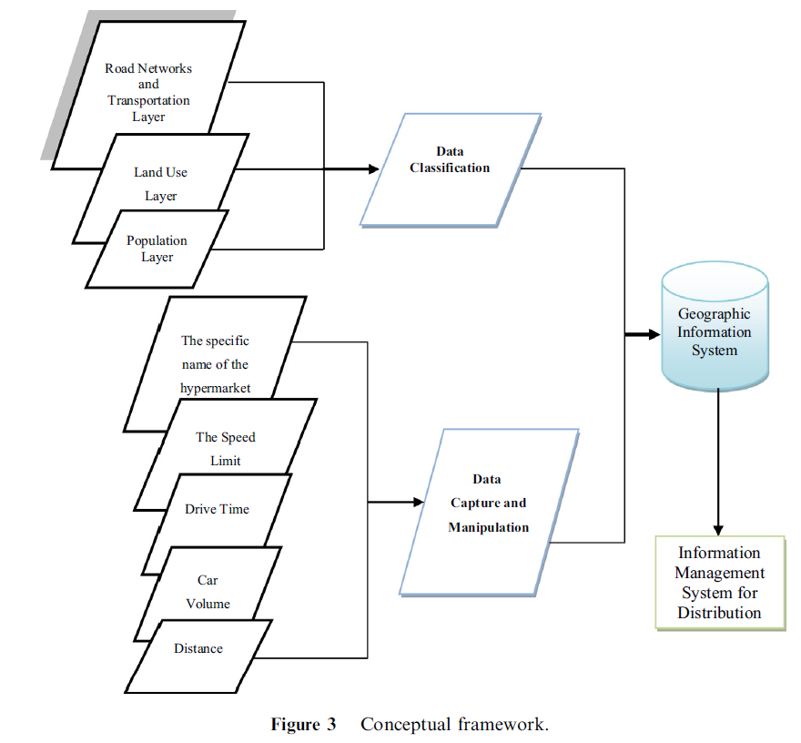
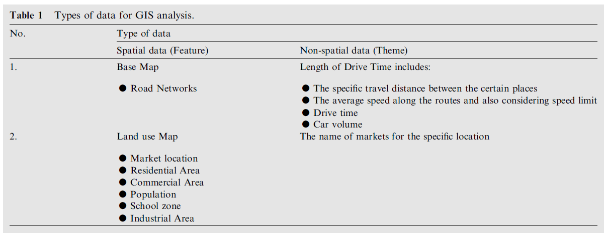
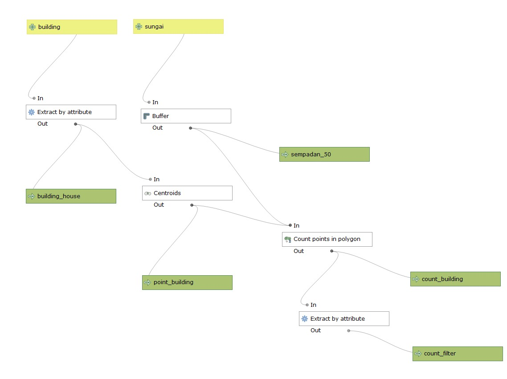

# Hari Kelima

**Referensi**

"Geographic Information System (GIS) modeling approach to determine the fastest delivery routes": [https://www.sciencedirect.com/science/article/pii/S1319562X15001370](https://www.sciencedirect.com/science/article/pii/S1319562X15001370)

## Conceptual framework

 

## Data

 

## Final regression model

LTIME = +0.2663 * CARVOLUME + 0.6984 * LLENGTH + 0.0203 * LPOP + 0.0605 * TWOWAY + 0.1681 * SCHOOL + 0.0317 * RESIDENTIAL - 0.5497

## Praktek Pemodelan SIG

### Menghitung jumlah rumah di sempadan sungai

\begin{align}
Hasil dari Mbak Siti
\end{align}
