# Hari Keenam {#hari_keenam}

**Data**

Data dapat diunduh di tautan berikut [https://firmanhadi.github.io/training-for-gis-analyses/img/dem.zip](https://firmanhadi.github.io/training-for-gis-analyses/img/dem.zip)

Analisis spasial adalah sebuah proses untuk mengkaji lokasi, atribut dan hubungan antara fitur dari data spasial melalui cara overlay dan teknik analisis lainnya, dalam rangka menjawab pertanyaan atau mendapatkan pemahaman yang bermanfaat. Analisis spasial mengekstrak atau membuat informasi baru dari data spasial.

## Basic Geoprocessing

Geoprocessing adalah operasi SIG untuk memanipulasi data. Operasi geoprocessing membutuhkan input, melakukan operasi tertentu pada data tersebut dan memberikan hasil dari operasi dalam bentuk output dataset, seringkali disebut juga data turunan.

Operasi geoprocessing yang umum adalah overlay, feature selection dan analisis, pemrosesan topologi dan konversi data. Geoprocessing memungkinkan Anda untuk mendefinisikan, mengelola dan menganalisis informasi geografis yang digunakan untuk membuat keputusan.

Dengan kata lain, ektraksi atau pengubahan informasi seperti yang Anda harapkan dari data selalu melibatkan geoprocessing.

<!-- ### Buffer -->

### Penapisan data

Kawasan lindung (taman nasional, suaga margasatwa dan hutan lindung) direncanakan dan dikelola dengan tujuan utama untuk konservasi biodiversitas. Hampir semua kawasan lindung terpapar interaksi dengan manusia, baik di dalam ataupun di luar kawasan. Hal ini akan berpengaruh terhadap hidupan liar dan habitatnya. Oleh karena itu, pertumbuhan populasi merupakan salah satu masalah utama dalam pengelolaan kawasan lindung. Hal tersebut akan memicu perubahan tutupan lahan dan penggunaan lahan, yang berdampak pada semakin tingginya tekanan terhadap kawasan lindung.

Walaupun efek kawasan lindung terhadap permukiman manusia masih menjadi perdebatan, ada sebuah kebutuhan pengelolaan interaksi tersebut, baik dalam hal positif ataupun negatif, yang menjadi vital dalam menjaga kelestarian layanan ekosistem. Dengan alasan ini, memetakan sebaran permukiman adalah salah hal yang dilakukan pertama kali dalam mengelola kawasan lindung.

Dalam pelatihan ini, permukiman direpresentasikan sebagai titik perkampungan dari OpenStreetMap yang akan diekstrak melalui query atau penapisan data. Caranya adalah sebagai berikut :

1. Buka osm_points.shp

2. Klik-kanan pada Layer dan pilih Open Attribute Table.


<div class="figure" style="text-align: center">

<p class="caption">(\#fig:fig1424)Open Attribute Table</p>
</div>


3. Klik tombol __Select features by expression__.

<div class="figure" style="text-align: center">

<p class="caption">(\#fig:fig1425)Select Features by expression button</p>
</div>

4. Pilih __place__ untuk opsi **Field and Values**. Klik tombol __All unique__ untuk melihat nilai yang ada di kolmo Place. Ketik ekspresi "place" = 'village', klik tombol __Select features__ di bagian bawah untuk melakukan penapisan data.

<div class="figure" style="text-align: center">
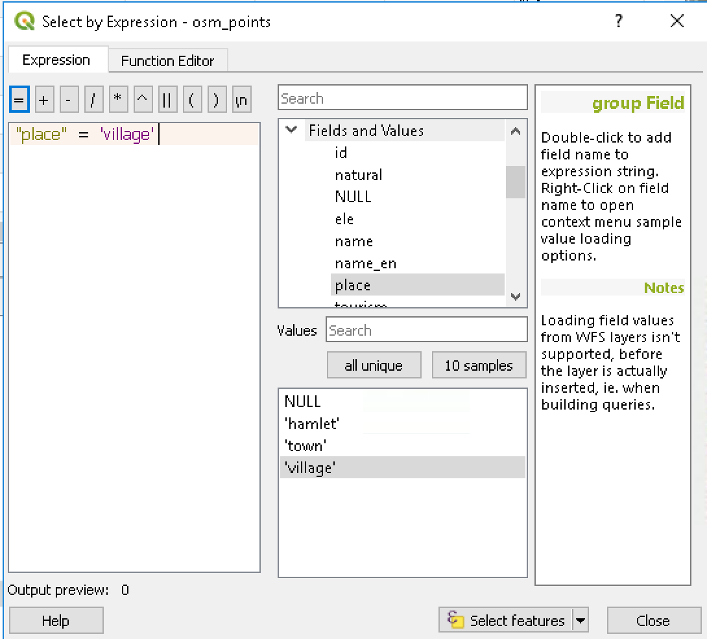
<p class="caption">(\#fig:fig1426)Select by expression window</p>
</div>

5. Baris yang terpilih akan berwarna biru (highlight).


<div class="figure" style="text-align: center">

<p class="caption">(\#fig:fig1427)Selected records</p>
</div>

5. Klik kanan pada Layer __osm_points__ layer dan pilih __"Save as"__

6. Isikan pilihan seperti pada Gambar \@ref(fig:fig1428). Dan jangan lupa untuk memilih __Save only selected features__.

Untuk mengubah Coordinate Reference System (CRS), klik ikon Globe pada opsi CRS dan ketikkan 32648 dalam kotak Filter.

<div class="figure" style="text-align: center">

<p class="caption">(\#fig:fig1429)Save Vector Layer As window</p>
</div>

<div class="figure" style="text-align: center">

<p class="caption">(\#fig:fig1428)Selecting new CRS</p>
</div>


### Dissolve

Satu atau lebih atribut dapat dipilih untuk menggabungkan (merge) geometri yang termasuk ke dalam kelas yang sama, atau semua geometri, dapat digabungkan.

Semua luaran (output) geometri akan dikonversi ke dalam bentuk multi geometri. Apabila inputnya adalah Layer poligon, common boundaries (batas bersama) dari poligon-poligon tetangga yang digabungkan, akan dihapus.

Untuk latihan ini, data yang akan digunakan adalah batas administrasi Laos. Batas ini terdiri dari tiga level (1) negara, (2) propinsi dan (3) distrik. Kita akan menggabungkan batas distrik ke tingkat propinsi.

Silakan ikuti langkah berikut untuk menggabungkan poligon berdasarkan atribut:

1. Buka gadm36_LAO_2.shp di Map Display.


<div class="figure" style="text-align: center">

<p class="caption">(\#fig:fig1419)Lao Admin Boundary Level 2</p>
</div>


2. Pilih ***Vector -> GeoProcessing Tools -> Dissolve***

<div class="figure" style="text-align: center">

<p class="caption">(\#fig:fig1419a)Dissolve menu</p>
</div>

3. Klik ... pada **Unique ID Field**, pilih **NAME1** dan klik OK.

<div class="figure" style="text-align: center">
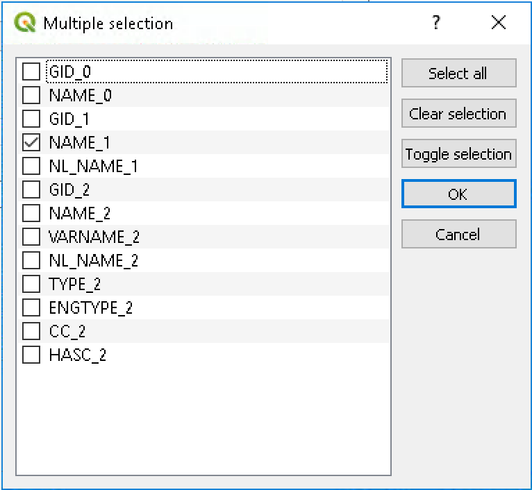
<p class="caption">(\#fig:fig1420)NAME1 selected as Unique ID</p>
</div>

4. Pada menu Dissolve, klik __Run in the background__ untuk menjalankan proses.Hasilnya akan ditampilkan di Map Display.


<div class="figure" style="text-align: center">

<p class="caption">(\#fig:fig1421)Dissolved region</p>
</div>

### Polygon dari layer extent

<!-- # ```{block2, type='rmdcaution'} -->
<!-- # # The following lesson sometimes failed in QGIS 3. You can try the process in QGIS 3 first and if it is failed, try it in QGIS 2.18 -->
<!-- # # ``` -->

Fungsi ini bermanfaat ketika kita ingin memotong raster atau vektor dengan menggunakan extent (bounding box) dari fitur tertentu.

Ikuti langkah berikut untuk melakukan ekstraksi batas dari poligon:

1. Pilih __Vector -> Research Tools -> Extract layer extent__

2. Anda dapat mengatur apakah luaran disimpan sebagai layer sementara atau disimpan ke dalam berkas baru.

<div class="figure" style="text-align: center">

<p class="caption">(\#fig:fig1422)Extract layer extent</p>
</div>

3. Hasil dari proses ini adalah sebuah poligon kotak (persegi panjang) berdasarkan batas koordinat kiri-atas dan kanan-bawah dari fitur yang digunakan.

<div class="figure" style="text-align: center">

<p class="caption">(\#fig:fig1423)Layer extent created</p>
</div>


<!-- ### Join table -->
<!-- District data -->
<!-- Population data -->

<!-- ### Calculate area -->

<!-- ### Point sampling tols -->


<!-- ### Coordinate transformation -->


<!-- ### Mosaic raster -->
<!-- Clipping WorlPop mosaic with HNN Extent -->
<!-- WorldPop Laos + WorldPop Vietnam -->

<!-- ### Clipping raster -->

<!-- ### Rescale  -->

### Reklasifikasi

Fitur ini merupakan salah satu teknik yang bermanfaat untuk mengubah rentang nilai atau mengelompokkannya ke dalam kategori yang baru.

Kita akan melakukan klasifikasi ketinggian ke dalam tiga kelas:

```
- Kurang dari 1.000 m

- Antara 1.000 dan 2.000 m

- Lebih dari 2.000 m
```

Untuk melakukan ini, silakan ikuti tahapan berikut :

1. Buka __srtm_58_09.tif__

2. Buka fungsi __r.reclass__ dari menu __Processing Toolbox__. Isi pilihan seperti terlihat dalam gambar dan klik **Run**.

<div class="figure" style="text-align: center">

<p class="caption">(\#fig:fig1474)Reclassifying the elevation data</p>
</div>

3. Hasilnya adalah layer dengan kelas baru

<div class="figure" style="text-align: center">

<p class="caption">(\#fig:fig1475)Reclassified elevation data</p>
</div>

Nilai dari setiap piksel dibandingkan dengan rentang limit yang ada di lookup table. 
Apabila nilai piksel termasuk ke dalam kelas tertentu, nilai kelas untuk rentang ini akan digunakan di dalam layer luaran.

<!-- ### Zonal statistics -->

## Terrain analyses

Tipe raster tertentu memungkinkan Anda untuk mendapatkan informasi yang lebih terkait terrain. Biasanya Digital Elevation Models (DEMs) digunakan untuk keperluan ini. 

### Persiapan

1. Buka __srtm_58_09.tif__ (ada di dalam sub folder TIF). Layer ini merupakan DEM dengan 
EPSG:4326 CRS dan ketinggian dalam kaki (feet). Karakteristik ini tidak cocok untuk algoritma terrain analyses, harus dikonversi terlebih dahulu ke dalam proyeksi meter (Universal Transverse Mercator).

2. Reproyeksi layer ke sistem CRS EPSG:32648, menggunakan pilihan **Save as...** pada menu yang muncul ketika di-klik kanan pada nama layer.

3. Buka layer yang dihasilkan.

Ada hal yang perlu diperhatikan ketika menerapkan algoritma terrain analyses, agar hasilnya benar.

Salah satu permasalahan utamanya adalah apabila raster yang digunakan memiliki piksel dengan ukuran panjang dan lebar yang tidak sama (bukan bujur sangkar). Asumsi yang biasa digunakan adalah semua piksel pasti bujur sangkar. Namun seringkali data yang kita dapatkan tidak seperti itu.

Oleh karena itu, tahapan yang perlu dilakukan adalah mengekspor layer dan mendefinisikan ukuran piksel dengan nilai yang sama, misalnya 30 atau 90 m. Caranya adalah dengan klik kanan pada nama layer dan pilih **Save as ... **. Pada dialog ***save*** yang ada, pastikan untuk mengisikan nilai piksel di bagian bawah dialog :

<div class="figure" style="text-align: center">

<p class="caption">(\#fig:fig1471)Save raster layer as</p>
</div>

### Kelerengan

Kelerengan (Slope) merupakan salah satu parameter dasar yang dapat diturunkan dari DEM.
Ia adalah turunan pertama dari DEM dan menggambarkan laju perubahan ketinggian. Slope dihitung dengan melakukan analisis ketinggian dari setiap piksel, membandingkannya dengan ketinggian dari piksel di sekelilingnya. Untuk menghitungnya di QGIS, silakan ikuti cara berikut : 

1. Pada opsi **Processing Toolbox** , pilih algoritma **Slope**, klik ganda untuk membukanya.

<div class="figure" style="text-align: center">

<p class="caption">(\#fig:fig1472)Calculating slope</p>
</div>

2. Pilih **DEM** sebagai layer masukan (input).

3. Klik **Run** untuk menjalankan prosesnya.

### Hillshade
A hillshade layer is commonly used to enhance the appearance of a map and display topography in an intuitive way, by simulating a light source and the shadows it casts. This can be computed from a DEM by using this recipe.

1. In the Processing Toolbox option, find the Hillshade algorithm and double-click on it to open it.

<div class="figure" style="text-align: center">
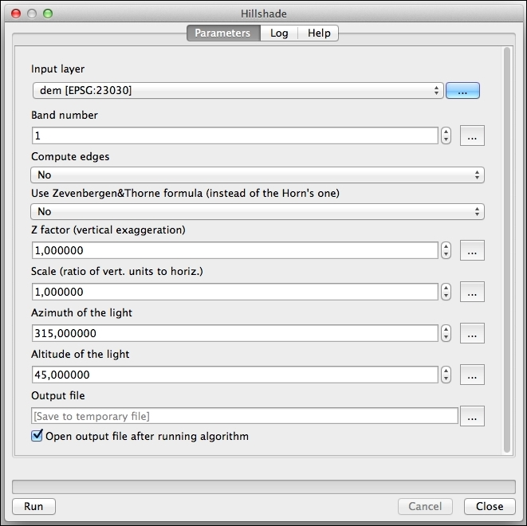
<p class="caption">(\#fig:fig1473)Calculating hillshade</p>
</div>


2. Select the DEM in the Input layer field. Leave the rest of the parameters with their default values.

3. Click on Run to run the algorithm.


## Density Analyses
We often need to work with large and dense datasets in which there is a lot of overplotting and features experience significant overlap. Such datasets may be very slow at rendering because they contain thousands, or even millions, of features, and very difficult to interpret because overlaps make it difficult to detect any clusters or distribution patterns. 

In this section, you will learn the techniques that allow you to visualize such datasets in a more readable and faster way by displaying feature density instead of the features themselves. After practicing the lessons in this section, you will be able to perform density analysis of your data and extract information from density maps.

In this section, we will go through the following topics:

- Density analysis and heat maps

- Creating heat maps with the Heatmap plugin

### Density Analyses and Heatmaps

Density maps allow visual estimation of object or event concentration over the study area. Such maps are very useful for assessment of the distribution patterns of the features over the study area. When we simply add locations of the features or events (for example, as points) to the map, we cannot see the changes in their concentration in different areas. Density analysis gives us such functionality by using uniform area characteristics, such as feature count per acre or square kilometer.

A density map gives us the ability to estimate the concentration of some features within an area. This helps us find areas where an urgent reaction is required or which match your criteria. Heatmaps also help control conditions and their changes.

Density maps are also extremely useful when mapped regions (for example, districts) have different sizes. For example, if we want to know how many people live in each district, we just need an ordinal map with the population data. According to this map, a large district may have a higher population than a smaller district. But if we want to identify the districts with a higher concentration of population, then we need a density map to see the number of people per square kilometer. And a density map will show us that, in fact, small regions with a high population density may have more people per square kilometer than larger districts.

Generally, we can show on a map the density distributions of the features themselves (for example, schools), as well as distributions of some numerical characteristics of these features (for example, the number of pupils in schools). The results will be completely different in these cases. A density map of schools can help an education department find areas where more schools are needed, while a density map created from information about the number of pupils in each school may help a transportation company to plan bus routes and to decide where to place bus stops.

The most common use case is the creation of density maps to display the density of point features. Such maps are often called heat maps. What is a heat map? It is a raster layer. Each cell of it contains a representation of the density of features in its vicinity (for example, the number of people per square kilometer), which depends on the number of features within some area.

To create a heat map, in the simplest case, GIS looks at the features around a cell center, using a given search radius. Then the number of features that fall within the given radius is calculated and divided by the area of the region. This value will be a cell value. Then next cell will be analyzed, and so on. As a result, we will get a combination of values, which creates a smooth surface. To understand this better, refer to the following diagram:

<div class="figure" style="text-align: center">
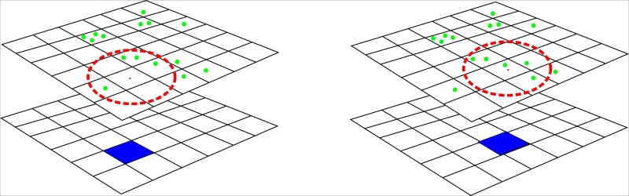
<p class="caption">(\#fig:fig1400)General principle of creating heatmaps</p>
</div>

This diagram shows the general principle of creating heat maps. The green dots depict the features used for density map generation, the blue square is a current raster cell, and the red dotted circle marks the search radius, for example, 1 km. In this case, the area covered will be about 3.14 sq. km. As we can see in the diagram to the left, four features are within the search radius. So, the raster cell will get a value of 4/3.14 = 1.27. On the right side, we notice that the next cell will get a value of 1.59 because now there are five features inside the search radius.

This is the simplest approach. In real-world applications, more complex algorithms are used, where each point has some impact on the values of the neighboring cells, depending on its distance from those cells.

### Creating heat maps with the Heatmap plugin
With the help of the QGIS core plugin called Heatmap, we can easily create heat maps from vector point data and use it for further analysis. First, we need to activate this plugin, if it has not yet been activated. After activation, it creates a submenu under the __Raster__ menu and places its button on the __Raster__ toolbar.

Let's create a density map for the __noise__ layer, which contains information about complaints regarding high noise levels. This layer contains 44,397 features, and it is difficult to know which places are noisy.

Information about such places may be useful for a police department or other agencies to plan some activities for noise reduction, or for those who are looking for apartments and don't want neighbors who like playing loud music.

1. Start the plugin by clicking on the __Heatmap__ button on the __Raster__ panel, or by navigating to __Raster | Heatmap | Heatmap....__

<div class="figure" style="text-align: center">

<p class="caption">(\#fig:fig1409)General principle of creating heatmaps</p>
</div>

2. Select the __noise__ layer from the __Input point layer__ combobox.

3. Using the … button on the right side of the __Output raster__ field, specify the location in which the resulting heat map needs to be saved. Note that there is no need to specify the file extension; it will be picked up automatically, based on the output file format.

4. Use the __Output format__ combobox to select the desired format for the heat map. The most common choice here is __GeoTIFF__, but for very large maps, it is better to use something different, for example, __Erdas Imagine__.

5. The last thing we need to specify is __Radius__. This value defines the distance from each cell up to which QGIS will look for neighbor features and take their presence into account. Generally, a bigger search radius gives a more generalized result, as the number of features found will be divided by a bigger area. A smaller radius gives more precise results, but if this value is too small, we may not find any distribution patterns. The search radius can be defined in meters or map units.

To determine the search radius from a known area, we can use a very simple formula derived from formula for the area of a circle:

\begin{equation*}
r = \sqrt{\frac{S}{\pi}}
\end{equation*}

For example, if we need to calculate density per square kilometer, then the search radius will be as follows:

\begin{equation*}
r = \sqrt{\frac{1 km^2}{\pi}} = \sqrt{\frac{1000000 m^2}{3.1415926}} \approx 564.2 m
\end{equation*}

For more fine-grained control over the result, we can check the __Advanced__ box and define some additional parameters:


- __Rows and Columns__: 

These allow us to define dimensions of the output raster. Larger dimensions will result in a bigger output file size, while smaller dimensions will result in a rough and pixelated output. Input fields are linked to each other, so changing the value in the Rows field (for example, halving it) will also cause the corresponding change to the value in the Columns field, and vice versa. Furthermore, these values have a direct influence on the raster cell size (see the next point). It is worth mentioning that the extent of the raster preserved when changing raster dimensions.

- __Cell size X and Cell size Y__: 

The raster cell size determines how coarse or detailed the display of the distribution patterns will be. A smaller cell size will give smoother results, but the processing time and memory required for the analysis will increase. Large cells will be processed faster, but the resulting raster will be pixelated. If the cells are really big, some patterns will become invisible, so you may need to run the analysis several times, trying different cell sizes to get results that satisfy your requirements.

The cell size depends on and is linked to the raster dimensions. Increasing it will decrease the number of rows and columns, and vice versa.

- __Kernel shape__: 

This controls how the point influence changes with changes in distance from this point. The QGIS __Heatmap plugin__ currently supports the following kernels:

-- quartic (also known as biweight)

-- triangular

-- uniform

-- triweight

-- Epanechnikov


<div class="figure" style="text-align: center">
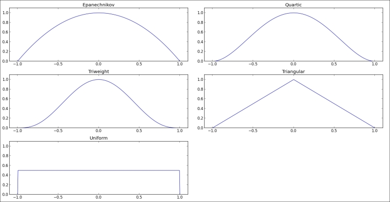
<p class="caption">(\#fig:fig1410)Distribution of the point influence for different kernel</p>
</div>


Depending on the kernel shape, we will get a smoother heat map, or more clearly exposed hotspots. For example, the triweight kernel will give clearer, sharper hotspots than the Epanechnikov kernel, because the Epanechnikov kernel has lower influence near the hotspot center. Also, in different scientific fields, different kernels are preferred; for example, in crime analysis, the quartic kernel is typically used.

It is also possible to use a variable search radius for each point by selecting the __Use radius from field__ checkbox and selecting the attribute field with radius value from the combobox. If you need to weight points (in other words, increase or decrease their influence) by some numeric attribute, activate the __Use weight from field__ checkbox and select the corresponding field. In our example, we will not use this functionality, but you can try it yourself.

As we said before, cell size has a direct influence on the quality of the resulting heat map, so it is important to select it carefully. In most cases, the cell size is chosen in such a way that we get 10 to 100 cells per unit area (which in turn is defined by the search radius). To calculate the cell size, we need to align area units with distance units; for example, if we calculate the density using square kilometers and define the search radius in meters, then it is necessary to convert the square kilometers to square meters. The next step is to divide the area by the desired number of cells. Finally, as the cell size is defined by its width or height (because raster cells usually have a square shape), we need to extract the square root of this value.

In our example, we will create a heat map with a search radius of 1000 m, so the lookup area will be approximately 3.14 square kilometers. When expressed in meters, this will be as follows:

\begin{equation*}
3.14 km^2 = 3.14 . 1000 m . 1000 m = 3140000m^2
\end{equation*}


As we want a smooth heat map, we will use a relatively large number of cells per unit area; let's say 100 cells per 3.14 square kilometers. So, we divide the area in square meters by the desired cell count:

\begin{equation*}
\frac{3140000m^2}{100 cells} = 3140000m^2 per cell
\end{equation*}

Finally, we calculate the square root of this value to get the cell size that allows us to have 100 cells per 3.14 square kilometers:

\begin{equation*}
\sqrt{31400m^2} \approx 177.2 m
\end{equation*}

Of course this is not a strict rule but just a recommendation. You can safely use another cell size, depending on your data and the desired results. Just remember that smaller values lead to smoother heat maps, but at the same time increase the analysis time and output raster size.

When all the inputs and parameters are set, press the OK button to start the process of the heat map generation. The progress of the heat map formation will be displayed in a small progress dialog. If this process is taking too long time to complete, you can interrupt it by pressing the Abort button. Note that after aborting heat map generation, you still get the output, but it will be incomplete and not useful for further analysis.

When the process completes, the generated heat map will be added to QGIS as a grayscale raster, where lighter regions correspond to higher density values and darker regions correspond to lower density values, like this:

<div class="figure" style="text-align: center">

<p class="caption">(\#fig:fig1476)Heatmap result in greyscale</p>
</div>


To improve readability and make it look like real heat map, we need to change its style. To do this, follow the next steps. 


1. Right-click on the __heatmap__ layer in the QGIS layer tree. In the context menu, select __Properties__.

2. Go to the __Style__ tab and select __Singleband pseudocolor__ as __Render type__.

3. In the __Load min/max values__ group, activate the __Min/max__ options. Set __Extent to Full__ and __Accuracy to Actual (slower)__. Press the __Load__ button to get raster statistics. This will be used for further classification.

4. Select a suitable color ramp in the __Generate new color map__ group, for example, __YlOrBr__ (which changes colors from yellow to orange and then brown), or __Red__s (which uses different shades of red). If necessary, change the number of classes and click on the __Classify__ button.

5. Click on __OK__ to apply the changes and close the properties dialog.


Now we can easily locate the hottest points (displayed in colors closer to red if the Reds color map is used), and even recognize some distribution patterns that were not visible when we looked at the original point layer:

<div class="figure" style="text-align: center">

<p class="caption">(\#fig:fig1477)Heatmap result  pseudocolor</p>
</div>

Now we can easily locate the hottest points (displayed in colors closer to red if the Reds color map is used), and even recognize some distribution patterns that were not visible when we looked at the original point layer. Also, our heatmap layer showed up much faster than the vector which is used to create this heat map.


__Detecting the "hottest" regions__

Sometimes, you don't need the heat map itself, but just want to find the hotspots—areas with the highest density—and use them in further analysis. It is pretty easy to find such regions in QGIS and extract them in the vector form.

First, we should define threshold value, which will be used to recognize the hotspots. As a starting value, we can use the maximum pixel value in our heat map and then adjust it as per our needs.

The simplest way to find the maximum pixel value is to use the __Identify Features__ tool. Select a layer in the QGIS layer tree, activate the __Identify Features__ tool, click on the most visually "hottest" regions, and look at the reported value. With our heat map, this will be 540.32.

If we will use this value as is, we cannot find all the important clusters, so this value should be reduced first. The smaller the selected value (in comparison with the maximum value), the larger the number of clusters found. The area of separate clusters will also grow. For our example, we choose a value of 200.

Now, open __Raster Calculator__ from the __Raster__ menu, specify a path where the output file should be saved in the __Output layer__ field, and enter the __"heatmap\@1">=200__ formula in the __Raster calculator expression__ field, like this:

<div class="figure" style="text-align: center">

<p class="caption">(\#fig:fig1478)Heatmap result  pseudocolor</p>
</div>


This formula is used to create a so-called mask. If the pixel value of the input layer is greater or equal to our threshold value of 200, then the output pixel value will be 1. Otherwise, it will be 0. So, our output raster will be a binary raster, with only two pixel values—0 and 1—which is very easy to convert to a vector.

Leave all other values unchanged so that the resulting raster will have exactly the same dimensions and cell size as the input one. Press the OK button to start the calculation. When it is done, a new black-and-white raster layer will be added to the QGIS canvas, as shown here:

<div class="figure" style="text-align: center">

<p class="caption">(\#fig:fig1479)Mask for heatmap</p>
</div>

To convert the mask raster into vector format, we need to create polygons from all connected pixels with the same value. This is where the Polygonize tool comes to help. In the Processing toolbox, you can find the Polygonize algorithm by typing its name in the filter field at the top of the toolbox. Double-click on the algorithm name to open its dialog, and you will see something like this:

<div class="figure" style="text-align: center">

<p class="caption">(\#fig:fig1480)Polygonized mask</p>
</div>

Select the mask layer that was previously created as __Input layer__, specify the path where the result will be saved using the __Output layer__ field, and click on the __Run__ button to start the algorithm. When it is done, a new vector layer will be added to QGIS. This layer has an attribute called __DN__ (if you did not change it) that indicates the pixel value of each polygon in the layer. So, all we need to do is remove all the features that have the attribute value equal to zero. The remaining features will be the hotspots.

To delete unnecessary features from the hotspots layer, select it in the QGIS layer tree, right-click to open the context menu, and select __Open Attribute Table__. Click on the __Select features using an expression__ button. In the __Select by expression__ dialog, enter __"DN" = 0__ (if necessary, replace DN with your field name), click on the __Select__ button, and close the dialog. Start editing by clicking on the Toggle editing mode button, or press __Ctrl + E__. To remove the selected features, press the __Delete key__ or click on __Delete selected features__. Finally, turn editing mode off by pressing __Ctrl + E__ or clicking on __Toggle editing mode__ again.

<div class="figure" style="text-align: center">
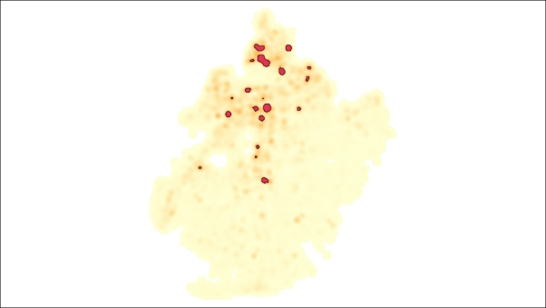
<p class="caption">(\#fig:fig1481)Cleaned hotspot polygon</p>
</div>

Now, the hotspots layer contains only hotspot polygons, which can be used for further analysis. For example, we can combine this cluster with information about the nearest buildings and noise types to find dependencies and develop some suggestions for reducing the noise levels there.

__Looking for distribution patterns with contour lines__

Apart from detecting hotspots, heat maps can also be used to detect intensity changes or visualize the direction of value changes. The most common way to do both of these tasks is contour lines generation.

Fortunately, QGIS has all the necessary tools for this. We will use processing again, but contour lines generation is also available in the __GDALTools__ plugin (which can be found in the __Raster__ menu). In the __Processing__ toolbox, you can find the __Contour__ algorithm by typing its name in the filter field at the top of the toolbox. Double-click on the algorithm name to open its dialog, which looks like this:

<div class="figure" style="text-align: center">
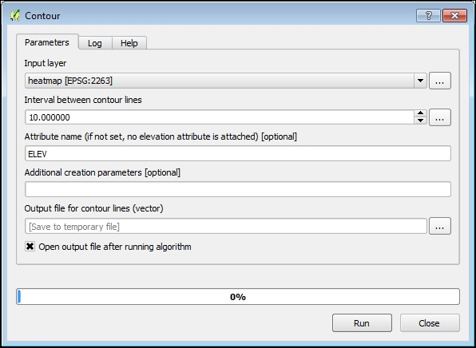
<p class="caption">(\#fig:fig1482)Creating Contour</p>
</div>


Select the __heatmap__ raster layer as __Input__ layer. In the __Output__ file field, specify the path where the results will be saved. Also, it is necessary to define __Interval between contour lines__. There are no strict principles about determining this interval. The general rule is to select such an interval that detects patterns in the areas with smooth density changes. We will select an interval of 10.

When all of the necessary information has been defined, click on __Run__ to start the contour line generation. After some time, a new polygonal vector layer will be added to QGIS, and we can start analyzing it. First, if necessary, move the contours layer to the top of the heat map in the QGIS layer tree. Also, it is better to adjust contours' symbology to make them more recognizable against the background of the heat map.

<div class="figure" style="text-align: center">
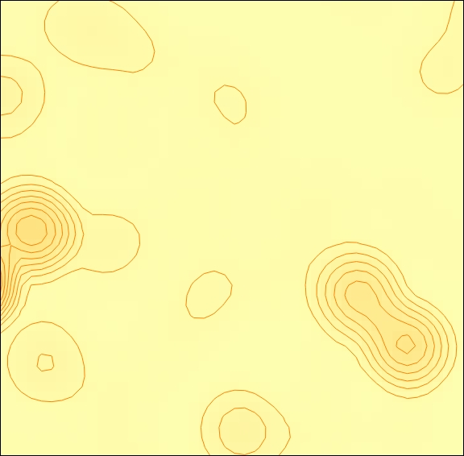
<p class="caption">(\#fig:fig1483)Contour heatmap</p>
</div>

More dense contours correspond to more intense density changes. Also, we can identify the direction of changes in noise. For example, in the preceding screenshot, we can see that in some places, the noise distribution around the center is not equal; the intensity reduces more quickly in the southeast than in the northwest. So, we may assume that there are some obstacles to noise there.

<!-- ### Mapping density with a hexagonal grid -->

<!-- There is also another approach of mapping density, called binning. Generally speaking, binning is a technique of grouping N values/features into M groups, where M < N. The result of such an operation can be interpreted as a two-dimensional histogram. -->

<!-- Binning is an alternative to heat maps, not a replacement. The choice of the method depends on the requirements and further usage of the results. It is, however, worth mentioning that binning produces a vector output, while a heat map produces a raster output. -->

<!-- In general, binning can be described in two simple steps: -->

<!-- Create a hexagonal grid on top of the point layer. -->

<!-- Count the number of points in each grid cell. -->

<!-- In this section, you will learn how to use this technique in QGIS in the example of hexbinning, in other words, mapping density with a hexagonal grid. -->

<!-- Note -->
<!-- In fact, for binning, we can use not only hexagons but also other shapes that allow regular tessellation of a 2D surface—triangles and rectangles. -->

<!-- Why do we choose hexagons? Well, because a hexagon is closest to a circle among all shapes that tessellate. As a result, they represent curves more naturally. Another advantage of hexagons is a more compact structure, so the distance between cell centers in a hexagonal grid is lower than in a rectangular grid. So data aggregation around the cell center is more efficient. -->

<!-- Note -->
<!-- In Chapter 8, Automating Analysis with Processing Models, we will create a model that produces two density maps: hexagonal and rectangular, so that you can compare them side by side and better understand their differences and use cases. -->

<!-- In the upcoming sections, we will create a density map using this approach. For this exercise, we will use data from Brooklyn's street tree census. This is the trees layer in our map. -->

<!-- Creating a hexagonal grid -->
<!-- To create a hexagonal grid, we will use the QGIS Processing framework and its algorithm called Create grid: -->

<!-- In the Processing toolbox, find the Create grid algorithm by typing its name in the filter field at the top of the toolbox. Double-click on the algorithm name to open its dialog, which looks like this: -->


<!-- In the Grid type combobox, select Hexagon (polygon). -->

<!-- To specify grid extent press the … button on the right side of the Grid extent field and choose Use layer/canvas extent from the menu. -->

<!-- The Select extent dialog will pop up. Use it to select the trees layer from the combobox, and click on OK. The coordinates of the layer extent will be added to the field. -->

<!-- Set 1000 as the horizontal and vertical spacing. These values have the same meaning as the search radius in the case of heat maps. Grid spacing determines how many cells will be in a grid and how smooth the resulting map will be. A smaller spacing produces smoother results, but very small values prevent us from identifying any distribution patterns. Note that the spacing should be specified in the same units as used by layer; for example, if a layer CRS uses feet as units, then the spacing should be in feet too. -->

<!-- Finally, in the Output field, specify the path where the resulting grid will be saved and click on Run to create the grid. When the algorithm execution completes, a new polygonal layer will be added to QGIS. -->

<!-- Counting points in grid cells -->
<!-- To calculate the number of features inside each grid cell, we can use fTools or Processing core plugins. The latter is more flexible and allows us to automate tasks, as described in Chapter 8, Automating Analysis with Processing Models. We will use the Count points in polygon algorithm from the Processing framework. -->

<!-- Tip -->
<!-- There is also a Count unique points algorithm in Processing that lets us count only points with unique attributes in the selected field. This may be useful when a more precise analysis is needed, for example, for mapping diversity. -->

<!-- In the Processing toolbox, find the Count points in polygon algorithm by typing its name in filter field at the top of the toolbox. Double-click on the algorithm name to open its dialog, and you will see this: -->


<!-- Select the grid layer created in the previous section as Polygons and the trees layer as Points. Enter Count field name or leave it unchanged. Don't forget the 10-character limitation for the shapefile field names! Finally, in the Result field, specify the location where the resulting layer will be stored, and click on the Run button to start the analysis. Keep in mind that this may take some time, as the tree layer contains many features and the grid size is relatively small. -->

<!-- When an algorithm execution completes, a new grid layer, containing the field with the number of points in each cell, will be added to QGIS. We can safely remove the original grid layer from QGIS and from the filesystem, as it is no longer needed. -->

<!-- For better visual representation of our data, we apply a graduated renderer to style cells according to the number of features in them. If necessary, go back to the Developing styles for vector layers section of Chapter 2, Visualizing and Styling the Data. The result may look like this: -->


<!-- Removing redundant data -->
<!-- If we look carefully at our grid layer and its attribute table, we will see that some grid cells are empty; there are no points in them. Such cells displayed with a very light green color in the preceding screenshot. It is clear that the empty cells are much more than the nonempty cells. Of course, we can simply hide such empty cells by assigning to them the same color as the map background, or by removing them from the renderer (assigning an empty style). But, is it better to remove them completely and reduce the file size? -->

<!-- There are two possible ways to remove empty cells: manually or by using one of the existing tools from the Processing toolbox. Each method has own advantages. -->

<!-- First, you will learn how to remove redundant data manually. This method can be used when you need to process only one layer and don't want to create any temporary intermediate files. Also, it allows you to easily examine the features that will be removed. Let's do it: -->

<!-- Select the LAYER layer from the QGIS layer tree. Then, click on the Select features using an expression button in the Attributes toolbar to open the Select by expression dialog. -->


<!-- In the functions tree, under the Fields and Values group, find the NUMPOINTS field and double-click on it to add its name to the expression. -->

<!-- Then, click on = to add the equal to operator to the expression, and type 0 after it. The final expression will look like "NUMPOINTS" = 0. -->

<!-- Click on Select to select all the features that match your condition. The selected features will be highlighted in yellow so that you can check whether they are what you want. -->

<!-- Now, close the Select by expression dialog and open the layer attribute table by clicking on the Open Attribute Table button in the Attributes toolbar. -->

<!-- Toggle editing mode by clicking on the corresponding button in the attribute table dialog, or by simply pressing Ctrl + E. -->

<!-- To remove the selected features, just press the Delete key or click on the Delete selected features button. -->

<!-- Finally, turn editing mode off by pressing Ctrl + E again. Now our layer contains only nonempty cells and is much smaller in size. -->

<!-- Deleting redundant data with Processing requires fewer steps than removing redundant data manually, but instead of updating the existing layer, it creates another file. The Processing framework is useful when you need to process many layers at once or want to automate some operations. To remove empty cells, we can use the Extract by attribute algorithm. -->

<!-- Tip -->
<!-- In our case, the comparison condition is very simple, so we use the Extract by attribute algorithm. When a more complex comparison condition that includes several attributes or some calculations is needed, it is better to use the Select by expression algorithm in combination with Save selected features. -->


<!-- Here are the necessary steps: -->

<!-- Find the Extract by attribute algorithm by typing its name in the filter field, and double-click on its name to open its dialog. -->

<!-- In the Input layer combobox, select LAYER. -->

<!-- In the Selection attribute combobox, select the NUMPOINTS field, which stores the point count in each cell. -->

<!-- In the Operator combobox select the not equal operator !=. -->

<!-- Enter 0 in the Value field. -->

<!-- Specify the name of the output file in the Output field. -->

<!-- Now, we can press the Run button to start processing. When it is done, the new layer, with empty cells removed, will be added to QGIS, and we can remove the original layer. The new layer is much smaller, but still contains all of the information. Also, we can now set up styles more precisely and identify some distribution patterns that were not visible earlier. -->


<!-- If we overlay a layer that has a street network with this density map, we can easily identify that the greenest street is the Ocean Parkway. -->

<!-- The result looks great, but performing all of these steps manually is not very comfortable. Also, there are a number of intermediate layers that can, and should, be removed. Fortunately, QGIS allows us to automate such operations with the Processing Graphical Modeler. Refer to Chapter 8, Automating Analysis with Processing Models, to learn how to create models and use them. -->

## Suitability Analyses

We live in a world full of various relationships that can be analyzed in functional, temporal, or spatial contexts. Spatial relationships are of particular interest when it comes to GIS, because here objects in space are represented in a way that facilitates explanations and analyses of their geographic relations. Suitability analysis is a fundamental part of GIS analysis that answers the question, "Where is the best place for something to be located?" In this chapter, you will be exposed to the fundamentals of suitability analysis through the search for the best place to live in. You will learn how to:

```
- interpret spatial relationships between objects

- express these relationships through spatial data

- analyze spatial data according to a set of predefined criteria

- overlap layers and interpret the results
```

__Basic of Suitability Analyses__

Suitability analysis is recognized as a multi-criteria decision support approach. In other words, its main aim is to divide the area of interest into two categories based on a set of predefined criteria: appropriate for some kind of use (living, building, conservation, and so on) and inappropriate. A general approach that is used for suitability assessment is multiple layer overlays that support multi-criteria decisions. Depending on the data that represents suitability criteria and overlaid, there are two basic approaches available:

1. Suitability analysis with vector data. 

This primarily utilizes operations such as buffering and their sequential combination using vector overlay operations, such as clipping, intersection, and union.

2. Suitability analysis with raster data. 

This heavily relies on raster algebra, which is used to reclassify initial raster coverages and then combine them to produce binary or ranked suitability rasters. This approach is more flexible, as it makes it possible to produce multiple suitability classes and change the raster weight according to the importance of the factor it represents. As a result, the user is able to produce a compound result, but the workflow requires more effort connected to data preprocessing and consolidation decisions.
\newpage

                                                Vector data                             Raster data
-------                                         -----------                             ---------
__Main operations__  
                                                Buffering                                 Vector data rasterization
                                                Clip overlay                              Proximity raster creation
                                                Intersection overlay                      Raster reclassification
                                                Union overlay                             Raster algebra addition
                                                                                          Raster algebra multiplication
                                                                                          Raster algebra substraction
__Advantages__
                                                Workflow quickness                        Simple data reclassification
                                                Workflow simplicity                       Good representation of continuous features
                                                Good representation of man-made features  Crisp and fuzzy classes are possible
                                                                                          Different weighting according to their importance
                                                                                          Various assessments are possible
__Limitations__
                                                Provide only crisp classes                Reclassification and ranking subjectivity
                                                Usually provide binary assessment only    Workflow complexity
                                                
                                                
No matter what approach you will follow, the general suitability analysis workflow involves several common steps. We will now take a closer look at them to ensure better understanding of the suitability analysis system:

1. __Define the goal and objectives of your analysis__ 

The question to be studied is formulated in general, and its applied significance is determined, which will later become the set of suitability criteria. 

Some popular suitability applications include the following:

- __Agriculture__: The appropriateness of the area for cultivation of certain crops is assessed.

- __Retail__: The area is assessed from a marketing prospective—whether it will attract new customers or buyers, or not. This type of analysis is in great demand when selecting preferable shopping locations.

- __Renewable energy__: Assessing land suitability for locations of wind power or solar power stations is a remarkable trend in the field of geospatial planning for sustainability.

- __Nature conservation__: Conservancy needs are prioritized using habitat suitability modeling, and the area is divided into locations that are more or less valuable for certain species survival and reproduction.

Generally speaking, the primary application of suitability analysis is in the field of land use planning, aimed at reasonable prioritization of various types of human activities within limited space and natural resources.

2. __Analyze the available data and define its relevance to the goals and objectives__

Data relevance to the goal and objectives is defined. Current data availability and future data requirements are analyzed, especially the knowledge of whether the current data derivatives can be used for analysis or not. For example, if we have to analyze suitability for agricultural needs, a DEM can be a great source. It provides not only basic information about the relief, but also some useful derivatives, such as slope and aspect. The main outcome of this stage is a list of primary data sources and their potential derivatives.

3. __Define the criteria of analysis__

This is the most important stage, where the objectives of analysis are described as clear numerical criteria based on relevant data. Descriptive objectives are translated into the language of GIS analysis. At this stage, various types of spatial relationships between objects are analyzed, and some of the most popular relationships include the following:
\newpage


- point-to-point relationships:

-- "is within": All schools that are within a distance of 1 km from a living place

-- "is nearest to": The primary school that is closest to a living place

<div class="figure" style="text-align: center">

<p class="caption">(\#fig:fig1401)Example of the "is within" point-to-point relationship</p>
</div>


- point-to-line relationships:

-- "is nearest to": The street that is closest to a subway station entrance


<div class="figure" style="text-align: center">

<p class="caption">(\#fig:fig1402)Example of the "nearest to point-to-line" relationship</p>
</div>


- point-to-polygon relationships:

-- "is contained in": All public schools within a certain community boundary


<div class="figure" style="text-align: center">

<p class="caption">(\#fig:fig1403)Example of the "is contained in" point-to-polygon relationship</p>
</div>


- line-to-line relationships:

-- "crosses": Whether a particular trail crosses a road

-- "is within": Find all trails that are within a distance of 1 km from a particular river

-- "is connected to": Find all streets connected to a particular highway


- line-to-polygon relationships:

-- "intersects": Find all districts crossed by a cycleway

-- "contains": Find all streets that are completely within a certain district


<div class="figure" style="text-align: center">

<p class="caption">(\#fig:fig1404)Example of the "intersects" line-to-polygon relationship</p>
</div>


- polygon-to-polygon relationships:

-- "completely within": Find all districts that are completely within a hazard zone

-- "is nearest to": Find the building that is nearest to a park

<div class="figure" style="text-align: center">
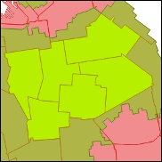
<p class="caption">(\#fig:fig1405)Example of the "completely within" polygon-to-polygon relationship</p>
</div>


4. __Primarily analyze and prepare the data__ 

The data is analyzed according to the set of criteria defined in the previous stages. Common analysis operations involve selection by location, buffering, rasterization, proximity (raster distance), and so on. After all the necessary layers are ready, they should be prepared for overlay, which involves reprojection into a common coordinate reference system (if necessary), setting ranges for various ranks, and reclassification in the common ranking system. All the layers should contain values in uniform units, otherwise their overlay will be meaningless and hard to interpret.

5. __Overlay the data and interpret the results__

Previously prepared layers are combined into a single coverage based on a set of user-defined rules. Depending on the data available and the rules applied, the following suitability assessments are possible:

- __Binary suitability assessment__ 

All of the area is divided into appropriate and inappropriate categories. This is the simplest type of assessment that can be obtained from vector data overlay.

- __Ranked suitability assessment__ 

Places are ranked from least appropriate to most appropriate based on the entire range of predefined criteria. This type of assessment can be derived from both vector and raster data. It lets you avoid simple yes/no assessments, which are not inherent to the real word. This advantage is counterbalanced by the subjectivity of data rankings and equal importance of various factors. Nevertheless, in the real world, their contribution to overall assessment can vary.

- __Weighted suitability assessment__ 

This is similar to the previous type of assessment and has only one significant difference: various factors can be weighted differently according to their importance for a certain type of activity. This type of assessments relies on the raster algebra approach and is thought to be all-inclusive, but not without some subjectivity, especially when it comes to factor weighting and interpreting the final result.

### Step 1: Define the goal and objectives

Throughout this tutorial, we will suppose that we are working on behalf of a young couple with a little child. They are looking for a perfect place to live in within a certain region of their interest. Our goal is to use the power of GIS-based suitability analysis methods and provide an objective and reliable answer to their question.

The goal of this analysis is to find areas that would be a good match for a young family with a child, given certain considerations. Many of their requirements are similar to those of a traditional housing estate development company. For example, proximity of subway stations, green zones, and public safety must be all taken into consideration. There are also some family-specific requirements that should be considered. As already mentioned, the family has a little baby, which means that we should take into account the existence of early childhood or elementary schools nearby. Also, they are keen on sports, and it would be great if the area they are going to live in has well-developed and active rest infrastructure. After this kind of review, we can formulate some more specific requirements and objectives:

- __Safety__: The area should not be exposed to various natural and crime hazards

- __Connectivity__: It should be well-connected to the city's transport network

- __Greenness and openness__: It should be close to parks or other green areas

- __Educational potential__: Early childhood or elementary schools should be located in the neighborhood

- __Active rest opportunities__: These include a cycling network and athletic facilities

- __Cultural life__: Art galleries and museums can be recognized as general signs of cultural pulse beating

Now that the main objectives and requirements have been clarified, we can proceed to the next step and study all of the available data to assess its relevance to our example.

### Step 2: Analyze the available data and define its relevance

As soon as we have defined the basic requirements, we need to explore the data layers that are potentially useful and relevant for our analysis. The training dataset contains a large number of datasets, and the most relevant among them are listed in the following list :

#### Safety

- Layer hurricane_evacuation_zones : 

Hurricane evacuation zones are the areas of the city that may need to be evacuated due to life- and safety-related threats from a hurricane storm surge.

- Layer hurricane_inundation_zones :

Hurricane inundation zones are the areas of worst-case storm surge inundation.

- Layer noise_heatmap :

The raster created in the Creating heat maps with the Heatmap plugin section of Chapter 5, Answering Questions with Density Analysis, that shows the spatial density of registered noise complaints might be useful for potential assessment for public safety.

#### Connectivity

- Layer subway_entrances :

Locations of subway entrances.

#### Greenness and openness

- Layer parks :

A layer containing open space features, such as courts, tracks, parks, and so on.


- Layer tree_density :

This is a raster layer created from the tree census data.


#### Educational potential

- Layer elementary_schools :

These are the point locations of schools based on the official addresses. This layer includes some basic information about the school, such as the name, address, type, and principal's contact information.

#### Active rest opportunities

- Layer bike_routes : 

Locations of bike lanes and routes throughout the city.

- Layer athletic_facilities

This layer contains athletic facilities and some basic information about them, including primary sport type, surface, dimensions, and so on.

#### Cultural life
 
- Layer musemart :

Locations of museums and art galleries.


### Step 3: Define the criteria of analyses

According to the description of hurricane_evacuation_zones, there are six zones, ranked in the attribute field zone by risk of storm surge impact, with zone 1 being the region most likely to be flooded. In the event of a hurricane or tropical storm, residents in these zones may be ordered to evacuate. Areas with a zone value of X are not in any evacuation zone. Areas with a zone value of 0 are any of the following: water, small piers, or uninhabited islands. For the purpose of analysis, this layer should be rasterized and ranked according to the risk of hurricane impact, with rank values descending from areas that are not in any evacuation zone to those most likely to be flooded.

The hurricane_inundation_zones polygon layer contains information about the risk of storm surge inundation in the category attribute field, in which the value is the surge height in feet. Areas that are most likely to be inundated are assigned a value of 1, and areas that are excluded from inundation modeling are assigned a value of 5. This layer should be rasterized and ranked with the highest potential suitability values for excluded areas, and the lowest for the areas of the 1 category.

The noise_heatmap raster layer is a raster that should be ranked using several categories, with the lowest suitability values for the noisiest places and vice versa. A good thing here is that we don't need to rasterize this layer, as we did with the previous layers. At the same time, establishing the amount and ranges for the rankings brings subjectivity into our assessment. The tree_density layer, which is also a density raster, should be analyzed similarly.

The other selected layers should be analyzed first for their proximity. For this purpose, we will first rasterize them, then create continuous proximity rasters, and finally rank them under several categories according to the proximity values (the closer an object, the higher the suitability value). Again, in the case of user rankings, we will not be able to avoid some subjectivity in our assessments. Also, the final proximity rasters can be weighted according to their importance in the overall suitability assessment.

### Step 4: Analyze and prepare the data

There are three main approaches to primary data analysis. These depend on the initial data type and available attributes:

- __Rasterizing and ranking categorized vector layers__: These are the layers that already contain all the necessary values, and at the preparation stage, all of them should be rasterized to the similar extent and resolution. Also, their categories should be ranked properly, with the highest values for the most suitable areas and vice versa. Examples of these layers are hurricane_evacuation_zones, hurricane_inundation_zones, and so on.

- __Ranking density rasters__: These are raster heat maps that should be converted from continuous coverages to categorized values where the highest value symbolizes the most appropriate area, and the lowest is related to the least suitable area. Examples of these layers are noise_heatmap and tree_density.

- __Generating and ranking proximity rasters__: This is the most tedious workflow. Vector layers should be rasterized first, and then proximity rasters should be created and ranked properly. This category encompasses the following vector layers: subway_entrances, parks, public_schools, bike_routes, athletic_facilities, and museumart.

Note that for the final output, we will always have ranked unique value rasters, with the highest values denoting the most suitable areas. Also, it is important that all output rasters share a common extent, which is necessary for their proper overlay with the raster calculator and overall suitability assessment.

In the upcoming sections, we will go through the previously mentioned workflows for the example of raster layers. As soon as you grasp the principle, you will be able to prepare other layers independently.

#### Rasterizing and ranking categorized vector layers###

In this example, we will work on the hurricane_evacuation_zones layer. The attribute we are particularly interested in is zone. This is because by this attribute, areas are prioritized for evacuation. Areas with the lowest value, 1, are the most likely to be evacuated, and vice versa. In this case, we can use these values directly to rank the raster. 

One thing that prevents us from doing rasterization directly is that the attribute field that is used for rasterization should be numeric. If you check out the attribute field in the Fields section under Properties, you will see that the field zone has Type QString, and its values that contain numbers 1-6 and letters (X) are interpreted not as numbers but as sequences of symbols or strings. That's why this field is unavailable for rasterization and should first be converted to numbers. This can be done easily with Field calculator:

1. Open the attribute table of the layer using the right-click Open Attribute Table shortcut, or hit the relative button from the Attributes toolbar. In the attribute table toolbar, either click on the Open field calculator button or use the Ctrl + I keyboard shortcut.

2. First of all, we should get rid of the X value that cannot be interpreted as a number and cannot be converted to it. As we have only one line that contains the X value, we simply toggle editing mode by clicking on the  button in the attribute table toolbar. Double-click on the cell and manually enter the new value of 7. If you have multiple values to change, you can use the following expression in Field calculator to change some zone field values: CASE WHEN "zone" = 'X' THEN '7' ELSE "zone" END.

3. Click on the  button to open the Field calculator dialog window as shown in the following screenshot, and make the following adjustments:

- Make sure that the Create a new field toggle is on.

- Type the Output field name manually, for example, rank.

- Select Whole number (integer) from the Output field type list, as we are going to use short integers for ranking.

- Reduce Output field width to 1. This is because the rank values don't exceed 10 and we don't want to create excess data by producing fields of length that exceed actual data values.

4. In the Expression field, we need to type a function that will be used to create the values of a new field. In the Functions list, expand the Conversions item and double-click on the toint function. According to its description, it converts a string to an integer number. Nothing changes if a value cannot be converted to integer (for example, 123asd is invalid). After double-clicking, the function will be added to the expression with an open bracket, after which you should type (or double-click to add an item from Fields and Values) the field name to be converted in double quotation marks, and close the brackets. In our case, the resulting expression will be toint( "zone" ).

5. After you've clicked on the OK button, the new field will appear at the end of the table. Deactivate editing mode, confirm saving of the edits, and exit the attribute table window.


<div class="figure" style="text-align: center">

<p class="caption">(\#fig:fig1433)Field Calculator</p>
</div>


The layer is ready for rasterization. Open a dialog window by going to __Raster | Conversion | Rasterize (Vector to Raster)__. In this dialog window as shown in the following screenshot, adjust the following settings:

1. From the Input file (shapefile) drop-down list, select hurricane_evacuation_zones.

2. From the Attribute drop-down list, select rank.

3. In Output file for rasterized vectors (raster), click on the Select button. Navigate to your working directory, and type hurricane_evacuation_zones.tif as the new layer name. This message will be shown: The output file doesn't exist. You must set up the output size or resolution to create it. Click on OK and proceed to the next stage.

4. In the previous steps, you defined some major options. For convenience, we will create rasters in this tutorial with the same extent and resolution using $lidar_dem.tif$ as a template. Click on the  button to make the gdal_rasterize command-line parameters editable. After modification, the line should look similar to the following example:

```
gdal_rasterize -a rank -l hurricane_evacuation_zones –a_nodata 0 -te 982199.3000000000465661 188224.6749999999883585 991709.3000000000465661 196484.6749999999883585 -tr 10 10 -ot UInt16 fullpath/hurricane_evacuation_zones.shp fullpath/hurricane_evacuation_zones.tif
```

This means that the output raster will contain rasterized values from the rank attribute field. Areas outside the layer polygons will be assigned a value of 0, which will be interpreted as nodata. The output data type is a 16-bit unsigned integer.

5. Click on the OK button. The result of rasterization will appear in the Layers panel.


<div class="figure" style="text-align: center">

<p class="caption">(\#fig:fig1434)Rasterize</p>
</div>

The hurricane_inundation_zones layer should be preprocessed in a similar way. The layer contains some zone numbers. These can be interpreted as the severity of inundation risk; that is, the higher the number, the lower the risk. This means that we can use these values directly for ranking. In the case of this layer, the gdal_rasterize command-line parameters will look as follows:

```
gdal_rasterize -a category -l hurricane_inundation_zones -a_nodata 0 -te 982199.3000000000465661 188224.6749999999883585 991709.3000000000465661 196484.6749999999883585 -tr 10 10 -ot UInt16 fullpath/hurricane_inundation_zones.shp fullpath/hurricane_inundation_zones.tif
```

When combined, these layers can give a cumulative assessment of suitability based on risk's severity from natural hazards.

#### Ranking density rasters

In the case of density rasters, we can use the ready __noise_heatamp.tif__ and create the __tree_density.tif__ layer ourselves. First, we will prepare a noise_heatmap.tif that is originally much larger by extent than the area of interest that we are working on in this chapter. To clip the raster layer go to __Raster | Extraction | Clipper__:

1. From the Input file (raster) drop-down list select noise-heatmap, which is the raster to be clipped.

2. In Output file, click on the Select button to set a path and name for the output file, for example, noise_heatmap_clip.tif.

3. In the Clipping mode section, there are two possible modes:

- Extent is where you can enter the bounding box's coordinates manually or by dragging the map canvas. Use this approach to set the extent for your output file. Just remember that the extent should exceed the boundaries of the area of interest set by the zipcode_bound shapefile.

- If Mask layer is active, you can select a polygonal shapefile, and it will be used as a clipping boundary.

After you have clicked on the OK button, the layer will be loaded into the map canvas.


<div class="figure" style="text-align: center">

<p class="caption">(\#fig:fig1435)Clipper</p>
</div>

The following steps should be done to assess its value range, divide it into categories, and rank them:

1. Double-click on the __noise_heatmap_clip__ layer to open the __Layer Properties__ window. In this window, go to the __Metadata__ section. Explore the __Properties__ window in the lower part of the dialog until you find the Band 1 highlighted line with basic raster statistics, as shown here:


<div class="figure" style="text-align: center">

<p class="caption">(\#fig:fig1436)Band 1 Metadata</p>
</div>

We will deal with the density raster, and its values are interpreted as the number of noise complaints per pixel area. This continuous surface should be divided into categories and they should be ranked according to the number of complaints. For this, a certain critical number of complaints should be set. There are no officially recognized limits and requirements, but we can interpret the mean dataset value as some critical number (it is slightly greater than 56, but we will use 50 for convenience). Divide the values into categories and assign them the following ranks (the less the number of complaints, the better):

Category        Value range       Suitability rank
--------        -----------       ----------------
1               Less than 50      5
2               50 to 100         4
3               100 to 150        3
4               150 to 200        2
5               Greater than 200  1

For the rankings, go to __Raster | Raster Calculator__ and adjust the following options in its dialog window:

- Enter the __Output__ layer path and name, for example, __noise_ranked__

- Select the __noise_heatmap_clip @1__ raster band and click on the __Current layer extent__ button to make sure that the output layer will have the same resolution and extent

- In the __Raster Calculator__ expression window, enter the following expression:

```
("noise_heatmap_clip@1" <= 50) *5 + ("noise_heatmap_clip@1" > 50 AND"noise_heatmap_clip@1" <= 100) *4 + ("noise_heatmap_clip@1" > 100 AND "noise_heatmap_clip@1" <= 150) *3 + ("noise_heatmap_clip@1" > 150 AND "noise_heatmap_clip@1" <= 200) *2+ ("noise_heatmap_clip@1" > 200)*1
```

This expression means that every pixel that falls under a certain range given in brackets first assigned 1 value, and then it is ranked by a certain multiplier value, which is outside the brackets. After you click on the OK button, the reclassified raster will be loaded into the Layers panel.


<div class="figure" style="text-align: center">

<p class="caption">(\#fig:fig1437)Reclassified raster</p>
</div>

Pay attention to this: due to ranking, the heat map was inverted; that is, the noisiest hotspots get the lowest ranks and the quietest places get the highest.

In a similar way, we can create and rank heat maps for other point objects that are of interest in our suitability analysis, namely __trees__ and __museumart__.

#### Generating and ranking proximity rasters

The workflow will be explained in the example of the subway_entrances point vector layer:

1. First, the layer should be rasterized in a common way. The gdal_rasterize line will contain the following parameters:

```
gdal_rasterize -l subway_entrances -burn 1 -a_nodata 0 -te 982199.3000000000465661 188224.6749999999883585 991709.3000000000465661 196484.6749999999883585 -tr 10 10 -ot Byte fullpath/subway_entrances.shp fullpath/subway_entances.tif
```

In the output layer, existing point locations will be marked by pixel values of 1, while all other areas will be assigned the nodata values of 0.

2. Go to ___Raster | Analysis | Proximity (Raster Distance)__. This dialog generates a raster proximity map that indicates the distance from the center of each pixel to the center of the nearest pixel identified as a target pixel. Target pixels are those pixels in the source raster for which the raster pixel value is in the set of target pixel values. If not specified, all nonzero pixels will be considered target pixels. In the dialog window, adjust the following parameters:

- From the Input file drop-down list, select the __subway_entrances__ layer.

- In the Output file, click on the __Select__ button and specify a path and a name for the output layer, for example, __subway_entances_proximity.tif__.

- Make sure that the Dist units parameter is activated and set to __GEO__. In this case, the distances generated will be in __georeferenced coordinates__ (feet).


The resulting parameters line will look like this:

```
gdal_proximity.bat fullpath/subway_entances.tif fullpath/subway_entances_proximity.tif -distunits GEO -of GTiff
```

<div class="figure" style="text-align: center">

<p class="caption">(\#fig:fig1438)Proximity analyses</p>
</div>

3. The proximity raster should be divided into discrete categories and they should be ranked. For this operation, we will use Raster Calculator. The major problem here is to decide on the amount and properly select the proximity categories for ranking. The optimal decision depends on the so-called walking radius, that is, the distance that people are comfortable to walk up to. Generally, transport planners have observed that the walking distance that most people seem to cover comfortably— beyond which ridership falls drastically—is about 400 m (approximately 1300 feet). We will apply this 400 m rule to categorize the layer values (min as zero and max as 4988.71) into four categories, with the following ranks:

Category          Proximity values range (feet)       Suitability rank
--------          -----------------------------       ----------------
1                 Less than 1,300                     4
2                 1,300 to 2,600                      3
3                 2,600 to 3,900                      2
4                 Greater than 3,900                  1


Go to __Raster | Raster Calculator__ and adjust the main options. Enter the following expression to generate a new __subway_entrances_proximity_ranks__ raster:

```
("subway_entances_proximity@1" <= 1300) *4 + ("subway_entances_proximity@1" > 1300 AND "subway_entances_proximity@1" <= 2600) *3 + ("subway_entances_proximity@1" > 2600 AND "subway_entances_proximity@1" <= 3900) *2 + ("subway_entances_proximity@1" > 3900)*1
```

In the following screenshot, you can see what continuous (on the left) and ranked (on the right) rasters may look like:


<div class="figure" style="text-align: center">
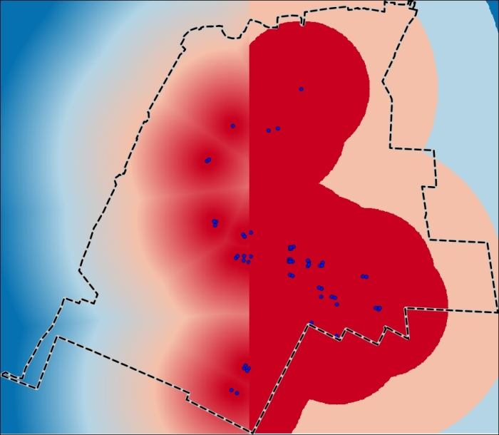
<p class="caption">(\#fig:fig1439)Field Calculator</p>
</div>

In a similar way, you can preprocess other vector layers that should be analyzed from the proximity position, namely parks, bike_routes, athletic_facilities, and elementary schools. As a result, you will have a set of raster layers ranked with several categories according to the proximity of selected objects. The higher the rank, the closer the objects. As a general rule of thumb, apply the 400 m (or 1300 feet) value to rank the rasters properly.

### Step 5: Overlay the data and interpret the results

Now we have everything ready for overlaying the rasters and generating a cumulative suitability assessment. In the following figure, you can see the full list of layers, weighted by their importance for general suitability. Weights are simple coefficients within a range of 0 to 1, and they are used to modify the rank properly.

<div class="figure" style="text-align: center">
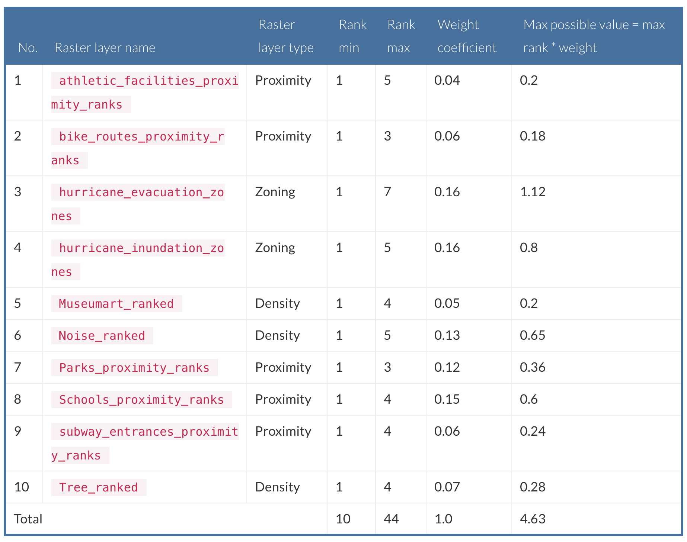
<p class="caption">(\#fig:fig1440)list of layers weighted by their importance for general suitability</p>
</div>

The expression to be used for our assessment of suitability can be constructed by several steps:

1. All the available factors that are represented by raster layers should be multiplied by their weight coefficients and summarized, like this: 
```
(factor_1*weight + factor_2*weight + factor_3*weight + … factor_n*weight)
```

This kind of assessment gives gross suitability, which is difficult for interpretation because the obtained values are not calculated relatively to the possible minimum and maximum.

2. For simplicity of interpretation, a gross suitability assessment can be divided into the sum of the maximum possible value. The extended formula will look like this: 

```
(factor_1*weight + factor_2*weight + factor_3*weight + … factor_n*weight) / (factor_1_max*weight + factor_2_max*weight + factor_3_max*weight + … factor_n_max*weight)
```

As a result, the output value range will be from 0 to 1, where the maximum suitability values are close to 1.

3. Optionally, the result can be multiplied by 100. Then the output values will be a percentage of suitability.

Go to __Raster | Raster Calculator__ to perform an assessment:

- Set the path and name for Output layer

- Select a layer from the Raster bands list to set up Current layer extent, for example, __hurricane_inundataion__

- In the Expression window, enter the following formula (if you are not sure about the values, check out the preceding table):

```
( ( "athletic_facilities_proximity_ranks@1" * 0.04 + "bike_routes_proximity_ranks@1" * 0.06+"hurricane_evacuation_zones@1" * 0.16+"hurricane_inundation_zones@1" * 0.16+"museumart_ranked@1" * 0.05+"noise_ranked@1" * 0.13+"parks_proximity@1" * 0.12+"schools_proximity@1" * 0.15+"subway_entrances_proximity_ranks@1" * 0.06+"tree_ranked@1"*0.07) / 4.63 ) *1000
```

After you have clicked on the OK button, the resulting layer will be added to the map canvas. The suitability raster value's range varies from 42 to 96 percent. Thus, it can easily be classified and interpreted. Navigate to __Layer properties | Style__ and adjust the rendering properties to those shown in the following screenshot:


<div class="figure" style="text-align: center">

<p class="caption">(\#fig:fig1441)Suitability layer</p>
</div>

After applying these settings, the layer will look as follows:

<div class="figure" style="text-align: center">
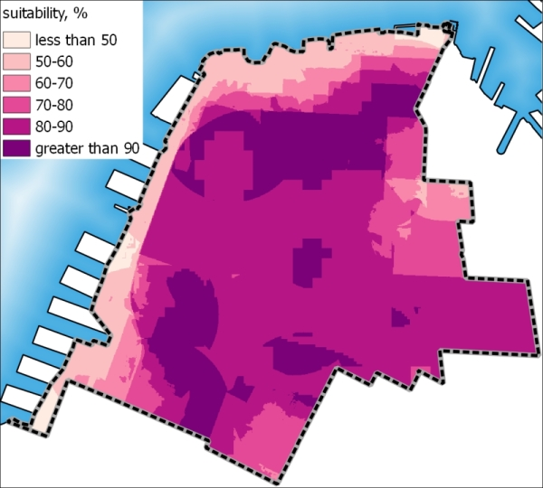
<p class="caption">(\#fig:fig1442)Suitability map</p>
</div>

We can use this raster as a basis for a primary visual suitability assessment of the area of our interest, or go further and combine it with other layers to identify the exact blocks that match best the entire range of suitability criteria.

In that case, we need to perform the inverse sequence of steps: select the most suitable areas, vectorize, and overlay the polygons of maximum suitability with residential living areas to identify the blocks and buildings that would be particularly suitable:

1. The initial suitability raster should be categorized into only two classes by a limit of 90 percent suitability. Go to __Raster | Raster Calculator__ and define the path and name for the output raster (for example max_suitability). In the Expression window, enter "suitability, %@1" >= 90. On the next page, you can see that the resulting layer contains only two classes: suitable (the value is 1; assigned to areas with suitability greater than or equal to 90 percent), and unsuitable (the value is 0).

2. Now we need to vectorize these areas to be able to query vector layers with them. Open the __Polygonize (Raster to vector)__ dialog window by going to __Raster | Conversion__ and adjust the following parameters:

<div class="figure" style="text-align: center">

<p class="caption">(\#fig:fig1443)Polygonize</p>
</div>

- Select max_suitability as the raster to be polygonized from __Input file (raster)__.

- Provide the path and name of the output shapefile in __Output file for polygons (shapefile)__, for example, max_suitability_polygons.

- Activate the Field name toggle and accept the default DN value. This option is responsible for creating and populating field with class values from the initial raster.

<div class="figure" style="text-align: center">

<p class="caption">(\#fig:fig1444)Masking raster</p>
</div>


3. After you click on the OK button, the resulting shapefile will be added to the Layers panel. Originally, the layer contains polygons of all classes, whereas we are interested only in class 1. For the purpose of selecting and deleting unnecessary polygons, we will use the Select features using an expression option:

- Open the max_suitability attribute table by clicking on the  button in the Attribute panel, or from the right-click Open Attribute Table layer shortcut.

- In the attribute table toolbar panel, click on the Select features using an expression button, , and enter the following expression: "DN" = 0. After clicking on OK, all the polygons that satisfy the condition will be highlighted in the attribute table and on the map canvas.

- As we don't need these polygons for further analysis, we should delete them. In the attribute table toolbar panel, click on the  button to toggle editing mode, or use the Ctrl + E keyboard shortcut. Now we can execute Delete selected features using the  button, or just press Del from the keyboard.

- After deleting the unnecessary data, don't forget to save your edits (using  or Ctrl + S) and deactivate editing mode. In the following screenshot, you can see that the layer contains only those polygons that encompass the maximum suitability values, which are set to 90 percent:

<div class="figure" style="text-align: center">

<p class="caption">(\#fig:fig1445)Reclass maximum suitability</p>
</div>


4. Now this layer can be used to overlay with other vector layers and analyze spatial relationships between objects, as was described in the Basics of suitability analysis section. For example, we can identify the zoning areas of primary residential living area that are of potential interest to us according to the suitability criteria:

- Open a dialog window by going to __Vector | Research tools | Select by location__. In this dialog, you should first select the layer from which objects are to be selected—residential_zoning from the __Select features in__: drop-down list—like this:


<div class="figure" style="text-align: center">

<p class="caption">(\#fig:fig1446)Select by location</p>
</div>


- the that intersect features in: drop-down list, select max_suitability_polygons, which will be used as a selector.

- There are several overlay selection options. Activate Include input features that intersect the selection features. Only those polygons that are within the query mask boundary or intersect it will be added to the selection. Click on the OK button. You will see the following result on the map canvas:

<div class="figure" style="text-align: center">

<p class="caption">(\#fig:fig1447)Selected maximum suitability</p>
</div>

Similarly, you can try another type of query and identify the exact buildings that satisfy a suitability condition. In that case, the dialog window will look as follows:

<div class="figure" style="text-align: center">

<p class="caption">(\#fig:fig1448)Exact buildings from selected maximum suitability</p>
</div>

After clicking on the OK button, you will see the following results on the map canvas:

<div class="figure" style="text-align: center">

<p class="caption">(\#fig:fig1449)Final result</p>
</div>
Notice that this time, we have selected buildings that were completely within the maximum suitability areas. So, we are ready to provide a solid and specific answer to the question, "Which is the best place to live?"

<!-- ## Raster analysis -->

<!-- ### Using the raster calculator -->

<!-- ### Calculating NDVI -->

<!-- ### Handling NULL values -->


<!-- ### Setting extents with masks -->

<!-- ### Sampling a raster layer -->

<!-- ### Preparing elevation data -->

<!-- ### Calculating a slope -->

<!-- ### Calculating a hillshade layer -->

<!-- ### Analyzing hydrology -->

<!-- ### Calculating a topographic index -->

<!-- ### Automating analyses tasks using the graphical modeler -->


<!-- ## Vector analysis -->

<!-- ### Selecting optimum sites -->

<!-- ### Dasymetric mapping -->

<!-- ### Calculating regional statistics -->


<!-- ### Estimating density using heatmaps -->

<!-- ### Estimating values based on samples -->


