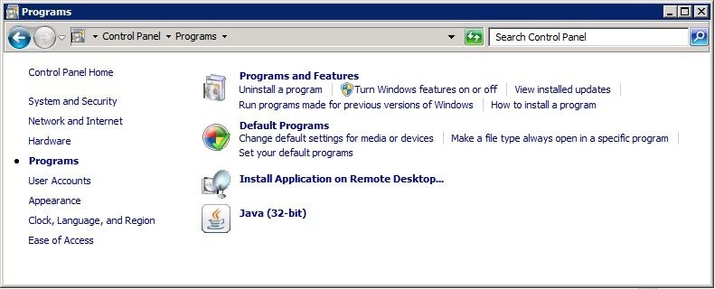

# (PART) WebGIS {-}
# GeoServer

## Pendahuluan

**Concept of webgis**

Internet-based GIS has been widely recognized in both
public and private organizations as a fundamental tool for
storage and distribution of data to targeted audiences
(Brovelli et al. 2016).
The GIS-based Web portals provide a centralized and
uniform interface to access the distributed and heteroge-
neous resources and data services (Karnatak et al. 2007).
According to (Peng 2001), Internet GIS refers to a
network-centric GIS tool that uses the Internet as a primary
means of providing access to distributed data and other
information, disseminating spatial information, and con-
ducting GIS analysis.


**GIS Web service**

GIS Web services provide direct access to data, eliminating
the need to download a dataset and import it into your
desktop application, instead using a simple HTTP interface
(URL) to access the data. The department uses a variety of
service protocols including Web Map Service (WMS), Web
Map Tile Service (WMTS), and Web Feature Service (WFS) provided by the Open Geospatial Consortium
(OGC) and ESRI Web mapping services.

**Web Services for Spatial Data**

Web services for spatial data enable using data from servers
directly with desktop GIS software, without downloading
first data as files to the own computer. In such a way, it is
possible to use always up-to-date data easily. All most
common commercial and open-source GIS desktop software
products support Web standards (MapInfo, ArcGIS, QGIS,
and GRASS). Web services are used so that the user con-
nects to the service using a special menu. For connection,
user needs to know the server’s URL. After connecting to
the server, the user gets a list of available map layers. Web
services are also easy to use in map applications on Web.
Data may be requested also directly with a HTTP GET or
POST request.
Most common Web service standards of Open Geospatial
Consortium’s (OGC) are: Web Map Service (WMS), Web
Map Tile Service (WMTS), Web Feature Service (WFS),
and Web Coverage Service (WCS).
WMS and WMTS return map image in raster format,
WFS data in vector format, and WCS data in raster format.
In WMTS, maps are available only in pre-defined scales and
size. In WMS, scale and map size can be set without
restrictions. WMTS, are faster, because often the map tiles
are already ready at the server. For requesting only part of
data different filters may be used, for example, BBOX
defines the area of interest.

**GIS Web Services**

The main challenges of geospatial (Shengru and Abdelguerfi
2006) data are:
Geospatial data are in bulk in size; loading the data and map
into the client is complex; reload of map and data takes time;
geospatial data is highly heterogeneous, and complex
geospatial problems need large quantities of geospatial data
from multiple sources and locations.


**Web GIS components**

The major components of the whole portal are categorized
into navigation tools, legend tools, search tools, and other
tools such as WMS layer adding tool, layer manager. Fea-
tures on the map can be identifying using map identify tool.
Distance measuring tool of map also has been included as
part of spatial map analysis tool. Results of map query or
area of interest can be printed out along with detail legend
using print tool. The size, font type, and map output can be
customized using this tool. The map can be produced in
various file formats such as PNG, JPEG, GIF, or PDF.
Region-specific zoom is made possible using quick zoom
tool.
Searching of non-spatial attributes could also be per-
formed by the users. To do this, user first selects a layer and
then, fill a from its listed fields/columns. An attribute to be
searched is entered in the textbox. Clicking the “Search by
Value” will create a pop-up window listing the attribute table
matching the search criteria and subsequent zooming in the
map and highlighted.
The automatic identification of map on mouse cursor
moves is made possible using “Auto Identify” widget. The
user selects a layer and its corresponding attribute(s), once
applied; the user sees the attributes corresponding to the map
location when mouse cursor moves.
The addition of WMS layers is also possible on this
WebGIS portal. First we host the layers having similar
projection through the GeoServer (Kamel and Honda 2006)
(Fig. 3.1).
<!-- ## Konsep WebGIS -->

<!-- ```{r fig1424, fig.cap='Open Attribute Table',echo=FALSE, message=FALSE, warning=FALSE, out.width='30%', fig.asp=.75, fig.align='center'} -->
<!-- knitr::include_graphics("img/webgis/pic1.png") -->
<!-- ``` -->
## Komponen yang diperlukan

Sebelum Anda dapat menggunakan GeoServer, Anda perlu menginstal beberapa perangkat lunak yang dibutuhkan. GeoServer merupakan aplikasi Java. Salah satu hal penting yang paling
Anda pastikan adalah virtual Java bekerja pada mesin Anda.

Ada dua paket utama Java. Tergantung pada apa yang Anda berencana untuk melakukan dengan Java, Anda mungkin
ingin menginstal sebuah JDK (Java Development Kit) atau JRE
( Java Runtime Environment).

JDK memungkinkan Anda untuk mengkompilasi kode Java, sedangkan JRE cukup memenuhi syarat 
untuk menjalankan sebagian besar aplikasi Java. Mulai dari rilis 2.0, GeoServer tidak perlu instalasi JDK penuh, dan Anda
dapat memilih JRE. JDK hanya diperlukan jika Anda berencana untuk menulis dan mengkompilasi kode
Java. Hal ini dilakukan jika Anda ingin memodifikasi kode sumber GeoServer, untuk memperbaiki kode, atau menambahkan
fungsionalitas.


Versi saat ini dari GeoServer membutuhkan Java 8.  Perlu diingat bahwa Java 9 tidak didukung, mungkin Anda dapat menginstal Geoserver.  Hanya saja Anda tidak akan mendapatkan 
dukungan untuk setiap masalah yang Anda temukan saat menggunakan Geoserver dengan Java 9.

Untuk melakukan pemeriksaan apakah sistem Anda memiliki Java JRE 8, silahkan ikuti langkah berikut :

1. Dari menu Start, pilih Control Panel.

2. Pilih Programs. Jika sistem anda memiliki JRE / JDK, Anda akan melihat ikon dengan
logo Java, seperti yang ditunjukkan pada gambar berikut. Ini adalah cara pintas ke panel kontrol Java:

<div class="figure" style="text-align: center">

<p class="caption">(\#fig:fig71)Cek Java</p>
</div>

3.
## Instalasi

**Tomcat**


<div class="figure">
<iframe src="https://www.youtube.com/embed/IC_wnPZYyYA" width="99%" height="400px" style="border: none;"></iframe>
<p class="caption">(\#fig:embed1)Instalasi Tomcat</p>
</div>

**GeoServer**

<div class="figure">
<iframe src="https://www.youtube.com/embed/NxV6bIpkaGw" width="99%" height="400px" style="border: none;"></iframe>
<p class="caption">(\#fig:embed2)Download GeoServer</p>
</div>


## GeoServer


<div class="figure">
<iframe src="https://www.youtube.com/embed/BGBthqeqmrs" width="99%" height="400px" style="border: none;"></iframe>
<p class="caption">(\#fig:embed3)Start GeoServer</p>
</div>


