# (PART) WebGIS {-}
# GeoServer

## Pendahuluan

**Konsep WebGIS**

GIS berbasis internet telah dikenal luas baik dalam organisasi publik maupun swasta sebagai alat mendasar untuk penyimpanan dan distribusi data ke audiens yang ditargetkan (Brovelli et al. 2016). Portal Web berbasis GIS menyediakan antarmuka terpusat dan seragam untuk mengakses sumber daya yang terdistribusi dan beragam dan layanan data (Karnatak et al. 2007). Menurut (Peng 2001), GIS Internet mengacu pada alat GIS berbasis jaringan yang menggunakan Internet sebagai sarana utama untuk menyediakan akses ke data yang didistribusikan dan informasi lainnya, menyebarkan informasi spasial, dan melakukan analisis GIS.

**GIS Web Service**

Layanan Web GIS menyediakan akses langsung ke data, menghilangkan kebutuhan untuk mengunduh dataset dan mengimpornya ke aplikasi desktop Anda, sebagai gantinya menggunakan antarmuka HTTP sederhana (URL) untuk mengakses data. Departemen ini menggunakan berbagai protokol layanan termasuk Web Map Service (WMS), Web Map Tile Service (WMTS), dan Web Feature Service (WFS) yang disediakan oleh Open Geospatial Consortium (OGC) dan layanan pemetaan Web ESRI.

**Layanan Web untuk Data Spasial**

Layanan web untuk data spasial memungkinkan menggunakan data dari server secara langsung dengan perangkat lunak GIS desktop, tanpa mengunduh data pertama sebagai file ke komputer sendiri. Sedemikian rupa, dimungkinkan untuk menggunakan data yang selalu terbaru dengan mudah. Semua produk perangkat lunak desktop GIS komersial dan open-source yang paling umum mendukung standar Web (MapInfo, ArcGIS, QGIS, dan GRASS). 

Layanan web digunakan sehingga pengguna terhubung ke layanan menggunakan menu khusus. Untuk koneksi, pengguna perlu mengetahui URL server. Setelah terhubung ke server, pengguna mendapat daftar lapisan peta yang tersedia. Layanan web juga mudah digunakan dalam aplikasi peta di Web. Data dapat diminta juga secara langsung dengan HTTP GET atau permintaan POST. 

Standar layanan Web yang paling umum dari Open Geospatial Consortium's (OGC) adalah: Layanan Web Map (WMS), Layanan Web Map Tile (WMTS), Layanan Fitur Web (WFS), dan Layanan Cakupan Web (WCS). WMS dan WMTS mengembalikan gambar peta dalam format raster, data WFS dalam format vektor, dan data WCS dalam format raster. Dalam WMTS, peta hanya tersedia dalam skala dan ukuran yang ditentukan sebelumnya. Dalam WMS, skala dan ukuran peta dapat diatur tanpa batasan. WMTS, lebih cepat, karena seringkali petak peta sudah siap di server. Untuk meminta hanya sebagian data filter yang berbeda dapat digunakan, misalnya, BBOX menentukan bidang yang diminati.

**Servise WebGIS**

Tantangan utama data geospasial (Shengru dan Abdelguerfi, 2006) adalah: Data geospasial berukuran besar; rumitnya pemuatan dan pemetaan data ke klien ; memuat ulang peta dan data membutuhkan waktu; data geospasial sangat heterogen, dan masalah geospasial yang kompleks membutuhkan sejumlah besar data geospasial dari berbagai sumber dan lokasi.


**Komponen WebGIS**

Komponen utama dari WebGIS dikategorikan ke dalam alat navigasi, alat legenda, alat pencarian, dan alat lainnya seperti alat menambahkan lapisan WMS, manajer lapisan. Fitur pada peta dapat diidentifikasi menggunakan alat identifikasi peta (Identifier). Alat ukur jarak dari peta juga telah dimasukkan sebagai bagian dari alat analisis peta spasial. Hasil permintaan peta atau bidang yang diinginkan dapat dicetak bersama dengan legenda detail memakai alat cetak. Ukuran, jenis font, dan output peta dapat dikustomisasi menggunakan alat ini. Peta dapat diproduksi dalam berbagai format file seperti PNG, JPEG, GIF, atau PDF. Zoom khusus kawasan dimungkinkan dengan menggunakan alat zoom cepat.

Pencarian atribut non-spasial juga dapat dilakukan oleh pengguna. Untuk melakukan ini, pengguna pertama-tama memilih layer dan kemudian, mengisi dari bidang / kolom yang terdaftar. Atribut yang akan dicari dimasukkan dalam kotak teks. Mengklik "Cari berdasarkan Nilai" akan membuat jendela sembulan yang mencantumkan tabel atribut yang cocok dengan kriteria pencarian dan selanjutnya memperbesar peta dan disorot.

Identifikasi otomatis peta pada pergerakan kursor mouse menggunakan widget "Identifikasi Otomatis". Pengguna memilih layer dan atributnya yang sesuai, setelah diterapkan; pengguna melihat atribut yang sesuai dengan lokasi peta ketika kursor mouse bergerak. Penambahan lapisan WMS juga dimungkinkan di portal WebGIS ini. Pertama-tama kita meng-host lapisan yang memiliki proyeksi serupa melalui GeoServer (Kamel dan Honda 2006).
<!-- ## Konsep WebGIS -->

<!-- ```{r fig1424, fig.cap='Open Attribute Table',echo=FALSE, message=FALSE, warning=FALSE, out.width='30%', fig.asp=.75, fig.align='center'} -->
<!-- knitr::include_graphics("img/webgis/pic1.png") -->
<!-- ``` -->
## Komponen yang diperlukan

Sebelum Anda dapat menggunakan GeoServer, Anda perlu menginstal beberapa perangkat lunak yang dibutuhkan. GeoServer merupakan aplikasi Java. Salah satu hal penting yang paling
Anda pastikan adalah virtual Java bekerja pada mesin Anda.

Ada dua paket utama Java. Tergantung pada apa yang Anda berencana untuk melakukan dengan Java, Anda mungkin
ingin menginstal sebuah JDK (Java Development Kit) atau JRE
( Java Runtime Environment).

JDK memungkinkan Anda untuk mengkompilasi kode Java, sedangkan JRE cukup memenuhi syarat 
untuk menjalankan sebagian besar aplikasi Java. Mulai dari rilis 2.0, GeoServer tidak perlu instalasi JDK penuh, dan Anda
dapat memilih JRE. JDK hanya diperlukan jika Anda berencana untuk menulis dan mengkompilasi kode
Java. Hal ini dilakukan jika Anda ingin memodifikasi kode sumber GeoServer, untuk memperbaiki kode, atau menambahkan
fungsionalitas.


Versi saat ini dari GeoServer membutuhkan Java 8.  Perlu diingat bahwa Java 9 tidak didukung, mungkin Anda dapat menginstal Geoserver.  Hanya saja Anda tidak akan mendapatkan 
dukungan untuk setiap masalah yang Anda temukan saat menggunakan Geoserver dengan Java 9.

Untuk melakukan pemeriksaan apakah sistem Anda memiliki Java JRE 8, silahkan ikuti langkah berikut :

1. Dari menu Start, pilih Control Panel.

2. Pilih Programs. Jika sistem anda memiliki JRE / JDK, Anda akan melihat ikon dengan
logo Java, seperti yang ditunjukkan pada gambar berikut. Ini adalah cara pintas ke panel kontrol Java:

<div class="figure" style="text-align: center">

<p class="caption">(\#fig:fig71)Cek Java</p>
</div>


## Instalasi

### Tomcat

Paket Tomcat yang digunakan dalam pelatihan ini adalah paket yang disediakan oleh Bitnami. Paket Bitnami Tomcat versi MS Windows tersebut dapat diunduh di tautan berikut [https://bitnami.com/redirect/to/654730/bitnami-tomcatstack-7.0.96-0-windows-x64-installer.exe](https://bitnami.com/redirect/to/654730/bitnami-tomcatstack-7.0.96-0-windows-x64-installer.exe)

Tahapan instalasi Bitnami Tomcat dapat dilihat pada video berikut :

<div class="figure">
<iframe src="https://www.youtube.com/embed/IC_wnPZYyYA" width="99%" height="400px" style="border: none;"></iframe>
<p class="caption">(\#fig:embed1)Instalasi Tomcat</p>
</div>

### GeoServer

GeoServer dapat diunduh di halaman tautan berikut [http://geoserver.org/download/](http://geoserver.org/download/) dan pilihlah tipe instalasi yang tersedia. Anda akan menemukan beberapa paket berbeda untuk GeoServer. Kita akan menggunakan versi Arsip Web (.war):


Anda dapat memilih rilis dari dua cabang yang berbeda - **Stable** dan **Maintenance**. Keduanya dibangun untuk keperluan produksi, sehingga Anda dapat memilih apa pun yang Anda inginkan. Kami sarankan Anda memilih rilis terbaru karena berisi semua fitur baru yang baru saja dirilis oleh tim pengembang.

Terlepas dari Production tab, Anda dapat memilih dua cabang lainnya - **Development** dan **Archived**. Di dalam bagian Development, Anda akan menemukan **Night Build**, rilis ini tidak cocok untuk produksi karena rentan terhadap *bug*, tetapi berisi semua perubahan yang dilakukan pengembang pada kode sumber, sehingga Anda dapat menggunakannya untuk menguji perbaikan bug yang Anda temukan:

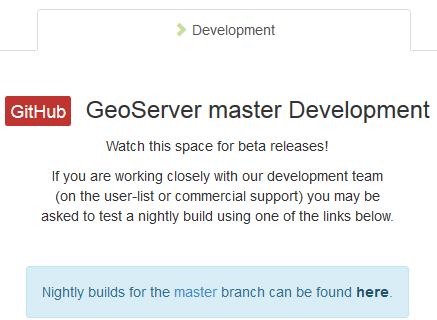

**Archived** berisi rilis yang lebih lama. Ini mungkin berguna jika Anda menggunakan rilis GeoServer lama dan perlu memutakhirkannya ke yang lebih baru, tetapi Anda tidak ingin melompat ke yang terakhir. Kasus penggunaan lain mungkin jika Anda menggunakan GeoServer di lingkungan di mana versi JRE lama, 7.x atau 6.x, tersedia dan Anda tidak dapat memutakhirkannya.

Tahapan pengunduhan GeoServer dapat dilihat pada video berikut :

<div class="figure">
<iframe src="https://www.youtube.com/embed/NxV6bIpkaGw" width="99%" height="400px" style="border: none;"></iframe>
<p class="caption">(\#fig:embed2)Download GeoServer</p>
</div>

Di bagian berikutnya, kita akan melakukan instalasi GeoServer dengan cara men-*deploy* arsip web di Apache Tomcat. Server aplikasi Java hampir dapat dijalankan pada sistem operasi apa pun dengan cara yang sama. Begitu pula dengan GeoServer yang di-**deploy** pada Tomcat. 

Proses instalasi GeoServer adalah sebagai berikut:

1. Pastikan bahwa Tomcat Server berjalan dengan membuka tautan [http://localhost/index.jsp](http://localhost/index.jsp). Apabila isi dari halaman tersebut seperti pada Gambar \@ref(fig:gs44), maka kita dapat melanjutkan ke proses berikutnya.


2. Buka tautan **Manager App**. Ketikkan username dan password seperti yang dibuat ketika instalasi.

3. Unggah berkas geoserver.war di bagian WAR file to deploy.

4. Klik Deploy.

- Apabila proses ini gagal dengan pesan kesalahan yang menunjukkan bahwa ukuran berkas melebihi yang ditentukan, edit berkas web.xml yang ada di direktori __*C:/Bitnami/tomcatstack-7.0.96-0/apache-tomcat/webapps/manager/WEB-INF*__

- Ubah ukuran max-file-size dan max-request agar lebih besar dari 100 MB, dengan menambahkan angka 1 di depan angka 8, sehingga menjadi 183886080. 

```
<multipart-config>
      <!-- 50MB max -->
      <max-file-size>83886080</max-file-size>
      <max-request-size>83886080</max-request-size>
      <file-size-threshold>0</file-size-threshold>
</multipart-config>
```

- Simpan berkas web.xml

- Stop Tomcat Server

<div class="figure" style="text-align: center">
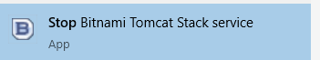
<p class="caption">(\#fig:fig111)Stop Tomcat Server</p>
</div>


- Jalankan ulang Tomcat Server.

<div class="figure" style="text-align: center">
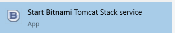
<p class="caption">(\#fig:fig112)Start Tomcat Server</p>
</div>

- Ulangi kembali proses Deploy.

5. Apabila proses Deploy Geoserver berhasil, maka menu Manager App akan terlihat **/geoserver** di dalam daftar aplikasi Tomcat. 

<div class="figure" style="text-align: center">
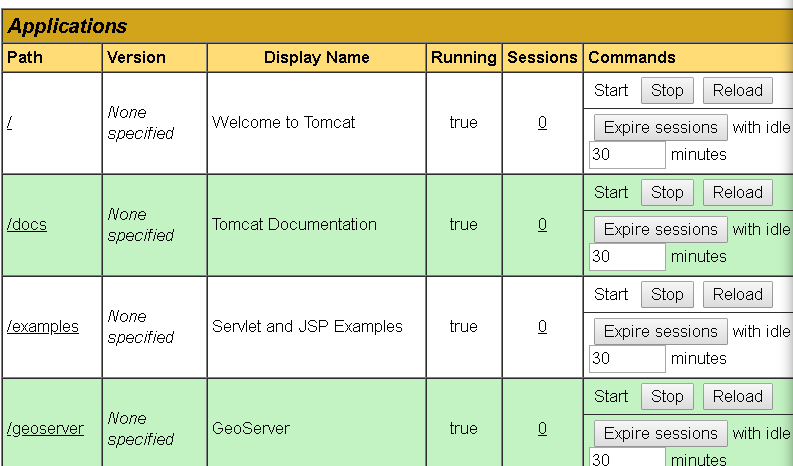
<p class="caption">(\#fig:fig39)Folder aplikasi GeoServer</p>
</div>


## Menjalankan GeoServer

<div class="figure">
<iframe src="https://www.youtube.com/embed/BGBthqeqmrs" width="99%" height="400px" style="border: none;"></iframe>
<p class="caption">(\#fig:embed3)Start GeoServer</p>
</div>


## Administrasi GeoServer

Dalam bab ini, kita akan menjelajahi antarmuka administrasi GeoServer. Ini adalah konsol utama tempat Anda dapat mengontrol hampir semua pengaturan instalasi GeoServer Anda. Dalam rilis pertama, itu sedikit rumit, tetapi karena seri 2.x, nama menu dan ikon konsisten di setiap bagian. Ada juga antarmuka yang ditingkatkan untuk GeoWebCache terintegrasi, di mana Anda dapat melakukan hampir semua konfigurasi caching dari antarmuka GeoServer. Kabar baiknya adalah bahwa kita akan menggunakan mouse lebih banyak di sini daripada bab lain, sehingga keyboard akan mendapatkan istirahat.

Dalam bab ini, kita akan membahas semua bagian dari Antarmuka Administrasi Web. Secara khusus, kami akan mengeksplorasi topik berikut secara rinci:

Memeriksa status GeoServer Anda dan mencatat konten file
Mempratinjau data Anda
Pengaturan tuninguntuk Layanan Peta Web ( WMS ), Layanan Fitur Web ( WFS ), dan Layanan Cakupan Web ( WCS )
Tuning global pengaturan
Melakukan permintaan melalui antarmuka demo

### Dashboard 

Mengakses antarmuka hanya membutuhkanAnda untuk membuka browser dan arahkan ke http: // localhost: 8080 / geoserver / web . Jika Anda telah membaca bab sebelumnya dan menjalankan contoh-contohnya, Anda harus mengubah kata sandi default untuk pengguna admin.

Anda bisa menggunakan yang baru untuk login lagi di GeoServer; kita sekarang akan memusatkan perhatian kita pada tata letak antarmuka.

Pertimbangkan tangkapan layar berikut. Anda dapat mengenali tiga area utama di antarmuka web GeoServer:


<div class="figure" style="text-align: center">
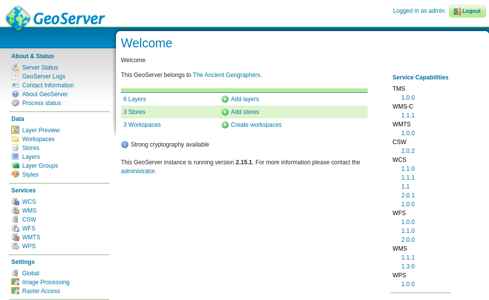
<p class="caption">(\#fig:fig74)Dashboard GeoServer</p>
</div>


Area pusat menunjukkan Anda beberapa informasi tentang status GeoServer - elemen di dalamnya berubah sesuai dengan operasi yang Anda lakukan. Tepat setelah Anda masuk, ini menunjukkan kepada Anda detail singkat dari data yang dikonfigurasi, dan peringatan atau kesalahan yang harus Anda koreksi. Baris terakhir menunjukkan nomor rilis dan ada tautan ke kotak surat administrator; ini default ke ahli geografi kuno yang terkenal sampai Anda memasukkan data Anda.

Di sisi kanan, ada daftar yang menunjukkan kemampuan GeoServer kepada Anda. Akronim yang tercantum mengacu pada protokol OGC standar; kita akan membicarakan beberapa dari mereka secara terperinci dalam buku ini, dan masing-masing dari mereka memiliki setidaknya satu rilis yang didukung. Angka-angka adalah tautan ke dokumen XML yang secara tepat menggambarkan data dan operasi yang didukung oleh setiap protokol. Mereka adalah sumber daya yang sangat berharga bagi klien yang mau menggunakan layanan Anda.

Cobalah untuk membuka WMS 1.1.1tautan dan buka hasilnya dalam editor teks. Anda dapat dengan mudah memahami beberapa bagian. Pertimbangkan yang berikut ini:

Yang pertama berisi deskripsi layanan yang dibuka:

```
<Service> 
<Name>OGC:WMS</Name> 
<Title>GeoServer Web Map Service</Title>
```

Kemudian Anda dapat menemukan beberapa informasi tentang administrator:

```
<ContactInformation> 
       <ContactPersonPrimary> 
         <ContactPerson>Stefano Iacovella</ContactPerson> 
         <ContactOrganization>Packt Publishing  
            Ltd.</ContactOrganization> 
       </ContactPersonPrimary> 
<ContactPosition>Chief geographer</ContactPosition
```       
       
       
Daftar operasi yang didukung dan URL dasar untuk permintaan adalah sebagai berikut:

```
<Request> 
       <GetCapabilities> 
       <Format>application/vnd.ogc.wms_xml</Format> 
       <DCPType> 
       <HTTP> 
         <Get> 
            <OnlineResource xmlns:xlink="http://www.w3.org/1999/xlink"
               xlink:type="simple"xlink:href="http://localhost:8080
                 /geoserver/wms?SERVICE=WMS&amp;"/> 
         </Get> 
        <Post> 
          <OnlineResource xmlns:xlink="http://www.w3.org/1999/xlink"   
             xlink:type="simple" xlink:href="http://localhost:8080
                /geoserver/wms?SERVICE=WMS&amp;"/> 
        </Post> 
       </HTTP> 
       ... 
       </GetCapabilities> 
       <GetMap> 
        ... 
       </GetMap> 
       <GetFeatureInfo> 
        ... 
       </GetFeatureInfo> 
       <DescribeLayer> 
        ... 
       </DescribeLayer> 
       <GetLegendGraphic> 
        ... 
       </GetLegendGraphic> 
       <GetStyles> 
        ... 
       </GetStyles> 
       </Request> 
```

### About dan Status

#### Server Status

<div class="figure" style="text-align: center">
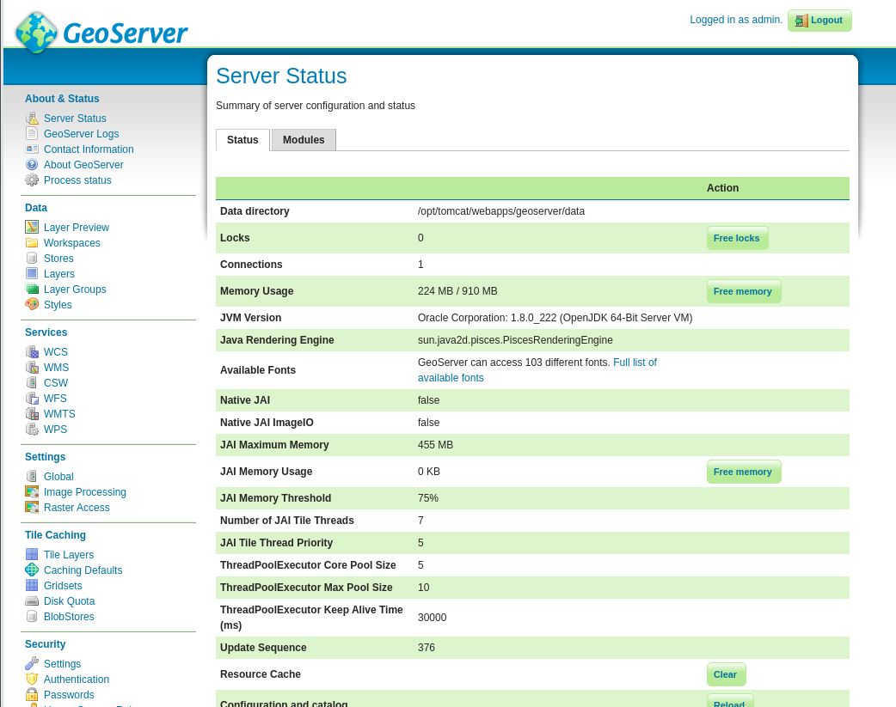
<p class="caption">(\#fig:gs4)Status server</p>
</div>

#### Logs

<div class="figure" style="text-align: center">
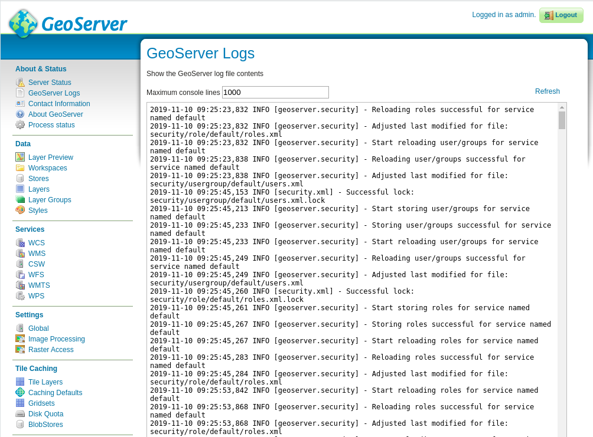
<p class="caption">(\#fig:gs5)Status server</p>
</div>
### Data

Bagian ini berisi tautanke mesin konfigurasi data. Seperti yang Anda duga, untuk menerbitkan peta di internet dengan GeoServer, Anda perlu menambahkan data spasial ke dalamnya. Pertimbangkan tangkapan layar berikut:

Di area ini, Anda dapat mengonfigurasi akses data dan cara aksesnya ke klien:

#### Layer Preview

membuka formulir termasuk setiap lapisan yang diterbitkan di GeoServer. Selain itu, jika Anda belum menambahkan data ke instalasi GeoServer Anda, Anda akan menemukan beberapa lapisan sampel sudah terdaftar. Mengklik pada OpenLayerstautan, yang ditempatkan di sebelah kanan nama lapisan, Anda dapat membuka contoh aplikasi web untuk melihat seperti apa data Anda terlihat. Suka.

The Keyhole Markup Language ( KML ) link membiarkan Anda men-download data dalam format yang sesuai untuk pratinjau di Google Earth. Ada juga beberapa format lain yang tersedia, tercantum dalam kotak drop-down di ujung kanan baris. Pertimbangkan tangkapan layar berikut:


<div class="figure" style="text-align: center">
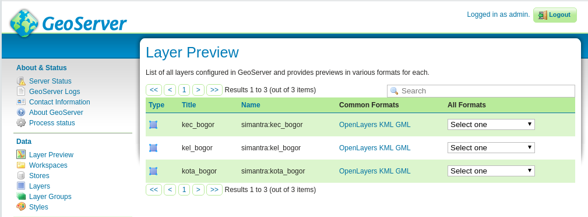
<p class="caption">(\#fig:gs6)Layer preview</p>
</div>


### Layanan

### Pengaturan

### Tile Caching

### Security


## Menambahkan Data

Anda akan mempelajari tipe data apa yang dapat Anda gunakan dengan GeoServer. Kami akan mengambil ikhtisar singkat tentang format yang didukung, baik bawaan maupun melalui ekstensi, dan cara menambahkannya ke konfigurasi Anda. Lebih khusus lagi, kami akan memuat data dari shapefile, tabel PostGIS, dan tabel Oracle menggunakan data sensus AS.

### Pengaturan Data

#### Workspace

Bagian ini menjelaskan cara melihat dan mengkonfigurasi ***workspace***. Dianalogikan dengan ***namespace***, ***workspace*** adalah wadah yang mengatur item lainnya. Di GeoServer, ***workspace*** sering digunakan untuk mengelompokkan layer yang sama. Layer dapat dirujuk dengan nama ruang kerja mereka, titik dua, nama lapisan (misalnya sf:archsites). Dua layer yang berbeda dapat memiliki nama yang sama selama mereka memiliki ***workspace*** yang berbeda (misalnya sf:states dan topp:states).

<div class="figure" style="text-align: center">
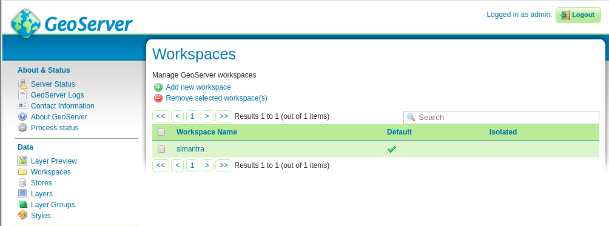
<p class="caption">(\#fig:gs7)Workspaces</p>
</div>

Untuk melihat atau mengedit workspace, klik nama workspace. Halaman konfigurasi workspace akan ditampilkan pada Gambar \@ref(fig:gs1)


<div class="figure" style="text-align: center">
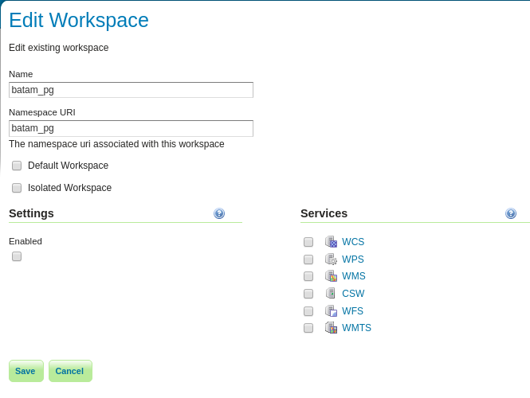
<p class="caption">(\#fig:gs1)Edit Workspace</p>
</div>

Workspace didefinisikan oleh nama dan URI Namespace (Uniform Resource Identifier). Nama workspace terbatas hingga sepuluh karakter dan tidak boleh memiliki spasi. URI mirip dengan URL, kecuali URI tidak perlu menunjuk ke lokasi aktual di web, dan hanya perlu menjadi pengidentifikasi unik. Untuk URI Workspace, kami sarankan menggunakan URL yang terkait dengan proyek Anda, dengan pengidentifikasi jejak yang berbeda. Misalnya, http://localhost/batam_pg adalah URI untuk ruang kerja "batam_pg".


#### Store

<div class="figure" style="text-align: center">
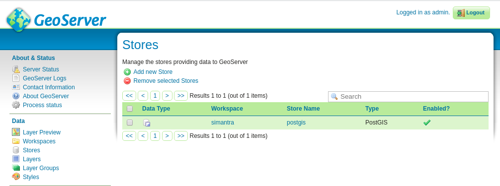
<p class="caption">(\#fig:gs8)Store</p>
</div>


### Penambahan Data

Data yang dapat diunggah ke dalam GeoServer dapat bermacam-macam, di antaranya adalah direktori Shapefiles, GeoPackage, PostGIS, GeoTIFF, WMS dan lainnya seperti disajikan pada Gambar \@ref(gs2).


<div class="figure" style="text-align: center">
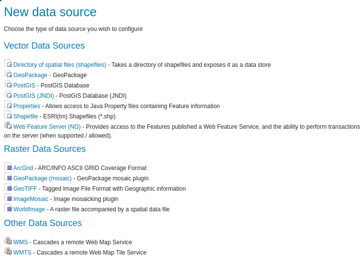
<p class="caption">(\#fig:gs2)Workspaces</p>
</div>

#### Direktori Shapefiles

Untuk menambah data ke dalam GeoServer, lakukan tahapan berikut

1. Buatlah workspace baru. 

Kita akan menambahkan workspace berdasarkan data sampel GeoServer yaitu San Fransisco. Isikan ***sf*** sebagai nama workspace baru dan ***san_fransisco*** untuk Namespace_URI. Jangan lupa untuk klik **Submit** untuk membuat workspace.

<div class="figure" style="text-align: center">
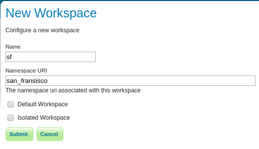
<p class="caption">(\#fig:gs14)Workspaces</p>
</div>

2. Tambahkan Stores baru.

- Klik Stores di panel sebelah kiri, dan klik tautan **Add new Store**. Pilih ***workspace*** sf dan isikan ***sf_shp*** untuk **Data Source Name**. 

- Untuk **Connection Parameters** klik Browse untuk memilih direktori di mana vektor shapefiles tersimpan. Untuk kasus ini, klik direktori ***data/data/sf***.


<div class="figure" style="text-align: center">
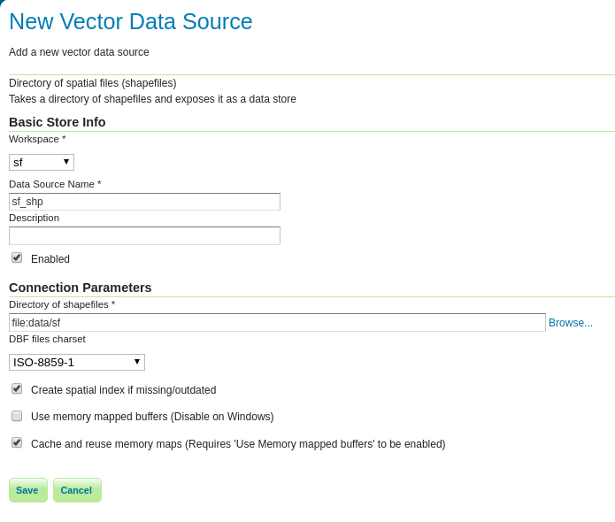
<p class="caption">(\#fig:gs15)Sumber data vektor</p>
</div>
- Klik Save.

3. Pilih Layer yang akan diunggah dengan mengklik tautan **Publish**, sebagai contoh ***archsites***.

<div class="figure" style="text-align: center">
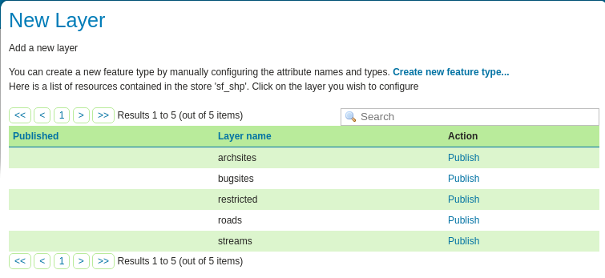
<p class="caption">(\#fig:gs16)Memilih Layer baru</p>
</div>

4. Definisikan data layer dan publikasinya.

- Isikan nama layer, misalnya ***archsites***. 

<div class="figure" style="text-align: center">
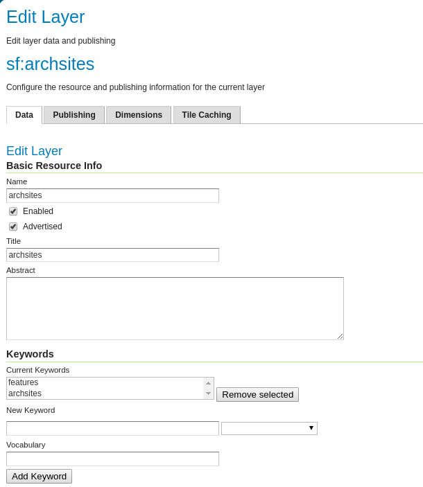
<p class="caption">(\#fig:gs17a)Edit layer name</p>
</div>

- Klik ***Compute from data*** untuk mengisikan **Bounding Boxes**, dan klik ***Compute from native bounds*** untuk **Lat/Lon Bounding Box**.


<div class="figure" style="text-align: center">
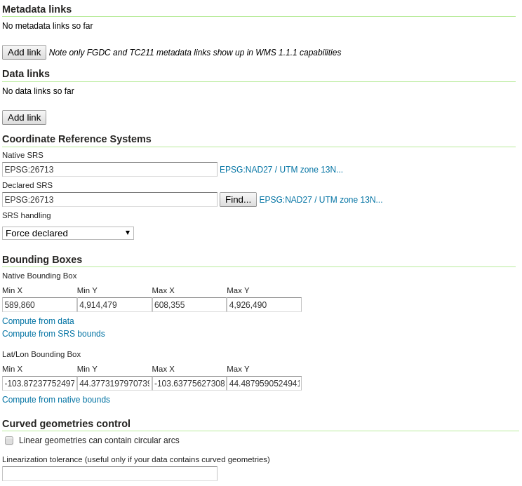
<p class="caption">(\#fig:gs17b)Parameter Bounding Boxes</p>
</div>

- Klik **Save** untuk menyimpan data.

<div class="figure" style="text-align: center">

<p class="caption">(\#fig:gs17c)Klik Save</p>
</div>

- Untuk mengetahui apakah layer telah tersimpan, gunakan menu Layer preview. Klik tautan **OpenLayers**

<div class="figure" style="text-align: center">
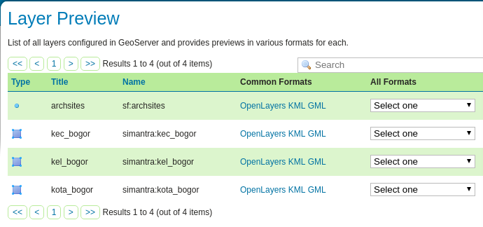
<p class="caption">(\#fig:gs18)Layer preview</p>
</div>

<div class="figure" style="text-align: center">
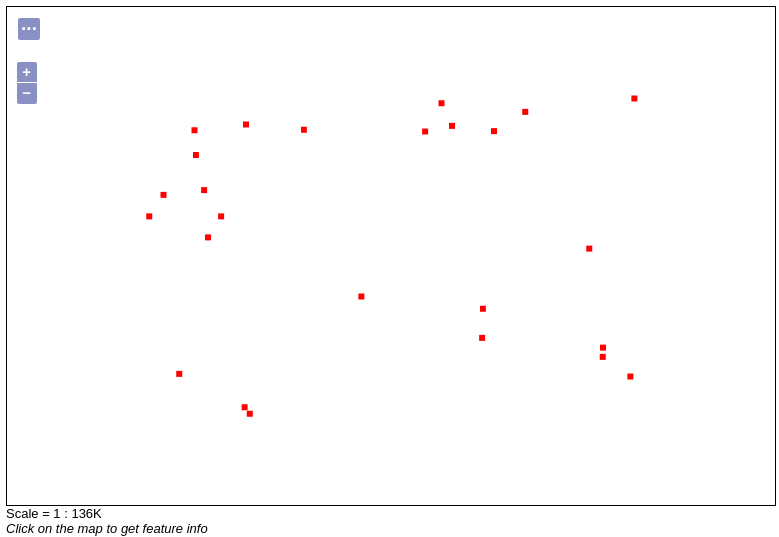
<p class="caption">(\#fig:gs19)Peta archsites dalam menu OpenLayers</p>
</div>

<div class="figure" style="text-align: center">
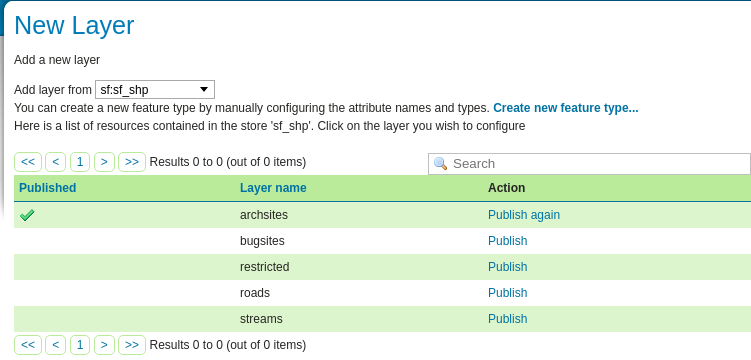
<p class="caption">(\#fig:gs20)Layer preview</p>
</div>

- Lakukan cara yang sama untuk berkas shapefiles lain yang ada di dalam direktori. Sebagai contoh, Gambar \@ref(fig:gs21) memperlihatkan layer roads.

<div class="figure" style="text-align: center">
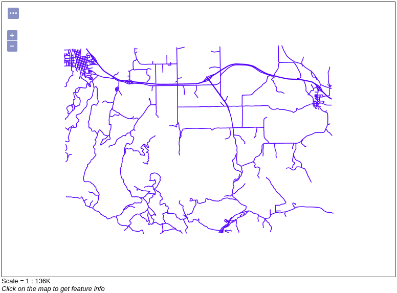
<p class="caption">(\#fig:gs21)Layer preview</p>
</div>


<div class="figure" style="text-align: center">
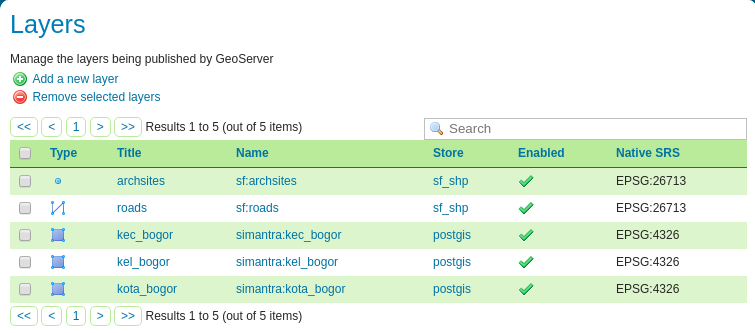
<p class="caption">(\#fig:gs22)Layer preview</p>
</div>


#### PostGIS

#### Raster


## Mengakses Layer

### Layer Group


<div class="figure" style="text-align: center">
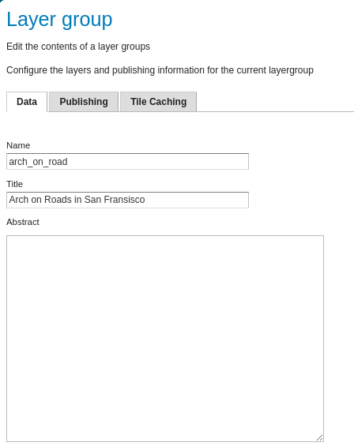
<p class="caption">(\#fig:gs23)Layer preview</p>
</div>

<div class="figure" style="text-align: center">
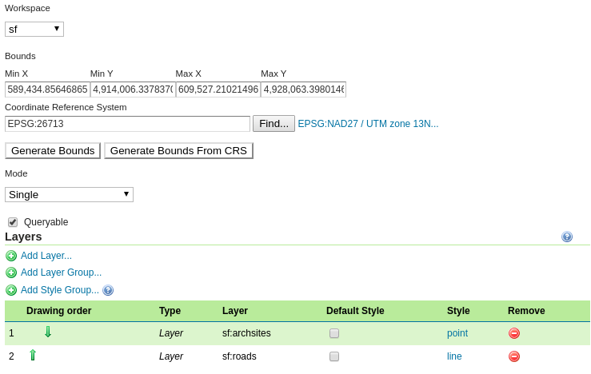
<p class="caption">(\#fig:gs24)Layer preview</p>
</div>

<div class="figure" style="text-align: center">
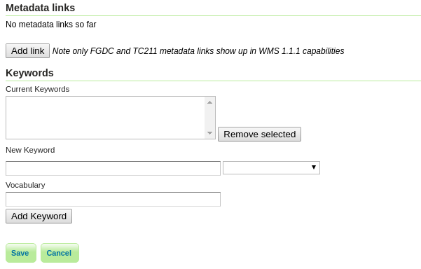
<p class="caption">(\#fig:gs25)Layer preview</p>
</div>

<div class="figure" style="text-align: center">
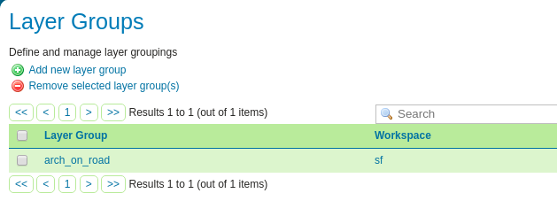
<p class="caption">(\#fig:gs26)Layer preview</p>
</div>


